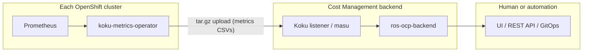

# HPA/VPA Recommendations and Deployment Modes

Internal analysis of how ros-ocp-backend deployment topology affects whether
HPA and VPA recommendations can be **used** (advisory) or **applied**
(automated actuation). HPA/VPA plugins are **deferred** — see
[requirements.md](requirements.md).

## Automation story at a glance

| Stage | What | How |
|-------|------|-----|
| **Today: Advisory-first** | ROS generates recommendations; humans apply | Optimizations UI or REST API → manual `oc edit` / GitOps |
| **Today: External automation** | Consumers read API and apply with safety gates | Ansible, SonataFlow, GitOps PRs, CronJobs/operators |
| **Future: Integrated automation** | Optional in-product actuator, GitOps export, VPA plugin synergy | Not planned for v1 |
| **Always: Safety gates** | PDB, surge windows, canary, confidence, magnitude, rollback | Required regardless of automation approach |
| **Today: VPA `updateMode: Off`** | Dual-advisor validation without auto-apply | Compare VPA recommender vs ROS container rightsizing |

**Core principle:** ROS provides advisory recommendations via a standard REST API.
Automation is a **consumer concern** — use your preferred automation tool to read
and act on recommendations.

---

## 1. Today: Advisory-first

In all shipped deployment modes, ROS generates recommendations centrally; users
(or their automation) apply changes on the cluster.

### Deployment modes today

| Mode | Topology | Status | Recommendation delivery |
|------|----------|--------|-------------------------|
| **Remote (SaaS)** | Operator on each cluster → upload → Koku (ingress, Kafka, S3) → central ros-ocp-backend → console.redhat.com UI | **Shipped** | Advisory via web UI and REST API |
| **Local (on-prem)** | Operator + Koku + ros-ocp-backend + UI on the **same** cluster (cost-onprem chart) | **Shipped** | Advisory via local UI and REST API |
| **Local + central (hybrid)** | N clusters upload to one central Cost Management installation | **Shipped** (SaaS and multi-cluster on-prem) | Central ROS generates recs for all clusters; advisory |
| **Local Mode (planned)** | Operator computes on-cluster; optional push to central for fleet view | **Not implemented** | Advisory; local `ros-ocp-api` is read-only |

All shipped modes share the same **data-collection → central processing → API/UI**
pattern. None include a built-in feedback loop that modifies cluster objects.

The koku-metrics-operator is **metrics collection and upload only**. Its
reconciler queries Prometheus, writes CSVs, packages tarballs, and POSTs to the
ingress endpoint. It does **not** read recommendations, patch Deployments, or
modify HPA/VPA CRs.

### Advisory workflow (existing recommendation types)

**Yes — in all shipped modes, for recommendation types that exist today**
(container CPU/memory, GPU, nodes, quota, etc.):

1. Platform admin enables ROS on namespaces (`insights_cost_management_optimizations=true`).
2. Operator uploads metrics; ros-ocp-backend computes recommendations.
3. User views Optimizations UI or calls the REST API.
4. User **manually** updates Deployment/StatefulSet resources, HPA specs, VPA
   policies, MachineSets, or GPU node config.

### HPA/VPA feature status

| Feature | Status | Planned delivery |
|---------|--------|------------------|
| HPA saturation / idle / flapping analysis | **Deferred** (REQ-8.1) | Phase 2 Enrich plugin `hpa`; codes **21**, **22** |
| VPA policy / updateMode recommendations | **Deferred** | Phase 2 Enrich plugin `vpa` |
| Combined VPA+HPA coordination | **Deferred** until in-place pod vertical scaling stabilizes | — |

When implemented, both plugins depend on **container** recommendations (Phase 1)
and enrich them — they are not new CSV ingestors. See
[plugin-phases.md](plugin-phases.md).

---

## 2. Today: External automation

ROS does **not** ship an in-product actuator, but users can achieve automation
**today** using external tools that poll the ROS API, evaluate recommendations,
and apply changes to cluster resources.

### Automation approaches

| Approach | Pattern | Typical apply mechanism |
|----------|---------|-------------------------|
| **Ansible Automation Platform** | Playbooks/roles poll ROS API, evaluate recommendations, apply via `kubernetes.core` collection | `k8s` module to patch HPA/VPA/Deployment resources |
| **SonataFlow (Red Hat Developer Hub Orchestrator)** | Workflow orchestration reads ROS recommendations via REST, runs approval gates, executes remediation steps | REST → human approval → Kubernetes API calls |
| **GitOps (Argo CD / Flux)** | ROS API → generate YAML diffs → open PR in GitOps repo → human reviews → merge → Argo CD syncs | Blast radius contained by PR review |
| **Custom CronJobs / operators** | On-cluster CronJob curls ROS API and patches resources matching labels/annotations | Simplest path; cluster-local RBAC |

### API endpoints for automation consumers

All paths are under the Cost Management API prefix
`/api/cost-management/v1`. Authenticate with `x-rh-identity` (same as UI).

| Resource | Endpoint | Status |
|----------|----------|--------|
| **Containers** | `GET /recommendations/openshift?format=json` | **Shipped** |
| **Nodes** | `GET /recommendations/openshift/nodes` | **Shipped** |
| **PVC** | `GET /recommendations/openshift/pvcs` | **Shipped** |
| **GPU (MIG)** | `GET /recommendations/openshift/gpu/mig` | **Shipped** |
| **GPU (time-slicing)** | `GET /recommendations/openshift/gpu/timeslicing` | **Shipped** |
| **HPA** | `GET /recommendations/openshift/hpa` | **Future** (REQ-8.1) |
| **VPA** | `GET /recommendations/openshift/vpa` | **Future** (VPA plugin) |

---

## 3. Future: Integrated automation

**Not today. Not planned for v1 in any deployment mode.**

In-product automated actuation would require a **new cluster-side component** with:

| Requirement | Current state |
|-------------|---------------|
| Read recommendations from ROS API or a push channel | Not built |
| Kubernetes API client with write RBAC | Operator has read-only metrics RBAC |
| Patch HPA `spec.maxReplicas`, VPA `spec.updatePolicy`, Deployment `resources` | No code path |
| Safety gates (PDB, surge, maintenance windows, canary) | Documented below; not enforced by product |
| Audit trail and rollback | Not designed |

---

## 4. Safety gates

Safety gates are **required regardless of automation approach** — whether a human
applies manually, Ansible patches overnight, or a future actuator operator runs
on-cluster.

### PDB (PodDisruptionBudget) awareness

VPA apply requires pod restarts. HPA changes can trigger rollouts. Before evicting or restarting pods:

1. List PDBs: `kubectl get pdb -n <namespace>`
2. Compare `minAvailable` / `maxUnavailable` against current ready replicas.
3. If `minAvailable=2` and only 2 replicas are running, applying VPA would **violate** the PDB — block the apply.

### Surge windows / maintenance windows

Define time windows when changes are safe (low traffic, on-call coverage).

### Canary rollout

Do not apply to all workloads simultaneously. Phase deployment by labels/annotations.

### Confidence threshold gate

Only auto-apply when ROS reports sufficient statistical confidence (`confidence_level >= 0.8`).

### Change magnitude gate

Large jumps can cause catastrophic under-provisioning. Reject changes above a threshold without human approval.

### Rollback mechanism

Before applying: snapshot current resource spec. After applying: watch error rate, OOMKilled, HPA ScalingLimited for N minutes. On regression: revert to snapshot.

---

## 5. VPA `updateMode: Off` — dual-advisor validation (available today)

This integration path exists **today**. It does not require the ROS VPA plugin or
any HPA/VPA actuator.

### What it is

VPA with `updateMode: Off`:

- The VPA **recommender** runs and populates `.status.recommendation`.
- The VPA **admission controller** and **updater** are inactive — no automatic eviction or in-place resize.
- Cluster objects are never modified by VPA.

### How to integrate today

1. Create VPA CRs with `updateMode: Off` for workloads of interest.
2. Kubernetes VPA recommender computes targets from live metrics.
3. Poll ROS container rightsizing via `GET /api/cost-management/v1/recommendations/openshift?format=json`.
4. Compare VPA target CPU/memory vs ROS recommended request for the same container.
5. **Agreement** → high confidence to apply.
6. **Divergence** → investigate (different time windows, bursty workload, etc.).

---

## Summary

| Question | Answer |
|----------|--------|
| What modes are supported today? | Remote (SaaS), local (on-prem), local+central — all advisory |
| Can users automate apply today? | **Yes**, via external tools (Ansible, SonataFlow, GitOps, CronJobs) reading REST API |
| Does ROS ship an actuator? | **No** — automation is a consumer concern |
| Are safety gates required? | **Yes** — PDB, windows, canary, confidence, magnitude, rollback |
| Can VPA `Off` validate ROS recs today? | **Yes** — compare VPA `.status.recommendation` vs ROS container rightsizing |
| Does on-prem enable built-in automation? | No — same architecture; external automation still applies |

## Related docs

- [requirements.md](requirements.md)
- [plugin-phases.md](plugin-phases.md)
- [MachineSet Recommendations](../planned-features/machineset-recommendations.md)
- [Autoscaler Optimization](../planned-features/autoscaler-optimization.md)
