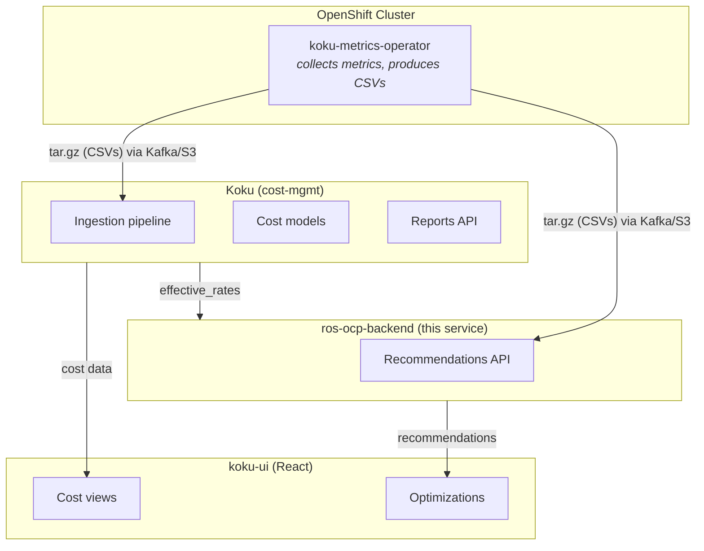

# Contributing to ros-ocp-backend

> **Last verified:** 2026-08-05

## License

This project is licensed under the **Apache License 2.0**. See [LICENSE](https://github.com/pgarciaq/ros-ocp-backend/blob/{{ git_branch }}/LICENSE) for details.

## What is ros-ocp-backend?

ros-ocp-backend is the **Resource Optimization for OpenShift** backend service.
It analyzes container, GPU, node, namespace, PVC, and snapshot metrics from
OpenShift clusters and produces rightsizing recommendations — "you're over-requesting
CPU here", "this GPU is idle", "this node is under-utilized".

It's part of Red Hat's Cost Management ecosystem:



**Koku tells you what you're spending. ros-ocp-backend tells you what you could save.**

---

## Architecture Overview

### Services (Processes)

ros-ocp-backend runs as 4 separate processes (same binary, different subcommands):

| Process | Command | Purpose |
|---------|---------|---------|
| **Processor** | `rosocp start processor` | Consumes Kafka messages, downloads CSVs, parses metrics, computes digests |
| **Recommendation Poller** | `rosocp start recommendation-poller` | Computes recommendations from digests on schedule |
| **API Server** | `rosocp start api` | Serves REST API for the frontend |
| **Housekeeper** | `rosocp start housekeeper` | Listens for source deletions, manages partitions |

### Data Flow

1. **koku-metrics-operator** collects Prometheus metrics → packages as CSVs → uploads tar.gz
2. **Koku** (ingress) stores the tar.gz in S3, publishes Kafka message
3. **Processor** consumes Kafka msg → downloads CSV from S3 → parses rows → upserts digests
4. **Recommendation Poller** reads digests → runs recommendation engine → persists recommendations
5. **API Server** reads recommendations from PostgreSQL → serves to frontend

### Key Packages

| Package | Description |
|---------|-------------|
| `internal/api/` | Echo HTTP handlers, middleware, serialization |
| `internal/config/` | Viper-based configuration (env vars, defaults) |
| `internal/costdata/` | HTTP client for Koku's effective_rates endpoint |
| `internal/db/` | pgxpool setup, connection management |
| `internal/engine/` | Recommendation math: percentiles, decay, GPU classification, node sizing, cost savings, retention sweeps |
| `internal/ingestion/` | CSV parsing, digest computation pipeline |
| `internal/kafka/` | Kafka consumer (confluent-kafka-go) |
| `internal/logging/` | Structured logging (logrus + WithFields) |
| `internal/metrics/` | Prometheus metric definitions |
| `internal/model/` | Database models and query builders |
| `internal/notifications/` | Notification code registry |
| `internal/plugin/` | Plugin registry (interfaces, init, enable/disable) |
| `internal/rbac/` | Platform RBAC integration |
| `internal/services/` | Report processing orchestration |
| `internal/services/housekeeper/` | Source deletion cleanup, partition management |
| `internal/testutil/` | Test database setup, fixtures |
| `internal/types/` | Shared type definitions |
| **`internal/plugins/`** | **Plugin implementations:** |
| `internal/plugins/container/` | Container CPU/memory recommendations |
| `internal/plugins/gpu/` | GPU MIG + time-slicing recommendations |
| `internal/plugins/vm/` | OpenShift Virtualization VM right-sizing (usage + per-GPU device CSV) |
| `internal/plugins/node/` | Node utilization recommendations |
| `internal/plugins/namespace/` | Namespace-level aggregates |
| `internal/plugins/pvc/` | PVC storage recommendations |
| `internal/plugins/snapshot/` | VolumeSnapshot staleness detection |
| `internal/plugins/kruize/` | Legacy Kruize delegation (deprecated) |

### Plugin Architecture

Plugins are **compile-time, in-process** Go interfaces toggled at runtime via env vars.
No dynamic loading — all plugins ship in the same binary.

Plugin interfaces:

| Interface | Purpose |
|-----------|---------|
| `CSVIngestor` | Owns CSV parsing for a payload type |
| `IngestHook` | Runs after CSV parsing (e.g., GPU digest upserts) |
| `APIProvider` | Registers HTTP routes |
| `APIEnricher` | Enriches another plugin's API responses |
| `RetentionProvider` | Owns data retention sweeps for its tables |
| `TermProvider` | Declares configurable recommendation time-window terms |

See [`docs/architecture/plugin-architecture.md`](architecture/plugin-architecture.md)
for full design details.

---

## Local Development Setup

### Prerequisites

- **Go 1.25+** (see `go.mod` for exact version)
- **PostgreSQL 16** (direct install, Docker, or Podman)
- **Kafka** (via docker-compose or Podman)
- **Docker or Podman** (for infrastructure services)

### Quick Start

```bash
# 1. Start infrastructure (Kafka + PostgreSQL + topics)
docker compose -f scripts/docker-compose.yml up -d kafka db-ros kafka-create-topics

# 2. Run database migrations
go run rosocp.go db migrate up

# 3. Start the API server (in one terminal)
PROMETHEUS_PORT=5007 go run rosocp.go start api

# 4. Start the processor (in another terminal)
PROMETHEUS_PORT=5005 go run rosocp.go start processor

# 5. Start the recommendation poller (in another terminal)
PROMETHEUS_PORT=5006 go run rosocp.go start recommendation-poller
```

### Using Makefile Shortcuts

```bash
make run-api-server            # Start API (port 8000)
make run-processor             # Start processor
make run-recommendation-poller # Start recommendation poller
make build                     # Build binary → bin/rosocp
make robne                     # Build standalone CLI → bin/robne
make build-all                 # bin/rosocp + bin/robne (not the docs site)
make test                      # Run all tests with -race
make lint                      # Run golangci-lint
make db-migrate                # Run migrations
```

### Docker Compose Services

The `scripts/docker-compose.yml` provides:

| Service | Port | Purpose |
|---------|------|---------|
| `kafka` | 29092 | Message broker |
| `zookeeper` | 32181 | Kafka coordination |
| `db-ros` | 15432 | PostgreSQL for ros-ocp-backend |
| `db-kruize` | — | PostgreSQL for Kruize (legacy) |
| `kruize-autotune` | 8080 | Kruize engine (legacy) |
| `ingress` | 3000 | Insights ingress (file upload → S3 → Kafka) |
| `sources-api-go` | 8002 | Sources API |
| `unleash-edge` | 3063 | Feature flags (offline mode) |
| `nginx` | 8888 | Serves sample CSV files for testing |

### Sending Test Data

```bash
# Upload a sample CSV message to Kafka (uses nginx to serve the file)
make upload-msg-to-rosocp

# Or use the sample tar.gz through ingress
curl -F "file=@scripts/samples/cost-mgmt.tar.gz;type=application/vnd.redhat.hccm.tar+tgz" \
  -H "x-rh-identity: $(echo -n '{"identity":{"org_id":"3340851","type":"System","auth_type":"cert-auth","system":{"cn":"1b36b20f-7fa0-4454-a6d2-008294e06378","cert_type":"system"},"internal":{"org_id":"3340851"}}}' | base64 -w0)" \
  http://localhost:3000/api/ingress/v1/upload
```

### Querying the API

```bash
IDENTITY=$(echo -n '{"identity":{"org_id":"3340851","type":"System","auth_type":"cert-auth","system":{"cn":"1b36b20f-7fa0-4454-a6d2-008294e06378","cert_type":"system"},"internal":{"org_id":"3340851"}}}' | base64 -w0)

# List container recommendations
curl -H "x-rh-identity: $IDENTITY" \
  http://localhost:8000/api/cost-management/v1/recommendations/openshift | python3 -m json.tool

# List GPU recommendations
curl -H "x-rh-identity: $IDENTITY" \
  http://localhost:8000/api/cost-management/v1/recommendations/openshift/gpu | python3 -m json.tool

# List node recommendations
curl -H "x-rh-identity: $IDENTITY" \
  http://localhost:8000/api/cost-management/v1/recommendations/openshift/nodes | python3 -m json.tool
```

---

## Configuration Reference

All configuration is via environment variables, loaded by `internal/config/config.go`
using Viper. When running under ClowdApp (production), many values are injected
automatically from the Clowder config.

### Setting Configuration Locally

The project uses [`godotenv`](https://github.com/joho/godotenv) to load a `.env`
file from the repository root into the process environment **before** Viper reads
it. This means you can configure everything in a single file without shell wrappers.

```bash
# One-time setup
cp .env.example .env

# Edit .env — uncomment and change only what you need
# Then just run:
go run rosocp.go start api
```

**How it works:**

1. `godotenv.Load()` reads `.env` into `os.Environ` (no-op if file is absent)
2. `viper.AutomaticEnv()` binds all Viper keys to environment variables
3. `viper.SetDefault(...)` provides fallback values for anything not set

**Precedence** (highest to lowest):

1. Explicit env vars (`LOG_LEVEL=DEBUG go run rosocp.go ...`)
2. Values in `.env`
3. Viper defaults in `config.go`

**Files:**

- `.env.example` — all available variables with their defaults (committed, documentation)
- `.env` — your local overrides (gitignored, never committed)
- `.env.local` — optional additional overrides (also gitignored)

### Core Settings

| Variable | Default | Description |
|----------|---------|-------------|
| `LOG_LEVEL` | `info` | Log level (debug, info, warn, error) |
| `API_PORT` | `8000` | API server listen port |
| `PROMETHEUS_PORT` | `9000` | Prometheus metrics port |
| `READ_HEADER_TIMEOUT` | `15` | HTTP read header timeout (seconds) |

### Database

| Variable | Default | Description |
|----------|---------|-------------|
| `DB_HOST` | `localhost` | PostgreSQL host |
| `DB_PORT` | `15432` | PostgreSQL port |
| `DB_NAME` | `postgres` | Database name |
| `DB_USER` | `postgres` | Database user |
| `DB_PASSWORD` | `postgres` | Database password |
| `DB_SSL` | `disable` | SSL mode |
| `ROS_DB_MAX_CONNS` | `10` | pgxpool max connections |
| `ROS_DB_ACQUIRE_TIMEOUT_SECS` | `5` | Connection acquire timeout |

### Kafka

| Variable | Default | Description |
|----------|---------|-------------|
| `KAFKA_BOOTSTRAP_SERVERS` | `localhost:29092` | Kafka broker addresses |
| `KAFKA_CONSUMER_GROUP_ID` | `ros-ocp` | Consumer group |
| `KAFKA_AUTO_COMMIT` | `false` | Auto-commit offsets (manual commit-on-success) |
| `UPLOAD_TOPIC` | `hccm.ros.events` | Upload notification topic |
| `RECOMMENDATION_TOPIC` | `rosocp.kruize.recommendations` | Recommendation trigger topic |
| `SOURCES_EVENT_TOPIC` | `platform.sources.event-stream` | Source lifecycle events |

### Recommendation Engine

| Variable | Default | Description |
|----------|---------|-------------|
| `ROS_RETENTION_MONTHS` | `6` | Data retention period |
| `ROS_MAX_LOOKBACK_DAYS` | `90` | Max lookback for recommendations |
| `ROS_HISTORY_RETENTION_DAYS` | `90` | History data retention |
| `ROS_STALENESS_THRESHOLD_HOURS` | `48` | Hours before marking stale |
| `ROS_STALE_CLEANUP_DAYS` | `30` | Days before deleting stale recs |
| `ROS_OOM_BASE_BUMP` | `0.15` | OOM memory bump factor (15%) |
| `ROS_OOM_MAX_BUMP` | `1.60` | Max OOM bump cap (160%) |

### GPU Thresholds

| Variable | Default | Description |
|----------|---------|-------------|
| `ROS_GPU_IDLE_THRESHOLD` | `0.02` | SM activity below this = idle |
| `ROS_GPU_UNDERUTILIZED_SM_THRESHOLD` | `0.25` | SM threshold for underutilized |
| `ROS_GPU_UNDERUTILIZED_TENSOR_THRESHOLD` | `0.15` | Tensor threshold for underutilized |
| `ROS_GPU_MEMBOUND_DRAM_THRESHOLD` | `0.60` | DRAM threshold for memory-bound |
| `ROS_GPU_MEMBOUND_TENSOR_THRESHOLD` | `0.15` | Tensor threshold for memory-bound |
| `ROS_GPU_FB_HEADROOM_FACTOR` | `1.20` | FB headroom multiplier for MIG sizing |

### Node Recommendations

| Variable | Default | Description |
|----------|---------|-------------|
| `ROS_NODE_UNDERUTIL_THRESHOLD` | `0.30` | Below this = underutilized |
| `ROS_NODE_OVERCOMMIT_THRESHOLD` | `1.50` | Above this = overcommitted |
| `ROS_NODE_ALLOCATABLE_FACTOR` | `0.93` | Allocatable fraction of capacity |
| `ROS_NODE_STRANDED_IMBALANCE_THRESHOLD` | `0.6` | CPU/memory imbalance threshold |
| `ROS_NODE_EMA_ALPHA` | `0.3` | EMA smoothing factor |

### Snapshot Detection

| Variable | Default | Description |
|----------|---------|-------------|
| `ROS_SNAPSHOT_ORPHAN_AGE_DAYS` | `7` | PVC-less snapshot age threshold |
| `ROS_SNAPSHOT_NEVER_RESTORED_DAYS` | `30` | Never-restored age threshold |
| `ROS_SNAPSHOT_STALE_DAYS` | `90` | General staleness threshold |
| `ROS_SNAPSHOT_REDUNDANT_THRESHOLD` | `3` | Max snapshots per PVC |
| `ROS_SNAPSHOT_COST_PER_GIB_MONTH` | `0.05` | Cost estimate ($/GiB/month) |

### Plugins

| Variable | Default | Description |
|----------|---------|-------------|
| `ROS_ENABLED_PLUGINS` | (all native) | Allowlist of active plugins |
| `ROS_DISABLED_PLUGINS` | (none) | Blocklist of disabled plugins |
| ~~`ROS_USE_NATIVE_ENGINE`~~ | — | **Removed.** Native engine is unconditionally active. Use `ROS_ENABLED_PLUGINS=kruize` for legacy Kruize-only mode. |

### Cost Integration

| Variable | Default | Description |
|----------|---------|-------------|
| `KOKU_MASU_URL` | — | Koku masu API URL for effective_rates |
| `ROS_SAVINGS_ESTIMATES_ENABLED` | `true` | Set `false` to skip Masu cost fetches; savings `$0`, `NotifNoCostData` on recommendations |

API responses include a `currency` field (ISO 4217 from Koku, default `USD`) alongside
existing `_usd` monetary fields. See [docs/architecture/cost-integration.md](architecture/cost-integration.md) for OCP-on-cloud behavior, per-plugin savings coverage, fleet savings summary (`GET .../savings-summary`), and negative savings semantics.

### RBAC

| Variable | Default | Description |
|----------|---------|-------------|
| `RBAC_ENABLE` | `false` (local) | Enable platform RBAC |
| `RBACHost` | `localhost` | RBAC service host |
| `RBACPort` | `9080` | RBAC service port |

---

## Data Ingestion

### What the Operator Sends

The koku-metrics-operator collects Prometheus metrics from each OpenShift cluster,
aggregates them into hourly CSV reports, packages them as a tar.gz, and uploads
to the platform ingress service.

### CSV Report Types

| File Pattern | Contents | Used By |
|--------------|----------|---------|
| `ros_ocp_usage.csv` | Container CPU/memory request/limit/usage per 15min interval | Container plugin |
| `ros_ocp_namespace.csv` | Namespace-level aggregates | Namespace plugin |
| `ros_ocp_storage.csv` | PVC capacity/request/usage | PVC plugin |
| `ros_ocp_snapshot.csv` | VolumeSnapshot inventory | Snapshot plugin |

### CSV Schema (Container — `ros_ocp_usage.csv`)

```
interval_start,interval_end,namespace,pod,workload,workload_type,container_name,
cpu_request_container_avg,cpu_limit_container_avg,cpu_usage_container_avg,cpu_throttle_container_avg,
memory_request_container_avg,memory_limit_container_avg,memory_usage_container_avg,memory_rss_usage_container_avg,oom_count
```

### Processing Pipeline

1. **Kafka consumer** receives `hccm.ros.events` message with `category: "ros"`
2. **Download** CSV from pre-signed S3 URL
3. **Parse** container ROS via `librobne/csv.ForEachRow` (ingest wrapper `internal/ingestion/csvparser.go`) and namespace ROS via `librobne/csv.ForEachNamespace` (ingest wrapper `internal/ingestion/namespace.go`). PVC / VM / snapshot / cluster-quota CSVs still parse in `internal/ingestion`.
4. **Digest** rows into daily aggregates (percentiles, min/max/avg per container per day)
5. **Upsert** digests into PostgreSQL (`daily_container_digests`, `gpu_container_digests`, etc.)
6. **Recommend** (poller or inline): read digests, apply decay-weighted percentiles, produce recommendations
7. **Persist** recommendations to `recommendation_sets` / `node_recommendations` / etc.

---

## Database

For schema design (JSONB vs normalized tables, decision matrix, codebase examples), see
[docs/architecture/database-conventions.md](architecture/database-conventions.md).

### Migrations

Migrations are in `migrations/` using [golang-migrate](https://github.com/golang-migrate/migrate):

```bash
# Apply all pending migrations
go run rosocp.go db migrate up

# Roll back one migration
go run rosocp.go db migrate down 1

# Check current version
go run rosocp.go db migrate version
```

### Key Tables

| Table | Purpose |
|-------|---------|
| `rh_accounts` | Tenant registry (org_id → account metadata) |
| `clusters` | Cluster registry (UUID, alias, source_id) |
| `workloads` | Workload registry (deployment/statefulset/etc.) |
| `recommendation_sets` | Container CPU/memory recommendations |
| `daily_container_digests` | Daily container metric digests (partitioned) |
| `container_usage_samples` | Raw usage samples (partitioned) |
| `gpu_container_digests` | GPU metric digests per container (partitioned) |
| `node_recommendations` | Node CPU/memory utilization recs |
| `daily_node_digests` | Daily node metric digests (partitioned) |
| `daily_namespace_digests` | Namespace-level digests (partitioned) |
| `namespace_recommendation_sets` | Namespace recommendations |
| `daily_pvc_digests` | PVC storage digests (partitioned) |
| `snapshot_recommendation_sets` | VolumeSnapshot staleness recommendations |
| `recommendation_history` | Historical recommendation snapshots |
| `recommendation_quality` | Quality/stability tracking |

### Partitioning

Digest and sample tables use **monthly range partitioning** on the interval timestamp.
Partitions are created automatically and dropped by the retention sweep after
`ROS_RETENTION_MONTHS`.

---

## API Endpoints

All endpoints are under `/api/cost-management/v1/`:

| Endpoint | Description |
|----------|-------------|
| `GET /recommendations/openshift` | List container recommendations |
| `GET /recommendations/openshift/:id` | Container recommendation detail |
| `GET /recommendations/openshift/fleet-summary` | Organization-wide summary |
| `GET /recommendations/openshift/gpu` | GPU recommendation summary |
| `GET /recommendations/openshift/gpu/timeslicing` | Node GPU time-slicing recs |
| `GET /recommendations/openshift/gpu/mig` | Container MIG profile recs |
| `GET /recommendations/openshift/nodes` | Node utilization recs |
| `GET /recommendations/openshift/namespaces` | Namespace recs |
| `GET /recommendations/openshift/namespaces/:id` | Namespace rec detail |
| `GET /recommendations/openshift/pvcs` | PVC storage recs |
| `GET /recommendations/openshift/snapshots` | Snapshot staleness recs |
| `GET /recommendations/openshift/history` | Recommendation history |
| `GET /recommendations/openshift/quality` | Quality/stability metrics |
| `GET /recommendations/openshift/settings/terms` | Term configuration |
| `PUT /recommendations/openshift/settings/terms` | Set custom term windows |
| `DELETE /recommendations/openshift/settings/terms` | Reset to defaults |

### Authentication

All requests require an `x-rh-identity` header (base64-encoded JSON):

```json
{
  "identity": {
    "org_id": "1234567",
    "type": "User",
    "user": { "username": "developer", "is_org_admin": true }
  }
}
```

In local development, RBAC is disabled by default (`RBAC_ENABLE=false`).

---

## Developing a New Plugin

### Prefer the scaffolder

```bash
make new-plugin NAME=myplugin
# optional: PHASE=enrich PRIORITY=40 TRAITS=csv,terms DRY_RUN=1
# or: go run ./cmd/newplugin -name myplugin -help
```

This creates `internal/plugins/<name>/{plugin.go,plugin_test.go}` with live
**Plugin** + **APIProvider** + **RetentionProvider** (other traits commented),
appends a sorted blank import to `internal/plugins/plugins.go`, and prints a
checklist. See [Local Development — Adding a plugin](development.md)
and issue [#410](https://github.com/pgarciaq/ros-ocp-backend/issues/410).

Trait explanations: [Plugin Traits](architecture/plugin-traits.md)
(public: [architecture/plugin-traits](https://pgarciaq.github.io/ros-ocp-backend/architecture/plugin-traits/)).
Go signatures: [Plugin Architecture §4](architecture/plugin-architecture.md).

### Manual steps (or after scaffolding)

### 1. Create the plugin package

```
internal/plugins/myplugin/
├── plugin.go       # Plugin struct + interface implementations
└── plugin_test.go  # Tests
```

### 2. Implement the interfaces you need

```go
package myplugin

import "github.com/redhatinsights/ros-ocp-backend/internal/plugin"

type MyPlugin struct {
    plugin.BasePlugin
}

func (p *MyPlugin) Name() string { return "myplugin" }

func (p *MyPlugin) Enabled() bool { return plugin.EnabledFor(p.Name()) }

// Implement one or more of:
// - plugin.CSVIngestor     → owns CSV parsing for a payload type
// - plugin.IngestHook      → runs after another plugin's CSV parsing
// - plugin.APIProvider     → registers HTTP routes
// - plugin.APIEnricher     → enriches another plugin's API response
// - plugin.RetentionProvider → owns retention sweeps for its tables
// - plugin.TermProvider    → short/medium/long recommendation terms

func init() {
    plugin.Register(&MyPlugin{})
}
```

### 3. Import the plugin (blank import)

In `internal/plugins/plugins.go` (do **not** edit `internal/plugin/registry.go`
for the plugin list):

```go
import _ "github.com/redhatinsights/ros-ocp-backend/internal/plugins/myplugin"
```

### 4. Enable/disable via env var

```bash
# Only enable your plugin (for focused testing)
ROS_ENABLED_PLUGINS=myplugin

# Enable alongside existing plugins
ROS_ENABLED_PLUGINS=container,gpu,node,myplugin
```

### 5. Add migrations if needed

```bash
# Create new migration files
go run rosocp.go db migrate create -ext sql -dir migrations -seq create_myplugin_table
```

---

## Testing

### Running Tests

```bash
# Nested librobne module (no PostgreSQL)
go test -C librobne ./...

# Unit tests (fast, no external dependencies) — includes librobne
make test-short
# equivalent: go test -C librobne -short ./... && go test -short ./...

# Unit tests with race detector
go test -C librobne -short -race ./...
go test -short -race ./...

# Full tests including integration (requires Podman/Docker for PostgreSQL)
make test
# equivalent: go test -C librobne ./... && go test ./...


# Specific package
go test ./internal/engine/ -run TestClassify

# Fuzz tests (run until interrupted or failure found)
go test ./internal/ingestion/ -fuzz=FuzzParseCSVRows -fuzztime=30s
```

Library import and call shape: [Integrating librobne](architecture/librobne.md)
([https://pgarciaq.github.io/ros-ocp-backend/architecture/librobne/](https://pgarciaq.github.io/ros-ocp-backend/architecture/librobne/)).

### Using Podman for Integration Tests

testcontainers-go works with Podman via rootless socket:

```bash
export DOCKER_HOST=unix:///run/user/$(id -u)/podman/podman.sock
export TESTCONTAINERS_RYUK_DISABLED=true
go test ./internal/engine/ -run Integration
```

Ryuk (the cleanup sidecar) is incompatible with rootless Podman. Disabling it
is safe because test containers are cleaned up via `t.Cleanup()`.

### Test Database

Integration tests use PostgreSQL on `localhost:15432`:

```bash
# Start a test database (if not using docker-compose)
podman run -d --name ros-test-db -p 15432:5432 -e POSTGRES_PASSWORD=postgres postgres:16
```

### Testing Conventions

#### Parallel Tests

All tests that are **pure computation** (no shared mutable state, no database,
no filesystem) MUST use `t.Parallel()`:

```go
func TestSomething(t *testing.T) {
    t.Parallel()
    // ...
}
```

#### Configurable Thresholds (GPUThresholds Pattern)

The GPU classification engine uses a `GPUThresholds` struct instead of
package-level global variables. This enables safe parallel testing:

```go
func TestCustomThreshold(t *testing.T) {
    t.Parallel()  // safe — no global mutation
    th := engine.GPUThresholds{
        IdleThreshold:       0.05,
        UnderutilizedSM:     0.25,
        UnderutilizedTensor: 0.15,
        MemBoundDRAM:        0.60,
        MemBoundTensor:      0.15,
        FBHeadroomFactor:    1.20,
    }
    cls, _ := th.Classify(digests)
    assert.Equal(t, engine.GPUClassIdle, cls)
}
```

**Never** mutate package-level globals in tests. If production code uses
globals (e.g., `InitGPUEngine`), tests that verify that function should NOT
be marked `t.Parallel()`.

#### Environment Variables in Tests

Use `t.Setenv()` instead of `os.Setenv()`:

```go
t.Setenv("ROS_GPU_IDLE_THRESHOLD", "0.05")  // auto-cleanup
```

#### Assertions

Use `require` for preconditions that would cause nil-pointer panics if failed,
`assert` for everything else:

```go
rec := RecommendGPU(digests)
require.NotNil(t, rec, "expected recommendation for idle workload")
assert.Equal(t, GPUClassIdle, rec.Classification)
assert.Greater(t, rec.Confidence, float32(0))
```

#### Error Path Testing

All external service integrations must have error-path tests covering:

- Timeouts (server takes longer than client timeout)
- Server errors (5xx)
- Authentication failures (401/403)
- Malformed responses (invalid JSON, unexpected schema)
- Context cancellation

See `internal/costdata/provider_contract_test.go` for the reference pattern.

#### Fuzz Tests

Add fuzz tests for any function that parses external input (CSV, JSON, query
parameters). Fuzz targets must not panic on arbitrary input:

```go
func FuzzParseCSVRows(f *testing.F) {
    f.Add("valid,csv,header\nrow,data,here\n")
    f.Fuzz(func(t *testing.T, data string) {
        ParseCSVRows(strings.NewReader(data)) //nolint:errcheck
    })
}
```

#### Fast local iteration

For sub-5-minute unit-only runs (no Docker/testcontainers):

```bash
make test-short
```

This runs `go test -C librobne -short ./...` then `go test -short ./...`, which skips integration tests guarded by `testing.Short()`.
Use `make test` for the full suite (nested module + parent) before opening a PR.

#### Integration Tests

Tests requiring PostgreSQL or external containers use `testing.Short()` guard:

```go
func TestPersistRecommendations(t *testing.T) {
    if testing.Short() {
        t.Skip("requires PostgreSQL")
    }
    pool := testutil.SetupTestDB(t)
    // ...
}
```

Key integration test suites:

| Test | File | Covers |
|------|------|--------|
| `TestGPU_MIG_EndToEnd_Integration` | `internal/engine/gpu_mig_integration_test.go` | Full MIG data flow: seeding → classification → MIG profile selection for all GPU classes |
| `TestSavingsPipeline_Integration` | `internal/engine/savings_integration_test.go` | Recommendations → cost data → savings computation |
| `TestMigrationRoundtrip` | `internal/engine/migration_roundtrip_test.go` | All migrations apply and roll back cleanly |
| `TestWriteRecommendations_*` | `internal/engine/recommend_all_integration_test.go` | Full recommendation persistence pipeline |

When adding new migrations, update the expected version in `TestMigrationRoundtrip`.

---

## Code Style

### Imports

Standard library → external packages → internal packages (blank-line separated):

```go
import (
    "context"
    "fmt"

    "github.com/labstack/echo/v4"
    "github.com/sirupsen/logrus"

    "github.com/redhatinsights/ros-ocp-backend/internal/config"
    "github.com/redhatinsights/ros-ocp-backend/internal/logging"
)
```

### Logging

Use the `internal/logging` package for structured logs:

```go
logging.ForOrg(orgID).WithField("cluster", clusterUUID).Info("processing complete")
logging.ForRequest(c).Warn("invalid parameter")
```

### Error Handling

Wrap errors with context. Never swallow errors:

```go
if err := db.Query(ctx, sql); err != nil {
    return fmt.Errorf("querying node recommendations for org %s: %w", orgID, err)
}
```

---

## Deployment

### Production (console.redhat.com)

Deployed as a ClowdApp on OpenShift with:

- 4 deployments (api, processor, recommendation-poller, housekeeper)
- Managed PostgreSQL (RDS)
- MSK Kafka
- Platform RBAC + identity middleware

### On-Premise (cost-onprem Helm chart)

Deployed alongside Koku in a single Helm chart (`cost-onprem-chart/`):

- Single PostgreSQL shared with Koku
- Internal Kafka (AMQ Streams)
- Keycloak for JWT authentication
- S3-compatible storage (NooBaa/Ceph RGW)

---

## Feature Flags (Unleash)

ros-ocp-backend uses [Unleash](https://www.getunleash.io/) for feature flag management.

### Current State

The `internal/featureflags` package initializes the Unleash SDK client. As of now,
the `flags.go` file is empty — no feature flags are actively checked in production code.
The infrastructure is wired and ready for when new features need gradual rollout.

### Local Development

The docker-compose stack includes `unleash-edge` in offline mode with an empty
feature set (`.unleash/bootstrap.json`). No external Unleash server is needed.

### Finding Active Flags

To discover what flags the code checks at any point:

```bash
# Search for Unleash IsEnabled calls
grep -rn "unleash.IsEnabled\|IsFeatureEnabled" internal/

# Check the bootstrap file for locally-defined flags
cat .unleash/bootstrap.json
```

### Adding a New Feature Flag

1. Define the flag name as a constant in `internal/featureflags/flags.go`
2. Check it where needed: `unleash.IsEnabled("ros.my_feature", unleash.WithContext(...))`
3. Add the flag to `.unleash/bootstrap.json` for local dev (set `enabled: true/false`)
4. Register the flag in the Unleash server (production) with appropriate rollout strategy

### Metrics That Need Operator Changes

If your plugin introduces new Prometheus metric **types** that should be collected
from OpenShift clusters (e.g., new DCGM metrics for GPU), those queries must be
added to the **koku-metrics-operator** (`~/dev/koku/koku-metrics-operator/`).
The operator is what collects the raw Prometheus data and packages it as CSVs.

---

## OpenAPI Specification

The API contract is defined in `openapi.json` at the repository root.

### When to Update

Update `openapi.json` whenever you:

- Add a new API endpoint
- Add/remove/rename query parameters or response fields
- Change response status codes
- Add a new plugin that registers routes

### How to Update

The spec is **maintained manually** (not auto-generated). Edit `openapi.json` directly:

1. Add your path under `paths`
2. Add any new schemas under `components.schemas`
3. If the endpoint belongs to a plugin, add `"x-plugin-required": "pluginname"` to the
   operation object — this enables automatic filtering when the plugin is disabled
4. Validate: `curl http://localhost:8000/api/cost-management/v1/recommendations/openshift/openapi.json | python3 -m json.tool`

The API server serves the spec via `ServeFilteredOpenAPI` which dynamically removes
paths for disabled plugins based on the `x-plugin-required` extension.

---

## Migration Best Practices

### Creating Migrations

```bash
# Install golang-migrate CLI (one-time)
make install-golang-migrate-cli-tool

# Create a new migration pair
$(LOCALBIN)/migrate create -ext sql -dir migrations -seq describe_what_it_does
```

This creates `migrations/000064_describe_what_it_does.{up,down}.sql`.

### Rules

1. **Never drop columns in production.** Add columns, deprecate, then remove in a later release.
2. **Always write both up and down.** The down migration must cleanly reverse the up.
3. **Partitioned tables** — Use the partition function pattern from existing migrations
   (see `000005_partition_functions.up.sql` and `000060_ros_partitioned_parent_registry.up.sql`).
4. **Indexes** — Add concurrently where possible (`CREATE INDEX CONCURRENTLY`). For
   partitioned tables, standard `CREATE INDEX` is fine (PostgreSQL handles per-partition).
5. **Data migrations** — Avoid large data transforms in migrations. If needed, make them
   idempotent (safe to re-run).
6. **Test migrations** — Run `go run rosocp.go db migrate up` then `down` then `up` again
   to verify round-trip safety.
7. **Never reorder** — Migration numbers must be sequential. Never insert between existing numbers.

### Partitioned Table Pattern

```sql
-- up: Create a monthly-partitioned table
CREATE TABLE IF NOT EXISTS daily_myplugin_digests (
    id BIGSERIAL,
    org_id TEXT NOT NULL,
    cluster_uuid UUID NOT NULL,
    interval_start TIMESTAMPTZ NOT NULL,
    -- ... columns ...
    PRIMARY KEY (id, interval_start)
) PARTITION BY RANGE (interval_start);

-- Register in the partition registry so retention sweep can find it
INSERT INTO ros_partitioned_tables (table_name, partition_column, retention_months)
VALUES ('daily_myplugin_digests', 'interval_start', 6)
ON CONFLICT (table_name) DO NOTHING;
```

---

## Multi-Tenancy

### The org_id Model

ros-ocp-backend is multi-tenant. Every row in the database is scoped to an
`org_id` (organization identifier from the Red Hat identity system). This is
the **#1 source of bugs** in the codebase.

### Rules

1. **Every database query MUST filter by `org_id`.**
   If you forget, you'll return data from all organizations — a security vulnerability.

2. **The `org_id` comes from the identity header**, decoded by middleware into the Echo context:
   ```go
   orgID := identityContext(c).OrgID
   ```

3. **Never hardcode `org_id` in tests.** Use `testutil.TestOrgID` constant.

4. **Cross-org queries are forbidden** in the API layer. Only internal housekeeping
   (retention sweeps, partition management) may iterate across orgs.

5. **Kafka messages carry `org_id` in metadata.** The processor extracts it and passes
   it through the entire pipeline. If `org_id` is empty, the message is rejected.

### Common Mistakes

```go
// BAD — returns all orgs' data
rows, _ := pool.Query(ctx, "SELECT * FROM recommendation_sets WHERE cluster_uuid = $1", clusterUUID)

// GOOD — scoped to tenant
rows, _ := pool.Query(ctx, "SELECT * FROM recommendation_sets WHERE org_id = $1 AND cluster_uuid = $2", orgID, clusterUUID)
```

---

## Common Pitfalls

### Partition Boundaries

Digest tables are partitioned by month. If you query across month boundaries
without ensuring the partition exists, you'll get empty results (not errors).
The partition creation is handled by `EnsurePartition()` during ingestion.

### Kafka Offset Commits

With `KAFKA_AUTO_COMMIT=false` (default), offsets are committed explicitly after
successful processing (at-least-once semantics). If the processor crashes mid-processing,
the message will be redelivered on restart. All database writes must be **idempotent**
(use `ON CONFLICT ... DO UPDATE`). Set `KAFKA_AUTO_COMMIT=true` to revert to periodic
auto-commit (at-most-once semantics).

### pgxpool Connection Exhaustion

The pool defaults to 10 connections (`ROS_DB_MAX_CONNS`). Long-running queries or
forgotten rows (not calling `rows.Close()`) will exhaust the pool and deadlock the service.
Always use `defer rows.Close()` and keep transactions short.

### GPU Model Name Matching

GPU model names from DCGM metrics are free-form strings that vary across driver versions.
The `MatchGPUModel()` function uses substring matching against a catalog. If you see
`rosocp_gpu_model_unrecognized_total` incrementing, check application logs for
`gpu_metadata: unrecognized GPU model` (the `gpu_model` field has the exact string),
then add the new variant to `librobne/gpu/catalog.go`.

### Time Zones

All timestamps in the database are `TIMESTAMPTZ` stored in UTC. The API accepts
and returns UTC. Never use local time in queries or comparisons.

### Stale Recommendations

Recommendations with no new data for `ROS_STALENESS_THRESHOLD_HOURS` (default 48h)
are marked stale. After `ROS_STALE_CLEANUP_DAYS` (default 30), they're deleted.
Don't be surprised when test data "disappears" — check the retention sweep.

### Project vs Namespace Terminology

OpenShift "projects" are Kubernetes namespaces with additional metadata (display name,
description, annotations). The codebase uses **"namespace"** in models, DB columns, and
Go structs (e.g., `Namespace` field, `daily_namespace_digests` table), but API responses
and the UI use **"project"** following the Cost Management convention. When mapping API
response fields to struct fields, `r.Project` maps to the `Namespace` field.

---

## Prometheus Metrics

### Exported Metrics

| Metric | Type | Labels | Description |
|--------|------|--------|-------------|
| `rosocp_db_query_duration_seconds` | Histogram | `operation` | Database query latency |
| `rosocp_recommendation_duration_seconds` | Histogram | `type` | Recommendation computation time |
| `rosocp_pipeline_phase_duration_seconds` | Histogram | `phase` | Per-phase pipeline timing |
| `rosocp_recommendations_written_total` | Counter | `type` | Recommendations persisted |
| `rosocp_kafka_messages_processed_total` | Counter | — | Kafka messages consumed |
| `rosocp_ingestion_errors_total` | Counter | `stage` | Pipeline failures by stage |
| `rosocp_invalid_csv_total` | Counter | — | Malformed CSVs received |
| `rosocp_csv_fetch_error_total` | Counter | — | S3/HTTP download failures |
| `rosocp_db_error_total` | Counter | — | Database errors |
| `rosocp_partition_missing_error_total` | Counter | `resource_name` | Missing partition errors |
| `rosocp_retention_partitions_dropped_total` | Counter | — | Partitions dropped by sweep |
| `rosocp_gpu_model_unrecognized_total` | Counter | — | Unrecognized GPU models (aggregate; check logs for specific models) |
| `ros_ocp_plugin_hook_errors_total` | Counter | `plugin`, `hook_type` | Plugin hook failures |
| `rosocp_rh_account_created_total` | Counter | — | New tenant accounts |

### Adding a New Metric

1. Define in `internal/metrics/metrics.go` (or a package-local `metrics.go` if scoped):
   ```go
   var MyMetric = promauto.NewCounterVec(prometheus.CounterOpts{
       Name: "rosocp_my_metric_total",
       Help: "Description of what this measures",
   }, []string{"label1"})
   ```
2. Instrument the code: `metrics.MyMetric.WithLabelValues("value").Inc()`
3. Use `promauto` (not `prometheus.MustRegister`) to avoid double-registration panics in tests

### Scraping

Each process exposes metrics on its `PROMETHEUS_PORT`:

- API: `:5007/metrics`
- Processor: `:5005/metrics`
- Recommendation Poller: `:5006/metrics`

---

## Issue Tracking and Code Review

### Filing Issues

File bugs and feature requests at:
**https://github.com/RedHatInsights/ros-ocp-backend**

### Code Review Process

- All changes require a pull request reviewed by the **Red Hat Resource Optimization Service team**
- PRs are merged via **rebase** (linear history)
- Run `go vet ./...` and `go test -race -short ./...` before submitting
- CI must pass before merge

### Commit Messages

Use imperative mood, reference issue numbers:

```
Fix GPU threshold race in parallel tests (#428)

Introduce GPUThresholds struct with Classify/SelectMIGProfile methods.
Tests create local instances instead of mutating package globals.
```

---

## IDE Setup

### VS Code / Cursor

Recommended extensions:

- `golang.go` — Go language support (gopls, dlv debugger)
- `redhat.vscode-yaml` — YAML validation for docker-compose

Settings (`.vscode/settings.json`):
```json
{
  "go.testFlags": ["-short", "-race"],
  "go.lintTool": "golangci-lint",
  "go.lintFlags": ["--timeout=3m"],
  "editor.formatOnSave": true
}
```

### GoLand

- Set `Go Modules` integration to enabled
- Configure test flags: `-short -race`
- Set `golangci-lint` as external linter

### Debugging

```bash
# Attach debugger to running API server
dlv attach $(pgrep -f "rosocp start api")

# Or run with debugger
dlv debug ./rosocp.go -- start api
```

### Useful psql Queries

```sql
-- Connect to local dev database
psql -h localhost -p 15432 -U postgres -d postgres

-- Check recommendations for an org
SELECT org_id, cluster_uuid, container_name, last_reported
FROM recommendation_sets WHERE org_id = '3340851' ORDER BY last_reported DESC LIMIT 10;

-- Check GPU digests
SELECT org_id, node_name, gpu_model_name, interval_start
FROM gpu_container_digests WHERE org_id = '3340851' ORDER BY interval_start DESC LIMIT 10;

-- Check partition health
SELECT tablename FROM pg_tables WHERE tablename LIKE '%202%' ORDER BY tablename;
```

---

## Documentation Site

The public documentation site is built and deployed automatically by GitHub Actions
(`.github/workflows/docs.yml`). You never need to run the build locally.

### How it works

1. Push to `main` (or `pgarciaq-rosocp-superpowers-*` branches) triggers the workflow
2. CI runs `scripts/generate-docs.sh` which:
   - Copies `docs/known-issues.md` → `docs-site/known-issues.md` (with site-safe link rewrites)
   - Copies `CONTRIBUTING.md` → `docs-site/contributing.md` (with path rewrites)
   - Does **not** overwrite curated `docs-site/` trees (architecture, features, operations,
     plugin-reference)
3. CI runs `mkdocs build` over `docs-site/` (config: `mkdocs.yml`)
4. CI runs `scripts/generate-librobne-docs.sh _site/pkg` (doc2go HTML for
   `librobne/` only — not pkgsite, not `internal/`)
5. Deploys the built HTML to GitHub Pages

Local preview: `make docs-serve` (MkDocs live reload; does **not** include
`_site/pkg`). For the librobne HTML tree: `make docs-build` then open
`_site/pkg/index.html` (or `python3 -m http.server -d _site`). Run
`make docs-generate` when you need the known-issues / CONTRIBUTING copies refreshed.
Plugin-reference pages are hand-maintained — see
[Plugin Reference overview](https://pgarciaq.github.io/ros-ocp-backend/plugin-reference/).

### Phase branch bump checklist

When opening a new `pgarciaq-rosocp-superpowers-phaseN` branch across the ecosystem,
update **live/current** branch pointers only. **Do not** run a repo-wide
search-and-replace of the previous phase branch name.

**Rule of thumb:** If the text records work done on branch X at time T, keep branch X.
If it tells someone which branch to clone or checkout **today**, update to the new phase
branch.

#### Update to the new phase branch (live pointers)

| Location | What to change |
|----------|----------------|
| `mkdocs.yml` | `repo_url` tree branch |
| `docs-site/quickstart.md` | Example native-engine checkout branch |
| `docs-site/testing/validating-native-engine.md` | Repo table, `BRANCH=`, checkout commands |
| `docs-site/security/index.md` | Blob links only when OSCAL artifacts were regenerated on the new branch |
| Forward-looking plan text | Cherry-pick **source** branch in `docs/plans/robne-upstreaming-plan.md` (operational guidance only) |
| Cross-repo clone/deploy docs | Branches readers should use **now** |

`macros.py` sets `{{ git_branch }}` from the current git HEAD at MkDocs build time —
no edit needed for blob links that already use that macro.

GitHub Actions (`.github/workflows/docs.yml`) already deploys all
`pgarciaq-rosocp-superpowers-*` branches; no workflow edit is required per phase unless
branch naming convention changes.

#### Keep the historical branch name (do not change)

| Location | Why |
|----------|-----|
| `docs/performance/*` audit reports | Audits name the branch and HEAD where profiling ran |
| `CHANGELOG.md` / `docs-site/changelog.md` release sections | `**Branch:**` under `## [1.0.0-phaseN]` must match that release's branch |
| Feature status archive phase rows | Branch where that phase's work happened |
| `docs-site/whats-new.md` "Recently completed (Phase N)" | Branch where that phase shipped |
| Point-in-time gap/analysis notes | e.g. Clowder diff researched on `phase16` |
| Helm/chart image tag comments | Branch used to build that image |
| Scale benchmark runbook pip/git refs | Branch used when the benchmark was executed |
| Any document with **Date and Scope** / frozen narrative | Historical record |

#### Verification (manual review, not blind replace)

```bash
rg 'pgarciaq-rosocp-superpowers-phase' docs-site/ mkdocs.yml CONTRIBUTING.md docs/plans/ docs/performance/
```

Review **each** match: live pointer → update; historical record → leave unchanged.

### Last-verified convention

Class A pages (live contracts: defaults, env vars, API paths, deploy/ops behavior) should
carry a visible stamp near the top:

```markdown
> **Last verified:** YYYY-MM-DD
```

**Meaning:** Class A facts on that page were checked against code, OpenAPI, chart values,
and/or Makefile targets on that date — not “page authored on” and not a claim that every
sentence is perfect.

| Page class | Stamp? |
|------------|--------|
| **Class A** (configuration, getting started, live architecture/ops contracts, OpenAPI summary) | **Required** after a freshness pass or Class A edit |
| Features / plugin-reference after substantive edits | Encouraged |
| Historical / planned-features / frozen narrative | Not required |

When you change Class A facts, bump the date on that page. Optional CI drift checks live in
[`scripts/check-docs-drift.sh`](https://github.com/pgarciaq/ros-ocp-backend/blob/{{ git_branch }}/scripts/check-docs-drift.sh)
(see `.github/workflows/docs-drift.yml`).

### Docs link lint (`make docs-lint`)

[`scripts/check-docs-lint.sh`](https://github.com/pgarciaq/ros-ocp-backend/blob/{{ git_branch }}/scripts/check-docs-lint.sh)
(issue #419) checks `docs-site/` for:

1. **Escaped relative links** — paths that leave `docs-site/` (e.g. `../../docs/design/...`).
   MkDocs only publishes `docs-site/`, so those become GitHub Pages 404s. Prefer
   `https://github.com/pgarciaq/ros-ocp-backend/blob/{{ git_branch }}/...` for repo
   internals, or an in-site page.
2. **Broken in-site relative targets**
3. **Class A pages missing** `> **Last verified:** YYYY-MM-DD`

`make docs-lint` fails on escaped/broken relative links or missing Class A stamps.
`make docs-lint-soft` is report-only. CI workflow `docs-lint.yml` runs the hard check.
Does **not** replace `make docs-drift`. One-shot rewriter used for the backlog:
[`scripts/fix-docs-site-links.py`](https://github.com/pgarciaq/ros-ocp-backend/blob/{{ git_branch }}/scripts/fix-docs-site-links.py).

### Generate PDF books (local only)

Build **per-section PDF books** offline for ebook/reader use. PDFs are **not**
committed and **not** published to GitHub Pages (see
[#379](https://github.com/pgarciaq/ros-ocp-backend/issues/379) /
[#380](https://github.com/pgarciaq/ros-ocp-backend/issues/380) /
[#381](https://github.com/pgarciaq/ros-ocp-backend/issues/381)).

```bash
# One-time deps
make docs-pdf-install
# Also need: npm install -g @mermaid-js/mermaid-cli
# And Chrome/Chromium (or set DOCS_PDF_CHROME=/path/to/chrome)

# All nav-section books → dist/pdf/*.pdf (gitignored; can take 15–30+ min)
make docs-pdf-all
# equivalent: ./scripts/docs-pdf.sh all

# Or one section at a time:
./scripts/docs-pdf.sh features
./scripts/docs-pdf.sh getting-started   # also: planned-features, architecture,
                                        # testing, plugin-reference, api,
                                        # operations, security, ui-integration,
                                        # historical
```

Pipeline: optional `generate-docs.sh` (known-issues/CONTRIBUTING) → copy section pages →
`mmdc` (Mermaid → PNG) → `mkdocs-to-pdf` / WeasyPrint (macros expand) →
`dist/pdf/<section>.pdf`. Use `SKIP_GENERATE=1` if copies are already fresh.

Work tree: `.docs-pdf-work/` (gitignored). Print CSS:
`scripts/docs-pdf/styles.scss` (A4). Nav mirrors `mkdocs.yml` (hardcoded in
the script). Home (`index.md`) is not a separate book. Full OpenAPI and Plugin
Reference are included (long books are expected). Historical is its own PDF
target (frozen narratives and point-in-time benchmark reports).

#### Known limitations

| Topic | Behavior |
|-------|----------|
| Mermaid format | **PNG**, not SVG — Mermaid SVGs often use HTML `foreignObject` that WeasyPrint cannot paint (blank diagrams). |
| Tall diagrams | Height-capped and **allowed to break** across pages. Do **not** set `break-inside: avoid` on tall `img`/`svg`/`figure` — WeasyPrint can **silently drop all following content** when an unbreakable box is taller than one page. |
| Tall tables / long code | Allowed to split across pages; table headers repeat when the engine supports `thead { display: table-header-group }`. Individual rows try to stay together. |
| Wide tables | May still overflow or wrap awkwardly; landscape-only pages are out of scope. |
| File size | Features book can be tens of MB (embedded Mermaid PNGs + fonts). Optional light PNG `optimize=True`; aggressive compression deferred. |
| Font warnings | WeasyPrint may log `Embedded font file may be invalid` (Material icon/emoji fonts). Usually cosmetic for body text. |
| Plugin defaults | `mkdocs-to-pdf` ships `page-break-inside: avoid` on `img`/`table`; our `styles.scss` overrides those with `!important`. |

### Source of truth for each page

**Policy A:** Keep `docs/` (internal) and `docs-site/` (public). Sync customer-relevant
facts when either side changes; do not expect identical prose. CI does **not** copy
`docs/architecture/` or `docs/operations/` onto `docs-site/` (removed in #417 — that
overwrite published stale internal copies over curated public pages). Prefer
`docs-site/` as the public SoT for contracts (defaults, API paths, deploy behavior),
then mirror Class A facts into `docs/`. Inventory parallel pairs with
`make docs-sync-check` (see `.cursor/rules/docs-site-sync.mdc`).

| What you edit | Where it ends up | How |
|---|---|---|
| `docs/known-issues.md` | `docs-site/known-issues.md` | **Known Limitations** — edit `docs/` source, then `make docs-generate`. Full status matrix: `docs-site/historical/feature-status-archive.md` |
| `CONTRIBUTING.md` | `docs-site/contributing.md` | Copied with path rewrites (edit this file) |
| `CHANGELOG.md` | `docs-site/changelog.md` | Generated by `generate-docs.sh` — root keeps relative `docs/` links for GitHub; site copy rewrites them to GitHub blob URLs (do **not** symlink) |
| `docs-site/architecture/`, `features/`, `operations/`, `plugin-reference/`, etc. | Same path | **Hand-maintained and committed** — edit `docs-site/` directly; mirror to `docs/` when a parallel internal page exists |
| Optional gomarkdoc dumps | `plugin.md` / `kruize.md` / `example.md` | Only if `DOC_GENERATE_GOMARKDOC=1`; prefer curated pages |

### .gitignore rules

All `docs-site/` content is tracked normally. Only build outputs are ignored (`_site/`,
`site/`, `dist/pdf/`, `.docs-pdf-work/`). See `.gitignore`.

**Rule:** Edit hand-maintained pages under `docs-site/` in place. For known-issues and
the contributing copy, edit `docs/known-issues.md` and `CONTRIBUTING.md`, then run
`make docs-generate` (CI does this before Pages deploy).

## Maintaining embedded data files

GPU hardware catalogs are compiled into the binary via `go:embed`:

- `librobne/gpu/gpu_catalog.yaml` — MIG profiles and model specs (containers and VMs)
- `librobne/gpu/vgpu_profiles.yaml` — vGPU C-series profiles (VMs only)

Before changing either file, read [GPU Catalogs — Data Sources and Validation](architecture/gpu-catalogs.md)
for NVIDIA documentation links, validation steps, and common pitfalls. Run:

```bash
go test -C librobne ./gpu/ -run 'TestGPUCatalog|TestMatchGPUModel|TestGPUModelMIG|TestVGPUProfile'
```

Day-to-day monitoring (`rosocp_gpu_model_unrecognized_total`):
[GPU Catalog Maintenance](https://github.com/pgarciaq/ros-ocp-backend/blob/{{ git_branch }}/docs/operations/gpu-catalog.md).

## Further Reading

- [Plugin architecture](architecture/plugin-architecture.md)
- [GPU catalogs (data sources and validation)](architecture/gpu-catalogs.md)
- [GPU classification algorithm](architecture/gpu-classification.md)
- [Recommendation math](architecture/recommendation-math.md)
- [Kafka message schema](architecture/kafka-schema.md)
- [Cost integration](architecture/cost-integration.md)
- [OpenAPI spec](openapi.md)
