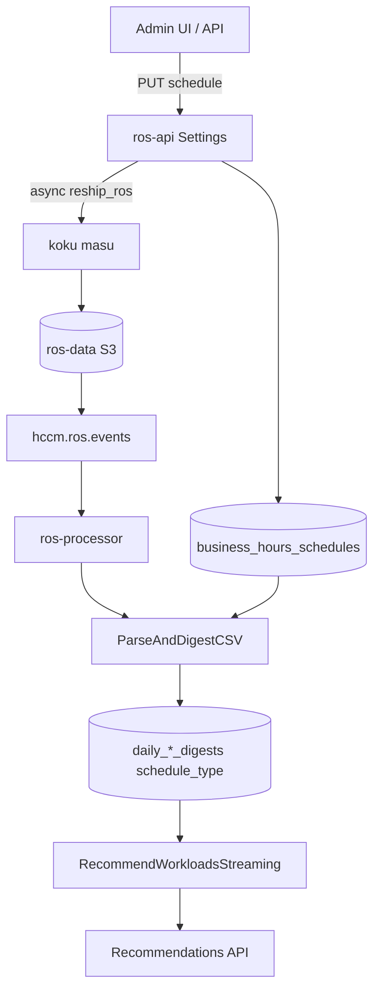

# Business Hours Recommendations

> **Last verified:** 2026-08-29

!!! info "Quick Facts"
    **What it does:** Produces container and namespace recommendations scoped to configured business hours (e.g., Mon–Fri 09:00–17:00) alongside existing 24/7 **all_hours** results  
    **Data source:** Same ROS usage CSV as container recommendations; hourly samples are weighted by `business_hours_schedules` (timezone, days, start/end, `off_hours_weight`)  
    **Update frequency:** Each ingestion cycle; schedule changes trigger masu `reship_ros` to rebuild historical **business_hours** digests  
    **Plugin:** `container` (priority 10) and `namespace` (priority 90) — business hours is a dual-digest enrichment, not a separate plugin  
    **Settings API:** `GET/PUT/DELETE /api/cost-management/v1/recommendations/openshift/settings/business-hours` (plus cluster and namespace paths)  
    **Recommendations API:** `business_hours` blocks on **container and namespace detail** when a schedule is enabled and reship is complete (lists stay all-hours); node **detail** (`GET .../nodes/{node}`) nests `business_hours` when org or cluster schedule is enabled (list stays all-hours); container **detail** nests `gpu.{term}.business_hours` when a namespace schedule is enabled (list/MIG stay all-hours); GPU timeslicing **detail** (`GET .../gpu/timeslicing/{node}`) nests `business_hours` when org ⊕ cluster is enabled and the node × model group is homogeneous (list stays all-hours); VM **detail** (`GET .../vm/detail`) nests a thin `business_hours` object when a namespace schedule is enabled (list stays all-hours)  
    **Savings:** Always computed from **all_hours** sizing; `estimated_monthly_savings` is a `MoneyAmount` (`{"value": "12.34", "units": "USD"}`) — BH affects CPU/memory sizing only  
    **Kill-switch:** `ROS_BUSINESS_HOURS_ENABLED` (default `true`)

**Status:** Implemented (ros-ocp-backend, koku masu `reship_ros`, cost-onprem-chart E2E). Node **detail** nested `business_hours` shipped in [#484](https://github.com/pgarciaq/ros-ocp-backend/issues/484). GPU **container detail** nested `gpu.{term}.business_hours` shipped in [#485](https://github.com/pgarciaq/ros-ocp-backend/issues/485). GPU **timeslicing detail** nested `business_hours` shipped in [#491](https://github.com/pgarciaq/ros-ocp-backend/issues/491). VM **detail** nested `business_hours` shipped in [#486](https://github.com/pgarciaq/ros-ocp-backend/issues/486).

## Overview

Business hours adds schedule-aware CPU and memory sizing to **container** and
**namespace** recommendations. Workloads that spike during business hours but
share nodes with overnight batch jobs get a second sizing perspective based on
in-window usage only.

ROS produces **two** recommendation perspectives:

| Stream | Meaning |
|--------|---------|
| **all_hours** | Existing 24/7 behavior (unchanged when BH is disabled) |
| **business_hours** | Percentiles computed from in-window samples only (off-hours excluded when `off_hours_weight=0`) |

**Who uses it:** Platform / FinOps admins sizing interactive workloads that
spike during business hours but share nodes with overnight batch jobs.

**Why not Koku cost models?** Business hours are an optimization concern, not
billing. Not every cluster has a cost model; settings live in ros-ocp-backend
alongside snapshot staleness and recommendation terms.

Full design rationale: [`docs/features-business-hours.md`](business-hours.md).

## How it works



1. An administrator configures a weekly schedule (timezone, days, start/end time) at org, cluster, or namespace scope.
2. **Schedule change** sets `reship_pending_since` and calls masu `reship_ros`
   to re-list S3 ROS CSVs and republish Kafka messages.
3. **Ingestion** writes dual digests (`schedule_type = all_hours | business_hours`).
4. **Engine** runs twice when BH is enabled — once per stream — and the API
   returns both CPU/memory amounts in Kruize-compatible `amount`/`format` fields.
5. After historical reship completes, recommendation **detail** responses
   include a nested `business_hours` block alongside the existing all-hours engines.
   List responses stay all-hours.

Savings estimates always use the **all_hours** perspective. Business hours
affects sizing only, not dollar savings.

Key code:

- Settings: [`internal/api/handlers_business_hours_settings.go`](https://github.com/pgarciaq/ros-ocp-backend/blob/{{ git_branch }}/internal/api/handlers_business_hours_settings.go)
- Schedule eval: [`internal/bhschedule/schedule.go`](https://github.com/pgarciaq/ros-ocp-backend/blob/{{ git_branch }}/internal/bhschedule/schedule.go)
- Dual digest pipeline: [`internal/ingestion/pipeline_business_hours.go`](https://github.com/pgarciaq/ros-ocp-backend/blob/{{ git_branch }}/internal/ingestion/pipeline_business_hours.go)
- Reship client: [`internal/reship/service.go`](https://github.com/pgarciaq/ros-ocp-backend/blob/{{ git_branch }}/internal/reship/service.go)
- Masu endpoint: koku `masu/api/views.py` (`reship_ros`)

## Scope

**v1: container and namespace** (detail nest; lists stay all-hours). **Nodes (#484):** nested `business_hours` on **detail only**, driven by org ⊕ cluster schedule (namespace-only enablement is ignored). **GPU (#485):** nested `business_hours` on **container detail** `gpu.{term}` only, driven by the namespace schedule (namespace-only enablement **does** dual-write GPU BH). **GPU timeslicing (#491):** nested `business_hours` on **GET .../gpu/timeslicing/{node}** only, driven by org ⊕ cluster (homogeneous node × model groups). **VM (#486):** nested `business_hours` on **GET .../vm/detail** only, driven by the namespace schedule (namespace-only enablement **does** dual-write VM BH). Thin nest (vCPU/GiB + reason + code 82) — not a full VM rec copy. Drop-or-full weighting (not container `ComputeWeightedDigest`). Nested `notifications` is the Kruize map; parent VM `notifications` stay a JSON array. Container list, namespace list, MIG list, timeslicing list, and VM list stay all-hours. PVC does not receive business-hours recommendations. No workload-type Settings API.

## Configuration

### Environment variables (ros-api / ros-processor)

| Variable | Default | Purpose |
|----------|---------|---------|
| `ROS_BUSINESS_HOURS_ENABLED` | `true` | Kill-switch — when `false`, BH routes return 404, capabilities omit the feature, and only `all_hours` digests are produced |
| `ROS_BUSINESS_HOURS_RESHIP_FORWARD_ONLY_FALLBACK` | `false` | After max reship retries, transition cluster to `forward_only` (new ingest only, no historical backfill) |
| `ROS_SETTINGS_LOCKED_BUSINESS_HOURS` | `true` (under global lock) | With `ROS_SETTINGS_LOCKED=true`, blocks PUT/DELETE; GET returns `settings_locked: true` and `enabled: false` |

Helm (cost-onprem-chart): set under `ros-api` and `ros-processor` env blocks;
see chart values on branch `feature/business-hours-e2e`.

Discover availability via `GET .../settings/capabilities` (`business_hours: true|false`).

### Savings estimates (Koku cost data)

Business hours affects **CPU/memory recommendation sizing**, not dollar savings
math. Savings estimates are configured separately:

| Variable | Default | Purpose |
|----------|---------|---------|
| `KOKU_MASU_URL` | `""` | Masu base URL for `GET .../effective_rates/` (required for non-zero savings) |
| `ROS_SAVINGS_ESTIMATES_ENABLED` | `true` | Kill-switch — `false` skips all Masu cost fetches; savings are zero `MoneyAmount` and recommendations include `NotifNoCostData` (code 25) |

For OCP-on-cloud clusters (OCP on AWS/Azure/GCP), `effective_rates` already includes
correlated cloud infrastructure costs in `namespace_aggregates.infrastructure_cost`
when both Koku sources are configured — no ROS-side correlation work is needed.

Plugin coverage, OCP-on-cloud details, `MoneyAmount` currency fields, fleet savings summary
(`GET .../savings-summary`), and troubleshooting:
[Savings estimations](savings-estimations.md) and
[`docs/architecture/cost-integration.md`](../architecture/cost-integration.md).

### Schedule inheritance

Resolution order: **namespace override → cluster override → org default → disabled**.

Storage impact: enabling BH approximately **doubles** digest row count for
affected scopes. The API returns a warning on org-level PUT.

## API Reference

Base path: `/api/cost-management/v1/recommendations/openshift/settings/business-hours`

| Method | Path | Description |
|--------|------|-------------|
| GET | `/` | Org default (inherited view) |
| PUT | `/` | Set org default (202 Accepted) |
| DELETE | `/` | Remove org default (204 No Content) |
| GET | `/effective` | Resolved schedule for optional `cluster_id` / `namespace` query params + `resolved_from` |
| GET | `/clusters/{cluster_id}` | Effective cluster schedule + `reship_status` |
| PUT | `/clusters/{cluster_id}` | Set cluster override (202 Accepted) |
| DELETE | `/clusters/{cluster_id}` | Remove cluster override (inherit org) |
| GET/PUT/DELETE | `/clusters/{id}/namespaces/{ns}` | Namespace override |

Capabilities: `GET .../settings/capabilities` → `{ "business_hours": true }`.

### Request body

```json
{
  "timezone": "America/New_York",
  "schedule": {
    "days": ["monday", "tuesday", "wednesday", "thursday", "friday"],
    "start_time": "08:00",
    "end_time": "17:00"
  },
  "off_hours_weight": 0.0,
  "enabled": true
}
```

| Field | Notes |
|-------|-------|
| `timezone` | IANA timezone for schedule boundaries |
| `schedule.days` | Lowercase English day names (`monday` … `sunday`) |
| `schedule.start_time` / `end_time` | 24-hour `HH:MM` in the configured timezone; half-open `[start, end)`. **Wall clock, not elapsed duration.** `08:00`–`17:00` is a typical office example, not the only legal window. `end_time` may be before `start_time` (overnight wrap). Equal start and end return `400`. |
| `off_hours_weight` | `0.0`–`1.0`; weight for off-hours samples in BH percentiles (`0.0` = in-window only) |
| `enabled` | `false` keeps the row but disables BH digest generation for that scope |

Overnight wrap is half-open `[start_time, end_time)` on the **local wall clock** in the IANA timezone (not elapsed duration; DST may skip or repeat an hour). Samples after midnight belong to the **previous calendar day's** shift (`InBusinessHours`):

- Mon–Fri `22:00`–`06:00` includes Friday 22:00–23:59 **and Saturday 00:00–05:59**. Saturday is not listed in `days`.
- `days: [monday]` only: Tuesday 03:00 is **in**; Monday 03:00 is **out** (Sunday's shift).
- `23:00`–`00:00` is one hour (23:00–23:59). Equal start and end is `400`.
- PUT may return a non-fatal `warnings[]` string about this wrap; the request still succeeds (`202`).

### Example GET response (cluster)

```json
{
  "timezone": "America/New_York",
  "schedule": {
    "days": ["monday", "tuesday", "wednesday", "thursday", "friday"],
    "start_time": "08:00",
    "end_time": "17:00"
  },
  "off_hours_weight": 0.0,
  "enabled": true,
  "reship_status": "complete",
  "reship_status_since": null
}
```

`reship_status` values: `complete`, `pending`, `forward_only`.

### Example GET effective response

`GET .../settings/business-hours/effective?cluster_id={uuid}&namespace=team-a`

```json
{
  "timezone": "America/New_York",
  "schedule": {
    "days": ["monday", "tuesday", "wednesday", "thursday", "friday"],
    "start_time": "09:00",
    "end_time": "17:00"
  },
  "off_hours_weight": 0.3,
  "enabled": true,
  "resolved_from": "namespace"
}
```

When no schedule applies at any level, `enabled` is `false` and `resolved_from` is `none`.

OpenAPI: `/api/cost-management/v1/openapi.json` (when feature enabled).

### Recommendation response

When a schedule applies and reship is complete:

`recommendation_engines.{cost|performance}.business_hours`

Same `amount`/`format` shape as the parent engine (CPU and memory requests/limits).
Omitted when no schedule applies — clients do not need extra filters.

`business_hours.reason` may explain degraded mode (e.g. reship in progress).

**Node detail:** `recommendation_terms.*.recommendation_engines.{cost|performance}.business_hours`
uses cores/GiB (`recommended_cpu_cores`, `recommended_memory_gib`), not the container
`requests`/`limits` shape. When sizing is present, notification **79**
(`NODE_BH_NOT_PEAK_SAFE`) is on that nested object only — not the parent engine,
list row, or top-level detail `notifications`. Render 79 as a warning. List
endpoints stay all-hours. Node BH uses the cluster schedule (org default if no
cluster override); a disabled cluster override blocks org inheritance.

**Container GPU detail:** `gpu.{term}.business_hours` uses the same classification/profile
shape as the parent GPU object (no timeslicing, savings, waste, or explanation).
When sizing is present, notification **80** (`GPU_BH_OFFICE_WINDOW`) is on that
nested object only — not the parent GPU map, list row, MIG list, or timeslicing
list. Render 80 as a warning. When BH days are below the term minimum, the nested
block may have `reason` and no sizing (no 80).

**GPU timeslicing detail:** `GET .../gpu/timeslicing/{node}` nests `business_hours`
(replicas / confidence / candidate·impacted counts, no dollar savings) when org ⊕
cluster is enabled and every container in the node × GPU model group uses the
cluster window. Heterogeneous namespace windows omit the object. When replica
sizing is present, notification **81** (`GPU_TS_BH_CLUSTER_WINDOW`) is on that
nested object only — not list, history, summary, or parent `notification_codes`.
Render 81 as a warning. When BH days are below the term minimum, the nested block
may have `reason` and no sizing (no 81).

**VM detail:** `GET .../vm/detail` nests `business_hours` when a namespace
schedule is enabled (namespace-only enablement **does** dual-write VM BH).
When sizing is present, notification **82** (`VM_BH_OFFICE_WINDOW`) is on
the nested object only — not list, history, CSV, or the parent array. Render 82
as a warning. When BH days are below the term minimum, the nested block may have
`reason` and no sizing (no 82). Disabled schedule omits the object.

### Optimizations UI (koku-ui-ros)

Peak hours is a **second perspective on detail pages only**. Lists stay all-hours.
Do not reuse the container YAML request/limit Peak hours card for these surfaces.

| Surface | Source | Shows | Warning |
|---------|--------|-------|---------|
| Node breakdown | selected term+engine `business_hours` | cores / GiB | **79** on the Peak hours card |
| GPU MIG breakdown | extra-fetch container detail `gpu.{term}` | profile + classification columns | **80** once |
| GPU timeslicing breakdown | `GET .../gpu/timeslicing/{node}` | replica count | **81** on the Peak hours card |
| VM breakdown | `report.business_hours` | vCPU / GiB only | **82** on the Peak hours card |

Reason-only nests (no sizing, no 79–82) hide the card. Warning copy is the nest
`message`, not a second i18n string. Visual Insights Peak hours charts
([#494](https://github.com/pgarciaq/ros-ocp-backend/issues/494)): node and VM
usage (BH rec on that series only), MIG dual radar from the GPU nest, timeslicing
radar from nest SM/VRAM. Default Visual Insights stay all-hours. Hide Peak hours
charts when the nest is reason-only. Container and namespace utilization
([#496](https://github.com/pgarciaq/ros-ocp-backend/issues/496)) use a second
Peak hours chart (`business_hours_plots` + BH request/limit); all-hours charts
stay 24×7. MIG extra-fetch is until list rows include container `id`
([#495](https://github.com/pgarciaq/ros-ocp-backend/issues/495)).

#### Thin nest vs full nest (not obvious)

Nightly persist is unchanged: `RecommendVM` still runs on **all-hours** only and
writes `vm_recommendations`. There is **no** second persist of BH recs.

At **GET `.../vm/detail`**, the handler loads BH digests and **invokes
`RecommendVM` again** on that stream (one extra recommend per detail GET, not a
second nightly pipeline). It copies **only**:

- `recommended_vcpu`
- `recommended_memory_gib`
- `reason` (insufficient BH days)
- `notifications` — Kruize **map** with code **82** when sizing is present

That is the **thin nest**. A **full nest** (rejected) would copy the entire VM
recommendation: instance-type SKU, idle/abandoned/power-off (including parent
code **64**), guest GPU, disk, I/O, network, and nested dollars. Parent
`estimated_monthly_savings` stays all-hours. Parent `notifications` stay a JSON
**array**; nested `notifications` is the Kruize **map**. Do not merge 82 into
the parent array.

#### Drop-or-full vs weighted percentiles (not obvious)

VM daily stats are unweighted percentiles of 15-minute samples. With the product
default `off_hours_weight=0`, drop-or-full and true weighting are the same:
off-hours samples are dropped.

They diverge only if someone sets a fractional weight such as `0.25`. Example:
five office samples at 1000 mCPU plus one 02:00 batch sample at 8000 mCPU.

| Method | P95 |
|--------|-----|
| Drop (`off_hours_weight=0`) | ~1000 |
| Drop-or-full (`0.25` treated as **keep the full sample**) | ~8000 (the spike is a full vote) |
| True weighted (`ComputeWeightedDigest`, mass 0.25) | ~1000 (the spike is a ¼ vote) |

Container BH uses weighted mass. GPU container BH uses drop-or-full. **VM is
locked to drop-or-full** — do not port `ComputeWeightedDigest`. Weight `<= 0`
skips the sample; any positive weight includes it at full strength.

## Deployment

### Migration order (ros-ocp-backend)

1. `000066_create_business_hours_schedules`
2. `000067_add_schedule_type_to_digests`
3. `000068_container_usage_samples_pk_workload_type`
4. `000069_add_reship_forward_only_since`
5. `000185_vm_business_hours` (`daily_vm_digests.schedule_type` + catalog **82**)

Deploy order: **koku masu** (`reship_ros`) → **ros-ocp-backend** (migrations 066–069) →
**cost-onprem-chart** (Helm values). If ros deploys before koku, the pending-flag
poller retries until masu is available.

### Helm values (cost-onprem)

- `ROS_BUSINESS_HOURS_ENABLED=true` on ros-api (and processor if split)
- Optional: `ROS_BUSINESS_HOURS_RESHIP_FORWARD_ONLY_FALLBACK=true` for degraded
  mode after repeated masu failures

No koku-metrics-operator changes required.

## Troubleshooting

| Symptom | Likely cause | Action |
|---------|--------------|--------|
| Settings 404 | Kill-switch off | Set `ROS_BUSINESS_HOURS_ENABLED=true`, restart ros-api |
| `reship_status: pending` stuck | masu down / S3 errors | Check masu logs, `ros_reship_failures_total`; scale masu; poller retries every 60s |
| `reship_status: forward_only` | Retries exhausted with fallback enabled | PUT schedule again to re-arm full reship, or fix masu/S3 root cause |
| BH recommendations missing | Reship not finished | Wait for `reship_pending_since` NULL and dual `schedule_type` rows in DB |
| Only `all_hours` digests | `enabled: false` or no schedule | Verify GET shows `enabled: true` |
| Storage growth | Expected ~2× digests | Documented in PUT warning; prune via DELETE schedule + re-ingest |
| PUT/DELETE returns 403 | Global settings lock | Check `ROS_SETTINGS_LOCKED` and `ROS_SETTINGS_LOCKED_BUSINESS_HOURS` |

Prometheus metrics: `ros_reship_in_progress`, `ros_reship_files_processed`,
`ros_reship_duration_seconds`, `ros_reship_failures_total`.

E2E coverage: `cost-onprem-chart/tests/suites/ros/test_business_hours.py`;
extended namespace flow: `cost-onprem-chart/tests/suites/e2e/test_namespace_recommendations_flow.py`
(`./scripts/run-pytest.sh --extended -k namespace_recommendations_flow`).

## Related documentation

- [Plugin reference — Business hours](../plugin-reference/business-hours.md)
- [Configurability — Business Hours](../architecture/configurability.md#business-hours)
- [UI integration — Business hours settings](../ui-integration-guide.md#business-hours-settings)
- [Namespace recommendations](namespace-recommendations.md#business-hours)
