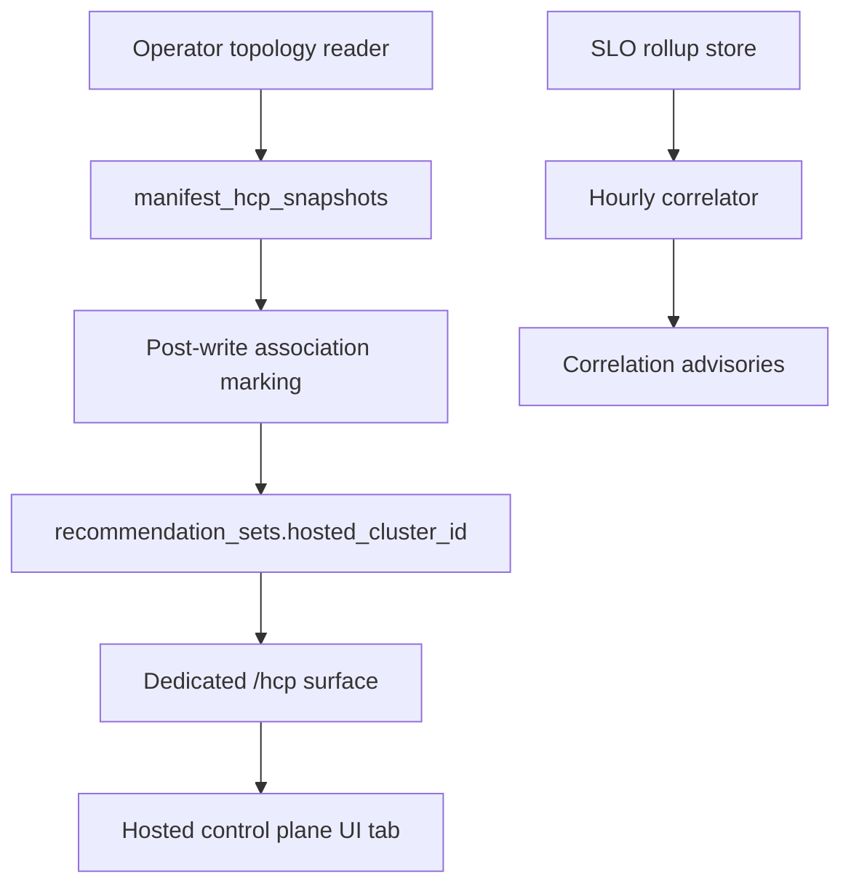

# Hosted Control Plane Recommendations

> **Last verified:** 2026-10-05

!!! success "Status: Shipped"
    Per-hosted-cluster rightsizing for OpenShift HyperShift control planes:
    association, dedicated list/filter/group-by surface, grouped savings,
    UI tab, correlator advisories, and correlator policy settings. Proven live
    on lab SNO + HCP clusters. Remaining fleet work (RH-operated bridge,
    cost distribution, dedicated masters) stays on the
    [planned page](../planned-features/hosted-control-plane-fleet-optimization.md#shipped-vs-remaining).

!!! info "Quick Facts"
    **API:** `GET /api/cost-management/v1/recommendations/openshift/hcp` (list),
    `GET .../hcp/{recommendation-id}` (detail)  
    **Configurable:** Yes (correlator policy via `/settings/hcp-correlation`)  
    **Engines:** cost, performance (both returned on every response)

## Overview

On HyperShift, each hosted cluster's control plane (etcd, kube-apiserver,
konnectivity, …) runs as ordinary pods in a namespace on the *management*
cluster — but `koku-metrics-operator` bills that usage to the management
cluster, hiding which hosted cluster each control-plane watt belongs to.
HCP recommendations attribute control-plane container rightsizing to the
hosted cluster it serves, so platform teams can answer "what does *this*
hosted cluster's control plane cost me" without touching etcd sizing blind.

Out of scope by design: hosted-cluster *sizing* (node counts), hosted
application workloads (those live on the [Container](container-recommendations.md)
tab under their own namespaces), and cost redistribution across hosted
clusters (postponed; association is not an allocation key).

## How it works

1. **Emission** — The operator's topology reader emits namespace→hosted-cluster
   snapshot observations (`manifest_hcp_snapshots`, report-scoped, fail-closed).
   Unknown hosted IDs fail closed with an info log; incomplete windows are omitted.
2. **Association** — A post-write pass stamps `hosted_cluster_id` on rows whose
   namespace is HCP-evidenced (snapshot union clusters-row list), and clears it
   when evidence lapses. Mixed-evidence namespaces stay unassociated rather
   than misattributed.
3. **History** — `recommendation_history` carries the frozen per-row
   association (`''` sentinel = null), so past advice keeps the cluster it was
   computed for.
4. **Serving** — The dedicated surface lists HCP-namespaced container rows:
   associated rows carry the frozen ID, unassociated-but-evidenced rows show
   `incomplete: true`, app-namespace rows never appear (and 404 on detail).
5. **Correlator (advisory-only)** — An hourly job evaluates hosted API pain
   against management-plane stress and writes sweep-expiring advisories; it
   never modifies existing recommendations.

## List, filter, group-by

| Capability | Shape |
|------------|-------|
| `filter[hosted_cluster_id]` | Narrows to one hosted cluster; unknown IDs return 200 with an empty list |
| `group_by[hosted_cluster_id]` | One row per hosted cluster: container count plus summed `estimated_savings` (`MoneyAmount` in display currency, `meta.currency` names it) |
| Term/engine projection | Rows carry all six variants; projection is display-side (same as the classic container list) |
| Detail | `GET .../hcp/{id}` — same shape as container detail; off-scope IDs 404 |

## UI tab

The **Hosted control plane** optimizations tab renders the surface with
term/engine projection, hosted-cluster filter, group-by with drill-down, and
an `Incomplete` state for unassociated rows (never rendered as healthy
attribution). Detail pages inherit list projection.

## Correlator policy settings

Thin cross-plane policy via **`GET/PUT/DELETE /settings/hcp-correlation`**.
PUT replaces the whole domain (all fields required); values take effect on
the next hourly run (at most one cycle of delay, no recalculation):

| Setting | Default | Env var (locks value) |
|---------|---------|----------------------|
| `h_p99_threshold_s` | 0.30 | `ROS_HCP_H_P99_THRESHOLD_S` |
| `h_baseline_multiple` | 3 | `ROS_HCP_H_BASELINE_MULTIPLE` |
| `c_cpu_pct` | 80 | `ROS_HCP_C_CPU_PCT` |
| `c_etcd_p99_s` | 0.01 | `ROS_HCP_C_ETCD_P99_S` |
| `window_h` | 1 | `ROS_HCP_WINDOW_HOURS` |
| `skew_m` | 5 | `ROS_HCP_SKEW_MINUTES` |
| `freshness_h` | 2 (must cover `window_h`) | `ROS_HCP_FRESHNESS_HOURS` |
| `expiry_h` | 24 | `ROS_HCP_EXPIRY_HOURS` |
| `z_idle_req_per_day` | 100 (DEPRECATED — accepted, no longer read; do not tune) | `ROS_HCP_ZOMBIE_IDLE_REQ_PER_DAY` |
| `z_idle_cpu_floor_mc` | 10 (discouraged to tune — see guide) | `ROS_HCP_ZOMBIE_IDLE_CPU_FLOOR_MC` |

Fixed methodological floors (not tunable): 30-minute minimum data per window,
36-hour node-recency calibration. `ROS_SETTINGS_LOCKED_HCP` freezes tenant
overrides under global lock. Full reference:
[configurability](../architecture/configurability.md#hcp-correlation).

## Guardrails

- HCP namespaces keep a control-plane floor profile; no replica
  recommendations for control-plane components.
- The plugin honors `ROS_DISABLED_PLUGINS=hcp` and Kruize mutual exclusivity.
- SLO ingest never permanently fails (skip-with-counters, always `Done`) so a
  poisoned rollup file cannot gate container recommendations.

## Key metrics

| Field | Meaning |
|-------|---------|
| `hosted_cluster_id` | Associated hosted cluster (omitted when empty — never guessed) |
| `incomplete` | `true` on evidenced-but-unassociated rows |
| `estimated_savings` (grouped) | Per-HC summed cents rendered as `MoneyAmount` |

Design rationale: [HCP per-hosted-cluster design](https://github.com/pgarciaq/ros-ocp-backend/blob/{{ git_branch }}/docs/design/hcp-per-hostedcluster-recommendations.md).
Product decisions: ADRs 0328–0332.
