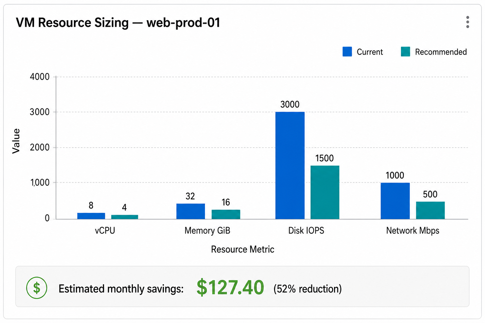
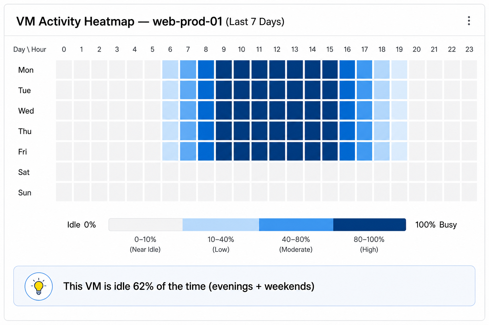
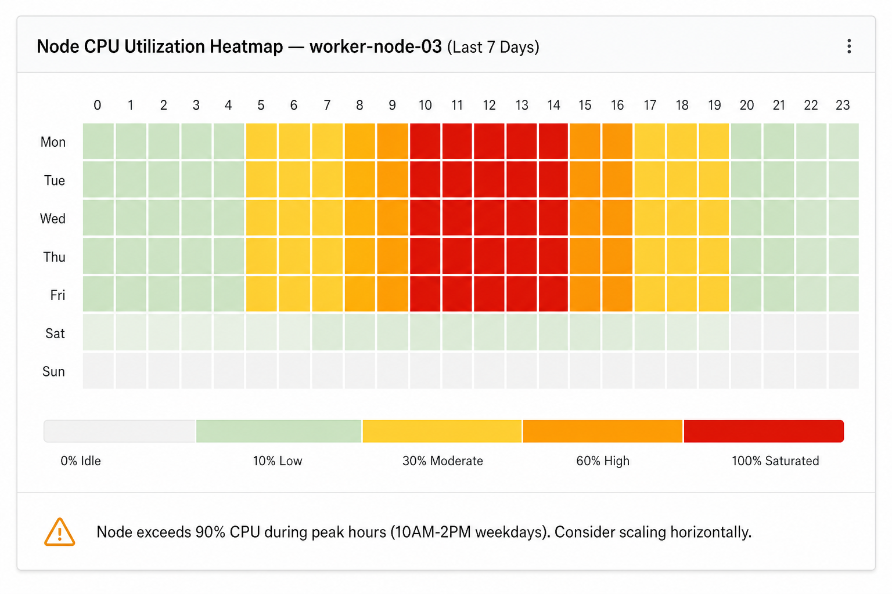
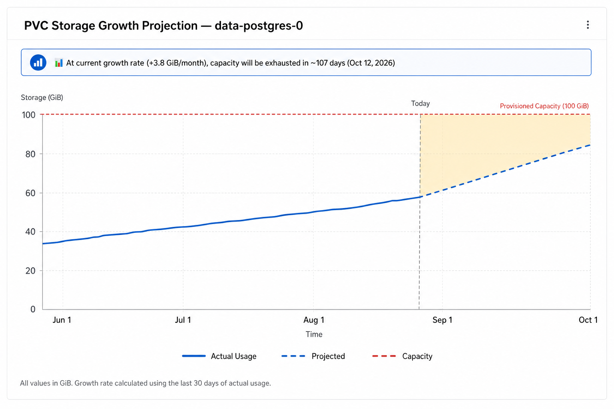

# Visual Insights (Shipped)

!!! success "Status: Complete — All Phases Shipped"
    Visual Insights adds charts, gauges, and heatmaps to recommendation detail
    pages across all entity types. **Phase 1 (Tier 1), Phase 2 (Tier 2), and
    most of Phase 3 (Tier 3) are now fully implemented.** All visualizations
    listed below are shipped unless explicitly marked otherwise. The only
    remaining planned item is sparklines in list views.

!!! info "Quick Facts"
    **Scope:** Charts and diagrams for all ROS recommendation entity types  
    **Backend changes:** Tier 1 requires minimal changes (OOM timeline endpoint + throttle field in boxplots); Tier 2 adds two hourly tables (~281 MB at medium scale)  
    **Charting library:** PatternFly Charts (`@patternfly/react-charts` / Victory)  
    **Feature-gated:** Yes — resource-intensive features (heatmaps, sparklines) are individually toggleable  
    **ADR:** [0301-visual-insights-dashboard](../../docs/adr/0301-visual-insights-dashboard.md)

---

## Why Visual Insights?

Today, ROS recommendation pages show numeric tables — current values, recommended
values, and percentage deltas. While accurate, this format makes it hard to:

- **Spot patterns** — Is the VM idle every night? Does CPU spike on Mondays?
- **Build confidence** — Is the recommendation based on a stable trend or a one-off spike?
- **Project forward** — Will this PVC run out of space in 30 days or 6 months?

Visual Insights adds **charts and diagrams** that answer these questions at a glance,
using data the system already collects.

---

## Phase Overview

| Phase | Effort | What Ships | Backend Changes |
|-------|--------|-----------|-----------------|
| **1 (Tier 1)** | Low | Charts using existing API data | None |
| **2 (Tier 2)** | Medium | Heatmaps, overlay charts | 2 new tables (~200 lines Go + 1 migration each) |
| **3 (Tier 3)** | Higher | Sparklines in lists, fleet dashboards | Optional list-query enhancement |

---

## Visualizations by Entity

### Virtual Machines

**Phase 1:**

- **Resource sizing bar chart** — Side-by-side comparison of current vCPU/GiB
  allocation vs the recommended values, making over-provisioning immediately visible.
  **Implemented** — see [Issue #7](https://github.com/pgarciaq/ros-ocp-backend/issues/7).
- **CPU + memory utilization trend** — 14-day line chart showing daily p95
  utilization, with the recommendation threshold overlaid.
  **Implemented** — see [Issue #8](https://github.com/pgarciaq/ros-ocp-backend/issues/8).
- **I/O sparkline** — Compact dual sparklines (IOPS + throughput) showing daily
  disk read/write trends. The daily I/O fields (`disk_read_iops_p95`,
  `disk_write_iops_p95`, `disk_read_bps_p95`, `disk_write_bps_p95`) are now
  exposed in the `daily_digests` response, gated by `ROS_VISUAL_INSIGHTS_ENABLED`.
  **Implemented** — see [Issue #9](https://github.com/pgarciaq/ros-ocp-backend/issues/9).
- **Disk growth projection** — Extrapolated line showing when current capacity
  will be exhausted at the observed growth rate, using existing IOPS and capacity fields.



**Phase 2:**

- **Activity heatmap** — Hour-of-day × day-of-week grid colored by CPU utilization,
  revealing idle periods (e.g., "this VM is unused 8 PM–6 AM and all weekends").
  Rendered using `VictoryScatter` with square-sized markers. Displays a "Data
  available from [deploy date]" note since historical hourly data cannot be backfilled.
  **Backend endpoint implemented** — `GET /vm/hourly-activity` serves hourly
  CPU, memory, and disk I/O digests from `hourly_vm_digests`. Gated by
  `ROS_VISUAL_INSIGHTS_ENABLED` and `ROS_HOURLY_VM_DIGESTS_ENABLED`.
  **Implemented** — see [Issue #13](https://github.com/pgarciaq/ros-ocp-backend/issues/13).



---

### Nodes

**Phase 1:**

- **Request vs usage gap chart** — Grouped bar chart showing CPU and memory
  requests alongside actual usage, highlighting wasted reservations.
- **Pod scheduling headroom gauge** — Visual gauge showing how close the node is
  to its pod scheduling limit.
  **Implemented** — see [Issue #26](https://github.com/pgarciaq/ros-ocp-backend/issues/26) and [Issue #100](https://github.com/pgarciaq/ros-ocp-backend/issues/100).

**Phase 2:**

- **CPU/memory utilization trend (14–30 days)** — Line chart showing node-level
  utilization over time with safe-to-consolidate threshold overlaid.
  **Implemented** — see [Issue #20](https://github.com/pgarciaq/ros-ocp-backend/issues/20).
- **Utilization heatmap** — Same hour-of-day × day-of-week format as VMs, useful
  for identifying nodes that are idle during off-hours. Displays a "Data available
  from [deploy date]" note since historical hourly data cannot be backfilled.
  **Backend endpoint implemented** — `GET /node/{id}/hourly-utilization` serves
  hourly CPU and memory digests from `hourly_node_digests`. Gated by
  `ROS_VISUAL_INSIGHTS_ENABLED` and `ROS_HOURLY_NODE_DIGESTS_ENABLED`.
  **Implemented** — see [Issue #16](https://github.com/pgarciaq/ros-ocp-backend/issues/16).



---

### Containers

**Phase 1:**

- **OOM event timeline** — Scatter plot showing out-of-memory kill events on a
  date axis, making it easy to spot recurring patterns. Served by a dedicated
  endpoint ([ADR-0302](../../docs/adr/0302-oom-timeline-endpoint.md)):

    ```
    GET /api/cost-management/v1/recommendations/openshift/containers/{id}/oom-timeline
        ?start_date=YYYY-MM-DD&end_date=YYYY-MM-DD
    ```

    Returns sparse data (only days with OOM events). The frontend fetches this
    lazily when the user expands the OOM section. See the
    [OOM Timeline API reference](../api-reference/oom-timeline.md) for full details.
    **Implemented** — see [Issue #3](https://github.com/pgarciaq/ros-ocp-backend/issues/3).

- **CPU throttle trend** — Area chart showing throttled CPU time (p95 + max),
  overlaid with total CPU usage. Data is served via the `cpuThrottle` field in
  the existing boxplot response (`plots_data`), scoped to the recommendation term
  window. Values are in cores (converted from millicores). No new endpoint needed.

    ```json
    "cpuThrottle": { "p95": 0.042, "max": 0.185, "format": "cores" }
    ```

    **Implemented** — see [Issue #4](https://github.com/pgarciaq/ros-ocp-backend/issues/4).

**Phase 2:**

- **Business hours vs all-hours overlay** — Dual-line chart comparing utilization
  during business hours (as configured) vs the full 24-hour window.
  **Implemented** — see [Issue #18](https://github.com/pgarciaq/ros-ocp-backend/issues/18).

---

### Persistent Volume Claims (PVCs)

**Phase 1:**

- **Storage growth projection** — Line chart of historical usage with a dashed
  extrapolation line showing projected exhaustion date.
  **Implemented** — see [Issue #5](https://github.com/pgarciaq/ros-ocp-backend/issues/5).
- **Utilization gauge** — Current usage as a percentage of provisioned capacity,
  with color thresholds (green/amber/red).
  **Implemented** — see [Issue #6](https://github.com/pgarciaq/ros-ocp-backend/issues/6).



---

### Namespaces

**Phase 1:**

- **Quota headroom trend** — Line chart showing the gap between quota hard limit and
  actual usage over time for CPU request and memory request, highlighting namespaces
  approaching their ceiling. Served by a dedicated endpoint:

    ```
    GET /api/cost-management/v1/recommendations/openshift/quota/{quota-id}/trend
        ?start_date=YYYY-MM-DD&end_date=YYYY-MM-DD
    ```

    Returns daily `cpu_request_hard_millicores`, `cpu_request_used_millicores`,
    `memory_request_hard_bytes`, and `memory_request_used_bytes`. Defaults to last
    30 days. The gap between hard and used represents headroom.
    **Implemented** — see [Issue #14](https://github.com/pgarciaq/ros-ocp-backend/issues/14).

**Phase 2:**

- **Business hours vs all-hours overlay** — Same dual-line format as containers,
  applied at the namespace aggregation level.
  **Implemented** — see [Issue #18](https://github.com/pgarciaq/ros-ocp-backend/issues/18).

---

### GPUs

**Phase 1:**

- **VRAM utilization gauge** — Visual gauge showing GPU memory usage relative to
  device capacity.
  **Implemented** — see [Issue #21](https://github.com/pgarciaq/ros-ocp-backend/issues/21).

**Phase 2:**

- **Utilization radar chart** — Multi-axis chart showing SM utilization, tensor
  core activity, and DRAM bandwidth simultaneously, helping identify which GPU
  subsystem is the bottleneck.
  **Implemented** — see [Issue #17](https://github.com/pgarciaq/ros-ocp-backend/issues/17).

---

### Cluster Resource Quotas

**Phase 1:**

- **Hard vs used trend chart** — Stacked area chart showing how quota consumption
  evolves relative to the hard limit.
  **Implemented** — see [Issue #11](https://github.com/pgarciaq/ros-ocp-backend/issues/11).
- **Utilization gauge per resource** — One gauge each for CPU, memory, and pods
  showing current vs hard limit.
  **Implemented** — see [Issue #12](https://github.com/pgarciaq/ros-ocp-backend/issues/12).

---

### Snapshots

**Phase 1:**

- **Age distribution histogram** — Bar chart with buckets (<7 days, 7–30 days,
  30–90 days, 90+ days) showing how many snapshots fall into each age category.
  **Backend endpoint implemented** — `GET /snapshots/age-distribution` returns
  bucketed snapshot counts. Gated by `ROS_VISUAL_INSIGHTS_ENABLED`.
  **Implemented** — see [Issue #15](https://github.com/pgarciaq/ros-ocp-backend/issues/15).
- **Cost by type donut chart** — Proportional view of snapshot storage cost by
  snapshot type.
  **Backend endpoint implemented** — `GET /snapshots/cost-by-type` returns
  costs grouped by recommendation type. Gated by `ROS_VISUAL_INSIGHTS_ENABLED`.
  **Implemented** — see [Issue #19](https://github.com/pgarciaq/ros-ocp-backend/issues/19).

---

## Phase 3: List-Page Enhancements

**Sparklines in all list views:**

Every recommendation list page (containers, VMs, nodes, PVCs, namespaces, GPUs)
will optionally display a 7-day mini-trend sparkline for the primary metric. This
is requested via `?include=sparkline` and defaults to **off** because it adds one
additional query per list page load.

**Node fleet heatmap:** ✅ Complete

A dashboard view showing all nodes colored by utilization and grouped by
MachineSet, giving platform teams a single-glance view of fleet health.
**Implemented** — see [Issue #24](https://github.com/pgarciaq/ros-ocp-backend/issues/24).

**Savings waterfall dashboard:** ✅ Complete

Cross-entity breakdown showing total potential savings by category (VMs, nodes,
containers, PVCs, GPUs, snapshots) as a horizontal bar chart sorted by magnitude.
Positive savings shown in blue, negative in red. Uses the existing
`/savings-summary` endpoint (`by_plugin` field). Gated by
`ROS_VISUAL_INSIGHTS_ENABLED`.
**Implemented** — see [Issue #25](https://github.com/pgarciaq/ros-ocp-backend/issues/25).

---

## Configuration

Resource-intensive visualizations can be individually toggled by operators.
Tier 1 charts have zero backend overhead and are always available when the
master toggle is enabled.

| Setting | Default | Purpose |
|---------|---------|---------|
| `ROS_VISUAL_INSIGHTS_ENABLED` | `true` | Master toggle for all visual insights |
| `ROS_HOURLY_VM_DIGESTS_ENABLED` | `true` | Enable VM activity heatmap data collection |
| `ROS_HOURLY_VM_DIGESTS_RETENTION_DAYS` | `90` | Days to retain hourly VM data |
| `ROS_HOURLY_NODE_DIGESTS_ENABLED` | `true` | Enable node utilization heatmap data collection |
| `ROS_HOURLY_NODE_DIGESTS_RETENTION_DAYS` | `90` | Days to retain hourly node data |
| `ROS_SPARKLINES_ENABLED` | `false` | Enable sparklines in list views (adds query load) |
| `ROS_SPARKLINES_LOOKBACK_DAYS` | `7` | Number of days of sparkline history to return |

### Storage Impact

At medium scale (500 VMs, 100 nodes, 90-day retention):

| Component | Storage |
|-----------|---------|
| Tier 1 charts | 0 (uses existing data) |
| Hourly VM digests | ~242 MB |
| Hourly node digests | ~39 MB |
| **Total** | **~281 MB** |

Storage scales linearly with entity count and retention period. Operators can
reduce `retention_days` to control disk usage.

---

## Timeline

| Phase | Target | Status |
|-------|--------|--------|
| Phase 1 (Tier 1) | Next release | ✅ Complete — All Tier 1 visualizations shipped (Issues #3, #4, #5, #6, #7, #8, #9, #11, #12, #14, #15, #19, #21, #26) |
| Phase 2 (Tier 2) | Following quarter | ✅ Complete — All Tier 2 visualizations shipped (Issues #13, #16, #17, #18, #20, #100) |
| Phase 3 (Tier 3) | Future | Mostly complete — Node fleet heatmap (#24) and savings waterfall (#25) shipped; sparklines in list views remains planned |

---

## UX Notes

- **Chart placement:** All Visual Insights charts appear **after the
  Configuration/sizing section** on the breakdown page, in a dedicated "Visual
  Insights" card section.
- **Loading strategy:** Detail pages use **eager loading** — chart data is fetched
  with the initial page load to eliminate perceived latency.
- **Data availability indicator:** Heatmaps display a note "Data available from
  [deploy date]" since historical hourly data cannot be backfilled. The date is
  inferred from the earliest row in the hourly digest table for that entity.
- **Tier 1 charts require minimal backend changes** — most data was already exposed
  through existing API endpoints. Two additions were needed: a dedicated OOM timeline
  endpoint ([ADR-0302](../../docs/adr/0302-oom-timeline-endpoint.md)) and a
  `cpuThrottle` field in the boxplot response. No new tables or migrations.

---

## Accessibility

All Visual Insights charts include **screen reader support** via visually-hidden
HTML data tables (`.pf-v6-u-screen-reader`) rendered adjacent to every SVG chart.
Charts support full **keyboard navigation** (arrow keys between data elements,
`Escape` to return to chart container, visible focus rings). Heatmaps use a
single-hue blue intensity ramp with numeric values in each cell — color alone
never conveys meaning. The feature targets **WCAG 2.1 AA** compliance per Red Hat
product requirements.

---

## Remaining / follow-up

- **Sparklines in list views** — still gated off by default (`ROS_SPARKLINES_ENABLED=false`); not required for the shipped Visual Insights detail experience.

---

## Related

- [ADR-0301: Visual Insights Dashboard](../../docs/adr/0301-visual-insights-dashboard.md)
- [Usage Percentile-Band Plots](percentile-band-plots.md)
- [Virtual Machine Recommendations](virtual-machines.md)
- [Node Recommendations](node-recommendations.md)
- [Container Recommendations](container-recommendations.md)
- [PVC Rightsizing](pvc-rightsizing.md)
- [Cluster Resource Quota](cluster-resource-quota.md)
