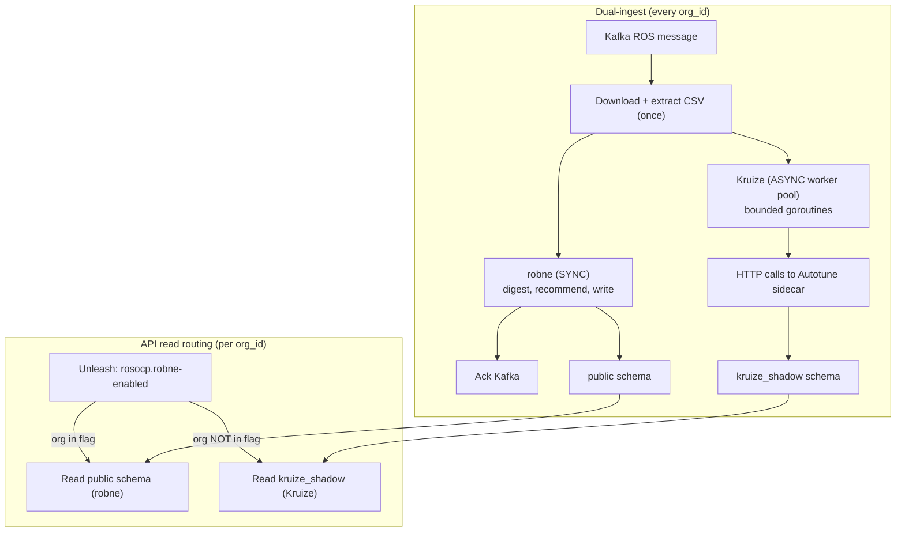

# Dual-Write Mode

> **Historical note (2026-08-11): superseded by cutover strategy**
>
> This page is preserved for historical architecture context. The active rollout
> direction is validation-first hard cutover (no dual-write window).

> **Last verified:** 2026-08-05

Dual-write mode runs both recommendation engines (robne and Kruize)
simultaneously, writing each engine's results to a separate PostgreSQL schema.
An Unleash feature flag controls which engine's recommendations are served to
each customer (`org_id`).

**Audience:** Operators, SREs, and PMs managing the Kruize-to-robne migration
in SaaS production.

**Scope:** SaaS deployments only. On-prem always runs robne exclusively and
does not support dual-write mode.

**ADR:** [ADR-0322](https://github.com/pgarciaq/ros-ocp-backend/blob/{{ git_branch }}/docs/adr/0322-temporary-dual-write-kruize-robne-saas-migration.md)

---

## When to use

During the migration from Kruize to robne in SaaS production
(console.redhat.com). Dual-write lets the PM validate robne's operational
behavior with real customer data and real production traffic before committing
to a full switchover. It is temporary — once migration is complete, dual-write
is disabled and Kruize is removed.

Dual-write is **not needed** for:

- On-prem deployments (robne is the default and only engine).
- Offline engine comparison (use the `cmd/compare` CLI instead).
- New installations (start with robne-only).

---

## How it works



1. Every incoming CSV is processed by **both** engines.
2. **robne** runs synchronously on the Kafka critical path — it digests,
   recommends, writes to `public` schema, and acks Kafka. This takes seconds.
3. **Kruize** runs asynchronously in a bounded goroutine pool — it calls the
   Autotune sidecar via HTTP and writes to `kruize_shadow` schema. This may
   take minutes. Kruize failures never block or fail the Kafka message.
4. The **API** reads from one schema per org_id based on the Unleash flag.
5. The **UI** renders percentile bands (robne) or boxplots (Kruize) based on
   the same flag.

---

## Storage architecture

| Schema | Engine | Tables |
|--------|--------|--------|
| `public` (default) | robne | `recommendation_sets`, `namespace_recommendation_sets`, `daily_container_digests`, etc. |
| `kruize_shadow` | Kruize | `recommendation_sets`, `workloads`, `workload_metrics`, `namespace_recommendation_sets` |

Both schemas live in the **same database** and share the same connection pool.
The schema name is the sole discriminator — no extra columns or prefixes are
needed to distinguish Kruize data from robne data.

---

## How to enable

### Prerequisites

- Autotune (Kruize) sidecar is deployed and healthy.
- The `recommendation-poller` binary is running alongside the main processor.
- The `rosocp.robne-enabled` flag exists on the SaaS Unleash instance.

### Environment variables

| Variable | Default | Purpose |
|----------|---------|---------|
| `DUAL_WRITE_ENABLED` | `false` | Master switch. Set to `true` to enable dual-write. |
| `KRUIZE_WORKER_CONCURRENCY` | `4` | Number of goroutines in the async Kruize worker pool. Increase for higher throughput; decrease if Autotune is resource-constrained. |

Set `DUAL_WRITE_ENABLED=true` in the processor deployment configuration.
Restart the processor pods. The startup log will confirm:

```
dual-write mode enabled: robne sync + Kruize async (workers=4)
```

### Unleash flag

Create `rosocp.robne-enabled` on the
[SaaS Unleash instance](https://insights.unleash.devshift.net/projects/default)
with the `userWithId` strategy. The value list contains org_ids that have robne
as their active engine.

- **Initially:** empty list (all orgs stay on Kruize, the current default).
- **During migration:** add org_ids in batches as the PM validates robne.
- **End state:** all org_ids in the flag; Kruize is removed.

---

## Migrating org_ids

### Flipping an org from Kruize to robne

1. Add the org_id to `rosocp.robne-enabled` on Unleash.
2. Within 15 seconds (SDK cache refresh), the API will start reading from
   `public` schema for that org.
3. The UI will switch from boxplots to percentile bands for that org.
4. Verify: call the API with the org's identity header and confirm
   recommendations are present and recent.

This direction is always safe — robne's `public` schema is always fresh
because robne runs synchronously on every ingest.

### Rolling back an org to Kruize

1. Remove the org_id from `rosocp.robne-enabled` on Unleash.
2. The API will read from `kruize_shadow` for that org.
3. **Check shadow freshness first.** The Kruize shadow store may lag behind
   robne by minutes to hours. The customer will see older recommendations
   until the next upload cycle completes through the Kruize path.

### Monitoring migration progress

Use Prometheus metrics to observe both engines:

| Metric | Description |
|--------|-------------|
| `rosocp_kruize_shadow_writes_total` | Total Kruize shadow writes |
| `rosocp_kruize_shadow_errors_total` | Kruize shadow write failures |
| `rosocp_kruize_shadow_lag_seconds` | How far Kruize trails robne per org |

Compare with existing robne metrics:

| Metric | Description |
|--------|-------------|
| `rosocp_recommendations_written_total` | robne recommendations persisted |
| `rosocp_pipeline_total_duration_seconds` | robne end-to-end processing time |

---

## Partial failure behavior

| Outcome | Behavior |
|---------|----------|
| **robne OK, Kruize fails** | robne commits to `public`; Kafka acked. Kruize failure logged + counted. Orgs on robne-active: unaffected. Orgs on Kruize-active: see last successful Kruize data. |
| **Kruize OK, robne fails** | Treated as hard ingest failure (retry/DLQ). robne owns the Kafka critical path. |
| **Both fail** | Standard Kafka retry + DLQ semantics. |
| **Kruize backlog grows** | Oldest shadow jobs dropped under backpressure with alert. robne is never slowed. |

---

## How to disable / teardown

When migration is complete (all orgs on robne):

1. Set `DUAL_WRITE_ENABLED=false` in the processor deployment. Restart pods.
2. Remove the `recommendation-poller` sidecar.
3. Remove the Kruize (Autotune) sidecar.
4. Delete the Unleash flag `rosocp.robne-enabled`.
5. Drop the shadow schema:

    ```sql
    DROP SCHEMA kruize_shadow CASCADE;
    ```

6. Continue with ADR-0163 Phase 2/3 Kruize code removal.

---

## Pros and cons

### Pros

- Validates robne under real SaaS production load with real customer data.
- Per-org instant rollback via Unleash flag (no redeployment needed).
- Clean storage separation — no risk of cross-contamination between engines.
- Clean teardown — single `DROP SCHEMA CASCADE` removes all Kruize data.
- On-prem is unaffected.

### Cons

- Additional resource cost during the migration window (Kruize sidecar CPU/
  memory, async worker pool goroutines, `kruize_shadow` storage).
- Kruize shadow store may lag behind robne. Rollback to Kruize-active requires
  checking freshness.
- Temporary code complexity (exclusivity relaxation, schema routing, async
  dispatch) — removed at teardown.
- Kruize and robne use different thresholds and multipliers for some
  recommendations, so direct numerical comparison is not meaningful for all
  metrics.
