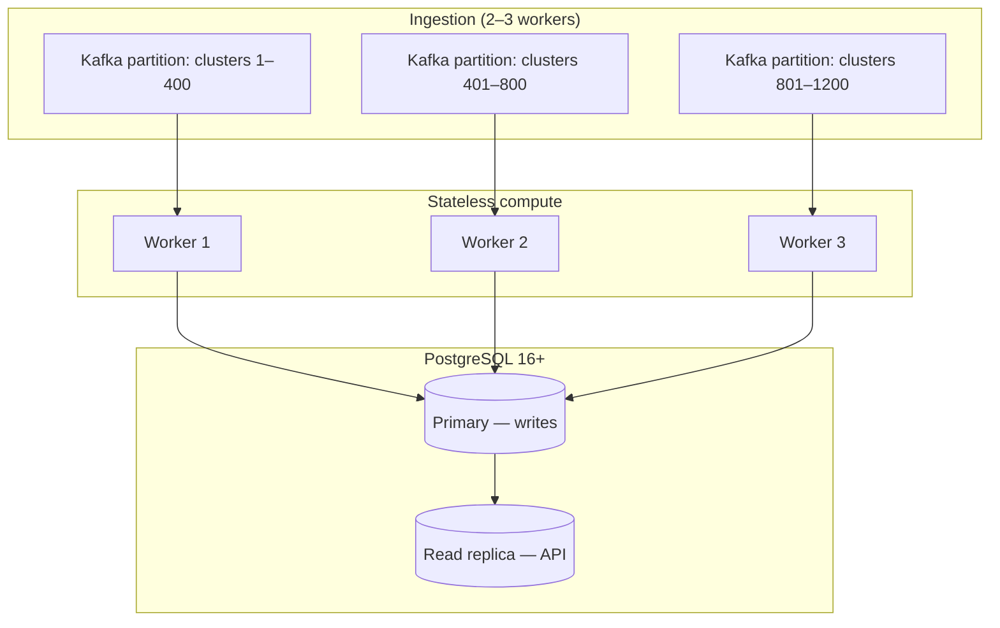

# Performance and Scalability

> **Date:** 2026-07-11

This page documents the native engine's performance characteristics, benchmark results, scaling projections for large multi-cluster deployments, horizontal scaling architecture, and production tuning guidance.

For the architectural rationale behind the native engine (serialization hops, JSONB anti-pattern, Kruize comparison), see [Why the Native Engine Was Built](../architecture/motivation.md). For detailed benchmark methodology and results, see the [Scale Benchmark Report](scale-benchmark-report.md).

---

## Benchmarked Throughput

All numbers below were measured on a **single ros-ocp-backend processor replica** backed by **plain PostgreSQL 16+** with no Trino, no Kruize, and no secondary databases. One replica was sufficient for all benchmarks up to 100K containers — but the architecture supports horizontal scaling via Kafka consumer groups when needed (see [Horizontal Scaling](#horizontal-scaling)).

| Metric | Value | Source |
|--------|-------|--------|
| Ingestion throughput | **15,000 containers/sec** | Synthetic benchmarks |
| Recommendation throughput | **60,000 containers/sec** | Synthetic benchmarks |
| Max containers in 1-hour SLA | **~5,000,000** | Projected from benchmarks |
| Largest verified benchmark | **84K containers** (all entity types) in **87 min** | [100K benchmark](scale-benchmark-report.md#100k-comprehensive-benchmark-july-11-2026) |
| Storage (84K containers, 31 days) | **3.5 GB** | 100K benchmark |
| Application RAM | **50–100 MB** | Measured across 4K–100K benchmarks |
| Infrastructure | **1 service** (app + PostgreSQL) | All benchmarks |

Benchmarks reflect the full ingest path: CSV parse → daily digest aggregation → recommendation compute → bulk write. Recommendation throughput measures end-to-end reconcile (read digests, compute percentiles, write `recommendation_sets`). The 100K benchmark covered all 10 recommendation entity types (containers, VMs, GPUs, PVCs, namespaces, nodes, quotas, cluster quotas, snapshots) in a single run.

---

## Legacy vs Native Comparison

| Metric | Legacy Kruize | Native Engine | Factor |
|--------|---------------|---------------|--------|
| Ingestion throughput | 8 containers/sec | 15,000 containers/sec | **~1,900×** |
| Recommendation throughput | 24 containers/sec | 60,000 containers/sec | **~2,500×** |
| Max containers (1-hour SLA) | ~1,000 | ~5,000,000 | **~5,000×** |
| Metrics storage (50K containers, 91 days) | 5.7 TB | 6 GB | **~950×** |
| Application RAM | 350–700 MB | 50–100 MB | **~5×** |
| Infrastructure | 4 services (2 apps + 2 DBs) | 1 service (scales via consumer groups) | **4× fewer** |

The storage reduction comes primarily from **daily digest aggregation**: 96 fifteen-minute intervals collapse into one row per container per day, stored in typed columns instead of JSONB blobs with repeated field names.

---

## Scaling to Large Deployments

Red Hat's largest SaaS tenants operate roughly **1,200 OpenShift clusters** totaling **~100 million containers**. The native engine's compute layer is **stateless and horizontally scalable** — partition work by cluster via Kafka consumer groups and add replicas as needed (see [Horizontal Scaling](#horizontal-scaling)).

### Per-cluster math

```
100,000,000 containers ÷ 1,200 clusters ≈ 83,000 containers/cluster
```

At 60,000 containers/sec recommendation throughput:

```
83,000 ÷ 60,000 ≈ 1.4 seconds per cluster (recommendations)
```

### Fleet-wide wall clock

| Workers | Time for 1,200 clusters | Fits 1-hour SLA? |
|---------|-------------------------|------------------|
| 1 | ~28 minutes | Yes |
| 3 | ~9 minutes | Yes (with headroom) |

Ingestion at 15,000 containers/sec processes 100M containers in ~111 minutes on a single replica. For a **1-hour upload window**, deploy **2–3 processor replicas** — they join the same Kafka consumer group and partitions are distributed automatically (see [Horizontal Scaling](#horizontal-scaling)).

### Storage at 100M containers

Daily digests at fleet scale:

```
100M containers × ~200 bytes/row/day × 91 days ≈ 12 TB (daily digests only)
```

Recommendation tables add modest overhead (6 rows per container for term × engine combinations, refreshed on reconcile). This is manageable with standard PostgreSQL tooling:

- **Range partitioning** by `usage_start` / digest date (monthly partitions, already used in ros-ocp-backend migrations)
- **Hash partitioning** by `cluster_uuid` for very large single-org deployments
- **Read replicas** for API read traffic
- **Tablespaces on NVMe** for hot partitions
- **`pg_partman` retention** to drop partitions older than `ROS_RETENTION_MONTHS`



---

## Why PostgreSQL Scales for Native but Not for Kruize

Both paths use PostgreSQL. The difference is **what gets stored** and **how it is written and read**.

| Factor | Kruize (legacy) | Native engine |
|--------|-----------------|---------------|
| Row granularity | 1 row per 15-min interval | 1 row per day (96× compression) |
| Column types | JSONB blobs | Typed `float64`, `int`, `timestamptz` |
| Write mechanism | Per-row HTTP → INSERT | `COPY FROM` bulk load |
| Read pattern | Deserialize all history every cycle | Index scan on digest date range |
| Compute location | JVM (separate service) | In-process Go (same binary) |
| Parallelism | Single Kruize instance | Horizontal via Kafka consumer groups |

### The 100M-container thought experiment

At Kruize's measured **8 containers/sec** ingestion rate:

```
100,000,000 containers ÷ 8 containers/sec = 12,500,000 seconds ≈ 145 days
```

Kruize would need **145 days** to ingest a single hour's worth of data for 100M containers.

At the native engine's **15,000 containers/sec** with **3 workers**:

```
100,000,000 ÷ (15,000 × 3) ≈ 2,222 seconds ≈ 37 minutes (ingestion)
+ ~9 minutes (recommendations with 3 workers)
≈ 46 minutes total — within the 1-hour SLA
```

---

## Horizontal Scaling

The ROS processor supports horizontal scaling via **Kafka consumer groups**. Multiple processor replicas join the same consumer group (`KAFKA_CONSUMER_GROUP_ID`, default `ros-ocp`), and Kafka distributes topic partitions across them. No application-level coordination, leader election, or distributed locking is needed.

### Why it works without coordination

Three properties make multi-replica operation safe:

1. **Partition-level affinity**: When messages are keyed by cluster UUID (the default in production Koku listener setups), all data for a given cluster routes to the same partition — and therefore to the same consumer replica. This eliminates cross-replica conflicts on the same cluster's data.

2. **Idempotent database operations**: Digest upserts and recommendation writes use `ON CONFLICT DO UPDATE`, so reprocessing or concurrent writes produce correct results. This makes the system resilient to Kafka rebalances (where partitions move between replicas) and message replays.

3. **Per-partition ordering**: Within each replica, the Kafka consumer uses per-partition mutexes to preserve message ordering. Messages on different partitions are processed in parallel (controlled by `ROS_KAFKA_WORKERS`), but messages within a partition are serialized — maintaining temporal consistency for each cluster's data.

### Scaling configuration

| Setting | Default | Multi-replica guidance |
|---------|---------|------------------------|
| `KAFKA_CONSUMER_GROUP_ID` | `ros-ocp` | All replicas must use the **same** group ID for partition sharing. |
| `ROS_KAFKA_WORKERS` | `3` | Per-replica internal parallelism. Keep at default or reduce if DB pool is constrained across replicas. |
| `ROS_DB_MAX_CONNS` | `10` | Per-process pool size. Total connections = `replicas × max_conns`. Coordinate with PostgreSQL `max_connections`. |
| Kafka topic partitions | Varies | Must be ≥ desired replica count. If `partitions < replicas`, some replicas sit idle. |

### When to scale

| Signal | Action |
|--------|--------|
| Kafka consumer lag > 15 min sustained | Add processor replicas (or increase per-replica workers) |
| Single replica handles the load comfortably | Stay at 1 replica — the 100K benchmark confirms this is sufficient for the largest observed on-prem deployments |
| SaaS fleet-wide ingestion needs < 1 hour SLA | Deploy 2–3 replicas with ≥ 3 topic partitions |

### Practical limits

The database connection pool is the primary tuning knob for multi-replica deployments. With 3 replicas × `ROS_DB_MAX_CONNS=10`, PostgreSQL needs at least 30 connections (plus headroom for API and poller processes). Monitor `rosocp_db_pool_acquired_conns` vs `rosocp_db_pool_max_conns` for pool pressure.

---

## Production Tuning Recommendations

### Processor / ingestion

| Setting | Default | Scale-up guidance |
|---------|---------|-------------------|
| `ROS_KAFKA_WORKERS` | `3` | Increase when consumer lag grows; cap at ~CPU cores minus headroom |
| `ROS_KAFKA_PARALLEL` | `true` | Keep enabled for multi-partition topics |
| `ROS_DB_MAX_CONNS` | `10` | Raise with workers (rule of thumb: `workers × 3`, max ~50) |
| `ROS_DB_MIN_CONNS` | `2` | Set to ~25% of max for warm pool |
| `ROS_DB_ACQUIRE_TIMEOUT_SECS` | `5` | Increase only if pool is correctly sized; sustained timeouts mean too many workers |

Monitor `rosocp_db_pool_acquired_conns` vs `rosocp_db_pool_max_conns` — sustained acquisition at max indicates pool saturation. See [Monitoring](../monitoring.md#connection-pool-pgxpool).

### Database

| Practice | Rationale |
|----------|-----------|
| PostgreSQL 16+ | Required; uses modern planner and `COPY` optimizations |
| NVMe storage for primary | Digest writes are sequential bulk loads; NVMe reduces flush latency |
| `shared_buffers` ≈ 25% RAM | Keeps hot digest partitions in cache |
| `work_mem` 64–256 MB | Sort/hash for percentile queries over digest windows |
| Monthly range partitions | Already created by migrations; verify `partitioned_tables` registry |
| `CREATE INDEX CONCURRENTLY` on large DBs | See [migrations README](../../migrations/README.md) before applying new indexes |
| Read replica for API | Offload list/aggregation queries from ingestion primary |

### Retention

| Setting | Default | Purpose |
|---------|---------|---------|
| `ROS_RETENTION_MONTHS` | `3` | Drop monthly digest partitions |
| `ROS_MAX_LOOKBACK_DAYS` | `90` | Recommendation window cap |
| `ROS_SAMPLE_RETENTION_DAYS` | varies | Raw sample cleanup |
| `ROS_HISTORY_RETENTION_DAYS` | varies | Historical recommendation rows |

Aggressive retention reduces storage linearly. Daily digests already compress 96× vs raw intervals — retention policies operate on the compressed layer.

### API read path

Large orgs (200k+ containers) should rely on:

- **Keyset pagination** via `org_container_keys` (not offset deep pages)
- **Partial indexes** matching `WHERE stale = false AND term = 'medium' AND engine = 'cost'`
- **Fleet summary cache** (`ROS_FLEET_SUMMARY_CACHE_TTL`, default 300s; `ROS_FLEET_HEATMAP_CACHE_CAPACITY` separate from `ROS_FLEET_SUMMARY_CACHE_CAPACITY`)

See [Query Performance](../query-performance.md) for the full audit methodology and index design principles.

### Horizontal scaling checklist

1. **Kafka topic partitions** ≥ desired replica count. Key messages by cluster UUID for partition affinity (same cluster always goes to same replica, avoiding redundant work).
2. **Processor replicas** join the same `KAFKA_CONSUMER_GROUP_ID`. Kafka assigns partitions across consumers automatically — no application-level coordination required.
3. **API replicas** scale independently; stateless, read from PostgreSQL (prefer read replica).
4. **Single PostgreSQL primary** for writes; add read replicas before sharding.
5. **`ROS_DB_MAX_CONNS`** (default 5 per process) — coordinate `replicas × max_conns` against PostgreSQL `max_connections`.
6. **Unique image tags** on deploy — `imagePullPolicy: IfNotPresent` caches stale images (see cost-onprem chart docs).

### When to add capacity

| Signal | Action |
|--------|--------|
| Kafka consumer lag > 15 min sustained | Add processor workers or partitions |
| `rosocp_ingestion_errors_total` rising with workers | Reduce workers or increase `ROS_DB_MAX_CONNS` |
| `rosocp_db_pool_acquire_duration_seconds` growing | Pool too small or queries too slow |
| API P95 > 500 ms on list routes | Read replica, cache tuning, index audit |
| Storage growth > plan | Verify retention job runs; check `rosocp_retention_partitions_dropped_total` |
| `rosocp_ingest_groups_in_memory` sustained high | Reduce flush batch size or add processor memory |

---

## Related Documentation

| Document | Scope |
|----------|-------|
| [Scale Benchmark Report](scale-benchmark-report.md) | Detailed benchmark results (4K–100K containers) |
| [Why the Native Engine Was Built](../architecture/motivation.md) | Architectural rationale |
| [Kafka Message Schema](../architecture/kafka-schema.md) | Kafka topics, message formats, consumer groups |
| [Query Performance](../query-performance.md) | API read-path optimization |
| [Monitoring](../monitoring.md) | Prometheus metrics and Grafana dashboard |
| [Configuration](../configuration.md) | Full environment variable reference |
| [Validating the Native Engine](../testing/validating-native-engine.md) | Benchmark reproduction steps |
