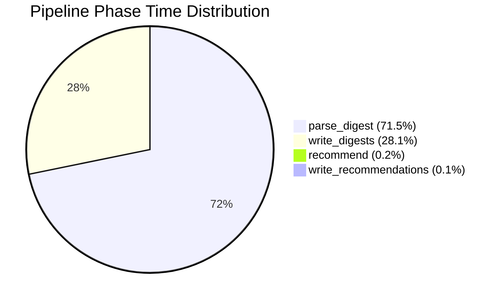
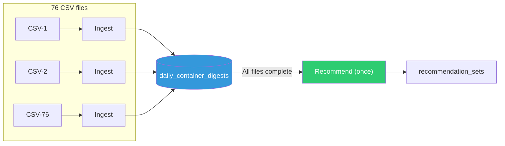
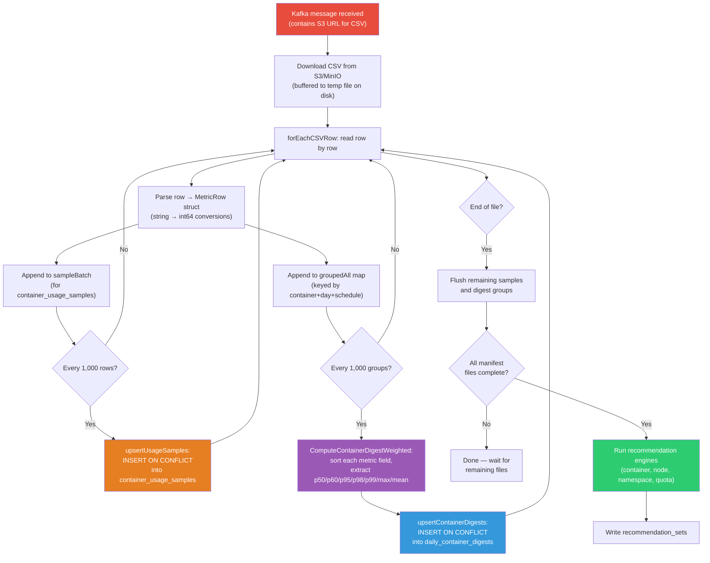

# Scale Benchmark Report: Native Engine (4K Containers, 15 Days)

> **Date:** 2026-07-08  
> **Environment:** Single-Node OpenShift (SNO), x86-64, Dell PowerEdge R640 (dell-r640-082)  
> **Engine:** ROS-OCP native engine (Go)

This report documents a scale stress test of the ROS-OCP **native engine** processing a bulk upload of 15 days of synthetic data for ~7,000 containers. Unlike the [UXSNO benchmark](benchmark-report.md) which measured production-equivalent incremental uploads, this test pushes the engine with a single 1 GiB tarball to establish baseline performance characteristics at scale.

!!! warning "Extreme bulk-load scenario"
    This benchmark represents a worst-case scenario: 15 days of data uploaded in one tarball. Normal operator uploads are hourly with ~100-500 containers, processing in seconds. The numbers below stress-test what happens during bulk re-ingestion, disaster recovery, or data migration.

---

## Test Environment

| Component | Detail |
|-----------|--------|
| Platform | Single-Node OpenShift (SNO) |
| Architecture | x86-64 (amd64) |
| Hardware | Dell PowerEdge R640 (8 cores, 78 GB RAM) |
| Cluster ID | dell-r640-082 |
| OpenShift version | 4.21 |
| ROS processor pod | Single replica, **single-threaded** |
| Processing mode | `ROS_KAFKA_WORKERS=1`, `ROS_MANIFEST_DOWNLOAD_WORKERS=1` |
| Database | PostgreSQL 16 |
| Message bus | Kafka (Strimzi) |
| Object storage | MinIO (S3-compatible), 10 GiB PVC |

!!! note "Single-threaded processing"
    The benchmark was run with single-threaded processing after a PostgreSQL deadlock was encountered with the default multi-threaded configuration (`ROS_KAFKA_WORKERS=3`). See [Issues Encountered](#issues-encountered) for details.

---

## Workload Profile

| Parameter | Value |
|-----------|-------|
| Profile name | `scale-medium-15d` |
| Data generator | NISE (koku-nise) |
| Target containers | 4,000 |
| Actual distinct containers | ~7,000 (NISE spreads workloads across namespaces) |
| Duration | 15 days of historical data |
| Tarball size | 1,013 MiB (1 GiB) |
| CSV files in tarball | 76 files |
| Total CSV rows | ~6.7 million |

The data was generated with NISE using a "medium" static data profile, then packaged into a single tarball and uploaded via the ingress endpoint.

---

## Results Summary

| Metric | Value |
|--------|-------|
| Upload time | 12 seconds |
| Total processing time | 12,818 seconds (~213 min / 3.5 hours) |
| Digests created | 114,890 rows in `daily_container_digests` |
| Distinct containers | ~7,000 |
| Recommendations generated | All container recommendation sets for cluster |
| Database size after benchmark | 7,008 MiB |
| Processing throughput | ~523 CSV rows/second (single-threaded) |

---

## Pipeline Phase Breakdown

The native engine processes data through four sequential phases, measured by the `rosocp_pipeline_phase_duration_seconds` Prometheus metric:

| Phase | Time (min) | % of Total | Description |
|-------|-----------|------------|-------------|
| `parse_digest` | ~152 | 71.5% | CSV parsing, digest computation, sample writes |
| `write_digests` | ~60 | 28.1% | Final digest upserts to PostgreSQL |
| `recommend` | ~0.4 | 0.2% | Recommendation engine execution |
| `write_recommendations` | ~0.2 | 0.1% | Persist recommendation sets |



### Phase 1: parse_digest (71.5%)

This is the dominant phase. For each CSV file, the processor:

1. **Parses** each row into a `MetricRow` struct (string → integer conversions for CPU/memory metrics)
2. **Groups** rows by `(container, day, schedule_type)` into a map of metric samples
3. **Flushes samples** every 1,000 rows: upserts raw 15-minute samples to `container_usage_samples` via `INSERT ON CONFLICT`
4. **Flushes digests** every 1,000 groups: computes percentiles (sort + index lookup for p50/p60/p95/p98/p99/max/mean across 6 metric fields) and upserts to `daily_container_digests`

The `container_usage_samples` writes account for an estimated 60-70% of this phase's time — and these samples are **not used by the recommendation engine**. This is the largest optimization opportunity (see [Optimization Opportunities](#optimization-opportunities)).

### Phase 2: write_digests (28.1%)

The final batch of digest groups that weren't flushed incrementally during parsing are computed and written. Each upsert uses:

```sql
INSERT INTO daily_container_digests (44 columns)
VALUES ($1...$44)
ON CONFLICT (org_id, cluster_uuid, namespace, workload, workload_type,
             container_name, bucket_date, schedule_type)
DO UPDATE SET (36 columns)
```

Batches are capped at `maxPgxBatchQueue = 2000` rows per `pgx.Batch` (increased from 500 in [#257](https://github.com/pgarciaq/ros-ocp-backend/issues/257)), requiring ~58 database round-trips for 114,890 digest rows.

### Phase 3: recommend (0.2%)

After **all** CSV files for the manifest are processed, the recommendation engine runs once per entity type (container, node, namespace, quota). For containers, it queries all digests for the cluster within the lookback window (14 days), streams through them, and computes CPU/memory request/limit recommendations per term (short/medium/long).

### Phase 4: write_recommendations (0.1%)

Persists computed recommendation sets. Negligible time.

---

## Why Recommendations Wait for All CSVs

A common question: why not produce recommendations as each CSV is ingested?

The answer is architectural, codified in [ADR-0166: Report File Status Manifest Gating](https://github.com/pgarciaq/ros-ocp-backend/blob/main/docs/adr/0166-report-file-status-manifest-gating.md):

1. **Recommendations require the full picture.** A recommendation for container X depends on X's complete usage history across all days in the lookback window. If CSV-12 contains June 25 data and CSV-13 contains June 26 data, running recommendations after CSV-12 would produce results based on incomplete data — potentially recommending too-small resources because June 26's peak wasn't seen yet.

2. **One run, not N runs.** With 76 CSV files, running recommendations after each would execute the engine 76 times. Since the engine queries the entire cluster's digest history each time, this would be 76× slower than running once after all data is ingested.

3. **Recommendations are not the bottleneck.** At 0.2% of pipeline time (~26 seconds), the recommendation phase is negligible. Even if it ran 76 times, it would add ~33 minutes — less than the ingestion phase. The optimization opportunity is in ingestion, not recommendations.



---

## Data Flow for One CSV File

The following diagram traces the complete processing path for a single CSV file, from Kafka message to database writes:



### Key observations from the data flow

1. **Two write paths during parsing**: Both `container_usage_samples` (raw 15-min samples) and `daily_container_digests` (aggregated daily summaries) are written during CSV processing. Only the digests are used by recommendations.

2. **Streaming architecture**: The processor never holds the entire CSV in memory. Rows are processed one at a time with periodic batch flushes. Memory usage stays bounded regardless of CSV size.

3. **Temp file buffering**: The HTTP response body is fully downloaded to a temp file before parsing begins, decoupling the HTTP client timeout from the arbitrarily long processing time.

---

## Issues Encountered

### 1. Context deadline exceeded (HTTP timeout)

**Symptom:** ROS processor logged `context deadline exceeded` while parsing large CSVs.

**Root cause:** The HTTP client timeout (`ROS_CSV_DOWNLOAD_TIMEOUT_SECS`, default 120s) applied to the entire duration of reading the response body — including CSV parsing and database upserts that took much longer than 120 seconds for 525 MiB files.

**Fix:** Modified `ReadCSVBodyFromUrl` to buffer the entire HTTP response to a temporary file on disk before returning an `io.ReadCloser`. This decouples the HTTP download timeout from processing time. The download completes within the timeout, and parsing reads from the local temp file with no deadline.

### 2. PostgreSQL deadlock (SQLSTATE 40P01)

**Symptom:** With `ROS_KAFKA_WORKERS=3`, the processor logged deadlock errors and processing stalled.

**Root cause:** Multiple Kafka workers processed CSVs for the same cluster concurrently. Each worker called `upsertContainerDigests()`, which iterates over a Go map (random key order) and executes `INSERT ON CONFLICT` statements. Two transactions locking the same rows in different orders caused a classic deadlock.

**Workaround:** Set `ROS_KAFKA_WORKERS=1` and `ROS_MANIFEST_DOWNLOAD_WORKERS=1` to force single-threaded processing. This eliminated deadlocks but sacrificed parallelism.

**Proper fix:** Sort digest keys before upsert to guarantee consistent lock ordering across transactions. See [GitHub issue #255](https://github.com/pgarciaq/ros-ocp-backend/issues/255).

### 3. S3 storage full

**Symptom:** MinIO returned HTTP 500 with "minimum free drive threshold" error.

**Root cause:** The 10 GiB MinIO PVC filled up from accumulated tarballs and extracted CSV data across the `insights-upload-perma`, `koku-bucket`, and `ros-data` buckets.

**Fix:** Cleaned up old data from MinIO buckets, freeing 98% of the 10 GiB PVC.

---

## Optimization Opportunities

Based on this benchmark, the following optimizations would dramatically reduce processing time:

### Ingestion optimizations (99.6% of pipeline time)

| Optimization | Target Phase | Expected Speedup | Effort | Issue |
|---|---|---|---|---|
| ~~Skip `container_usage_samples` writes~~ | `parse_digest` | 2-3× | Low | [#258](https://github.com/pgarciaq/ros-ocp-backend/issues/258) ✅ |
| ~~Fix deadlock, enable multi-threaded processing~~ | `parse_digest` | ~3× | Low | [#255](https://github.com/pgarciaq/ros-ocp-backend/issues/255) ✅ |
| ~~Increase digest flush batch size (1000→5000)~~ | `parse_digest` | 1.2-1.5× | Trivial | [#256](https://github.com/pgarciaq/ros-ocp-backend/issues/256) ✅ |
| ~~`csv.Reader.ReuseRecord` on all parsers~~ | `parse_digest` | ~5-10% CPU | Trivial | [#256](https://github.com/pgarciaq/ros-ocp-backend/issues/256) ✅ |
| ~~Pre-compute digest partitions from manifest window~~ | `parse_digest` | Marginal | Trivial | [#256](https://github.com/pgarciaq/ros-ocp-backend/issues/256) ✅ |
| ~~Increase `maxPgxBatchQueue` (500→2000)~~ | `write_digests` | 1.5-2× | Trivial | [#257](https://github.com/pgarciaq/ros-ocp-backend/issues/257) ✅ |

**Combined estimate:** With all optimizations, this 3.5-hour benchmark could complete in **~20-30 minutes** (skip samples + 3 workers + larger batches + COPY for initial load).

### Comparison to production patterns

| Scenario | Containers | Data Duration | Expected Time |
|---|---|---|---|
| Normal hourly upload | 100-500 | 1 hour | < 5 seconds |
| Daily catch-up | 500-2000 | 24 hours | 1-5 minutes |
| Bulk re-ingestion (current) | 7,000 | 15 days | 3.5 hours |
| Bulk re-ingestion (optimized) | 7,000 | 15 days | ~20-30 minutes |

---

## Appendix: Prometheus Queries

The following queries were used to collect benchmark metrics:

```promql
# Pipeline phase breakdown
rosocp_pipeline_phase_duration_seconds_sum

# Digest counts
rosocp_db_query_duration_seconds_count{operation="upsert_container_digests"}

# Recommendation timing
rosocp_recommendation_duration_seconds_sum
```
