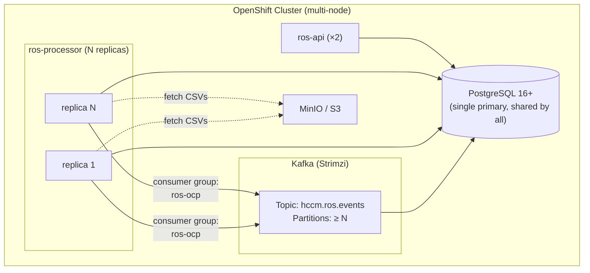

# Scale Test Plan for Performance & Scalability Engineering

> **Last verified:** 2026-08-05
> **Last updated:** 2026-07-11  
> **Author:** ROS-OCP-Backend team  
> **Audience:** Red Hat Performance & Scalability Engineering  
> **Status:** Ready for review

This document describes the tests needed to validate the ROS-OCP **native engine** (Go) at production SaaS scale (~6M containers) and provides step-by-step instructions for environment setup, data generation, test execution, and results comparison against the legacy Kruize engine.

---

## Background

### What is ROS-OCP?

ROS-OCP (Resource Optimization Service for OpenShift) analyzes container, VM, GPU, PVC, namespace, and node usage metrics from OpenShift clusters and produces resource rightsizing recommendations. It is part of Red Hat Cost Management.

### Why these tests are needed

The native engine has been benchmarked on a single-node OpenShift cluster (8 cores, 78 GB RAM) up to **84K containers** with excellent results. However, production SaaS (console.redhat.com) serves **~6M containers** across many tenants. Four gaps remain:

| # | Gap | Why it matters |
|---|-----|----------------|
| 1 | **Multi-replica horizontal scaling** | Architecture supports it (Kafka consumer groups), but no empirical validation under load |
| 2 | **API latency at 6M scale** | List and fleet summary endpoints may behave differently with 6M rows in digest tables |
| 3 | **500K+ single-tenant benchmark** | Some SaaS tenants may have 200K–500K containers in a single org |
| 4 | **Sustained multi-day ingestion** | All existing benchmarks used bulk uploads; production uploads are hourly |

### What we already know (from existing benchmarks)

| Benchmark | Containers | Wall time | Replicas | DB size |
|-----------|-----------|-----------|----------|---------|
| 4K post-optimization | 4,000 | 7.5 min | 1 | ~250 MB |
| 10K v2 (post-#264) | 10,000 | 13.2 min | 1 | ~800 MB |
| 20K mixed (VMs + GPUs) | ~17,000 | 36.6 min | 1 | 744 MB |
| **100K comprehensive** | **~84,000** | **87 min** | **1** | **3,474 MB** |

Scaling is nearly linear: 4.9x more containers → 4.8x more CPU-time. Zero failures, zero restarts, zero OOM events across all benchmarks.

Full details: [Scale Benchmark Report](scale-benchmark-report.md)

### Kruize production baseline (what we're replacing)

From production SaaS telemetry (July 9, 2026, 24-hour snapshot):

| Metric | Value |
|--------|-------|
| Total experiments (containers) | **5,983,268 (~6M)** |
| Kruize replicas | 3 |
| Max CPU per replica | 8.53 cores (~25.6 cores total) |
| Max memory per replica | 17.87 GB (~54 GB total) |
| Database size | 380 GB |
| CreateExperiment success rate | **0.4%** (99.6% failures) |
| UpdateResults success rate | **27%** (73% failures) |
| UpdateRecommendations success rate | 100% |

The native engine must demonstrate it can handle the same 6M container load with fewer resources and without failures.

---

## Test Matrix

!!! note "How the test matrix relates to real-world scale"
    Industry data provides context for these target sizes. The [CNCF 2025 Annual Survey](https://www.cncf.io/reports/cncf-annual-survey-2025/) reports a median of **~370 containers per cluster** (2,341 containers/org across 6.3 clusters). The [Datadog 2025 Container Report](https://www.datadoghq.com/container-report/) reports **250+ containers/cluster** as the median, with top-percentile clusters reaching **5,000+**.

    | Test target | Real-world equivalent | Rationale |
    |-------------|----------------------|-----------|
    | 500K containers | ~1,350 typical clusters (at CNCF median ~370/cluster) | Validates multi-replica scaling for large enterprise or MSP |
    | 6M containers | ~16,200 typical clusters; matches current SaaS Kruize production load | Validates readiness to replace Kruize at full fleet scale |
    | 500K single-tenant | ~100 top-percentile clusters (at Datadog 5K/cluster) | Worst case for single-org API queries and digest table scans |
    | 50K sustained | ~135 typical clusters | Validates daily ingest cycle stability |

### Test 1: Multi-replica horizontal scaling (500K containers)

**Goal:** Validate that adding processor replicas increases throughput proportionally, with no data corruption or coordination issues.

| Parameter | Value |
|-----------|-------|
| Containers | 500,000 (use replay-and-multiply method from 100K data) |
| Replica configurations | 1, 2, 3 replicas |
| Kafka topic partitions | ≥ 3 (must equal or exceed max replica count) |
| Duration per run | Until all data processed |
| Measurements | Wall time, CPU per replica, memory per replica, DB connection pool metrics, Kafka consumer lag |

**Success criteria:**

- 2 replicas ≥ 1.7x throughput of 1 replica
- 3 replicas ≥ 2.5x throughput of 1 replica
- Zero data corruption (recommendation counts match single-replica run)
- Zero pod restarts
- No connection pool exhaustion (`rosocp_db_pool_acquired_conns` < `rosocp_db_pool_max_conns`)

### Test 2: API latency at 6M scale

**Goal:** Measure API response times with a 6M-container dataset under concurrent load.

| Parameter | Value |
|-----------|-------|
| Database contents | ~6M containers (use replay-and-multiply method) |
| API endpoints to test | Container list, namespace list, fleet summary, savings summary, container detail |
| Concurrent users | 1, 10, 50, 100 |
| API replicas | 2 |
| PostgreSQL | Production-grade (≥ 8 vCPU, 32 GB RAM, NVMe) |

**Endpoints and expected behavior:**

| Endpoint | Path | Expected P95 |
|----------|------|-------------|
| Container list (page 1) | `GET /api/ros-ocp/v1/recommendations?limit=20` | < 200 ms |
| Container list (with filters) | `GET /api/ros-ocp/v1/recommendations?cluster_uuid=X&namespace=Y` | < 200 ms |
| Namespace list | `GET /api/ros-ocp/v1/recommendations/namespaces?limit=20` | < 500 ms |
| Fleet summary | `GET /api/ros-ocp/v1/recommendations/fleet-summary` | < 2s (first load), < 200 ms (cached) |
| Savings summary | `GET /api/ros-ocp/v1/recommendations/savings-summary` | < 5s (first load), < 500 ms (cached) |
| Container detail | `GET /api/ros-ocp/v1/recommendations/{id}` | < 100 ms |

**Success criteria:**

- All endpoints respond within their expected P95 at 50 concurrent users
- No `statement_timeout` cancellations (`rosocp_api_statement_timeout_cancellations_total` = 0)
- Fleet summary cache hit rate > 60% after warm-up

### Test 3: 500K single-tenant benchmark

**Goal:** Validate ingest and recommendation performance for the largest possible single tenant.

| Parameter | Value |
|-----------|-------|
| Containers | 500,000 in a single org/tenant |
| Data duration | 7 days (representative of hourly uploads accumulating over a week) |
| Replicas | 1 (baseline), then 3 (scaling test) |
| DB instance | Production-grade (≥ 8 vCPU, 32 GB RAM) |

**Success criteria:**

- Processing completes within 6 hours (one upload cycle) with 1 replica
- Processing completes within 2 hours with 3 replicas
- Memory stays under 1 GiB per replica
- DB size scales linearly (~20 GB expected for 500K × 7 days)

### Test 4: Sustained multi-day ingestion

**Goal:** Verify memory stability, partition management, and digest accumulation over 7 days of simulated daily uploads.

| Parameter | Value |
|-----------|-------|
| Containers | 50,000 |
| Ingestion pattern | 1 upload per simulated day, 7 consecutive days |
| Replicas | 1 |
| Measurements | Memory (RSS) trend over 7 days, digest partition sizes, recommendation freshness |

**Success criteria:**

- Memory (RSS) does not grow monotonically (no leak)
- All 7 days of data produce recommendations
- Housekeeper partition cleanup works correctly
- No stale recommendations after each daily cycle

---

## Architecture

### Native engine deployment



All processor replicas connect to the **same PostgreSQL instance**. They join the same Kafka consumer group (`ros-ocp`), and Kafka distributes topic partitions across them automatically. No application-level coordination is needed.

### Key configuration for multi-replica

| Setting | Default | Multi-replica guidance |
|---------|---------|------------------------|
| `KAFKA_CONSUMER_GROUP_ID` | `ros-ocp` | **Same** across all replicas |
| `ROS_KAFKA_WORKERS` | `3` | Per-replica parallelism; keep at default |
| `ROS_DB_MAX_CONNS` | `10` | Per-process pool. Total = `replicas × 10`. Must fit within PostgreSQL `max_connections` |
| `ROS_KAFKA_SESSION_TIMEOUT_MS` | `120000` | Increase if large manifests cause rebalances |
| `ROS_KAFKA_HEARTBEAT_INTERVAL_MS` | `30000` | ≤ 1/3 of session timeout |
| Kafka topic partitions | Varies | **Must be ≥ replica count**. If `partitions < replicas`, some replicas sit idle |

### PostgreSQL connection budget

```
Total ROS connections = (ros-processor replicas × ROS_DB_MAX_CONNS)
                      + (ros-api replicas × ROS_DB_MAX_CONNS)
                      + (housekeeper × ROS_DB_MAX_CONNS)

Example: 3 processors + 2 APIs + 1 housekeeper = 6 × 10 = 60 connections
PostgreSQL max_connections should be ≥ 100 (60 ROS + headroom for monitoring, migrations)
```

---

## Data Generation

### Option A: Replay-and-multiply (recommended for Tests 1, 2, 3)

This is the fastest approach. Instead of generating 6M containers through nise (which would take weeks), take existing benchmark digest data and replicate it across synthetic clusters.

**Prerequisites:**

- Access to a PostgreSQL instance with the 100K benchmark data (84K containers, ~3.5 GB), OR
- A fresh database where we'll load exported data

**Step 1: Export digest data from the 100K benchmark**

```bash
# Connect to the benchmark database
PGPASSWORD=<password> pg_dump -h <host> -p <port> -U <user> -d <dbname> \
  --schema=<org_schema> \
  --table=daily_container_digests_* \
  --table=daily_vm_digests_* \
  --table=daily_pvc_digests \
  --table=daily_namespace_digests_* \
  --table=gpu_container_digests_* \
  --data-only --format=custom \
  -f ros_100k_digests.dump
```

**Step 2: Load and multiply**

The following SQL pattern creates N copies of the digest data, each with a unique `cluster_uuid`. This simulates N clusters, each with ~84K containers.

```sql
-- For 6M total: 6,000,000 / 84,000 ≈ 72 cluster copies needed
-- Run this in a loop or script for cluster_copy_id = 1..72

DO $$
DECLARE
  copy_id INT;
  new_cluster UUID;
BEGIN
  FOR copy_id IN 1..72 LOOP
    new_cluster := gen_random_uuid();

    INSERT INTO daily_container_digests_202606
      (org_id, cluster_uuid, cluster_alias,
       namespace, workload, workload_type, container_name,
       bucket_date, schedule_type,
       cpu_request_p50, cpu_request_p95, cpu_request_p99, cpu_request_max, cpu_request_mean,
       cpu_limit_p50, cpu_limit_p95, cpu_limit_p99, cpu_limit_max, cpu_limit_mean,
       cpu_usage_p50, cpu_usage_p95, cpu_usage_p99, cpu_usage_max, cpu_usage_mean,
       memory_request_p50, memory_request_p95, memory_request_p99, memory_request_max, memory_request_mean,
       memory_limit_p50, memory_limit_p95, memory_limit_p99, memory_limit_max, memory_limit_mean,
       memory_usage_p50, memory_usage_p95, memory_usage_p99, memory_usage_max, memory_usage_mean,
       memory_rss_p50, memory_rss_p95, memory_rss_p99, memory_rss_max, memory_rss_mean,
       node, image, sample_count, weighted_sample_count,
       created_at, updated_at)
    SELECT
      org_id, new_cluster, 'perf-cluster-' || copy_id,
      namespace, workload, workload_type, container_name,
      bucket_date, schedule_type,
      cpu_request_p50, cpu_request_p95, cpu_request_p99, cpu_request_max, cpu_request_mean,
      cpu_limit_p50, cpu_limit_p95, cpu_limit_p99, cpu_limit_max, cpu_limit_mean,
      cpu_usage_p50, cpu_usage_p95, cpu_usage_p99, cpu_usage_max, cpu_usage_mean,
      memory_request_p50, memory_request_p95, memory_request_p99, memory_request_max, memory_request_mean,
      memory_limit_p50, memory_limit_p95, memory_limit_p99, memory_limit_max, memory_limit_mean,
      memory_usage_p50, memory_usage_p95, memory_usage_p99, memory_usage_max, memory_usage_mean,
      memory_rss_p50, memory_rss_p95, memory_rss_p99, memory_rss_max, memory_rss_mean,
      node, image, sample_count, weighted_sample_count,
      NOW(), NOW()
    FROM daily_container_digests_202606
    WHERE cluster_uuid = '<original_benchmark_cluster_uuid>';

    RAISE NOTICE 'Cluster copy % (%) inserted', copy_id, new_cluster;
  END LOOP;
END $$;
```

!!! warning "Adjust column list"
    The column list above is illustrative. Run `\d daily_container_digests_202606` on the target database to get the exact columns. Do not include auto-generated `id` columns.

**Expected result for 6M containers:**

| Metric | Value |
|--------|-------|
| Cluster copies | 72 |
| Containers per cluster | ~84,000 |
| Total containers | ~6,048,000 |
| Digest rows (31 days) | ~72 × 1,823,038 ≈ 131M rows |
| Estimated DB size | ~72 × 3.5 GB ≈ 252 GB |

**Step 3: Generate recommendation_sets**

After loading digests, trigger the recommendation engine to populate `recommendation_sets`:

```bash
# Port-forward to the processor pod
kubectl port-forward -n <namespace> svc/ros-processor 5005:5005

# Trigger recommendation recalculation via the processor's internal endpoint
# (or simply restart the processor to re-process all manifests)
```

Alternatively, for API latency testing (Test 2), the recommendation table can be populated using the same replay-and-multiply approach from the 100K benchmark's recommendation data.

### Option B: Nise + direct-to-MinIO (for Test 4 and small-scale Tests 1/3)

For tests at ≤ 100K containers or for testing the full ingestion pipeline, use the nise data generator with direct-to-MinIO mode.

**Generate data:**

```bash
# Install nise
pip install koku-nise

# Generate config for 50K containers (all entity types)
python3 gen_benchmark_config.py --containers 50000 > /tmp/benchmark_50k.yml

# Generate CSV data
nise report ocp \
  --static-report-file /tmp/benchmark_50k.yml \
  --ocp-cluster-id $(uuidgen) \
  --ros-ocp-info \
  --write-monthly
```

**Upload via direct-to-MinIO:**

```bash
python3 direct_to_minio.py \
  --nise-output-dir /path/to/nise/output \
  --cluster-uuid <uuid> \
  --provider-uuid <uuid> \
  --source-id <id>
```

Scripts are in the ros-ocp-backend repository: `scripts/gen_benchmark_config.py` and `scripts/direct_to_minio.py`.

See [Scale Benchmark Runbook](scale-benchmark-runbook.md) for full details on nise data generation and direct-to-MinIO mode.

### Option C: Nise with parallelism (for large-scale full-pipeline tests)

For tests requiring realistic CSVs at 500K+ containers, run nise on multiple machines in parallel:

```bash
# Machine 1: clusters 1-10 (each 50K containers)
for i in $(seq 1 10); do
  nise report ocp --static-report-file config_50k.yml \
    --ocp-cluster-id $(uuidgen) --ros-ocp-info --write-monthly &
done

# Machine 2: clusters 11-20
# ... same pattern
```

10 machines × 10 clusters × 50K containers = 5M containers in ~53 hours (1 machine-day each).

### Estimated data generation times

| Method | Target scale | Time | Storage needed |
|--------|-------------|------|---------------|
| Replay-and-multiply (SQL) | 6M containers | **~30 minutes** | ~252 GB (DB) |
| Nise (single machine) | 100K | ~5.3 hours | ~160 GiB (CSVs) |
| Nise (single machine) | 500K | ~26 hours | ~800 GiB (CSVs) |
| Nise (10 machines parallel) | 5M | ~53 hours | ~8 TiB (CSVs, distributed) |

**Recommendation:** Use replay-and-multiply for Tests 1, 2, and 3 (fast, realistic digest data). Use nise for Test 4 (tests the full parse-and-digest pipeline).

---

## Environment Setup

### Infrastructure requirements

| Component | Minimum for 6M tests | Recommended |
|-----------|---------------------|-------------|
| OpenShift cluster | Multi-node (≥ 3 workers) | 3+ workers, 16+ cores each |
| PostgreSQL | 8 vCPU, 32 GB RAM, 500 GB NVMe | 16 vCPU, 64 GB RAM, 1 TB NVMe |
| Kafka (Strimzi) | 3 brokers, 3+ partitions on `hccm.ros.events` | 3 brokers, 6+ partitions |
| MinIO / S3 | 100 GB | 500 GB (for nise-generated CSVs) |
| Network | Low-latency between components | Same availability zone |

### PostgreSQL tuning for 6M scale

```sql
-- Recommended settings for the test database
ALTER SYSTEM SET max_connections = 200;
ALTER SYSTEM SET shared_buffers = '8GB';        -- 25% of RAM
ALTER SYSTEM SET work_mem = '64MB';             -- For sort/hash in recommendation queries
ALTER SYSTEM SET maintenance_work_mem = '1GB';  -- For VACUUM, CREATE INDEX
ALTER SYSTEM SET effective_cache_size = '24GB';  -- 75% of RAM
ALTER SYSTEM SET random_page_cost = 1.1;        -- NVMe storage
ALTER SYSTEM SET checkpoint_completion_target = 0.9;
ALTER SYSTEM SET wal_buffers = '64MB';
SELECT pg_reload_conf();
```

### Deploying the native engine

The native engine is distributed as a single container image (`ros-ocp-backend`). It runs in three modes via different commands:

```bash
# Build from source
cd ros-ocp-backend
podman build -t ros-ocp-backend:perftest -f Dockerfile .

# Or pull a published image
# (check with the ROS-OCP team for the latest image reference)
```

**Deploy on OpenShift via the cost-onprem Helm chart:**

The easiest way to get a fully wired deployment (PostgreSQL, Kafka, MinIO, processor, API) is the cost-onprem Helm chart:

```bash
cd cost-onprem-chart
helm install cost-onprem ./cost-onprem -n cost-onprem \
  -f openshift-values.yaml \
  --set ros.image.tag=perftest \
  --wait
```

**Or deploy standalone (processor + API only):**

```yaml
# ros-processor-deployment.yaml
apiVersion: apps/v1
kind: Deployment
metadata:
  name: ros-processor
spec:
  replicas: 1  # Adjust for scaling tests
  template:
    spec:
      containers:
      - name: processor
        image: ros-ocp-backend:perftest
        command: ["rosocp", "start", "processor"]
        env:
        - name: ROS_DB_HOST
          value: "postgresql.cost-onprem.svc"
        - name: ROS_DB_PORT
          value: "5432"
        - name: ROS_DB_NAME
          value: "ros"
        - name: ROS_DB_USER
          value: "ros"
        - name: ROS_DB_PASSWORD
          valueFrom:
            secretKeyRef:
              name: ros-db-credentials
              key: password
        - name: KAFKA_BOOTSTRAP_SERVERS
          value: "kafka-bootstrap.cost-onprem.svc:9092"
        - name: KAFKA_CONSUMER_GROUP_ID
          value: "ros-ocp"
        - name: ROS_KAFKA_WORKERS
          value: "3"
        - name: ROS_DB_MAX_CONNS
          value: "10"
        - name: GOMEMLIMIT
          value: "922MiB"
        - name: PROMETHEUS_PORT
          value: "5005"
        resources:
          requests:
            cpu: "2"
            memory: "512Mi"
          limits:
            cpu: "4"
            memory: "1Gi"
        ports:
        - containerPort: 5005
          name: metrics
```

**Run database migrations before first use:**

```bash
kubectl exec -n cost-onprem deploy/ros-processor -- rosocp db migrate
```

---

## Test Execution

### Test 1: Multi-replica horizontal scaling

```bash
# Step 1: Load 500K containers via replay-and-multiply (see Data Generation, Option A)
# Use 6 cluster copies of the 100K data: 6 × 84K ≈ 504K containers

# Step 2: Clean recommendation_sets to force re-computation
kubectl exec -n cost-onprem deploy/ros-processor -- \
  psql -U ros -d ros -c "TRUNCATE recommendation_sets CASCADE;"

# Step 3: Prepare Kafka messages for each cluster
# Use direct_to_minio.py with --dry-run to generate Kafka messages
# pointing to existing MinIO data, OR re-upload CSVs for each cluster

# Step 4: Run with 1 replica, record wall time and metrics
kubectl scale deployment ros-processor -n cost-onprem --replicas=1
# Monitor: rosocp_pipeline_total_duration_seconds, rosocp_kafka_messages_processed_total

# Step 5: Clean and repeat with 2 replicas
kubectl scale deployment ros-processor -n cost-onprem --replicas=2

# Step 6: Clean and repeat with 3 replicas
kubectl scale deployment ros-processor -n cost-onprem --replicas=3
```

**What to record for each run:**

```bash
# Wall time (start to last message processed)
# Prometheus metrics snapshot
curl -s http://ros-processor:5005/metrics | grep -E 'rosocp_(pipeline|recommendation|db_pool|kafka)'

# Per-replica resource usage
kubectl top pods -n cost-onprem -l app.kubernetes.io/component=ros-processor

# Recommendation counts (should be identical across all runs)
kubectl exec -n cost-onprem deploy/ros-processor -- \
  psql -U ros -d ros -c "SELECT COUNT(*) FROM recommendation_sets;"
```

### Test 2: API latency at 6M scale

```bash
# Step 1: Load 6M containers via replay-and-multiply
# Step 2: Run recommendations for all clusters
# Step 3: Deploy 2 API replicas

kubectl scale deployment ros-api -n cost-onprem --replicas=2

# Step 4: Generate identity header for API access
IDENTITY=$(echo -n '{"identity":{"account_number":"10001","org_id":"1234567","type":"User","user":{"username":"perf_test","email":"perf@test.com","is_org_admin":true}},"entitlements":{"cost_management":{"is_entitled":true}}}' | base64 -w0)

# Step 5: Warm up caches
curl -s -H "x-rh-identity: $IDENTITY" \
  "http://ros-api:8080/api/ros-ocp/v1/recommendations?limit=20" > /dev/null

# Step 6: Run load test (using hey, wrk, or k6)
# Example with hey (install: go install github.com/rakyll/hey@latest)
hey -n 1000 -c 50 -H "x-rh-identity: $IDENTITY" \
  "http://ros-api:8080/api/ros-ocp/v1/recommendations?limit=20"

# Repeat for each endpoint in the test matrix
```

**Prometheus queries for results:**

```promql
# API latency by endpoint
histogram_quantile(0.95, rate(rosocp_echo_request_duration_seconds_bucket[5m]))

# Statement timeout cancellations
rosocp_api_statement_timeout_cancellations_total

# DB pool saturation
rosocp_db_pool_acquired_conns / rosocp_db_pool_max_conns

# Cache hit rate
rate(rosocp_fleet_summary_cache_hits_total[5m]) /
(rate(rosocp_fleet_summary_cache_hits_total[5m]) + rate(rosocp_fleet_summary_cache_misses_total[5m]))
```

### Test 3: 500K single-tenant benchmark

Follow the same procedure as Test 1, but load all 500K containers under the **same `org_id` and `cluster_uuid`** (or a small number of clusters within one org). This tests the worst case for API queries that filter by org.

### Test 4: Sustained multi-day ingestion

```bash
# Generate 7 days of data for 50K containers using nise
for day in $(seq 1 7); do
  START_DATE="2026-07-0${day}"
  END_DATE="2026-07-0$((day+1))"

  nise report ocp \
    --static-report-file config_50k.yml \
    --ocp-cluster-id <fixed-uuid> \
    --ros-ocp-info \
    --start-date $START_DATE \
    --end-date $END_DATE \
    --write-monthly

  # Upload and trigger ingestion
  python3 direct_to_minio.py --nise-output-dir /path/to/output ...

  # Wait for processing to complete
  # Monitor: rosocp_kafka_messages_processed_total stops incrementing

  # Record memory RSS
  kubectl top pods -n cost-onprem -l app.kubernetes.io/component=ros-processor

  # Record digest partition sizes
  kubectl exec -n cost-onprem deploy/ros-processor -- \
    psql -U ros -d ros -c "
      SELECT relname, pg_size_pretty(pg_relation_size(oid))
      FROM pg_class WHERE relname LIKE 'daily_container_digests%'
      ORDER BY relname;"

  echo "--- Day $day complete ---"
  sleep 300  # Simulate gap between daily uploads
done
```

---

## Comparison with Kruize

To make the results directly comparable, record these metrics for both engines processing the same dataset:

| Metric | How to measure (native) | How to measure (Kruize) |
|--------|------------------------|------------------------|
| Processing wall time | `rosocp_pipeline_total_duration_seconds` | Kruize API call timing |
| Total CPU used | `kubectl top pods` (sum across replicas) | `kubectl top pods` |
| Peak memory per replica | `kubectl top pods` (max) | `kubectl top pods` |
| Database size | `SELECT pg_database_size('ros')` | `SELECT pg_database_size('kruize')` |
| Recommendation count | `SELECT COUNT(*) FROM recommendation_sets` | Kruize `listRecommendations` count |
| Success rate | `rosocp_kafka_messages_processed_total` vs errors | Kruize API 2xx vs 4xx/5xx |
| API P95 latency | `rosocp_echo_request_duration_seconds` P95 | Kruize `listRecommendations` P95 |
| Pod restarts | `kubectl get pods` RESTARTS column | Same |

### Setting up Kruize for comparison

If a side-by-side Kruize comparison is desired, deploy Kruize 0.11 alongside the native engine on the same cluster and database infrastructure:

1. Deploy Kruize using its standard Helm chart or operator
2. Load the same dataset into Kruize via its `createExperiment` + `updateResults` API
3. Trigger `updateRecommendations` for all experiments
4. Record the same metrics as above

!!! note "Kruize data loading is slow"
    Loading 6M containers into Kruize via REST API at 8 containers/sec would take ~8.7 days. For a fair comparison at 6M, use the production Kruize metrics as the baseline (already collected) rather than re-running Kruize from scratch. For smaller scales (100K–500K), a direct side-by-side comparison is feasible.

---

## Key Prometheus Metrics Reference

All metrics are exposed on the processor's `PROMETHEUS_PORT` (default 5005), path `/metrics`.

### Ingestion pipeline

| Metric | Type | Description |
|--------|------|-------------|
| `rosocp_pipeline_phase_duration_seconds` | histogram | Per-phase timing (download, parse_digest, recommend, write_recommendations, etc.) |
| `rosocp_pipeline_total_duration_seconds` | histogram | End-to-end manifest processing time |
| `rosocp_kafka_messages_processed_total` | counter | Total Kafka messages processed |
| `rosocp_kafka_dlq_messages_total` | counter | Messages sent to dead letter queue |
| `rosocp_recommendation_duration_seconds` | histogram | Per-type recommendation compute time (container, vm, gpu, namespace, node, quota, pvc, cluster_quota, snapshot) |

### Database pool

| Metric | Type | Description |
|--------|------|-------------|
| `rosocp_db_pool_acquired_conns` | gauge | Currently acquired connections |
| `rosocp_db_pool_max_conns` | gauge | Pool maximum |
| `rosocp_db_pool_acquire_duration_seconds` | histogram | Connection acquire wait time |
| `rosocp_db_query_duration_seconds` | histogram | Per-operation DB timing |

### API

| Metric | Type | Description |
|--------|------|-------------|
| `rosocp_echo_request_duration_seconds` | histogram | API latency by route |
| `rosocp_api_statement_timeout_cancellations_total` | counter | Queries killed by timeout |
| `rosocp_fleet_summary_cache_hits_total` | counter | Cache hits |
| `rosocp_fleet_summary_cache_misses_total` | counter | Cache misses |

---

## Artifacts and Repositories

| Repository | Path | Description |
|------------|------|-------------|
| `ros-ocp-backend` | `scripts/gen_benchmark_config.py` | Generates nise YAML configs for all entity types |
| `ros-ocp-backend` | `scripts/direct_to_minio.py` | Uploads CSVs directly to MinIO + sends Kafka messages |
| `ros-ocp-backend` | `docs-site/operations/scale-benchmark-report.md` | Detailed results from all existing benchmarks |
| `ros-ocp-backend` | `docs-site/operations/scale-benchmark-runbook.md` | Step-by-step runbook for running benchmarks |
| `ros-ocp-backend` | `docs/adr/` | Architecture Decision Records (ADR-0318 through ADR-0321 cover scaling decisions) |
| `cost-onprem-chart` | `cost-onprem/` | Helm chart for deploying the full stack |
| `koku-nise` (PyPI) | — | Synthetic data generator (`pip install koku-nise`) |

---

## Contact

For questions about the native engine architecture, benchmark methodology, or test interpretation:

- **Team:** ROS-OCP-Backend (Cost Management)
- **Existing benchmark data:** Available on the dell-r640-082 SNO cluster (ask for access)
- **Production Kruize metrics:** Available from the Cost Management SaaS operational dashboard
