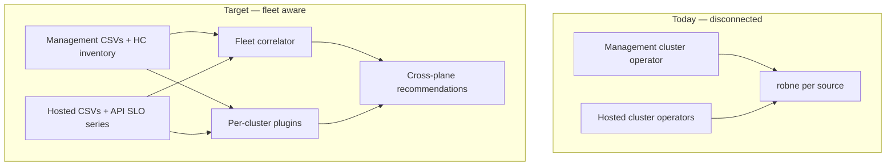

# Hosted Control Plane & Fleet Control-Plane Optimization

!!! warning "Status: Planned / Future Work"
    This feature family is **not yet implemented**. The description below is the
    intended product and research direction. Today's ROS-OCP recommendations
    remain **per-cluster** and **workload/worker focused**. Running robne
    independently on a management cluster and on hosted clusters already yields
    useful *disconnected* recommendations; **cross-plane causality** and
    **fleet control-plane FinOps** require the work described here.

!!! info "Quick Facts (planned)"
    **Scope:** Optimize OpenShift **Hosted Control Plane (HCP / HyperShift)** fleets and, more broadly, **multi-cluster control-plane economics** — not only worker rightsizing  
    **Deployment model:** Operator + robne on **management** and/or **hosted** clusters; later a **fleet correlator** joining both  
    **Depends on:** Existing container/node/namespace plugins; new PromQL/CSV (research); stable HostedCluster ↔ cluster UUID join  
    **Out of scope (v1):** Customer-facing “resize Red Hat–managed shared CP” without evidence and without management-plane access  
    **Tracking:** Parent epic + research children + wedge backlog (see [Tracking model](#tracking-model-how-we-do-not-forget))  
    **Est. effort:** Research **2–4 weeks**; MVP wedge **~1–2 months**; full family **multi-quarter**

---

## What this is about

OpenShift can run with:

| Topology | Control plane location | What ROS sees today |
|----------|------------------------|---------------------|
| **Dedicated control plane** | Master/control-plane nodes **in** the cluster | Worker + some platform namespaces; masters may appear as nodes |
| **Hosted Control Plane (HCP)** | Control plane pods on a **management** cluster; workers on the **hosted** cluster | Hosted: workers + workloads only. Management: CP pods look like ordinary Deployments/StatefulSets |

**robne** (native engine) and **koku-metrics-operator** optimize what they **measure on the cluster where they run**. They do **not** today understand “this cluster’s API is slow because the shared control plane on another cluster is starved.”

This planned feature answers:

1. What value we get **with zero new metrics** by installing on both planes  
2. What **new recommendation families** are worth building  
3. What **metrics, joins, and algorithms** research must prove  
4. How we **phase wedges** so MVP ships without forgetting the rest  

---

## Why it matters

### HCP makes the control plane a fleets product

On HyperShift, the management cluster’s “product” is **HostedClusters**. Unit economics are:

- Cost of CP pods + management worker capacity **per** HostedCluster  
- SLO of API/etcd/konnectivity **per** HostedCluster  
- Density: how many HCs fit before SLO risk  

Classic container rightsizing still matters on **hosted** workers. It does **not** replace **control-plane FinOps**.

### The “shared CP is starving us” story is real — and easy to get wrong

Undersized or noisy-neighbor management capacity **does** cause API latency, etcd pressure, and “everything feels slow” on hosted clusters. That case is **real**.

It is **not** diagnosable from hosted-cluster CSVs alone. A recommendation that blames the shared CP without management-plane signals and a join key will be a high-rate false positive.

### Managed vs self-managed HCP (critical product constraint)

| Environment | Who runs robne on management? | Implication |
|-------------|------------------------------|-------------|
| **Self-managed HyperShift / ACM** | Customer (often) | Full dual-plane story for the customer tenant |
| **ROSA HCP / vendor-managed CP** | **Usually not the customer** | Customer-facing ROS on **hosted** clusters: topology awareness, suppress bad narratives; **no** customer “resize shared CP” without RH policy |
| **ROSA HCP — Red Hat–operated management** | **Red Hat** (platform / SRE / internal Cost–ROS) | Management-plane metrics **are** available to RH. Full W1/W2/W3… families are viable **as RH-operated or RH-assisted capabilities**, with careful tenancy, data residency, and what is exposed to the customer vs kept internal |

**Important:** “Customer cannot install on ROSA management” ≠ “we will never have those metrics.” When Red Hat runs robne on the management plane, research and design must cover:

1. **Internal fleet mode** — RH uses full CP FinOps / causality for operating ROSA HCP  
2. **Customer-visible subset** — what (if anything) is safe in the customer Optimizations UI  
3. **Join across trust boundaries** — hosted cluster in customer `org_id` vs management source in RH tenancy  

Audiences stay separate in product copy; **metric availability for RH-operated management is in-scope for research R2/R3** (see also tracking issue under epic #384).

---

## What works today (no new code)

Install koku-metrics-operator + ingest into robne on **each** cluster independently.

### Hosted / dedicated worker clusters

Full current catalog: containers, namespaces, nodes, GPU, PVC, VM, quotas, idle detection, savings, etc. HCP does not change workload rightsizing on workers.

### Management cluster

HyperShift CP components are pods. Existing engines already apply:

| Existing capability | HCP / management reading |
|--------------------|---------------------------|
| Container right-size | `kube-apiserver`, `etcd`, `oauth`, `konnectivity`, etc. request/limit hygiene |
| Idle / zombie | Leftover pods after HC delete (partial — needs HC lifecycle signals for confidence) |
| Namespace / ResourceQuota | Per-HC namespace budget envelopes |
| Node consolidation | Pack CP pods denser on management workers (advisory) |
| Cost / savings | If cost models applied to management provider |

**Gap:** no HostedCluster identity, no CP SLO metrics, no join to hosted API latency, no “fleet admission capacity,” no HC hibernation.

---

## Non-goals (near term)

- Pixel-perfect HyperShift admin console replacement  
- Automatic scale-up of **Red Hat–operated** shared control planes for ROSA customers  
- Replacing Cluster Monitoring / HyperShift runbooks with ROS  
- Carbon-aware multi-region placement (parking lot — see [Later wedges](#wedge-roadmap-mvp-and-beyond))  
- Requiring Local Mode / robne-operator (orthogonal; see [Related planned work](#related-planned-work))  

---

## Recommendation families (exhaustive catalog)

Each family needs research → metrics → algorithm → owner (who can act) → false-positive analysis before implementation.

### Family A — Topology awareness (foundation)

| Item | Detail |
|------|--------|
| **Intent** | Know dedicated vs HCP vs management role; avoid misleading infra stories |
| **Example rec / behavior** | “This is a hosted cluster (no local masters); node consolidation excludes control-plane capacity that isn’t here.” |
| **Signals (candidates)** | `Infrastructure` CR `platformStatus`; HyperShift / `hostedcontrolplanes` APIs; node roles; absence of master nodes; management labels |
| **Owner** | Platform admin (UX/docs); mostly **suppress / annotate**, not “fix CP” |
| **Depends on** | Detection only — little/no new PromQL |
| **Research issue theme** | Topology detection |

### Family B — Management-as-workload (CP rightsizing)

| Item | Detail |
|------|--------|
| **Intent** | Treat CP pods as first-class optimization targets on management |
| **Example rec** | “etcd for HC `payments-prod` CPU request 2× p95 usage — lower request; limit headroom OK.” |
| **Signals** | Existing ROS container digests **if** CP pods labeled/namespaced consistently; optional component labels |
| **Owner** | HyperShift / platform SRE on management |
| **Depends on** | Namespace/HC labeling conventions; maybe plugin filter “controlplane” |
| **Research issue theme** | Management-as-workload gap analysis |

### Family C — Cross-plane causality (the “blame CP” family)

| Item | Detail |
|------|--------|
| **Intent** | Attribute hosted pain to CP vs workers/storage/DNS with evidence |
| **Example rec** | “Hosted `payments-prod` API client p99 ↑ **and** management `kube-apiserver` for that HC CPU/latency ↑ → investigate CP capacity; do **not** add worker nodes first.” |
| **Signals (mgmt)** | APIserver request duration, CPU/mem per HC namespace; etcd fsync/DB size; konnectivity errors |
| **Signals (hosted)** | API request duration; client-side timeouts; webhook latency; scheduling queue |
| **Join key** | HostedCluster name / ID ↔ hosted `cluster_uuid` / infra ID |
| **Owner** | Platform SRE (mgmt) + cluster admin (hosted) — possibly different orgs |
| **Depends on** | New metrics + fleet correlator |
| **Research issue theme** | Cross-plane causality |

### Family D — HostedCluster lifecycle / zombie FinOps

| Item | Detail |
|------|--------|
| **Intent** | Stop paying for CP burn on unused HCs |
| **Example rec** | “HC `dev-alice` workers near-idle 14d; CP still full size on management — hibernate/delete.” |
| **Signals** | HostedCluster CR phase/conditions; hosted node/pod usage; management CP namespace cost/usage |
| **Owner** | Fleet admin |
| **Research issue theme** | HC lifecycle / zombie |

### Family E — Fleet admission / density capacity

| Item | Detail |
|------|--------|
| **Intent** | How many more HCs before SLO risk |
| **Example rec** | “At current p95 APIserver/etcd load, estimated headroom ≈ N HostedClusters of similar size.” |
| **Signals** | Aggregated CP util; historical add-HC events; optional synthetic benchmarks |
| **Owner** | Fleet capacity planner |
| **Research issue theme** | Fleet admission capacity |

### Family F — Noisy neighbor / isolation

| Item | Detail |
|------|--------|
| **Intent** | One HC’s CP burst harms another on shared management nodes |
| **Example rec** | “Move HC `batch-etl` CP pods to dedicated management MachineSet; anti-affinity vs `payments-prod`.” |
| **Signals** | Per-HC CP CPU; node co-residency; etcd disk contention |
| **Owner** | Platform SRE |
| **Research** | Often folds into C + E; may be own spike |

### Family G — Operator / webhook / API tax

| Item | Detail |
|------|--------|
| **Intent** | Chatty controllers and webhooks overload API (hosted or mgmt) |
| **Example rec** | “SA `system:serviceaccount:foo:bar` drives 40% of list/watch — tune QPS/informers; webhook `baz` adds 200ms p99.” |
| **Signals** | `apiserver_request_total` by user/resource/verb; webhook duration |
| **Owner** | App platform / operator authors |
| **Research issue theme** | Operator/webhook tax |

### Family H — Shared CP cost attribution / chargeback

| Item | Detail |
|------|--------|
| **Intent** | Show $ of management capacity per HC (FinOps) |
| **Example rec** | “HC `team-x` consumes ~12% of management CP CPU → ~$Y/mo allocated.” |
| **Signals** | Management cost model + per-HC usage join; Koku rates |
| **Owner** | FinOps |
| **Depends on** | Cost integration on management provider + join |
| **Research** | After B/C prove usage attribution |

### Family I — CP pool / MachineSet design

| Item | Detail |
|------|--------|
| **Intent** | Separate CP worker pools; right-size management MachineSets for CP |
| **Example rec** | “CP pods share general compute with CI — create `control-plane` MachineSet; pin HC namespaces.” |
| **Signals** | Node labels; MachineSet metrics ([MachineSet planned](machineset-recommendations.md)); CP pod placement |
| **Owner** | Platform |
| **Related** | MachineSet / node consolidation features |

### Family J — Sleep / business-hours for non-prod HCs

| Item | Detail |
|------|--------|
| **Intent** | Shrink or pause non-prod CP/workers on schedule |
| **Example rec** | “Scale non-prod HC CP to minimal profile nights/weekends (where HyperShift supports).” |
| **Signals** | Business hours ([feature](../features/business-hours.md)); HC tier tags; usage |
| **Owner** | Fleet admin |
| **Depends on** | HyperShift pause/scale capabilities — validate in research |

### Family K — Multi-cluster workload placement (broader than HCP)

| Item | Detail |
|------|--------|
| **Intent** | Place namespaces/VMs on best cluster in fleet |
| **Example rec** | See [Cross-Cluster VM Placement](cross-cluster-vm-placement.md) |
| **Note** | Sibling planned feature; fleet correlator may share index infrastructure |

### Family L — Parking lot (explicitly deferred)

| Idea | Why parked |
|------|------------|
| Carbon / region preference | Needs external signals; not HCP-specific |
| Synthetic “create project → rollout” SLO journeys | Valuable; heavy; after causality MVP |
| Blast-radius graphs as primary UX | Visualization after metrics exist |
| Auto-remediation of CP scale | Safety; advisory-first forever for CP |

---

## Wedge roadmap (MVP and beyond)

Wedges are **shippable product slices**. Research validates; implementation children appear **only after** a wedge is locked.

| Wedge | Goal | Families | Status | Forget-me-not |
|-------|------|----------|--------|---------------|
| **W0 — Topology** | Detect HCP/management/dedicated; annotate/suppress bad node narratives | A | **MVP ladder step 1** | Epic child / research → impl |
| **W1 — Management CP rightsizing** | Use existing pod digests on management with CP-aware filtering | B | **MVP ladder step 2** | |
| **W2 — Cross-plane causality (thin)** | One join: hosted API latency ↔ mgmt APIserver/etcd for that HC | C | **MVP ladder step 3** | Hardest; may slip |
| **W3 — HC zombie / lifecycle** | Idle HC + CP burn → hibernate/delete advisory | D | Post-MVP | Backlog issue |
| **W4 — Fleet admission headroom** | “N more HCs” estimate | E | Post-MVP | Backlog issue |
| **W5 — API tax (operators/webhooks)** | Chatty client / webhook recs | G | Post-MVP | Backlog issue |
| **W6 — CP cost attribution** | $ per HC from management | H | Post-MVP | Backlog issue |
| **W7 — CP pools / MachineSet** | Dedicated management pools | I | Post-MVP | Backlog issue |
| **W8 — HC sleep schedules** | Business-hours non-prod | J | Post-MVP | Backlog issue |
| **W9 — Fleet placement share** | Shared index with VM placement | K | Coordinate | Link sibling feature |

### MVP ladder (carry now)

```text
W0 Topology ──▶ W1 Management CP rightsizing ──▶ W2 Thin cross-plane join
     │                    │                              │
  ships alone         ships alone              ships only if research proves metrics+join
```

If **W2** fails research, **W0+W1** still ship. Do not block W0/W1 on W2.

---

## Tracking model (how we do not forget)

### Artifacts (all required)

| Artifact | Role |
|----------|------|
| **This planned-feature page** | Exhaustive catalog, wedge table, research checklist, non-goals — **source of truth** |
| **Parent GitHub epic** | Program umbrella; links here |
| **Research children** | Time-boxed spikes; DoD = metrics table + algorithm sketch + MVP yes/no |
| **Wedge backlog children** | One issue per post-MVP wedge (W3–W8); **not** detailed impl tasks yet — placeholders so nothing drops |
| **Implementation children** | Created **only** when a wedge is greenlit (operator / backend / API / UI as needed) |

### Research children (create with the epic)

| ID (theme) | Research question | Definition of done |
|------------|-------------------|-------------------|
| **R1 Topology** | How do we reliably detect dedicated vs hosted vs management? What do we suppress today? | Detection matrix; false-positive cases; W0 impl sketch |
| **R2 Management-as-workload** | Which CP pods already appear in ROS CSVs? Label/namespace conventions? Gaps? | Inventory of series; W1 plugin/filter sketch; gap list for operator |
| **R3 Cross-plane causality** | Minimum PromQL both sides; join key; can we beat “add nodes” false blame? | Metric table; join; algorithm; go/no-go for W2 |
| **R4 HC lifecycle** | Zombie/hibernate signals from HC CR + usage | Signals; HyperShift API notes; W3 sketch |
| **R5 Fleet admission** | Is “N more HCs” estimable without synthetic load? | Model or “not viable yet”; W4 sketch |
| **R6 API tax** | Availability of request-by-user / webhook metrics in customer clusters | Metric availability; W5 sketch |

### When to start research

**Immediately after scaffolding** (this page + epic + children). Order:

1. **R1** and **R2** in parallel (unblock W0/W1; no new pipeline required to *think*)  
2. **R3** next (decides W2)  
3. **R4–R6** can parallelize after R1 or stagger  

Research does **not** require waiting for Local Mode, PDF books, or other epics.

### How wedge backlog issues work

- Each **W3–W8** gets a GitHub issue under the parent epic: title `Wedge Wₙ: …`, body links to the family section here, status = backlog until research promotes it.  
- When starting a wedge: convert/expand into implementation children; update this page’s Status column.  
- **Do not** pre-create dozens of operator/API tickets for W3–W8.

---

## Candidate metrics (research input — not final)

### Management cluster (candidates)

| Metric / signal | Family | Notes |
|-----------------|--------|-------|
| Container CPU/mem usage & requests (existing ROS) | B, H | Baseline |
| `apiserver_request_duration_seconds` | C, E, G | SLO |
| `apiserver_request_total` by `resource`,`verb`,`user`/`username` | G | Tax |
| etcd `backend` / fsync / DB size | C, E | Classic bottleneck |
| Konnectivity / tunnel errors | C | HCP-specific |
| HostedCluster CR status, conditions, creationTimestamp | D, E | API not Prom |
| Node labels `control-plane` pool | I | Placement |
| MachineSet size / util | I | Link MachineSet feature |

### Hosted cluster (candidates)

| Metric / signal | Family | Notes |
|-----------------|--------|-------|
| Existing workload digests | — | Unchanged |
| API request duration / errors | C | Consumer view |
| Webhook duration | G, C | |
| Scheduling latency / pending pods | C | Alt explanations |
| Cluster infra ID / cluster_uuid | C | Join |

### Join

| Left | Right | Key candidates |
|------|-------|----------------|
| Management HC namespace / HC CR | Hosted cluster | HC name, infra ID, `cluster_uuid`, cloud account labels |

Research **R3** must pick one stable key and document failure modes (rename, recreate, managed opaque IDs).

---

## Algorithm sketches (to refine in research)

### W0 — Topology

```text
observe Infrastructure + APIs + node roles
  → classify {dedicated, hosted, management, unknown}
  → attach cluster_topology to recommendations / UI
  → if hosted: suppress “missing master capacity” style narratives
```

### W1 — Management CP rightsizing

```text
filter digests to HC / control-plane namespaces (label rules from R2)
  → reuse container right-size + idle engines
  → tag recommendation_type / plugin = controlplane (TBD)
  → savings via existing cost path if rates exist
```

### W2 — Thin causality

```text
for each joined (HC, hosted_cluster):
  hosted_api_p99 = …
  mgmt_api_or_etcd_stress = …
  hosted_worker_pressure = …
  if hosted_api_p99 high and mgmt_stress high and worker_pressure low:
      emit “investigate CP capacity” (advisory)
  elif hosted_api_p99 high and worker_pressure high:
      emit classic node/workload recs only
  else:
      no CP blame
```

Confidence must be explicit; prefer **suppress worker-scale advice** when CP blame fires, rather than aggressive auto-action.

---

## Architecture sketch



Phases: **detect → per-plane CP plugin → join/correlator → richer families**.

---

## Related planned work

| Page | Relationship |
|------|----------------|
| [Local Mode](local-mode.md) | On-cluster engine may later run correlator pieces near management; not a prerequisite for W0–W1 remote path |
| [Cross-Cluster VM Placement](cross-cluster-vm-placement.md) | Shares “fleet index” ideas; different object (VM vs HC/CP) |
| [MachineSet recommendations](machineset-recommendations.md) | Management CP worker pools (Family I) |
| [Business Hours](../features/business-hours.md) | HC sleep schedules (Family J) |
| [Node consolidation](../features/node-recommendations.md) | Must not mis-apply to hosted “missing masters” |
| [Cost integration](../architecture/cost-integration.md) | CP chargeback (Family H) |

---

## Open questions (research must close)

1. Stable join key across self-managed HyperShift vs ROSA HCP naming?  
2. Which CP containers are always present vs optional (OVN, ingress, …)?  
3. Can hosted clusters scrape enough API SLO without elevating monitoring privileges?  
4. For ROSA HCP with **RH-operated** management robne: what is internal-only vs customer-visible? How do we join across RH vs customer tenancy?  
5. Does HyperShift support pause/hibernate sufficient for Family J?  
6. Multi-tenant SaaS: may one robne see both management and hosted sources for the same customer?  
7. Notification code ranges and `recommendation_type` values for controlplane / causality?  

---

## Acceptance criteria for this planned page (scaffolding)

- [x] Exhaustive family catalog and non-goals  
- [x] MVP ladder W0→W1→W2 and post-MVP wedges W3–W8  
- [x] Tracking model: page + epic + research + wedge backlog  
- [x] Parent epic filed and linked below  
- [x] Research issues R1–R6 filed as children  
- [x] Wedge backlog issues W3–W8 filed as children  
- [ ] Research complete → update Status column and promote implementation children  

### Links

| Tracker | URL |
|---------|-----|
| Parent epic | [#384](https://github.com/pgarciaq/ros-ocp-backend/issues/384) |
| Research R1 Topology | [#385](https://github.com/pgarciaq/ros-ocp-backend/issues/385) |
| Research R2 Management-as-workload | [#386](https://github.com/pgarciaq/ros-ocp-backend/issues/386) |
| Research R3 Cross-plane causality | [#387](https://github.com/pgarciaq/ros-ocp-backend/issues/387) |
| Research R4 HC lifecycle | [#388](https://github.com/pgarciaq/ros-ocp-backend/issues/388) |
| Research R5 Fleet admission | [#389](https://github.com/pgarciaq/ros-ocp-backend/issues/389) |
| Research R6 API tax | [#390](https://github.com/pgarciaq/ros-ocp-backend/issues/390) |
| Wedge backlog W3 | [#391](https://github.com/pgarciaq/ros-ocp-backend/issues/391) |
| Wedge backlog W4 | [#392](https://github.com/pgarciaq/ros-ocp-backend/issues/392) |
| Wedge backlog W5 | [#393](https://github.com/pgarciaq/ros-ocp-backend/issues/393) |
| Wedge backlog W6 | [#394](https://github.com/pgarciaq/ros-ocp-backend/issues/394) |
| Wedge backlog W7 | [#395](https://github.com/pgarciaq/ros-ocp-backend/issues/395) |
| Wedge backlog W8 | [#396](https://github.com/pgarciaq/ros-ocp-backend/issues/396) |
| Design: RH-operated ROSA HCP management | [#397](https://github.com/pgarciaq/ros-ocp-backend/issues/397) |
| HyperShift/ACM alignment outreach | [#398](https://github.com/pgarciaq/ros-ocp-backend/issues/398) |
| Sibling planned-feature coordination | [#399](https://github.com/pgarciaq/ros-ocp-backend/issues/399) |
| ADR after research (postponed) | [#400](https://github.com/pgarciaq/ros-ocp-backend/issues/400) |

---

## Document history

| Date | Change |
|------|--------|
| 2026-08-03 | Initial exhaustive planned feature: HCP/fleet CP optimization, research model, MVP wedge ladder; epic #384 + children filed |
| 2026-08-03 | RH-operated ROSA HCP management audience; tracking issues #397–#400 |
