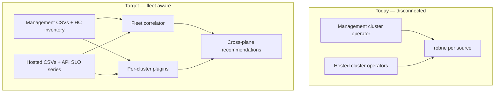

# Hosted Control Plane & Fleet Control-Plane Optimization

!!! warning "Status: Planned / Future Work — **documentation & research only**"
    This feature family is **not yet implemented**. **No coding** until an
    explicit per-wedge implementation greenlight. Locked decisions live in ADRs
    0328–0335 and the [design plan](https://github.com/pgarciaq/ros-ocp-backend/blob/{{ git_branch }}/docs/plans/hcp-fleet-optimization.md).
    Today's ROS-OCP recommendations remain **per-cluster** and **workload/worker focused**.
    Research R1–R6 for the main wedges is **complete**.

!!! info "Quick Facts (planned)"
    **Scope:** Optimize OpenShift **Hosted Control Plane (HCP / HyperShift)** fleets and, more broadly, **multi-cluster control-plane economics** — not only worker rightsizing  
    **Deployment model:** Operator + robne on **management** and/or **hosted** clusters; later a **fleet correlator** joining both  
    **Depends on:** Existing container/node/namespace plugins; operator HCP ns collection (ADR-0329); stable HostedCluster ↔ cluster UUID join  
    **Out of scope (v1):** Customer-facing “resize Red Hat–managed shared CP” without evidence and without management-plane access  
    **Tracking:** Parent epic [#384](https://github.com/pgarciaq/ros-ocp-backend/issues/384)  
    **Accepted ADRs:** [0328](https://github.com/pgarciaq/ros-ocp-backend/blob/{{ git_branch }}/docs/adr/0328-hcp-cluster-topology-detection-w0.md) W0 · [0329](https://github.com/pgarciaq/ros-ocp-backend/blob/{{ git_branch }}/docs/adr/0329-ros-auto-include-hypershift-hcp-namespaces.md) ROS HCP ns · [0330](https://github.com/pgarciaq/ros-ocp-backend/blob/{{ git_branch }}/docs/adr/0330-hcp-audience-visibility-rh-vs-customer.md) audience · [0331](https://github.com/pgarciaq/ros-ocp-backend/blob/{{ git_branch }}/docs/adr/0331-management-cp-rightsizing-filters-and-guardrails.md) W1 · [0332](https://github.com/pgarciaq/ros-ocp-backend/blob/{{ git_branch }}/docs/adr/0332-thin-cross-plane-causality-w2.md) W2 · [0333](https://github.com/pgarciaq/ros-ocp-backend/blob/{{ git_branch }}/docs/adr/0333-unused-hostedcluster-lifecycle-w3.md) W3 · [0334](https://github.com/pgarciaq/ros-ocp-backend/blob/{{ git_branch }}/docs/adr/0334-fleet-admission-headroom-w4.md) W4 · [0335](https://github.com/pgarciaq/ros-ocp-backend/blob/{{ git_branch }}/docs/adr/0335-api-tax-operator-webhook-w5.md) W5  
    **Design plan:** [`docs/plans/hcp-fleet-optimization.md`](https://github.com/pgarciaq/ros-ocp-backend/blob/{{ git_branch }}/docs/plans/hcp-fleet-optimization.md)  
    **Est. effort:** Research done for W0–W5; MVP coding **~1–2 months** after greenlight; full family **multi-quarter**

---

## Documentation stance (important)

| Artifact | Role |
|----------|------|
| **This page** | Public product catalog, MVP ladder, research findings, audience model |
| **ADRs 0328–0335** | Locked architectural / product decisions — do not re-litigate in PRs without a new ADR |
| **Design plan** | Implementation map + glossary + coding gate |
| **GitHub epic #384** | Program tracker; children for research / wedges / design |
| **#400 / ADR-0332** | Thin correlator metrics + join — **locked** after R3 |

**Coding** (operator, robne, UI) starts only when a wedge is explicitly greenlit for implementation. Design issues #406–#408 describe W0 slices but remain **postponed for coding**.

---

## What this is about

OpenShift can run with:

| Topology | Control plane location | What ROS sees today |
|----------|------------------------|---------------------|
| **Dedicated control plane** | Master/control-plane nodes **in** the cluster | Worker + some platform namespaces; masters may appear as nodes |
| **Hosted Control Plane (HCP)** | Control plane pods on a **management** cluster; workers on the **hosted** cluster | Hosted: workers + workloads only. Management: CP pods look like ordinary Deployments/StatefulSets |

**robne** (native engine) and **koku-metrics-operator** optimize what they **measure on the cluster where they run**. They do **not** today understand “this cluster’s API is slow because the shared control plane on another cluster is starved.”

This planned feature answers:

1. What value we get **with zero new metrics** by installing on both planes  
2. What **new recommendation families** are worth building  
3. What **metrics, joins, and algorithms** research must prove  
4. How we **phase wedges** so MVP ships without forgetting the rest  

---

## Recommendations users will see (one screen)

**Not shipped yet** — this is the intended product copy once wedges are implemented. Who sees what depends on whether you run Optimizations on the **hosted** cluster, the **management** cluster, or both (and whether Red Hat operates management for ROSA/ARO).

| You will see… | Plain English | Typical audience | Wedge |
|---------------|---------------|------------------|-------|
| “This cluster’s control plane is **external** (hosted)” | Stop treating missing master nodes as a bug; don’t invent local CP capacity | Customer on **hosted** | W0 |
| **Suppress / soften** “add worker nodes” when the real issue isn’t workers | Avoid the wrong first fix when API pain is elsewhere | Customer on hosted | W0 (+ W2/W5 when evidence exists) |
| **Rightsize** control-plane pods (`kube-apiserver`, `etcd`, …) on management | Requests/limits hygiene for HyperShift CP components — careful floors | Self-managed or **RH-internal** on **management** | W1 |
| “API is slow **and** this cluster’s CP on management is stressed — **don’t add workers first**” | Blame shared CP only with join + evidence | Self-managed dual-plane; RH-internal; customer gets a **safe** advisory only (never “resize RH’s CP”) | W2 |
| “Hosted cluster looks **unused**; control plane still running — review **delete**” | Zero workers ≠ free CP; do **not** use `pausedUntil` to save money | Fleet admin / RH-internal (management view) | W3 |
| “About **N more** similar HostedClusters may fit (sizing guide / MCE)” | Labeled packing estimate — not a universal guarantee; warn if not HA | Self-managed / RH-internal on management | W4 |
| “Service account X / webhook Y is hammering the API — **tune that**” | Top chatty clients and slow webhooks | Hosted **and** management | W5 |

**You will not see (near term):** customer CTA to resize Red Hat–managed shared control planes; auto-delete of HostedClusters; fake “hibernate” via `pausedUntil`; a magic N that ignores CPU arch / cloud / API load.

---

## Why it matters

### HCP makes the control plane a fleets product

On HyperShift, the management cluster’s “product” is **HostedClusters**. Unit economics are:

- Cost of CP pods + management worker capacity **per** HostedCluster  
- SLO of API/etcd/konnectivity **per** HostedCluster  
- Density: how many HCs fit before SLO risk  

Classic container rightsizing still matters on **hosted** workers. It does **not** replace **control-plane FinOps**.

### The “shared CP is starving us” story is real — and easy to get wrong

Undersized or noisy-neighbor management capacity **does** cause API latency, etcd pressure, and “everything feels slow” on hosted clusters. That case is **real**.

It is **not** diagnosable from hosted-cluster CSVs alone. A recommendation that blames the shared CP without management-plane signals and a join key will be a high-rate false positive.

### Managed vs self-managed HCP (critical product constraint)

| Environment | Who runs robne on management? | Implication |
|-------------|------------------------------|-------------|
| **Self-managed HyperShift / ACM** | Customer (often) | Full dual-plane story for the customer tenant |
| **ROSA HCP / vendor-managed CP** | **Usually not the customer** | Customer-facing ROS on **hosted** clusters: topology awareness, suppress bad narratives; **no** customer “resize shared CP” without RH policy |
| **ROSA HCP — Red Hat–operated management** | **Red Hat** (platform / SRE / internal Cost–ROS) | Management-plane metrics **are** available to RH. Full W1/W2/W3… families are viable **as RH-operated or RH-assisted capabilities**, with careful tenancy, data residency, and what is exposed to the customer vs kept internal |

**Important:** “Customer cannot install on ROSA management” ≠ “we will never have those metrics.” When Red Hat runs robne on the management plane, research and design must cover:

1. **Internal fleet mode** — RH uses full CP FinOps / causality for operating ROSA HCP  
2. **Customer-visible subset** — what (if anything) is safe in the customer Optimizations UI  
3. **Join across trust boundaries** — hosted cluster in customer `org_id` vs management source in RH tenancy  

Audiences stay separate in product copy. RH **will** collect management metrics on ROSA/ARO when that path lands (product intent).

### Audience & visibility model (locked — ADR-0330)

Tracking: [#397](https://github.com/pgarciaq/ros-ocp-backend/issues/397) **closed** → [ADR-0330](https://github.com/pgarciaq/ros-ocp-backend/blob/{{ git_branch }}/docs/adr/0330-hcp-audience-visibility-rh-vs-customer.md). Constrains **what we show** and **where data lives**; does **not** block W0/W1 when management digests exist in *some* tenant.

#### Personas / deployment modes

| Mode | Plain English | Who has management robne? | Who has hosted robne? | Same customer org? |
|------|---------------|---------------------------|------------------------|--------------------|
| **M1 Self-managed dual-plane** | Customer runs HyperShift/ACM themselves | Customer | Customer | **Yes** — join inside that org (Cost Management auth already scopes clusters) |
| **M2 ROSA HCP — customer hosted only** | Customer only sees hosted clusters | Nobody (customer side) | Customer | N/A for management |
| **M3 ROSA HCP — RH-operated management** | RH runs robne on management; customer on hosted | Red Hat (platform) | Customer | **No** — two trust domains |
| **M4 RH-assisted** (future) | RH shares selected signals with customer | RH; selected signals shared | Customer | Join via controlled export |

**Decision (2026-08-03):** Support **both** RH-internal full FinOps **and** customer-visible paths (W0 on hosted; safe W2 advisory when evidence exists — never “resize RH CP” in customer UI).

#### Join (clarified)

- **Self-managed (M1):** No special `clusterID→org` service. Auth = customer org; Sources/API list that org’s clusters; ROS/Cost payloads carry `cluster_uuid` / ClusterVersion id. Correlator joins management + hosted **sources in the same org**.
- **ROSA RH-operated (M3):** Management digests may live only in RH tenancy. Then either correlator stays RH-side (**J1**) and/or writes sanitized customer-visible advice (**J2**). Reject putting RH management under the customer `org_id` (**J3**).

| Approach | Plain English | Recommendation |
|----------|---------------|----------------|
| **J1** | RH keeps raw management metrics; maps HC → customer cluster id internally | **Preferred for M3 raw data** |
| **J2** | Also drop a small sanitized “don’t add workers” row into customer org for UI | OK if customer-local history needed |
| **J3** | Pretend management source belongs to customer org | **Reject** |
| **J4** | Never join; customer only gets W0 | Fallback if policy blocks J1/J2 |

**Join key (technical):** `HostedCluster.spec.clusterID` ↔ hosted ClusterVersion / ROS `cluster_uuid` — **confirmed** in lab (#401). Fallback: `infraID` / `infrastructureName`.

#### Product copy rules (non-negotiable)

1. Never tell a ROSA HCP customer to **resize Red Hat–managed** shared CP unless a written policy exception exists.  
2. Never show RH management cluster names, node IPs, or sibling HC names in customer UI.  
3. W0 copy on hosted: “control plane is external / hosted” — factual, not blame.  
4. Self-managed (M1) may use full W1/W2 language; templates must branch on mode.

#### Decisions (2026-08-03)

1. **Customer + RH-internal:** both — full RH-internal W1/W2; customer gets W0 + safe advisory (not RH CP resize).  
2. **Org mapping:** Cost Management auth / per-org cluster list / payload cluster ids for M1. M3 cross-org only when management digests are RH-only.  
3. **Join:** J1 for M3 raw data; J2 optional for customer-local advisory rows.  
4. **#405:** auto-include HCP namespaces in ROS queries (option B).  
5. **On-prem M3:** still open if needed later — default assume cloud/RH-SRE first unless stated.

#### Feed into R3 / W2

**R3** = research issue [#387](https://github.com/pgarciaq/ros-ocp-backend/issues/387): *can we prove hosted API pain is caused by management CP (metrics + join key), and should we build W2?*

**R3 closed (2026-08-04):** **GO with caveats** → [ADR-0332](https://github.com/pgarciaq/ros-ocp-backend/blob/{{ git_branch }}/docs/adr/0332-thin-cross-plane-causality-w2.md).

- Correlator assumes both planes in one trust domain (M1) or RH-internal (M3); RH **will** collect management metrics on ROSA/ARO.
- Customer UI path uses advisory subset only (ADR-0330).
- W2 backlog [#404](https://github.com/pgarciaq/ros-ocp-backend/issues/404) ready for coding greenlight after SLO series design; still **no code** until greenlit.

---

## What works today (no new code)

Install koku-metrics-operator + ingest into robne on **each** cluster independently.

### Hosted / dedicated worker clusters

Full current catalog: containers, namespaces, nodes, GPU, PVC, VM, quotas, idle detection, savings, etc. HCP does not change workload rightsizing on workers.

### Management cluster

HyperShift CP components are pods. Existing engines already apply:

| Existing capability | HCP / management reading |
|--------------------|---------------------------|
| Container right-size | `kube-apiserver`, `etcd`, `oauth`, `konnectivity`, etc. request/limit hygiene |
| Idle / zombie | Leftover pods after HC delete (partial — needs HC lifecycle signals for confidence) |
| Namespace / ResourceQuota | Per-HC namespace budget envelopes |
| Node consolidation | Pack CP pods denser on management workers (advisory) |
| Cost / savings | If cost models applied to management provider |

**Gap:** no HostedCluster identity, no CP SLO metrics, no join to hosted API latency, no “fleet admission capacity,” no HC hibernation.

---

## Non-goals (near term)

- Pixel-perfect HyperShift admin console replacement  
- Automatic scale-up of **Red Hat–operated** shared control planes for ROSA customers  
- Replacing Cluster Monitoring / HyperShift runbooks with ROS  
- Carbon-aware multi-region placement (parking lot — see [Later wedges](#wedge-roadmap-mvp-and-beyond))  
- Requiring Local Mode / robne-operator (orthogonal; see [Related planned work](#related-planned-work))  

---

## Recommendation families (exhaustive catalog)

Each family needs research → metrics → algorithm → owner (who can act) → false-positive analysis before implementation.

### Family A — Topology awareness (foundation)

| Item | Detail |
|------|--------|
| **Intent** | Know dedicated vs HCP vs management role; avoid misleading infra stories |
| **Example rec / behavior** | “This is a hosted cluster (no local masters); node consolidation excludes control-plane capacity that isn’t here.” |
| **Signals (candidates)** | `Infrastructure` CR `platformStatus`; HyperShift / `hostedcontrolplanes` APIs; node roles; absence of master nodes; management labels |
| **Owner** | Platform admin (UX/docs); mostly **suppress / annotate**, not “fix CP” |
| **Depends on** | Detection only — little/no new PromQL |
| **Research issue theme** | Topology detection |
| **Research status (2026-08-04)** | **R1 complete — locked** → [ADR-0328](https://github.com/pgarciaq/ros-ocp-backend/blob/{{ git_branch }}/docs/adr/0328-hcp-cluster-topology-detection-w0.md) ([#385](https://github.com/pgarciaq/ros-ocp-backend/issues/385) closed) |

### Family B — Management-as-workload (CP rightsizing)

| Item | Detail |
|------|--------|
| **Intent** | Treat CP pods as first-class optimization targets on management |
| **Example rec** | “etcd for HC `payments-prod` CPU request 2× p95 usage — lower request; limit headroom OK.” |
| **Signals** | Existing ROS container digests **if** CP pods labeled/namespaced consistently; optional component labels |
| **Owner** | HyperShift / platform SRE on management |
| **Depends on** | Operator collects HCP namespaces ([#405](https://github.com/pgarciaq/ros-ocp-backend/issues/405) / ADR-0329); CP-aware guardrails |
| **Research issue theme** | Management-as-workload gap analysis |
| **Research status (2026-08-04)** | **R2 complete — locked** → [ADR-0331](https://github.com/pgarciaq/ros-ocp-backend/blob/{{ git_branch }}/docs/adr/0331-management-cp-rightsizing-filters-and-guardrails.md) (+ ADR-0329). Ingest proof still [#405](https://github.com/pgarciaq/ros-ocp-backend/issues/405). |

### Family C — Cross-plane causality (the “blame CP” family)

| Item | Detail |
|------|--------|
| **Intent** | Attribute hosted pain to CP vs workers/storage/DNS with evidence |
| **Example rec** | “Hosted `payments-prod` API client p99 ↑ **and** management `kube-apiserver` for that HC CPU/latency ↑ → investigate CP capacity; do **not** add worker nodes first.” |
| **Signals (mgmt)** | APIserver request duration, CPU/mem per HC namespace; etcd fsync/DB size; konnectivity errors |
| **Signals (hosted)** | API request duration; client-side timeouts; webhook latency; scheduling queue |
| **Join key** | **`HostedCluster.spec.clusterID` ↔ hosted ClusterVersion / ROS `cluster_uuid`** (confirmed #401 / R3) |
| **Owner** | Platform SRE (mgmt) + cluster admin (hosted) — possibly different orgs |
| **Depends on** | New SLO series + fleet correlator (ADR-0332) |
| **Research issue theme** | Cross-plane causality |
| **Research status (2026-08-04)** | **R3 complete — GO with caveats** for thin W2 → [ADR-0332](https://github.com/pgarciaq/ros-ocp-backend/blob/{{ git_branch }}/docs/adr/0332-thin-cross-plane-causality-w2.md) |

### Family D — HostedCluster lifecycle / zombie FinOps

| Item | Detail |
|------|--------|
| **Intent** | Stop paying for control-plane cost on unused hosted clusters |
| **Example rec** | “Hosted cluster `dev-alice` looks unused for 14 days; control plane still running on management — review **delete** (scaling workers to zero does **not** stop control-plane cost).” |
| **Signals** | HostedCluster `Available` + age; hosted idle usage; optional CP pod digests on management |
| **Owner** | Fleet admin |
| **Research issue theme** | HC lifecycle / zombie |
| **Research status (2026-08-04)** | **R4 complete — GO with caveats** → [ADR-0333](https://github.com/pgarciaq/ros-ocp-backend/blob/{{ git_branch }}/docs/adr/0333-unused-hostedcluster-lifecycle-w3.md). Do **not** recommend `pausedUntil` to save money. No native ROSA HCP hibernate. |

### Family E — Fleet admission / density capacity

| Item | Detail |
|------|--------|
| **Intent** | How many more hosted clusters before packing / pressure risk |
| **Example rec** | “Using OCP HCP sizing (HA request + maxPods math), schedule-style headroom ≈ N similar clusters — not a guarantee across arch/cloud/load. Prefer MCE capacity gauges when present.” |
| **Signals** | Node allocatable + maxPods; HC count; CP pod requests; optional MCE `mce_hs_addon_*_hcp_capacity_gauge`; pressure fallback |
| **Owner** | Fleet capacity planner |
| **Research issue theme** | Fleet admission capacity |
| **Research status (2026-08-04)** | **R5 complete — GO narrow** → [ADR-0334](https://github.com/pgarciaq/ros-ocp-backend/blob/{{ git_branch }}/docs/adr/0334-fleet-admission-headroom-w4.md). Docs/sizing + MCE metrics; **no** lab-calibrated universal N. |

### Family F — Noisy neighbor / isolation

| Item | Detail |
|------|--------|
| **Intent** | One HC’s CP burst harms another on shared management nodes |
| **Example rec** | “Move HC `batch-etl` CP pods to dedicated management MachineSet; anti-affinity vs `payments-prod`.” |
| **Signals** | Per-HC CP CPU; node co-residency; etcd disk contention |
| **Owner** | Platform SRE |
| **Research** | Often folds into C + E; may be own spike |

### Family G — Operator / webhook / API tax

| Item | Detail |
|------|--------|
| **Intent** | Chatty controllers and webhooks overload API (hosted or management) |
| **Example rec** | “SA `system:serviceaccount:foo:bar` drives ~40% of reported API requests — tune QPS/informers; webhook `baz` p99 high.” |
| **Signals** | Thin top-N from OpenShift `APIRequestCount` + webhook Prom rollups (not full per-user Prom) |
| **Owner** | App platform / operator authors |
| **Research issue theme** | Operator/webhook tax |
| **Research status (2026-08-04)** | **R6 complete — GO** → [ADR-0335](https://github.com/pgarciaq/ros-ocp-backend/blob/{{ git_branch }}/docs/adr/0335-api-tax-operator-webhook-w5.md). Also hooks W2 / add-nodes / W1 / W4. |

### Family H — Shared CP cost attribution / chargeback

| Item | Detail |
|------|--------|
| **Intent** | Show $ of management capacity per HC (FinOps) |
| **Example rec** | “HC `team-x` consumes ~12% of management CP CPU → ~$Y/mo allocated.” |
| **Signals** | Management cost model + per-HC usage join; Koku rates |
| **Owner** | FinOps |
| **Depends on** | Cost integration on management provider + join |
| **Research** | After B/C prove usage attribution |

### Family I — CP pool / MachineSet design

| Item | Detail |
|------|--------|
| **Intent** | Separate CP worker pools; right-size management MachineSets for CP |
| **Example rec** | “CP pods share general compute with CI — create `control-plane` MachineSet; pin HC namespaces.” |
| **Signals** | Node labels; MachineSet metrics ([MachineSet planned](machineset-recommendations.md)); CP pod placement |
| **Owner** | Platform |
| **Related** | MachineSet / node consolidation features |

### Family J — Sleep / business-hours for non-prod HCs

| Item | Detail |
|------|--------|
| **Intent** | Shrink or pause non-prod CP/workers on schedule |
| **Example rec** | “Scale non-prod HC CP to minimal profile nights/weekends (where HyperShift supports).” |
| **Signals** | Business hours ([feature](../features/business-hours.md)); HC tier tags; usage |
| **Owner** | Fleet admin |
| **Depends on** | HyperShift pause/scale capabilities — validate in research |

### Family K — Multi-cluster workload placement (broader than HCP)

| Item | Detail |
|------|--------|
| **Intent** | Place namespaces/VMs on best cluster in fleet |
| **Example rec** | See [Cross-Cluster VM Placement](cross-cluster-vm-placement.md) |
| **Note** | Sibling planned feature; fleet correlator may share index infrastructure |

### Family L — Parking lot (explicitly deferred)

| Idea | Why parked |
|------|------------|
| Carbon / region preference | Needs external signals; not HCP-specific |
| Synthetic “create project → rollout” SLO journeys | Valuable; heavy; after causality MVP |
| Blast-radius graphs as primary UX | Visualization after metrics exist |
| Auto-remediation of CP scale | Safety; advisory-first forever for CP |

---

## Wedge roadmap (MVP and beyond)

Wedges are **shippable product slices**. Research validates; implementation children appear **only after** a wedge is locked.

| Wedge | Goal | Families | Status | Forget-me-not |
|-------|------|----------|--------|---------------|
| **W0 — Topology** | Detect HCP/management/dedicated; annotate/suppress bad node narratives | A | **MVP ladder step 1** — design locked (ADR-0328); coding postponed [#402](https://github.com/pgarciaq/ros-ocp-backend/issues/402) | R1 [#385](https://github.com/pgarciaq/ros-ocp-backend/issues/385) ✅ |
| **W1 — Management CP rightsizing** | Use existing pod digests on management with CP-aware filtering | B | **MVP ladder step 2** — design locked (ADR-0331); needs [#405](https://github.com/pgarciaq/ros-ocp-backend/issues/405); coding postponed [#403](https://github.com/pgarciaq/ros-ocp-backend/issues/403) | R2 [#386](https://github.com/pgarciaq/ros-ocp-backend/issues/386) ✅ |
| **W2 — Cross-plane causality (thin)** | One join: hosted API latency ↔ mgmt APIserver/etcd for that HC | C | **MVP ladder step 3** — **R3 GO with caveats** (ADR-0332); coding postponed [#404](https://github.com/pgarciaq/ros-ocp-backend/issues/404) | R3 [#387](https://github.com/pgarciaq/ros-ocp-backend/issues/387) ✅ · audience [#397](https://github.com/pgarciaq/ros-ocp-backend/issues/397) ✅ |
| **W3 — HC zombie / lifecycle** | Idle hosted + CP still on → delete/review advisory (not hibernate/`pausedUntil`) | D | Post-MVP — backlog [#391](https://github.com/pgarciaq/ros-ocp-backend/issues/391); **R4 GO with caveats** (ADR-0333); coding deferred | R4 [#388](https://github.com/pgarciaq/ros-ocp-backend/issues/388) ✅ |
| **W4 — Fleet admission headroom** | Labeled packing / MCE headroom (not lab-universal N) | E | Post-MVP — backlog [#392](https://github.com/pgarciaq/ros-ocp-backend/issues/392); **R5 GO narrow** (ADR-0334); coding deferred | R5 [#389](https://github.com/pgarciaq/ros-ocp-backend/issues/389) ✅ |
| **W5 — API tax (operators/webhooks)** | Top-N SA + slow webhook digests; both planes | G | Post-MVP — backlog [#393](https://github.com/pgarciaq/ros-ocp-backend/issues/393); **R6 GO** (ADR-0335); coding deferred | R6 [#390](https://github.com/pgarciaq/ros-ocp-backend/issues/390) ✅ |
| **W6 — CP cost attribution** | $ per HC from management | H | Post-MVP | Backlog issue |
| **W7 — CP pools / MachineSet** | Dedicated management pools | I | Post-MVP | Backlog issue |
| **W8 — HC sleep schedules** | Business-hours non-prod | J | Post-MVP | Backlog issue |
| **W9 — Fleet placement share** | Shared index with VM placement | K | Coordinate | Link sibling feature |

### MVP ladder (carry now)

```text
W0 Topology ──▶ W1 Management CP rightsizing ──▶ W2 Thin cross-plane join
     │                    │                              │
  ships alone         ships alone              research GO (ADR-0332); coding still deferred
```

**W2 research passed** (GO with caveats). **W0+W1** still ship without waiting for W2 coding. Do not block W0/W1 on W2 implementation.

### Open gates (explicit — do not forget)

| Gate | Tracker | Blocks | Does not block |
|------|---------|--------|----------------|
| Management ROS CSV + `clusterID` ↔ hosted join proof | [#401](https://github.com/pgarciaq/ros-ocp-backend/issues/401) **closed** | Was: R2/W1 confidence | Join PASS; Prom PASS; ROS CSV → [#405](https://github.com/pgarciaq/ros-ocp-backend/issues/405) |
| Operator: ROS collect HCP namespaces | [#405](https://github.com/pgarciaq/ros-ocp-backend/issues/405) — **B chosen** (auto-include); still open | W1 ingest | W0 design |
| RH-operated tenancy / visibility / join | [#397](https://github.com/pgarciaq/ros-ocp-backend/issues/397) ✅ → ADR-0330 | Was: W2 customer copy | W0, W1 |
| R3 causality go/no-go | [#387](https://github.com/pgarciaq/ros-ocp-backend/issues/387) ✅ **GO with caveats** → ADR-0332 | W2 coding [#404](https://github.com/pgarciaq/ros-ocp-backend/issues/404) | W0/W1 |

---

## Tracking model (how we do not forget)

### Artifacts (all required)

| Artifact | Role |
|----------|------|
| **This planned-feature page** | Exhaustive catalog, wedge table, research checklist, non-goals — **source of truth** |
| **Parent GitHub epic** | Program umbrella; links here |
| **Research children** | Time-boxed spikes; DoD = metrics table + algorithm sketch + MVP yes/no |
| **Wedge backlog children** | One issue per post-MVP wedge (W3–W8); **not** detailed impl tasks yet — placeholders so nothing drops |
| **Implementation children** | Created **only** when a wedge is greenlit (operator / backend / API / UI as needed) |

### Research children (create with the epic)

| ID (theme) | Research question | Definition of done |
|------------|-------------------|-------------------|
| **R1 Topology** | How do we reliably detect dedicated vs hosted vs management? What do we suppress today? | ✅ → ADR-0328 ([#385](https://github.com/pgarciaq/ros-ocp-backend/issues/385) closed) |
| **R2 Management-as-workload** | Which CP pods already appear in ROS CSVs? Label/namespace conventions? Gaps? | ✅ → ADR-0331 + ADR-0329 ([#386](https://github.com/pgarciaq/ros-ocp-backend/issues/386) closed); ingest [#405](https://github.com/pgarciaq/ros-ocp-backend/issues/405) |
| **R3 Cross-plane causality** | Minimum PromQL both sides; join key; can we beat “add nodes” false blame? | ✅ Metric table; join; algorithm; **GO with caveats** for W2 (ADR-0332) |
| **R4 HC lifecycle** | Unused hosted cluster still costing control plane? | ✅ Signals; HyperShift notes; **GO with caveats** for W3 (ADR-0333) |
| **R5 Fleet admission** | Is “N more HCs” estimable without synthetic load / without lab N? | ✅ **GO narrow:** OCP sizing + MCE gauges; NO universal lab N (ADR-0334) |
| **R6 API tax** | Availability + safe thin digest for API-tax recs? | ✅ **GO:** top-N via `APIRequestCount` + webhook Prom; both planes (ADR-0335) |

### When to start research

**Immediately after scaffolding** (this page + epic + children). Order:

1. **R1** and **R2** in parallel (unblock W0/W1; no new pipeline required to *think*)  
2. **R3** ✅ complete (W2 = GO with caveats)  
3. **R4–R6** ✅ complete (research wave for MVP-adjacent families)  

Research does **not** require waiting for Local Mode, PDF books, or other epics.

### How wedge backlog issues work

- Each **W3–W8** gets a GitHub issue under the parent epic: title `Wedge Wₙ: …`, body links to the family section here, status = backlog until research promotes it.  
- When starting a wedge: convert/expand into implementation children; update this page’s Status column.  
- **Do not** pre-create dozens of operator/API tickets for W3–W8.

---

## Candidate metrics (research input — not final)

### Management cluster (candidates)

| Metric / signal | Family | Notes |
|-----------------|--------|-------|
| Container CPU/mem usage & requests (existing ROS) | B, H | Baseline |
| `apiserver_request_duration_seconds` | C, E, G | SLO |
| `apiserver_request_total` by `resource`,`verb`,`user`/`username` | G | Tax |
| etcd `backend` / fsync / DB size | C, E | Classic bottleneck |
| Konnectivity / tunnel errors | C | HCP-specific |
| HostedCluster CR status, conditions, creationTimestamp | D, E | API not Prom |
| Node labels `control-plane` pool | I | Placement |
| MachineSet size / util | I | Link MachineSet feature |

### Hosted cluster (candidates)

| Metric / signal | Family | Notes |
|-----------------|--------|-------|
| Existing workload digests | — | Unchanged |
| API request duration / errors | C | Consumer view |
| Webhook duration | G, C | |
| Scheduling latency / pending pods | C | Alt explanations |
| Cluster infra ID / cluster_uuid | C | Join |

### Join

| Left | Right | Key candidates |
|------|-------|----------------|
| Management HC namespace / HC CR | Hosted cluster | HC name, infra ID, `cluster_uuid`, cloud account labels |

Research **R3** must pick one stable key and document failure modes (rename, recreate, managed opaque IDs).

**Lab note (2026-08-03):** For HC `clusters/kubevirt-demo`, `spec.clusterID=3f481fde-…`, `spec.infraID=kubevirt-demo`, hosted `Infrastructure.status.infrastructureName=kubevirt-demo`, HCP namespace `clusters-kubevirt-demo`. Prefer **`spec.clusterID`** as join primary once confirmed against hosted ClusterVersion/`cluster_uuid` in ROS CSVs (R3).

**R3 lock (2026-08-04):** Primary join = `HostedCluster.spec.clusterID` ↔ hosted ClusterVersion / ROS `cluster_uuid` (**PASS** in #401). Fallback = `infraID`. Failure modes documented in ADR-0332.

---

## Research findings (R1 + R2 — lab 2026-08-03)

Lab artifacts: `robnehcp/managementcluster/` (pack A) + `robnehcp/hostedcluster/` (pack B).  
Environment: **AWS management** hosting **KubeVirt** HC `kubevirt-demo` (OCP **4.21.24** hosted); **1** HostedCluster (density sample limited).

### Pack usefulness

| Artifact | Useful for | Verdict |
|----------|------------|---------|
| Hosted `Infrastructure` + nodes | R1 hosted signals | **Excellent** — gold signal present |
| Management `HostedCluster`/`HostedControlPlane` YAML | R1 management + R3 join keys | **Excellent** |
| Management namespaces + pod labels | R2 filters / inventory | **Excellent** |
| Management/hosted node lists | R1 false-positive analysis | **Excellent** — both sides are **worker-only** |
| ROS CSVs / digests | R2 “already in pipeline?” proof | **Missing** — infer from labels; confirm with CSV later |
| ≥2 HCs on one management | Multi-HC density | **Gap** — only one HC |

### R1 — Detection matrix (prefer signals over heuristics)

| Role | Signal | Confidence | ROSA HCP (customer hosted) | Self-managed HyperShift | Failure modes |
|------|--------|------------|----------------------------|-------------------------|---------------|
| **hosted** | `Infrastructure.status.controlPlaneTopology == External` | **High** | Observed on lab hosted | Expected | Absent on old/odd installs → fall through |
| **hosted** | `Infrastructure.metadata.labels["hypershift.openshift.io/managed"] == "true"` | **High** | Observed | Expected | Label policy change |
| **hosted** | Node roles = workers only (no master/control-plane) | **Low** (supporting only) | Observed | Often true | **Also true on this management cluster** → false “hosted” if used alone |
| **management** | ≥1 `HostedCluster` CR (any namespace) | **High** | N/A for customer (no API access) / RH-operated yes | Yes if HyperShift installed | Empty fleet still management if operator present |
| **management** | Namespace labeled `hypershift.openshift.io/hosted-control-plane=true` | **High** | RH-operated / self-managed | Yes | Naming still `{hc.namespace}-{hc.name}` in lab (`clusters-kubevirt-demo`) |
| **management** | Namespace `hypershift` + pods labeled `hypershift.openshift.io/operator-component` | **High** | Same | Yes | Renamed operator ns (rare) |
| **dedicated** | `controlPlaneTopology` in {`HighlyAvailable`,`SingleReplica`} **and** master/control-plane node roles present **and** no HostedCluster API/CRs | **Medium–High** | Typical classic OCP | Typical | SNO / externalized masters edge cases → `unknown` |
| **unknown** | Conflicting or missing signals | — | Safe default: **do not suppress** aggressively | Same | Prefer annotate “topology unclear” |

**Classification policy (W0):** evaluate **high-confidence signals first**; never classify `hosted` from “no masters” alone. Management vs hosted can both look worker-only.

**Where detection runs (confirmed):**

1. **Operator** emits local facts (Infrastructure topology + labels; HostedCluster count / HCP namespace list; node role summary) into inventory/CSV metadata.
2. **Backend** classifies `{dedicated, hosted, management, unknown}` and applies suppress/annotate policy.
3. **Backend correlator** (W2/R3) joins planes — not an operator concern.

### R1 — Suppress / annotate / leave (candidates)

| Current / likely ROS behavior | On **hosted** | On **management** | Advice |
|-------------------------------|---------------|-------------------|--------|
| Narratives implying local master/CP node capacity is missing | **Suppress** | N/A | High FP if we ever emit this |
| Node consolidation that assumes CP nodes exist in-cluster | **Suppress or scope to workers-only story** | Leave (CP is pods, not master nodes) | W0: suppress misleading copy; deep algorithm rewrite can wait |
| Fleet consolidation of worker nodes | **Annotate** (“workers only; CP elsewhere”) | **Annotate** if CP pods dense on same nodes (W7 later) | Do not blank all node advice |
| “Add workers” driven only by API-slowness symptoms without worker pressure | **Annotate** in W0; **suppress-as-first-advice** only with W2 evidence | N/A | Avoid CP blame without join |
| Container / namespace / PVC / GPU / VM rightsizing on workers | **Leave** | **Leave** for non-CP | Core value unchanged |
| Generic container rightsizing on HC CP pods (etcd, kas, …) | N/A | **Do not leave as-is** → W1 guardrails | Unsafe default floors |

### R2 — CP inventory (lab)

- **HCP namespace pattern:** `{HostedCluster.namespace}-{HostedCluster.name}` → `clusters-kubevirt-demo`.
- **Namespace label:** `hypershift.openshift.io/hosted-control-plane=true` (+ `hypershift.openshift.io/monitoring=true`).
- **Pod labels (primary filter):**
  - `hypershift.openshift.io/control-plane-component=<component>` (40 distinct components in lab)
  - `hypershift.openshift.io/hosted-control-plane=<hcp-namespace>`
- **Strict-guard components (advisory-first / high floors):** `etcd`, `kube-apiserver`, `kube-controller-manager`, `kube-scheduler`, `openshift-apiserver`, `openshift-oauth-apiserver`, `oauth-openshift`, `konnectivity-agent` / server, `control-plane-operator`, `openshift-controller-manager`.
- **Request-serving** (lab): `kube-apiserver`, `oauth-openshift`, `ignition-server-proxy` (`hypershift.openshift.io/request-serving-component=true`).
- **Noise / exclude from CP rightsizing:**
  - Name-match `etcd` outside HCP ns (e.g. OpenShift Data Science `redhat-ods-applications/etcd`)
  - `kube-system` konnectivity agents / pull-secret syncer (management helpers, not per-HC CP)
  - **KubeVirt `virt-launcher-*` pods inside the HCP namespace** (hosted worker VMs living beside CP — platform-specific data plane)

### R2 — Proposed filter rules (W1)

```text
INCLUDE pod IF
  namespace has label hypershift.openshift.io/hosted-control-plane=true
  AND (
    pod has hypershift.openshift.io/control-plane-component
    OR pod has hypershift.openshift.io/control-plane=true
  )
EXCLUDE IF
  name prefix virt-launcher-           # KubeVirt worker VMs in HCP ns
  OR control-plane-component in deny-noise set (TBD)

OPTIONAL attribute:
  hc_key = HostedCluster.spec.clusterID   # preferred join later
  hc_name / infra_id / hcp_namespace      # display + fallback
```

Prefer **labels over namespace regex**. Namespace name pattern is a fallback only.

### R2 — Existing CSV enough?

| Goal | Existing container digests? | New metrics? |
|------|-----------------------------|--------------|
| **W1** CP request/limit vs usage | **Likely yes** if operator already scrapes these pods (labels prove they are normal pods) | Only if CSVs omit HCP namespaces today |
| **W0** topology | Need **small inventory/metadata** (Infrastructure topology, HC presence) — not in classic usage CSVs | Operator fact emission |
| **W2** causality | **No** | API/etcd SLO series (R3) |

**Conclusion:** Do **not** block W1 on new PromQL. Confirm with one management ROS CSV (or live ingest) that `clusters-*` / `control-plane-component` pods appear. Operator gap list for W1 is **empty pending that CSV check**; gap for W0 is **topology fact fields**.

### R2 — Guardrails (W1 posture)

- Advisory-first; stricter floors than app containers for strict-guard set.
- Never imply aggressive etcd/kas downsize; prefer “gross over-request” callouts.
- Tag `recommendation_type` / plugin path as **controlplane** at ship time (detect via labels first).
- Customer without management robne: W1 unavailable; still ship W0 + hosted worker recs. Same filters apply for self-managed **or** RH-operated management.

### Updated algorithm sketches

### W0 — Topology

```text
operator emits: controlPlaneTopology, hypershift.managed label,
                hostedcluster_count, hcp_namespace_list, node_role_summary
backend:
  if HostedCluster count > 0 or hcp namespaces present → management
  elif controlPlaneTopology == External (or hypershift.managed) → hosted
  elif masters present and topology not External → dedicated
  else → unknown
  attach cluster_topology
  if hosted: suppress master/CP-capacity narratives; annotate worker consolidation
  if unknown: do not suppress
```

### W1 — Management CP rightsizing

```text
filter digests with R2 label rules (exclude virt-launcher / noise)
  → run container engines with controlplane guardrail profile
  → emit as controlplane-tagged recommendations (at impl)
  → attribute to hc via clusterID / hcp namespace
```

---

## Research findings (R3 — cross-plane causality — 2026-08-04)

**Verdict: GO with caveats for thin W2.** Locked in [ADR-0332](https://github.com/pgarciaq/ros-ocp-backend/blob/{{ git_branch }}/docs/adr/0332-thin-cross-plane-causality-w2.md).

### Lab / product evidence

| Check | Result |
|-------|--------|
| Prometheus on management (`oc get prometheus -n openshift-monitoring`) | Available (`k8s` 3.9.1) |
| Prometheus on hosted | Available (`k8s` 3.7.3) |
| Hosted API duration series | Query returns data (naive p99 returned `60` — treat as **existence proof**, not a calibrated SLO; exclude WATCH in impl) |
| Join key | `#401` PASS — `clusterID` ↔ hosted ClusterVersion |
| ROSA/ARO management Cost/metrics collection | **Not yet in prod**; **RH will** collect — this family is why |
| Dual-collector model | Matches product: RH on management + customer on hosted (M3); self-managed dual-plane (M1) |

HyperShift metrics-forwarding into the guest is **optional**; architecture does **not** depend on it.

### Minimum metric tables (thin MVP)

**Hosted**

| Signal | Series / source | Role |
|--------|-----------------|------|
| API slow | `apiserver_request_duration_seconds` (exclude WATCH; prefer short verbs) | Primary pain |
| Workers not saturated | Existing ROS node/pod pressure digests | Negative control |

**Management**

| Signal | Series / source | Role |
|--------|-----------------|------|
| Per-HC API / CPU stress | Latency and/or CPU for pods in that HC’s `hosted-control-plane` namespace | CP stress |
| etcd / konnectivity (optional v1.1) | fsync, DB size, tunnel errors | Confidence boost |

### Join failure modes

| Mode | Mitigation |
|------|------------|
| HC recreate → new `clusterID` | Treat as new cluster; no stale join |
| Customer hosted-only (no mgmt source) | No W2 CP blame; W0 + worker recs only |
| Clock skew across sources | Windowed correlation; require overlapping evidence |
| Multi-HC density | Scope management metrics by HCP namespace / HC labels |

### Thin algorithm (precision-first)

```text
join on clusterID
H = hosted API latency high (refined PromQL)
C = management CP stress high for that HC ns
N = hosted worker pressure high

if H and C and not N → advisory CP investigate (suppress “add workers” first)
elif H and N → classic node/workload only (no CP blame)
elif H and not C → no CP blame (DNS/webhook/app later)
else → no emission
```

RH-internal may deep-link to W1; customer gets “contact provider” (ADR-0330) — never “resize RH etcd.”

### Caveats (must ship with W2)

1. New SLO series / rollups in metrics operator (not in today’s ROS container CSVs).
2. PromQL hygiene tests (WATCH exclusion) — lab raw `60` is a warning.
3. Management collection must exist (self-managed M1 or future RH M3).
4. Prefer suppress bad worker advice over chatty CP blame.
5. W0 topology recommended so we know the cluster is hosted.

### Deferred from thin W2 (still real)

Webhook/API tax, fleet admission N+, noisy-neighbor CP move → R5–R6 / later wedges. Unused HC → R4 (below).

---

## Research findings (R4 — unused hosted clusters — 2026-08-04)

**Plain English problem:** A hosted cluster with almost no work still runs a full control plane on the management cluster. That costs money until someone deletes the HostedCluster (or uses a platform destroy/recreate “sleep” workflow).

**Verdict: GO with caveats for W3.** Locked in [ADR-0333](https://github.com/pgarciaq/ros-ocp-backend/blob/{{ git_branch }}/docs/adr/0333-unused-hostedcluster-lifecycle-w3.md).

### Signals

| Question | How we tell |
|----------|-------------|
| Is the hosted side quiet? | Low CPU/memory / few user workloads for N days (existing ROS data on hosted) |
| Is the control plane still on? | HostedCluster still `Available` on management; preferably CP pods still present (#405 helps, not required for v1) |
| Same cluster? | `clusterID` join (already confirmed) |

### HyperShift / ROSA facts (do not get these wrong in product copy)

| Action | Saves control-plane money? |
|--------|----------------------------|
| HyperShift `pausedUntil` | **No** — only pauses controllers updating the object |
| Scale workers / NodePools to zero | **No** for control plane — only saves worker machines |
| Delete the HostedCluster | **Yes** — main real save |
| Native ROSA HCP hibernate | **Does not exist today** (classic ROSA hibernate is a different product path) |

### W3 sketch

```text
if hosted looks idle for N days
   and HostedCluster still Available
   and cluster older than grace period:
  advise: review delete / platform sleep-by-destroy;
          say clearly that zero workers ≠ free control plane;
          never recommend pausedUntil for FinOps
```

Coding still deferred (#391). Ask HyperShift/ACM later (#398) if an official HCP sleep API appears.

---

## Research findings (R5 — fleet headroom — 2026-08-04)

**Method:** OpenShift/OKD hosted-control-plane **sizing documentation** and Multicluster Engine capacity metric names. **Not** calibrated from our lab cluster (one HC is irrelevant for a portable “N”).

**Verdict: GO narrow for W4.** Locked in [ADR-0334](https://github.com/pgarciaq/ros-ocp-backend/blob/{{ git_branch }}/docs/adr/0334-fleet-admission-headroom-w4.md).

### Plain English

| Do | Don’t |
|----|--------|
| Use published HA packing (~5 vCPU / ~18 GiB requests, ~75 pods, `maxPods`) | Invent “you can add 7 more” from one lab |
| Prefer MCE gauges (`mce_hs_addon_*_hcp_capacity_gauge`) when present | Pretend load-based QPS tables apply identically on every cloud/arch |
| Label assumptions (HA vs single-replica, guide version) | Show customer-facing “N more” on ROSA when they can’t see RH management |
| Fall back to “management already hot — grow first” under pressure | Promise SLO-safe capacity |

### Documented HA baselines (from sizing guide)

- ~78 pods / ~5 vCPU + ~18 GiB **requests** per HC  
- `maxPods` often limits before free CPU (plan ~75 pods/HC)  
- Load examples: +1000 QPS ≈ +9 vCPU / +2.5 GiB (bare-metal measured profile)  
- Capacity = **min**(CPU, memory, pods) × eligible workers  

### W4 sketch

```text
if MCE capacity gauges present → surface/explain them with caveats
else compute min(request packing, maxPods packing) using published baselines
     and current HC count / node allocatable
if management already under pressure → warn “grow before add”; suppress fake precision
always name method + HA/single-replica assumption
```

Coding deferred (#392).

---

## Research findings (R6 — API tax — 2026-08-04)

**Verdict: GO with caveats for W5.** Locked in [ADR-0335](https://github.com/pgarciaq/ros-ocp-backend/blob/{{ git_branch }}/docs/adr/0335-api-tax-operator-webhook-w5.md).

### Plain English

| Fact | Implication |
|------|-------------|
| Standard Prom `apiserver_request_total` has **no username** | Cannot answer “who” from that metric alone |
| OpenShift **`APIRequestCount`** already keeps **top users** per API resource | Prefer this for top-N client digests |
| Webhook latency/volume metrics exist with **bounded** labels | Safe to roll up top slow/heavy webhooks |
| Full per-user Prom export | **Rejected** (cardinality + privacy) |

### Thin digest (required for GO)

- **A:** Top 10–20 service accounts (prefer SA over human usernames) + counts/share  
- **B:** Top webhooks by latency / errors  
- Emit on **hosted and management**; coordinate with W2 (tune client before blind CP blame / add-nodes)

### Other rec types that should listen (not only W5 cards)

W2 causality, “add worker nodes,” W1 CP downsize caution, W4 headroom pressure — see ADR-0335.

Coding deferred (#393).

---

## Algorithm sketches (baseline — see research findings above for refinements)

### W2 — Thin causality (ADR-0332)

```text
for each joined (HC, hosted_cluster) on clusterID:
  H = hosted_api_p99_high   # refined PromQL, not bare histogram_quantile
  C = mgmt_cp_stress_high   # per-HC ns latency and/or CPU
  N = hosted_worker_pressure_high
  if H and C and not N:
      emit advisory “investigate CP; do not add workers first”
      (RH-internal: may link W1; customer: contact provider — ADR-0330)
      optionally suppress/de-prioritize add-nodes advice
  elif H and N:
      emit classic node/workload recs only
  else:
      no CP blame
```

Confidence must be explicit; prefer **suppress worker-scale advice** when CP blame fires, rather than aggressive auto-action.

### W3 — Unused HostedCluster (ADR-0333)

```text
join HC + hosted on clusterID (when both exist)
if idle_N_days and HC_Available and age > grace:
  advisory delete/review (not pausedUntil; not “hibernate” unless platform proves it)
```

### W4 — Fleet headroom (ADR-0334)

```text
prefer MCE hcp_capacity gauges
else min(request_pack, maxPods_pack) from OCP HCP sizing baselines
headroom = estimated_max - current_HC_count
label assumptions; no lab-universal N; pressure → warn without fake precision
```

### W5 — API tax (ADR-0335)

```text
read thin digests (top SA from APIRequestCount; top webhooks from Prom)
if dominant SA or slow webhook:
  advise tune operator/webhook; suppress add-nodes-first
  order with W2: client/webhook before or beside CP capacity
```

---

## Architecture sketch



Phases: **detect → per-plane CP plugin → join/correlator → richer families**.

---

## Related planned work

| Page | Relationship |
|------|----------------|
| [Local Mode](local-mode.md) | On-cluster engine may later run correlator pieces near management; not a prerequisite for W0–W1 remote path |
| [Cross-Cluster VM Placement](cross-cluster-vm-placement.md) | Shares “fleet index” ideas; different object (VM vs HC/CP) |
| [MachineSet recommendations](machineset-recommendations.md) | Management CP worker pools (Family I) |
| [Business Hours](../features/business-hours.md) | HC sleep schedules (Family J) |
| [Node consolidation](../features/node-recommendations.md) | Must not mis-apply to hosted “missing masters” |
| [Cost integration](../architecture/cost-integration.md) | CP chargeback (Family H) |

---

## Open questions (research must close)

1. Stable join key across self-managed HyperShift vs ROSA HCP naming? — **✅ R3:** `HostedCluster.spec.clusterID` ↔ hosted `cluster_uuid` / ClusterVersion.  
2. Which CP containers are always present vs optional (OVN, ingress, …)? — **R2 partial:** lab inventory listed; need second platform (non-KubeVirt) + version matrix.  
3. Can hosted clusters scrape enough API SLO without elevating monitoring privileges? — **✅ R3:** Prometheus Available on hosted; series present; operator must export rollups.  
4. For ROSA HCP with **RH-operated** management robne: what is internal-only vs customer-visible? How do we join across RH vs customer tenancy? — **#397 / ADR-0330** (locked); RH collection **will** land.  
5. Does HyperShift support pause/hibernate sufficient for Family J / W3? — **✅ R4:** `pausedUntil` ≠ cost off; no native ROSA HCP hibernate; delete/review is the real save; ask #398 for future APIs.  
6. Multi-tenant SaaS: may one robne see both management and hosted sources for the same customer? — **✅ ADR-0330 / R3:** M1 yes; M3 RH-side correlator + sanitized export.  
7. Notification code ranges and `recommendation_type` values for controlplane / causality? — **impl after W1/W2 greenlight**  
8. Do management ROS CSVs already include `clusters-*` CP pods? — **#401 closed:** join key PASS; Prom CP series PASS; **no operator on lab management** → ROS CSV N/A. Ingest gap: [#405](https://github.com/pgarciaq/ros-ocp-backend/issues/405) (auto-include HCP ns or label runbook).  
9. Second HC on same management (density) + non-KubeVirt platform pack? — **lab follow-up** (optional)  
10. Calibrated API p99 thresholds / baselines (after WATCH-safe PromQL)? — **impl spike with W2**

---

## Acceptance criteria for this planned page (scaffolding)

- [x] Exhaustive family catalog and non-goals  
- [x] MVP ladder W0→W1→W2 and post-MVP wedges W3–W8  
- [x] Tracking model: page + epic + research + wedge backlog  
- [x] Parent epic filed and linked below  
- [x] Research issues R1–R6 filed as children  
- [x] Wedge backlog issues W3–W8 filed as children  
- [x] Research R1–R6 complete → Status / ADRs updated on this page  
- [ ] Implementation children promoted only after coding greenlight (still postponed)  

### Links

| Tracker | URL |
|---------|-----|
| Parent epic | [#384](https://github.com/pgarciaq/ros-ocp-backend/issues/384) |
| Research R1 Topology | [#385](https://github.com/pgarciaq/ros-ocp-backend/issues/385) ✅ closed → ADR-0328 |
| Research R2 Management-as-workload | [#386](https://github.com/pgarciaq/ros-ocp-backend/issues/386) ✅ closed → ADR-0331 |
| Research R3 Cross-plane causality | [#387](https://github.com/pgarciaq/ros-ocp-backend/issues/387) ✅ closed → ADR-0332 |
| Research R4 HC lifecycle | [#388](https://github.com/pgarciaq/ros-ocp-backend/issues/388) ✅ closed → ADR-0333 |
| Research R5 Fleet admission | [#389](https://github.com/pgarciaq/ros-ocp-backend/issues/389) ✅ closed → ADR-0334 |
| Research R6 API tax | [#390](https://github.com/pgarciaq/ros-ocp-backend/issues/390) ✅ closed → ADR-0335 |
| Lab gate: ROS CSV + join proof | [#401](https://github.com/pgarciaq/ros-ocp-backend/issues/401) ✅ closed |
| Operator gap: ROS HCP ns collect | [#405](https://github.com/pgarciaq/ros-ocp-backend/issues/405) (open) |
| Impl skeleton W0 | [#402](https://github.com/pgarciaq/ros-ocp-backend/issues/402) (postponed) |
| Impl skeleton W1 | [#403](https://github.com/pgarciaq/ros-ocp-backend/issues/403) (postponed) |
| Wedge backlog W2 | [#404](https://github.com/pgarciaq/ros-ocp-backend/issues/404) (postponed) |
| Wedge backlog W3–W5 | [#391](https://github.com/pgarciaq/ros-ocp-backend/issues/391) · [#392](https://github.com/pgarciaq/ros-ocp-backend/issues/392) · [#393](https://github.com/pgarciaq/ros-ocp-backend/issues/393) |
| Wedge backlog W6–W8 | [#394](https://github.com/pgarciaq/ros-ocp-backend/issues/394) · [#395](https://github.com/pgarciaq/ros-ocp-backend/issues/395) · [#396](https://github.com/pgarciaq/ros-ocp-backend/issues/396) |
| Design: RH-operated ROSA HCP management | [#397](https://github.com/pgarciaq/ros-ocp-backend/issues/397) ✅ closed → ADR-0330 |
| HyperShift/ACM alignment outreach | [#398](https://github.com/pgarciaq/ros-ocp-backend/issues/398) |
| Sibling planned-feature coordination | [#399](https://github.com/pgarciaq/ros-ocp-backend/issues/399) |
| Correlator ADR | [#400](https://github.com/pgarciaq/ros-ocp-backend/issues/400) ✅ → ADR-0332 |
| Sizing-guide baseline refresh | [#409](https://github.com/pgarciaq/ros-ocp-backend/issues/409) |

---

## Document history

| Date | Change |
|------|--------|
| 2026-08-03 | Initial exhaustive planned feature: HCP/fleet CP optimization, research model, MVP wedge ladder; epic #384 + children filed |
| 2026-08-03 | RH-operated ROSA HCP management audience; tracking issues #397–#400 |
| 2026-08-03 | R1+R2 lab findings from `robnehcp` packs: detection matrix, suppress list, CP filters/guardrails, refined W0/W1 sketches |
| 2026-08-03 | Open gates table; lab CSV #401; W0/W1 skeletons #402/#403; W2 backlog #404; R1/R2 DoD tighten |
| 2026-08-03 | #397 audience/visibility/join draft (M1–M4, J1–J4); #401 exact lab dump ask |
| 2026-08-03 | #401 closed: join+Prom PASS; ROS CSV N/A; operator gap #405 |
| 2026-08-03 | Doc freeze: ADRs 0328–0331; design plan; **no coding** until impl greenlight |
| 2026-08-04 | R3 complete: Prom both planes; thin metrics/join/algorithm; **GO with caveats**; ADR-0332; #400 satisfied |
| 2026-08-04 | Closed #385/#386/#397; R4 complete; ADR-0333; W3 GO with caveats (delete/review; not pausedUntil) |
| 2026-08-04 | R5 complete (OCP sizing + MCE gauges; no lab N); ADR-0334; W4 GO narrow |
| 2026-08-04 | R6 complete; ADR-0335; W5 GO (top-N digest; cross-hooks to W1/W2/W4/nodes) |
| 2026-08-04 | Docs hygiene: one-screen recommendations; R1–R6 status/links; ADR links use `git_branch` |
