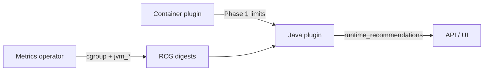

# Java & JVM Optimization

!!! warning "Status: Planned / Future Work"
    This feature is **not yet implemented**. The description below is the intended
    product direction for a future ROS-OCP release. Container, namespace, node, PVC,
    quota, and GPU recommendations remain available today.

!!! info "Quick Facts (planned)"
    **Scope:** JVM workloads on OpenShift (Spring Boot, Quarkus, WebSphere/Open Liberty, plain Java)  
    **Plugin:** `java` (Enrich phase — builds on container recommendations)  
    **Analysis windows:** Same as containers (1 / 7 / 15 days) with JVM warmup exclusion  
    **Gate:** `ROS_ENABLE_JVM_RECS` (off by default until release)  
    **Warmup exclusion:** First 45 minutes after pod start (configurable; shorter when InstantOn detected)  
    **Detection:** Dual-axis — JVM runtime (Hotspot vs OpenJ9/Semeru) × app framework (Liberty, Quarkus, Spring, plain)

---

## What it does

**Java & JVM Optimization** provides JVM-specific tuning recommendations for Java
applications running on OpenShift:

- **Heap sizing** — `MaxRAMPercentage` and effective heap limits aligned to real usage
- **Garbage collector selection** — Data-driven choice among Hotspot collectors (G1, ZGC, Shenandoah, Parallel, Serial) or OpenJ9 `-Xgcpolicy:` for Semeru
- **Thread pool configuration** — Liberty executor, Quarkus, and Spring worker counts matched to CPU limits
- **Container memory optimization** — Limits that account for metaspace, thread stacks, and native memory — not just the heap
- **Liberty JDBC pools** — Datasource pool sizing when MicroProfile Metrics `connectionpool.*` series are present

Recommendations appear **alongside** container right-sizing guidance in a
`runtime_recommendations` section on container detail — not a separate product silo.

**Why it matters:** Java is one of the most common languages on OpenShift, and
**container-level rightsizing alone routinely mis-tunes JVM apps** — causing OOMKills,
GC pauses, and wasted memory simultaneously.

---

## The problem — why Java is special

### JVM memory is not "one number"

The JVM divides process memory into regions that behave differently under load:

| Region | What it holds | Controlled by |
|--------|---------------|---------------|
| **Heap** | Application objects | `-Xmx`, `-XX:MaxRAMPercentage` |
| **Metaspace** | Class metadata | `-XX:MaxMetaspaceSize` (optional cap) |
| **Thread stacks** | ~1 MiB × thread count | Thread pools, framework defaults |
| **Code cache** | JIT compiled code | JVM ergonomics |
| **Direct buffers** | NIO, Netty, gRPC | Application code |
| **GC structures** | Collector overhead | Collector choice and heap size |

Generic container recommendations optimize **cgroup memory** as a single bucket.
That works for Go or Node when RSS ≈ working set. For Java, **heap is only part of the story**.

### Container OOMKill ≠ Java heap exhaustion

Kubernetes OOMKills the container when **total RSS** exceeds the cgroup limit — not when
the heap is full.

A common failure mode:

1. Container limit: **2 GiB**
2. `MaxRAMPercentage=80` → heap can grow to ~**1.6 GiB**
3. Metaspace grows to **200 MiB** after deployments
4. **50 threads** × ~1 MiB stack ≈ **50 MiB**
5. Code cache + GC + direct buffers add hundreds of MiB
6. **Working set exceeds 2 GiB** → **OOMKill** while heap shows **40–60%** used in metrics

**Raising MaxRAMPercentage makes this worse** — it steals cgroup budget from non-heap regions.

**The fix:** increase the **container limit** *or* **lower** MaxRAMPercentage to reserve cgroup space for non-heap.

### JVM ergonomics follow CPU limits

The JVM sets default parallelism (GC threads, ForkJoin pools, etc.) from
`Runtime.availableProcessors()`, which on Kubernetes equals the **CPU limit**.

| CPU limit | JVM assumption | Risk |
|-----------|----------------|------|
| 4 cores | 4 GC threads, modest pools | May under-utilize if request is low |
| 0.5 cores | 1 GC thread | Long GC pauses on multi-GB heap |
| 8 cores, Quarkus defaults | `core-threads` may follow cores | Under-threaded for I/O-heavy APIs |

Thread pool recommendations align framework defaults with **allocated CPU**, not node size.

### Warmup distorts short windows

For the first **30–45 minutes** after start:

- JIT compiles hot methods (CPU spike, code cache growth)
- Heap grows as caches warm
- GC patterns are not representative of steady state

ROS excludes this **warmup period** so recommendations reflect production behavior, not startup.

---

## The container OOMKill problem (detailed)

### Diagram in words

```
┌─────────────────────────────────────────────────────────────┐
│  Kubernetes cgroup memory limit: 2 GiB                       │
├─────────────────────────────────────────────────────────────┤
│  ┌─────────────────────────────────────────────────────┐  │
│  │ Heap (MaxRAMPercentage=80% → up to ~1.6 GiB)          │  │
│  │  Objects, caches, session state                       │  │
│  └─────────────────────────────────────────────────────┘  │
│  Metaspace (~200 MiB after deploy)                          │
│  Thread stacks (50 threads × ~1 MiB)                        │
│  Code cache (~100 MiB)                                      │
│  Direct buffers / native (variable)                         │
│  GC overhead                                                │
├─────────────────────────────────────────────────────────────┤
│  If sum > 2 GiB → OOMKill (even if heap chart shows 40%)   │
└─────────────────────────────────────────────────────────────┘
```

### Scenario walkthrough

**Symptoms:**

- Pod restarts with **OOMKilled**
- Prometheus shows heap peaked at **60%** of limit
- SRE raises `MaxRAMPercentage` from 50% → 75%
- OOMKills **increase**

**ROS diagnosis (planned):**

> *"3 OOMKills in 7 days. Peak heap **60%** of container limit. Peak non-heap **350 MiB**.
> Likely cause: **metaspace** or **direct buffer** growth. **Do not** raise MaxRAMPercentage.
> Recommend: container limit **2.5 GiB** OR MaxRAMPercentage **45%** with metaspace cap review."*

**Why it matters:** Misdiagnosed OOM loops waste weeks of tuning; the right lever is
often **container limit** or **thread/direct buffer** control, not heap percent.

---

## Recommendation types

### Heap sizing

Analyzes peak heap usage over your chosen window (after warmup exclusion) and recommends
`MaxRAMPercentage` (Hotspot) or equivalent heap fraction so the JVM uses cgroup memory efficiently.

**Example:**

> *"p95 heap usage **400 MiB** over 7 days. Container limit **2 GiB**. Recommend
> **MaxRAMPercentage=45%** (~900 MiB heap cap) — leaves **~1.1 GiB** for non-heap and headroom."*

**Why it matters:** FinOps saves memory; SRE avoids heap-driven OOM while preserving slack for metaspace.

**Output format (Hotspot):**

```
JDK_JAVA_OPTIONS="-XX:MaxRAMPercentage=45"
```

### Container memory

Combines heap target, non-heap peak, and safety margin when cgroup usage exceeds what heap tuning alone can fix.

**Example:**

> *"Total JVM footprint: heap p95 (**400 MiB**) + non-heap p95 (**350 MiB**) + 15% safety ≈ **860 MiB**.
> Recommend: reduce container limit from **2 GiB** → **1 GiB** (cost profile)."*

**Why it matters:** Paying for 2 GiB limits on 860 MiB workloads multiplies cost across hundreds of replicas.

### GC strategy

Uses GC pause percentiles and JDK/heap size rules to recommend a collector suited to your SLA.

**Example:**

> *"p95 GC pause **350 ms** on G1GC. JDK **21**, heap **6 GiB** qualifies for **ZGC Generational**.
> Expected improvement: p95 pause **< 10 ms** for latency-sensitive APIs."*

| Profile | Collector bias | When |
|---------|----------------|------|
| **Cost** | G1 / Parallel when pauses acceptable | Batch, internal tools |
| **Performance** | ZGC / Shenandoah when pauses high | User-facing APIs |

**OpenJ9 / Semeru:** Recommendations use `-Xgcpolicy:` instead of Hotspot `-XX:+Use*` flags.

### Thread pools (Liberty / Quarkus / Spring)

Aligns worker threads with CPU limits for frameworks that default to core count.
Output shape depends on the detected **framework** (not only the JVM vendor).

**Example (WebSphere / Open Liberty):**

> *"CPU limit **4 cores**. `Default_Executor` active threads p95 **14**, pool size **5**.
> Recommend increasing Liberty executor capacity (for example `maxThreads=16` in `server.xml`)
> — or raise the CPU limit if the pool is intentionally capped."*

```xml
<!-- Illustrative server.xml snippet -->
<executor id="default" name="Default Executor" maxThreads="16"/>
```

**Example (Quarkus):**

> *"CPU limit **4 cores**, Quarkus `core-threads=4`. Recommend **core-threads=8** for I/O-heavy REST
> (throughput profile) — or confirm CPU limit should be **2** if intentional."*

**Example (Spring Boot):**

> *"Tomcat `maxThreads=200` on **2 CPU** limit — thread contention likely. Recommend **maxThreads=50**
> aligned with CPU, or raise CPU limit if load requires 200 threads."*

### JDBC connection pools (Liberty)

When Liberty MicroProfile Metrics expose `connectionpool.*` (free/managed/queued connections),
ROS can recommend datasource `maxPoolSize` adjustments — for example when requests queue while
the pool is saturated, or when the pool is chronically oversized relative to concurrent load.

### OOM prevention / diagnosis

Classifies OOMKills where heap usage was low — pointing to non-heap causes.

**Example:**

> *"OOMKill with heap max **40%** of limit. Classification: **non_heap_oom**. Check
> `-XX:MaxMetaspaceSize`, direct buffer leaks, and thread pool growth."*

---

## Supported frameworks

Detection is **dual-axis**: JVM **runtime** (Hotspot vs OpenJ9/Semeru) is independent of app
**framework** (Liberty, Quarkus, Spring, plain). Heap and non-heap OOM math are shared;
GC flag shape follows the runtime; thread-pool and JDBC config output follow the framework.

### JVM runtime: OpenJDK Hotspot

**Full suite:** heap (`MaxRAMPercentage`), Hotspot GC flags (`-XX:+Use*`), thread hints (when metrics exist), container memory.

Common on many OpenShift application images (Spring Boot, Quarkus on Hotspot).

### JVM runtime: Eclipse OpenJ9 / IBM Semeru

**Adapted recommendations:** GC via `-Xgcpolicy:gencon` / `balanced` etc.; heap sizing with OpenJ9 ergonomics.

Same OOM anatomy — metaspace and stacks still matter. Official Open Liberty / WebSphere Liberty
container images commonly ship OpenJ9 (Semeru / IBM Small Footprint Java).

### WebSphere Liberty / Open Liberty (first-class)

**Heap + OpenJ9/Hotspot GC + Liberty executor + optional JDBC pool** guidance.

| Aspect | Planned behavior |
|--------|------------------|
| **Detection** | Image names/tags (`websphere-liberty`, `open-liberty`, `openj9`), Liberty vendor metrics, `jvm_info` |
| **Metrics** | MicroProfile Metrics `/metrics` (enable `mpMetrics`): base `memory.usedHeap` / `memory.maxHeap`, vendor `threadpool.*`, `connectionpool.*`, servlet/REST |
| **Config output** | `JDK_JAVA_OPTIONS` / OpenJ9 GC flags plus `server.xml` executor (and datasource pool) snippets |
| **InstantOn** | Checkpoint/restore shortens classic JIT warmup — use a shorter or adaptive warmup gate when InstantOn is detected |

Liberty does **not** get a separate heap algorithm. Oversized limits after a WAS → Liberty migration
are handled by the normal cost-engine container memory recommendations once steady-state metrics exist.

### Quarkus (JVM mode)

**Heap + GC + thread pool** with optional `application.properties` snippets:

```properties
quarkus.thread-pool.core-threads=8
quarkus.thread-pool.max-threads=32
```

### Quarkus Native (GraalVM)

**Different profile:** no heap tuning; **RSS-based container sizing** only.

Native image removes JVM heap/GC recommendations — container rightsizing remains primary.

### Spring Boot

**HTTP thread pools** (Tomcat/Undertow), connection pool advisories when metrics exposed, plus standard JVM tuning.

Actuator Prometheus endpoint is the typical metrics source.

### Plain Java

Standard JVM tuning from `jvm_*` (or equivalent) metrics; thread pool hints when executor metrics are present.

---

## Out of scope

ROS **does not** recommend platform migrations (for example traditional WebSphere Application Server →
WebSphere Liberty / Open Liberty). Migration depends on application compatibility, licensing, and
enterprise features that cannot be assessed from cgroup or JVM metrics alone.

For migration assessment, use IBM Transformation Advisor and Liberty migration guidance.
After workloads already run on Liberty, ROS focuses on rightsizing and Liberty runtime tuning.

---

## Cost vs performance tradeoff

ROS applies the same **dual-engine** model as containers:

| Aspect | Cost engine | Performance engine |
|--------|-------------|-------------------|
| Heap percentile | p95 | p99 / max |
| Container margin | ~15% | 25–50% |
| MaxRAMPercentage | Higher when safe | Lower for spike headroom |
| GC | Throughput-friendly if pauses OK | ZGC / Shenandoah when pauses high |
| Goal | Minimize memory $ | Minimize tail latency |

**How to choose:**

- **Batch processing, ETL, internal cron** → cost profile; accept higher GC pause if throughput is fine.
- **User-facing API, checkout, real-time** → performance profile; pay for headroom and low-latency GC.

You select the engine per recommendation the same way as [container right-sizing](../features/container-recommendations.md) — see [Dual engine](../features/dual-engine.md).

---

## Warmup handling

| Setting | Default | Purpose |
|---------|---------|---------|
| `ROS_JVM_WARMUP_MINUTES` | 45 | Exclude samples after pod start |

**What we exclude:** First N minutes after each pod start in the observation window.

**What you still get:** Steady-state heap, GC pause, and thread metrics for rightsizing.

**Liberty InstantOn:** Checkpoint/restore avoids much of the classic JIT warmup. When InstantOn
(or equivalent) is detected, ROS should use a **shorter or adaptive** warmup exclusion rather than
always applying the full 45-minute default.

**Customer message:**

> *"Recommendations based on steady-state behavior (warmup excluded). If you deploy
> frequently, ensure medium/long terms include enough post-warmup hours."*

---

## How it works



1. **Detection** — JVM workloads identified when workload scrape data includes JVM/Liberty metrics
   (`jvm_*`, MicroProfile `memory.*` / `threadpool.*`, and/or image signals). Runtime and framework
   are classified independently.
2. **Warmup exclusion** — Post-start samples dropped from percentile calculations (adaptive for InstantOn).
3. **Analysis** — Heap, non-heap, GC pause, thread (and Liberty JDBC) signals over container term windows.
4. **Enrichment** — JVM tuning attached to container recommendation detail; CPU/memory recs remain the base layer.

Without JVM metrics, ROS will **not** emit high-confidence JVM guidance (heuristic-only mode is **not** planned for initial release).

---

## What you'll see in the API

JVM recommendations enrich **container detail** responses (planned shape):

```json
{
  "container": "order-api",
  "project": "commerce",
  "workload": "order-api",
  "recommendations": {
    "medium_term": {
      "cost": {
        "config": {
          "requests": {
            "cpu": {"amount": 0.5, "format": "cores"},
            "memory": {"amount": 1, "format": "GiB"}
          }
        },
        "runtime_recommendations": {
          "runtime": "openj9",
          "framework_detected": "liberty",
          "jdk_version": "21",
          "confidence": 0.92,
          "items": [
            {
              "category": "heap",
              "tunable": "MaxRAMPercentage",
              "current_value": "80",
              "recommended_value": "45",
              "formatted_flag": "-XX:MaxRAMPercentage=45",
              "rationale": "p95 heap 400 MiB; reserve cgroup space for non-heap"
            },
            {
              "category": "gc",
              "tunable": "collector",
              "current_value": "gencon",
              "recommended_value": "balanced",
              "formatted_flag": "-Xgcpolicy:balanced",
              "rationale": "p95 pause exceeds threshold on OpenJ9; latency profile"
            },
            {
              "category": "threads",
              "tunable": "liberty.executor.maxThreads",
              "current_value": "5",
              "recommended_value": "16",
              "formatted_flag": "executor maxThreads=16",
              "rationale": "Default_Executor active p95 14 on 4 CPU limit"
            },
            {
              "category": "container_memory",
              "tunable": "memory_limit",
              "current_value": "2Gi",
              "recommended_value": "1Gi",
              "rationale": "heap + non-heap p95 + 15% margin"
            }
          ],
          "oom_diagnosis": null
        }
      }
    }
  }
}
```

**OOM example** (`oom_diagnosis` populated):

```json
"oom_diagnosis": {
  "classification": "non_heap_oom",
  "oom_count_7d": 3,
  "heap_max_pct_of_limit": 0.60,
  "message": "OOMKill with low heap usage — increase container limit or reduce MaxRAMPercentage; check metaspace"
}
```

| Field | Meaning |
|-------|---------|
| `runtime` | JVM runtime: `hotspot`, `openj9` (Semeru / IBM SFJ), or `native` |
| `framework_detected` | App framework: `liberty`, `quarkus`, `spring`, `plain` (independent of runtime) |
| `confidence` | Based on data days and metric completeness |
| `formatted_flag` | Copy-paste for Deployment env, JVM options, or `server.xml` |
| `category` | heap, gc, threads, jdbc, container_memory, oom |

---

## Prerequisites

| Requirement | Why |
|-------------|-----|
| **JVM / runtime metrics endpoint** | App exposes Prometheus metrics (Micrometer Actuator, Quarkus `/q/metrics`, Liberty `/metrics` with `mpMetrics`, or JMX exporter sidecar) |
| **User Workload Monitoring (UWM)** | Cluster allows scraping workload metrics into the operator pipeline |
| **Container recommendations** | Java plugin runs in **Enrich** phase after container **Produce** |
| **JDK / framework metrics** | Heap, GC, threads (and Liberty vendor metrics when applicable) |

**Liberty:** Enable the MicroProfile Metrics feature (`mpMetrics`) so `/metrics` is scrapeable; without it,
ROS may detect a Liberty image but will not emit high-confidence Liberty runtime items.

**Without JVM metrics:** recommendations fall back to **container-level analysis only** with **no** `runtime_recommendations` block — lower confidence for Java tuning.

### Metric checklist (Micrometer / Prometheus)

| Metric family | Used for |
|---------------|----------|
| `jvm_memory_used_bytes{area="heap"}` | Heap sizing |
| `jvm_memory_used_bytes{area="nonheap"}` or metaspace series | Container memory, OOM class |
| `jvm_gc_pause_seconds` | GC strategy |
| `jvm_threads_live` | Thread/stack pressure |
| `jvm_info` | JDK version / vendor for GC rules |

### Metric checklist (Liberty MicroProfile Metrics aliases)

Ingest normalizes these to the same digest fields as Micrometer where possible:

| Metric family | Used for |
|---------------|----------|
| `memory.usedHeap` / `memory.maxHeap` / `memory.heapUtilization` | Heap sizing |
| `gc.time` / `gc.time.per.cycle` / `gc.total` | GC strategy |
| `threadpool.activeThreads` / `threadpool.size` | Liberty executor sizing |
| `connectionpool.*` | JDBC pool sizing |
| servlet / REST request metrics | Load context for thread recommendations |

---

## Configuration

Same **three-tier** model as other ROS features:

| Variable | Default | Purpose |
|----------|---------|---------|
| `ROS_ENABLE_JVM_RECS` | `false` | Master feature gate |
| `ROS_JVM_WARMUP_MINUTES` | `45` | Exclude post-start samples |
| `ROS_JVM_MIN_RAM_PERCENT` | `50` | Floor for MaxRAMPercentage |
| `ROS_JVM_MAX_RAM_PERCENT` | `90` | Ceiling for MaxRAMPercentage |
| `ROS_JVM_GC_PAUSE_HIGH_MS` | `200` | Pause threshold for low-latency GC bias |
| `ROS_JVM_NON_HEAP_FACTOR` | `1.20` | Safety margin on container memory |

**Settings API:** `GET/PUT/DELETE .../settings/ros/thresholds/?recommendation_type=java`

See [Configurable thresholds](../features/configurable-thresholds.md).

---

## Related documentation

| Document | Scope |
|----------|-------|
| [Container Right-Sizing](../features/container-recommendations.md) | Base CPU/memory recommendations JVM builds on |
| [Dual Engine (Cost vs Performance)](../features/dual-engine.md) | Cost vs performance profiles |
| [Configurable Thresholds](../features/configurable-thresholds.md) | Settings API and precedence |
| [Plugin Execution Phases](../architecture/plugin-phases.md) | Enrich-phase placement |
| Internal design | [`docs/design/java-recommendations.md`](https://github.com/pgarciaq/ros-ocp-backend/blob/{{ git_branch }}/docs/design/java-recommendations.md) |
| [Open Liberty monitoring metrics](https://openliberty.io/docs/latest/introduction-monitoring-metrics.html) | `/metrics`, MP Metrics, JMX |
| [Open Liberty metrics reference](https://openliberty.io/docs/latest/metrics-list.html) | Base/vendor metric names |
| [Open Liberty container images](https://openliberty.io/docs/latest/container-images.html) | OpenJ9 image tags |
