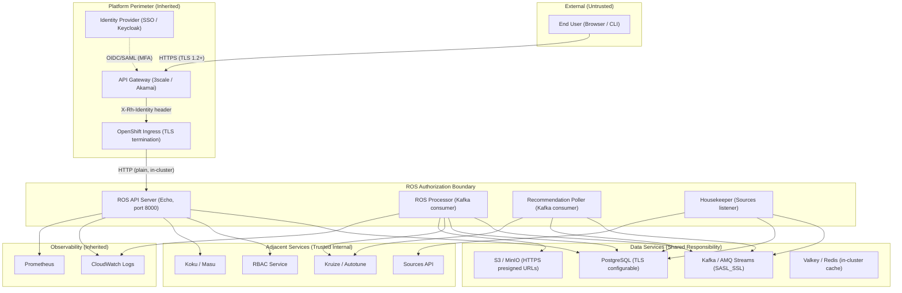
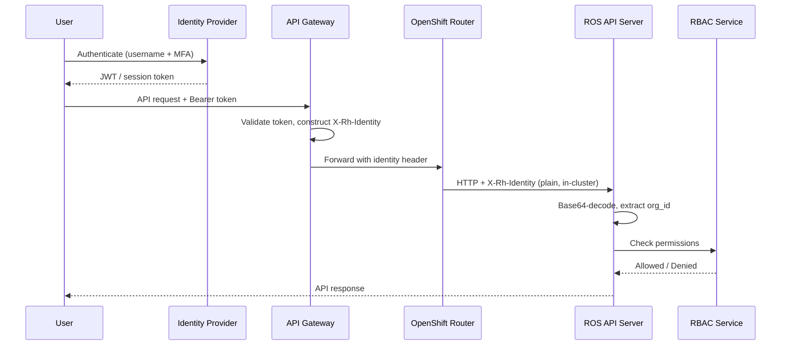

# Compliance Architecture

This page documents the security architecture of ROS-OCP Backend from a compliance
perspective: system boundaries, trust relationships, data flows, cryptographic
protections, and inherited controls.

---

## System Boundary

The authorization boundary encompasses all ROS application components. Infrastructure
services and platform controls sit outside the boundary and are inherited.



---

## Identity Trust Chain

ROS does not perform cryptographic signature verification on the identity header.
Instead, it relies on a **perimeter defense model** where the API gateway is the
sole ingress point and NetworkPolicy prevents bypass.



**Why no JWT verification at the service layer:**

1. The gateway strips any externally-supplied `X-Rh-Identity` header
2. NetworkPolicy ensures only the ingress route can reach the API pods
3. Adding JWT verification would require key management infrastructure for
   no security benefit in this topology
4. This is a documented, accepted risk with bounded exposure

---

## Data Flow Inventory

| # | Source | Destination | Protocol | Auth | TLS |
|---|--------|-------------|----------|------|-----|
| 1 | End User | API Gateway | HTTPS | Bearer token | Yes (1.2+) |
| 2 | API Gateway | ROS API | HTTP | X-Rh-Identity | No (in-cluster) |
| 3 | ROS API | PostgreSQL | TCP/5432 | Username/password | Configurable |
| 4 | ROS Processor | Kafka | TCP/9093 | SASL (SCRAM-SHA-512) | Yes (SASL_SSL) |
| 5 | ROS Processor | S3/MinIO | HTTPS | Presigned URL | Yes |
| 6 | ROS Processor | Kruize | HTTP/8080 | None (pod-to-pod) | No (in-cluster) |
| 7 | ROS API | RBAC Service | HTTP | X-Rh-Identity passthrough | No (in-cluster) |
| 8 | ROS API | Koku/Masu | HTTP | Service account | No (in-cluster) |
| 9 | ROS (all) | CloudWatch | HTTPS | IAM credentials | Yes |
| 10 | Prometheus | ROS API | HTTP/5005 | None (scrape) | No (in-cluster) |

---

## TLS Termination Boundary

```
Internet ──[TLS 1.2+]──> OpenShift Route ──[plain HTTP]──> ROS Pod (port 8000)
```

The ROS API server runs plain HTTP internally. TLS is terminated at the platform
layer:

| Deployment | TLS Terminator | Certificate Source |
|------------|---------------|-------------------|
| SaaS (console.redhat.com) | OpenShift Router (HAProxy) | Let's Encrypt / Red Hat managed |
| On-Prem (cost-onprem chart) | OpenShift Route (edge) | OpenShift ingress controller CA |
| On-Prem (OAuth2 Proxy) | OAuth2 Proxy sidecar | OpenShift service-serving CA |

**Pod-to-pod encryption:**

| Deployment | Mechanism |
|------------|-----------|
| SaaS (OSD/ROSA) | OVN-Kubernetes IPsec (all traffic encrypted at network layer) |
| On-prem (SNO) | Single-node — no network hops |
| On-prem (multi-node) | NetworkPolicy isolation; optional Istio/service mesh for mTLS |

---

## FIPS 140-2/3 Cryptographic Protection

ROS achieves FIPS-validated cryptography through Red Hat's standard approach —
no application code changes required.

| Layer | Mechanism |
|-------|-----------|
| **Build image** | UBI10 `go-toolset:1.25` with `golang-fips` patches |
| **Runtime image** | UBI9 `ubi-minimal` with OpenSSL 3.0 (FIPS-validated module) |
| **OS FIPS mode** | Kernel parameter `fips=1` on OpenShift nodes |
| **Application** | Go stdlib crypto transparently routed to OpenSSL via `golang-fips` |

**How it works:**

1. Red Hat's Go toolset compiles with `golang-fips` patches
2. `CGO_ENABLED=1` enables dynamic linking to system OpenSSL
3. At runtime, the binary detects `/proc/sys/crypto/fips_enabled`
4. When FIPS mode is active, all crypto routes to the FIPS-validated OpenSSL module
5. Non-compliant algorithms (MD5, unapproved curves) are disabled

**Verification:**

```bash
# On the OpenShift node:
cat /proc/sys/crypto/fips_enabled  # Expected: 1

# Inside a running ROS pod:
oc exec deployment/ros-api -- cat /proc/sys/crypto/fips_enabled
```

!!! note "Operational Requirement"
    FIPS activation requires the target OpenShift cluster to have FIPS mode
    enabled at the OS level (`fips=1` kernel parameter on RHCOS nodes). This is
    standard for FedRAMP deployments and is a platform operator responsibility.

---

## Inherited Controls

These controls are **not implemented by ROS** but inherited from the platform:

| Control | NIST ID | Inherited From | Evidence |
|---------|---------|---------------|----------|
| Multi-factor authentication | IA-2(1) | Identity Provider | IdP enforces MFA before issuing tokens |
| Log integrity | AU-9 | CloudWatch / Splunk | Encrypted at rest, IAM-restricted access |
| Log retention | AU-11 | CloudWatch lifecycle | Platform-managed retention policy |
| SIEM integration | AU-6(1) | Platform SRE | Cluster log forwarder to central SIEM |
| Encryption at rest (DB) | SC-28 | PostgreSQL volume | LUKS/EBS encryption |
| Encryption at rest (etcd) | SC-28 | OpenShift | Kubernetes secrets encrypted at rest |
| Encryption at rest (Kafka) | SC-28 | Managed Kafka | Encrypted broker volumes |
| Network segmentation | SC-7 | OpenShift SDN | Helm chart NetworkPolicy (deny-all + allow rules) |
| Vulnerability scanning | RA-5 | Quay.io / Clair | Automated CVE scanning on image push |
| Patch management | SI-2 | UBI image updates | Red Hat publishes security patches |
| Physical security | PE-* | Data center | SOC 2 Type II certified facilities |
| Personnel security | PS-* | Organization | Background checks per policy |
| Contingency planning | CP-* | Platform SRE | PostgreSQL backup/restore; Kafka replication |

---

## Control Family Implementation Status

| Family | Controls Assessed | Implemented | Inherited | Shared | Open Items |
|--------|-------------------|-------------|-----------|--------|------------|
| AC (Access Control) | 5 | 2 | 1 | 0 | 2 |
| AU (Audit) | 5 | 1 | 2 | 0 | 2 |
| CM (Configuration) | 5 | 3 | 0 | 0 | 2 |
| IA (Identification) | 4 | 1 | 2 | 1 | 0 |
| IR (Incident Response) | 4 | 1 | 0 | 0 | 3 |
| PL (Planning) | 1 | 1 | 0 | 0 | 0 |
| RA (Risk Assessment) | 4 | 2 | 1 | 0 | 1 |
| SC (System & Comms) | 6 | 2 | 2 | 2 | 0 |
| SI (System Integrity) | 3 | 1 | 2 | 0 | 0 |

---

## Accepted Risks

The following architectural decisions are documented as accepted risks with
bounded exposure:

| Risk | Rationale | Mitigation |
|------|-----------|------------|
| No JWT signature verification on identity header | Gateway is sole entry; NetworkPolicy prevents bypass | Monitor for unauthorized ingress |
| Pod-to-pod traffic unencrypted (without mesh) | NetworkPolicy isolation; same-namespace only | Deploy service mesh for defense-in-depth |
| Valkey/Redis cache unencrypted | In-memory only; caches RBAC (not secrets) | NetworkPolicy restricts access |
| Kruize communication unencrypted | Same-namespace; data is usage metrics (not PII) | Enable mTLS with service mesh |
| RBAC cache staleness (60s TTL) | Bounded revocation window | Acceptable for non-safety-critical decisions |

---

## Machine-Readable Artifacts

For automated compliance tooling (Trestle, OSCAL CLI, GRC platforms), the
following OSCAL v1.1.3 artifacts are maintained in the repository:

- **Component Definition** — `docs/fedramp/oscal/component-definition.json`
- **Plan of Action & Milestones** — `docs/fedramp/oscal/plan-of-action-and-milestones.json`

These can be consumed by [compliance-trestle](https://github.com/oscal-compass/compliance-trestle)
or [OSCAL CLI](https://github.com/usnistgov/oscal-cli) for validation and
integration with organizational GRC workflows.
