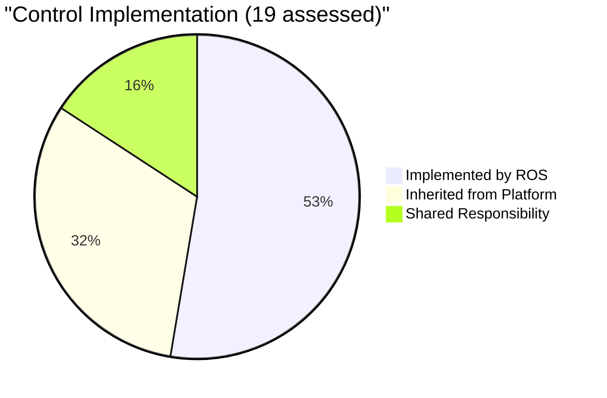
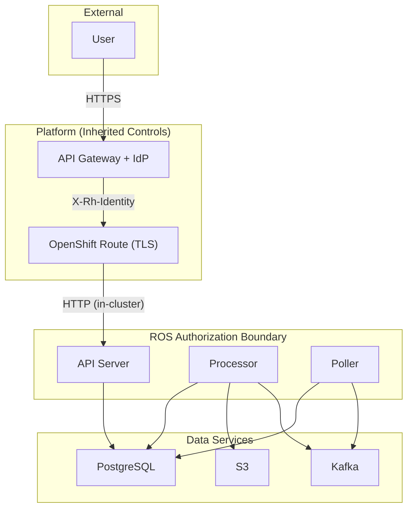

# Security & Compliance

ROS-OCP Backend is **FedRAMP-aligned** — engineered to satisfy NIST SP 800-53
Rev 5 controls at the FedRAMP Moderate (Class C) baseline. When deployed on
Red Hat's managed platform (console.redhat.com), the service operates within
an existing FedRAMP Authorization boundary. For on-premise deployments, this
documentation provides the guidance needed to achieve equivalent security posture.

---

## What "FedRAMP-Aligned" Means

| Term | Meaning | Applies to ROS? |
|------|---------|-----------------|
| **FedRAMP Authorized** | Active Authority to Operate (ATO) from a federal agency or JAB | Platform-level (Red Hat SaaS) |
| **FedRAMP Compliant** | Formally assessed by a 3PAO and meets all baseline requirements | Not independently assessed |
| **FedRAMP Aligned** | Architecture, controls, and practices follow NIST 800-53 / FedRAMP guidance | **Yes** |

We use "aligned" because ROS is an application component, not a standalone cloud
service. It implements application-layer controls and inherits infrastructure
controls from the deployment platform.

---

## Security Posture at a Glance

| Property | Status | How |
|----------|--------|-----|
| Cryptography | FIPS 140-2/3 validated | Red Hat `golang-fips` + UBI9 OpenSSL 3.0 |
| Access Control | RBAC enforced | Middleware validates permissions via RBAC service |
| Encryption in Transit | TLS 1.2+ | Platform route termination + DB/Kafka TLS validation |
| Input Validation | Defense-in-depth | CSV injection sanitization, SSRF blocking, host allowlists |
| Audit Logging | Structured JSON | org_id, request_id, method, status in every log entry |
| Startup Enforcement | Graduated model | Fatal in SaaS; Warn on-prem; configurable via `ROS_SECURITY_ENFORCE` |
| Supply Chain | UBI base images | Quay.io CVE scanning, RHEL STIG-aligned runtime |

---

## Authorization Boundary (Simplified)

The ROS authorization boundary contains the API server, Kafka processor, and
recommendation poller. Everything outside this boundary — identity providers,
TLS termination, network segmentation, encryption at rest — is inherited from
the platform.

---

## Deployment Modes

| Mode | Security Posture | Controls |
|------|-----------------|----------|
| **SaaS** (console.redhat.com) | Covered by platform ATO | All controls inherited or implemented; FIPS enforced; fatal security enforcement |
| **On-Prem** (cost-onprem chart) | Operator responsibility | Warn-level enforcement by default; [Hardening Guide](hardening-guide.md) provides step-by-step path to full compliance |
| **Development** | No enforcement | All security checks skipped; never deploy to production |

---

## Compliance Artifacts

The following machine-readable and human-readable artifacts are maintained:

| Artifact | Format | Purpose |
|----------|--------|---------|
| [Component Definition](https://github.com/pgarciaq/ros-ocp-backend/blob/pgarciaq-rosocp-superpowers-phase15/docs/fedramp/oscal/component-definition.json) | OSCAL JSON v1.1.3 | 19 control-to-implementation mappings |
| [Plan of Action & Milestones](https://github.com/pgarciaq/ros-ocp-backend/blob/pgarciaq-rosocp-superpowers-phase15/docs/fedramp/oscal/plan-of-action-and-milestones.json) | OSCAL JSON v1.1.3 | 13 open findings with remediation plans |
| [Compliance Architecture](compliance-architecture.md) | Documentation | Trust model, data flows, inherited controls |
| [Hardening Guide](hardening-guide.md) | Documentation | Operator deployment checklist |

---

## NIST 800-53 Control Family Coverage

| Family | Description | ROS Coverage |
|--------|-------------|--------------|
| **AC** | Access Control | RBAC middleware, graduated enforcement, permission caching |
| **AU** | Audit & Accountability | Structured logging, request correlation, CloudWatch integration |
| **CM** | Configuration Management | Startup validation, STIG-aligned base image, SCAP mapping |
| **IA** | Identification & Authentication | Identity header trust model, service account validation, dev token enforcement |
| **IR** | Incident Response | Rate limiting, metrics exposition (alerting is platform responsibility) |
| **PL** | Planning | System boundary documentation, OSCAL artifacts |
| **RA** | Risk Assessment | FIPS 199 categorization, NIST 800-30 risk analysis, adversarial reviews |
| **SC** | System & Communications | FIPS crypto, TLS enforcement, SSRF protection, network segmentation |
| **SI** | System & Information Integrity | CSV sanitization, input validation, UBI patching, vulnerability scanning |

---

## Next Steps

- [Compliance Architecture](compliance-architecture.md) — full technical deep-dive
  with diagrams, data flows, and inherited controls
- [Hardening Guide](hardening-guide.md) — step-by-step instructions for achieving
  FedRAMP-equivalent security in on-premise deployments
