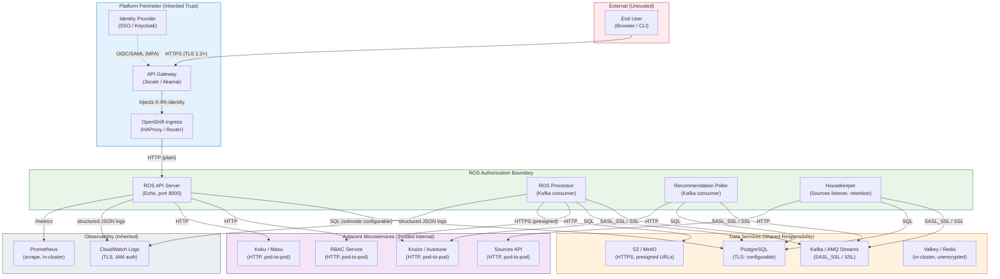
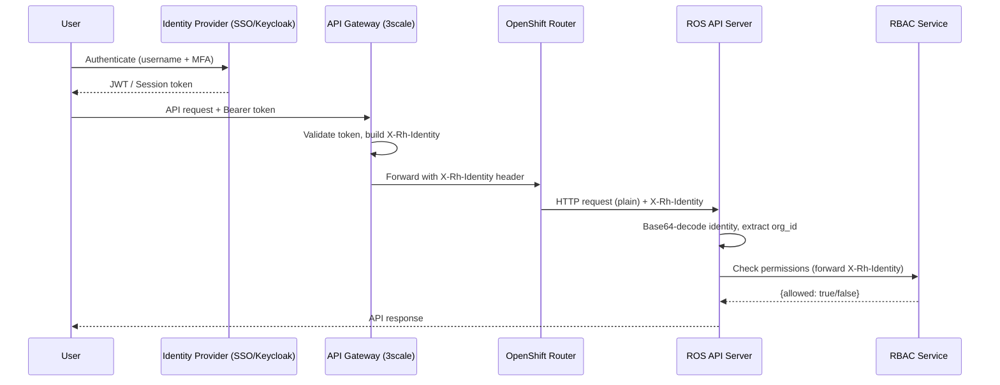

# System Boundary, Trust Model, and Inherited Controls

This document defines the authorization boundary for `ros-ocp-backend` (Resource
Optimization Service), the trust relationships with adjacent systems, and controls
inherited from the platform layer.

**Last updated:** 2026-07-05  
**Applicable deployments:** SaaS (console.redhat.com) and On-Prem (cost-onprem chart)

---

## System Boundary Diagram



---

## Data Flow Inventory

| # | Source | Destination | Protocol | Data Classification | Auth Mechanism | TLS |
|---|--------|-------------|----------|--------------------|-----------------|----|
| 1 | End User | API Gateway | HTTPS | Requests (public) | None at this hop | Yes (1.2+) |
| 2 | API Gateway | ROS API | HTTP | Requests + `X-Rh-Identity` | Gateway-injected identity | No (in-cluster) |
| 3 | ROS API | PostgreSQL | TCP/5432 | Recommendations, settings, org data | Username/password | Configurable (`sslmode`) |
| 4 | ROS Processor | Kafka | TCP/9093 | Upload events (manifest URLs) | SASL (SCRAM-SHA-512) | Yes (SASL_SSL) |
| 5 | ROS Processor | S3/MinIO | HTTPS/443 | CSV report files (usage data) | Presigned URL (time-limited) | Yes |
| 6 | ROS Processor | Kruize | HTTP/8080 | Experiment creation, recommendations | None (pod-to-pod trust) | No (in-cluster) |
| 7 | ROS API | RBAC Service | HTTP | Permission checks (org, account) | `X-Rh-Identity` passthrough | No (in-cluster) |
| 8 | ROS API | Koku/Masu | HTTP | Effective cost rates, reship triggers | `X-Rh-Identity` or service account | No (in-cluster) |
| 9 | ROS Housekeeper | Sources API | HTTP | Source registration/validation | `X-Rh-Identity` or service account | No (in-cluster) |
| 10 | ROS (all) | CloudWatch | HTTPS/443 | Structured JSON logs | IAM Access Key + Secret | Yes |
| 11 | Prometheus | ROS API | HTTP/5005 | Metrics scrape (Prometheus format) | None (in-cluster NetworkPolicy) | No |
| 12 | ROS API | Valkey/Redis | TCP/6379 | RBAC permission cache | None (in-cluster) | No |

---

## Trust Model

### Identity Trust Chain



### Trust Boundaries

| Boundary | What We Trust | Why | Risk if Compromised |
|----------|--------------|-----|---------------------|
| **Platform Gateway → ROS** | `X-Rh-Identity` header is authentic | Gateway is sole origin; strips external headers | Tenant impersonation, cross-org data access |
| **ROS → RBAC** | RBAC responses are authoritative | Same-namespace pod-to-pod; NetworkPolicy isolates | Authorization bypass |
| **ROS → PostgreSQL** | Database returns correct data | Direct connection with credentials; no intermediary | Data tampering, exfiltration |
| **ROS → Kafka** | Messages on `hccm.ros.events` are from ingress service | Topic ACLs restrict producers; SASL auth | Malicious payload injection |
| **ROS → S3 (presigned URLs)** | URL points to authentic report data | URL signed by ingress service with time-limited token | SSRF (mitigated by `ROS_CSV_ALLOWED_HOSTS`) |
| **ROS → Kruize** | Kruize returns correct recommendations | Same-namespace; no external reachability | Incorrect recommendations (integrity, not confidentiality) |
| **ROS → Koku/Masu** | Cost rate data is accurate | Same-namespace; authenticated with service account | Incorrect savings estimates |

### Identity Header: `X-Rh-Identity`

The service does **not** perform cryptographic signature verification on the
identity header. This is by design:

1. **Perimeter defense model:** The API gateway (3scale/Akamai) is the only
   ingress point. It validates the user's JWT against the IdP, constructs the
   `X-Rh-Identity` JSON payload, base64-encodes it, and injects it as a header.

2. **Header stripping:** The gateway strips any externally-supplied
   `X-Rh-Identity` header before forwarding. An external attacker cannot inject
   a forged identity.

3. **Internal trust:** Within the cluster, all pod-to-pod communication is
   restricted by NetworkPolicy. Only the ingress route can reach the API pods.

4. **Trade-off accepted:** Cryptographic verification (e.g., JWT signature
   checking) would add latency and key management complexity for no security
   benefit in the current deployment topology. This is documented as an accepted
   risk in the risk assessment.

**On-prem variant:** In on-prem deployments with OAuth2 Proxy (Keycloak), the
proxy performs JWT validation and injects the identity header. The same trust
model applies — ROS trusts the header from the proxy sidecar.

### Multi-Factor Authentication (MFA)

MFA is an **inherited control** from the Identity Provider:

| Deployment | MFA Provider | Mechanism |
|------------|-------------|-----------|
| SaaS (console.redhat.com) | Red Hat SSO (Keycloak) | TOTP, WebAuthn, Red Hat account MFA policy |
| On-prem | Customer IdP (Keycloak/RHBK) | Customer-configured (TOTP, FIDO2, etc.) |

ROS cannot verify or enforce MFA at the service layer. The `X-Rh-Identity` header
does not carry an MFA claim. MFA enforcement is the responsibility of the IdP
and is documented as inherited in the SSP.

---

## TLS Boundary

### Where TLS Terminates

```
Internet ──[TLS]──> OpenShift Route ──[plain HTTP]──> ROS Pod (port 8000)
```

The ROS API server runs **plain HTTP** internally. TLS is terminated at:

| Deployment | TLS Terminator | Certificate Source |
|------------|---------------|-------------------|
| SaaS | OpenShift Router (HAProxy) | Let's Encrypt / Red Hat managed |
| On-prem | OpenShift Route (edge termination) | OpenShift ingress controller CA |
| On-prem (OAuth2 Proxy) | OAuth2 Proxy sidecar | OpenShift service-serving CA |

### Pod-to-Pod Encryption

| Deployment | Mechanism | Coverage |
|------------|-----------|----------|
| SaaS (OSD/ROSA) | OVN-Kubernetes IPsec (cluster-wide) | All pod traffic encrypted at network layer |
| On-prem (SNO) | Single-node — no network hops | N/A (loopback only) |
| On-prem (multi-node) | Customer responsibility | NetworkPolicy isolation; optional Istio/mTLS |

### Mutual TLS Between Microservices

ROS does **not** enforce mutual TLS (mTLS) at the application layer. Service
authentication relies on:

1. **NetworkPolicy:** Only pods within the same namespace can communicate.
   External namespaces are denied by default Helm chart NetworkPolicy.
2. **Service accounts:** Internal endpoints (`/internal/tags/sync`,
   `/internal/recalculate-savings`) require bearer token auth
   (`ROS_INTERNAL_TAGS_AUTH_REQUIRED=true`) validated via Kubernetes TokenReview.
3. **Platform mesh (optional):** If Istio/OpenShift Service Mesh is deployed,
   mTLS is enforced transparently at the sidecar level. ROS is mesh-compatible
   (no TLS termination conflicts).

This is documented as a shared responsibility: the platform provides network
isolation, the application provides identity verification for sensitive endpoints.

---

## FIPS Cryptographic Protection

### How FIPS Is Achieved

| Layer | Mechanism | Responsibility |
|-------|-----------|---------------|
| **Build image** | UBI10 `go-toolset:1.25` with `golang-fips` patches | Red Hat (image publisher) |
| **Runtime image** | UBI9 `ubi-minimal` with OpenSSL 3.0 (FIPS-validated module) | Red Hat (image publisher) |
| **OS FIPS mode** | Kernel parameter `fips=1` on OpenShift nodes | Platform operator |
| **Application** | No manual crypto — uses Go stdlib (transparently patched by `golang-fips`) | Automatic |

### FIPS Activation Requirements

FIPS cryptography is activated when **all** conditions are met:

1. Container built with Red Hat's `golang-fips`-patched Go toolchain (satisfied by UBI go-toolset)
2. Runtime base image includes FIPS-validated OpenSSL 3.0 module (satisfied by UBI9-minimal)
3. OpenShift node has `fips=1` kernel parameter (operator responsibility)
4. RHCOS/RHEL 9 is in FIPS mode (`/proc/sys/crypto/fips_enabled` = `1`)

**When FIPS mode is active:**
- TLS connections (DB, Kafka, S3) use only FIPS-approved ciphersuites
- Random number generation uses the FIPS DRBG
- Non-compliant algorithms (MD5, non-approved curves) are disabled

**Verification:**
```bash
# On an OpenShift node:
cat /proc/sys/crypto/fips_enabled  # Should output: 1

# In a running ROS pod:
oc exec deployment/ros-api -- cat /proc/sys/crypto/fips_enabled
```

---

## Inherited Controls

Controls that are **not implemented by ROS** but inherited from the platform:

| Control | NIST ID | Inherited From | Evidence |
|---------|---------|---------------|----------|
| Audit policy and procedures | AU-1 | Platform Security Team (console.redhat.com SSP) | Audit policy, roles, and review cadence defined in platform FedRAMP SSP; ROS inherits by deploying on an authorized platform |
| Audit events definition | AU-2 | Platform Security Team + ROS (shared) | Platform defines auditable event categories; ROS emits structured JSON logs (org_id, request_id, method, URI, status) to stdout; platform ships/retains them |
| Multi-factor authentication | IA-2(1) | Identity Provider (Keycloak/SSO) | IdP enforces MFA policy before issuing tokens |
| Log integrity (tamper-evidence) | AU-9 | CloudWatch / Splunk | AWS CloudWatch encrypts logs at rest (AES-256); IAM restricts write access |
| Log retention and lifecycle | AU-11 | CloudWatch / S3 lifecycle | CloudWatch log group retention policy (platform-managed) |
| SIEM integration | AU-6(1) | Platform SRE (Splunk/ELK) | Logs forwarded to central SIEM by cluster-level log forwarder |
| Encryption at rest (database) | SC-28 | PostgreSQL volume (LUKS/dm-crypt) or EBS encryption | RDS uses AES-256; on-prem uses LUKS-encrypted PV or ODF |
| Encryption at rest (etcd) | SC-28 | OpenShift etcd encryption | Kubernetes secrets encrypted at rest in etcd (platform-managed) |
| Encryption at rest (Kafka) | SC-28 | Kafka broker disk encryption | Managed Kafka (MSK/AMQ) uses encrypted volumes |
| Network segmentation | SC-7 | OpenShift NetworkPolicy + SDN | Helm chart deploys deny-all ingress + explicit allow rules |
| Vulnerability scanning (images) | RA-5 | Quay.io / Clair | Automated CVE scanning on every image push |
| Patch management (base image) | SI-2 | UBI image updates | Red Hat publishes security patches; Dockerfile uses `ubi-minimal:latest` |
| Physical security | PE-* | Data center operator (AWS/customer) | SOC 2 Type II certified facilities |
| Personnel security | PS-* | Red Hat HR / Customer HR | Background checks per organizational policy |
| Contingency planning | CP-* | Platform SRE | Backup/restore procedures for PostgreSQL; Kafka replication |

---

## Deployment-Specific Trust Differences

| Aspect | SaaS (console.redhat.com) | On-Prem (cost-onprem chart) |
|--------|--------------------------|----------------------------|
| Identity source | 3scale + Red Hat SSO | OAuth2 Proxy + Customer Keycloak |
| MFA enforcement | Red Hat SSO policy (mandatory for admins) | Customer IdP policy |
| TLS termination | Managed OpenShift Router | OpenShift Route (self-signed or customer CA) |
| DB encryption in transit | `sslmode=verify-full` (RDS) | Configurable (may be `disable` for same-pod DB) |
| Kafka encryption | SASL_SSL (MSK managed) | Configurable (AMQ Streams with TLS or plaintext) |
| Log destination | CloudWatch (IAM-protected) | Stdout → cluster log forwarder (customer-managed) |
| Image scanning | Quay.io + Tekton pipeline | Customer's CI/CD pipeline |
| Network isolation | OVN-Kubernetes + NetworkPolicy | NetworkPolicy + customer SDN |
| FIPS mode | Always (OSD/ROSA nodes are FIPS-enabled) | Customer responsibility (`fips=1` on nodes) |

---

## Accepted Risks

| Risk | Rationale | Mitigation |
|------|-----------|------------|
| No cryptographic verification of `X-Rh-Identity` | Gateway is sole entry; NetworkPolicy prevents bypass | Monitor for unauthorized ingress; alert on identity anomalies |
| Pod-to-pod traffic unencrypted (without mesh) | NetworkPolicy isolation; same-namespace-only communication | Deploy Istio/service mesh for defense-in-depth |
| Valkey/Redis cache unencrypted | In-memory only; same-pod or same-namespace; caches RBAC (not secrets) | NetworkPolicy restricts access to ROS pods only |
| Kruize communication unencrypted | Same-namespace; data is usage metrics (not PII) | Enable mTLS if service mesh is deployed |
| RBAC cache staleness (60s TTL) | Revocations take up to 60s to propagate | Acceptable for non-safety-critical authorization decisions |

---

## References

- [Security Enforcement at Startup](../operations/security-enforcement.md) — runtime enforcement of TLS and auth settings
- [FIPS 199 Security Categorization](security-categorization.md) — system impact levels
- [Risk Assessment](risk-assessment.md) — threat/vulnerability analysis
- [STIG Baseline Mapping](stig-baseline-mapping.md) — container hardening
- [FedRAMP Gap Assessment](fedramp-audit-v1.md) — comprehensive findings
