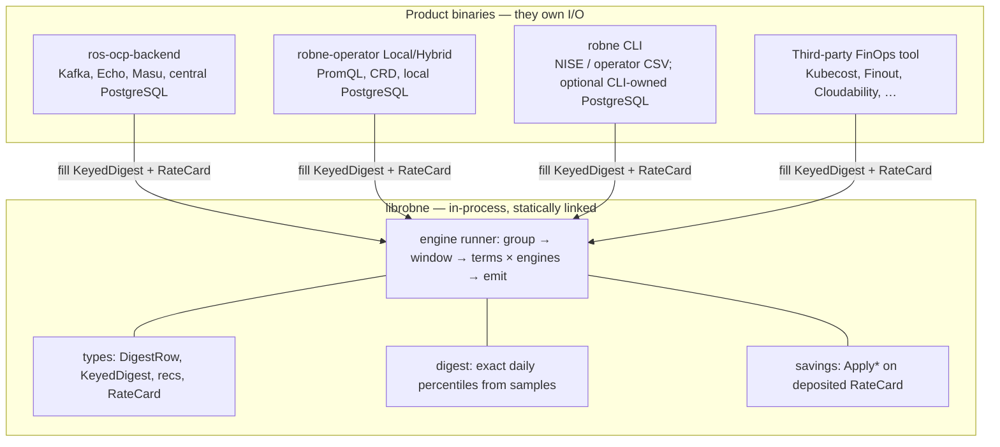
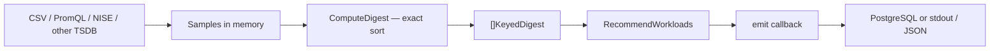
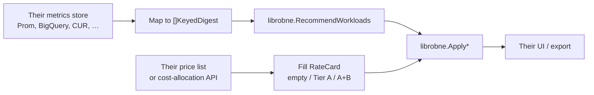

# librobne extraction plan

**Status:** **P4+ complete** (2026-08-15). Nested `librobne/` holds container + namespace, snapshot, node, GPU, VM, PVC, and quota compute. Product wrappers still load PostgreSQL and persist. **[#99](https://github.com/pgarciaq/ros-ocp-backend/issues/99) Phase 1, 2a, pgdigest INSERT, digest SELECT, and namespace/node/GPU/PVC/VM/quota stdout shipped** ([#469](https://github.com/pgarciaq/ros-ocp-backend/issues/469), [#471](https://github.com/pgarciaq/ros-ocp-backend/issues/471), [#463](https://github.com/pgarciaq/ros-ocp-backend/issues/463), [#474](https://github.com/pgarciaq/ros-ocp-backend/issues/474), namespace + node/GPU + PVC + VM + quota slices of [#472](https://github.com/pgarciaq/ros-ocp-backend/issues/472)); `librobne/csv` parses container, namespace, storage, and VM, plus in-memory node/GPU daily aggregation from container ROS and namespace ResourceQuota snapshots. **Next product work:** remainder of other-entity CSVs ([#472](https://github.com/pgarciaq/ros-ocp-backend/issues/472) — cluster_quota). Operator Local Mode remains [#138](https://github.com/pgarciaq/ros-ocp-backend/issues/138).

**P4b** was originally numbered **P2** (namespace/snapshot before the nested module). After locking **container-first P4**, that work runs after P4. The name now matches execution order. P4b is in-tree cleanup, not a module move.

**Tracking:** [GitHub #94](https://github.com/pgarciaq/ros-ocp-backend/issues/94)  
**Branch:** `pgarciaq-rosocp-superpowers-phase17`  
**Baseline SHA:** [`841639f3`](https://github.com/pgarciaq/ros-ocp-backend/commit/841639f365079038fe60c5bb6127f9f08834eecf) (first commit on phase17)  
**Supersedes:** [Cut-1 blueprint](../archive/librobne-extraction-blueprint-cut1-2026-08.md) (rejected)  
**P0.5 amends:** [ADR-0303](../adr/0303-library-extraction-librobne.md) (Accepted = this design)  
**Baseline files:** [`docs/performance/librobne-baseline-841639f3/`](../performance/librobne-baseline-841639f3/README.md)

librobne is a **statically linked Go engine**, not a network service and not a
plugin ABI. Consumers call it in-process. No HTTP, gRPC, Wasm, or `.so`.

---

## 0. Approval gate

Read this whole document. **P0 is approved (2026-08-15).** Next is P0.5, then P1a.

After approval, work is **aggressive**: P0.5 baseline + ADR amend, in-tree cleanup
(P1a–P3), then nested module (P4 container-first). Operator ([#138](https://github.com/pgarciaq/ros-ocp-backend/issues/138))
and CLI ([#99](https://github.com/pgarciaq/ros-ocp-backend/issues/99)) consume the
library later; they are not in the first extract.

**Do not** create `librobne/` or move packages until **P4**. **Do not** start P1a
until P0.5 numbers are recorded (§8).

---

## 1. Why extract (and why the previous plan was wrong)

Three products need the **same** recommendation engine:

| Consumer | I/O | Needs engine? |
|----------|-----|----------------|
| **ros-ocp-backend** (this repo) | Kafka, S3, Echo, Masu HTTP, central PostgreSQL | Yes |
| **robne-operator** Local/Hybrid ([#138](https://github.com/pgarciaq/ros-ocp-backend/issues/138)) | PromQL, CRD, local PostgreSQL, embedded API | Yes |
| **robne CLI** ([#99](https://github.com/pgarciaq/ros-ocp-backend/issues/99)) | NISE / operator CSV; optional CLI-owned PostgreSQL (native upsert, not COPY) | Yes |

Importing all of ros-ocp-backend into an operator or CLI pulls Kafka, Echo,
Clowder, AWS SDK, Unleash, GORM. Copy-pasting `internal/engine/` into three
repos will drift.

**Rejected (Cut 1):** extract only inner `RecommendCPUAndMemory`-style functions;
leave grouping, term×engine loops, savings, and digest types behind “adapters”
(`model.X → librobne.X`). That duplicates the hot loop three times and copies
~280-byte `DigestRow`s (200k containers × 14 days ≈ 2.8M rows ≈ **750 MiB** extra
if copied once). That is the Kruize marshalling tax without a network.

**Rejected (old Cut 2 / Cut 3):** a shared `DigestProvider` / plugin registry that
pretends Prometheus, Kafka CSV, and NISE files are one I/O loop. Those sources
do not share a schema or a clock.

**This plan:** extract the **engine runner + canonical digest types + savings on a
deposited RateCard**. **P4 (#94) moves the container path.** Other entities follow
in P4+. Each consumer fills `[]KeyedDigest` however it wants, then calls the same
runner. Persistence is an **emit callback**, not SQL inside compute.

Drop the names Cut 1 / Cut 2 / Cut 3 / M1b. They mixed “who does I/O” with “who
owns the hot loop.”

---

## 2. Target architecture



Ingest and recommend stay **two phases** (already true in ros-ocp-backend today):



**Primary API (shape; names may tighten in P3):**

```go
type KeyedDigest struct {
    Key WorkloadKey // namespace, workload, workload_type, container_name
    Row DigestRow   // canonical in-memory digest — scan into this, never convert
}

type EmitContainer func(batch []ContainerRec) error // caller reuses backing array

func RecommendWorkloads(rows []KeyedDigest, cfg EngineConfig, emit EmitContainer) error
```

That **is** today’s `RecommendWorkloadsStreaming` `processContainer` loop minus
`*pgxpool.Pool`. Inner `RecommendCPUAndMemory` stays exported for unit tests.
Production consumers must not reimplement the term×engine loop.

**Savings are not inside that loop.** Today the wrapper calls
`ApplySavingsEstimates(batch, …)` on each emitted batch. librobne keeps
`Apply*` as a **separate** function (same as §4.1). The runner fills sizing;
the caller deposits a RateCard and applies savings before persist/print.
Forgetting `Apply*` is a product bug (no dollars), not a silent wrong size.

`[]DigestRow` / `[]KeyedDigest` are slice headers (no copy of the backing array).
Windows are subslices (`digests[lo:hi]`), as they are today.

---

## 3. Boundary: in vs out

### In librobne (required)

- Canonical **digest and recommendation value types**. **One type per entity.**
  Consumers scan or parse **directly into these types**. **P4 ships container
  types**; node/VM/GPU/PVC/quota/snapshot types join the module when that
  entity’s `Recommend*` no longer takes a pool (§9).
- Digest **aggregation from in-memory samples** (`ComputeDigest`, weighted
  percentiles, BH weights). This is how the native engine stays fast: recommend
  over daily rows, not raw hourly points.
- Engine **runner**: group-by-entity, window, terms × engines, idle, notifications,
  category, replica helpers, batch emit.
- **Savings math** on a deposited `RateCard` (empty / Tier A / Tier A+B — §4).
- Embedded read-only catalogs (`go:embed`: GPU YAML, VM instance types, …).
- Notification **integer codes** (not the HTTP catalog).
- Domain enablement bitmask (`EngineConfig.Enabled`), not Echo/CSV plugin traits.

### Optional packages (`csv`, `pgdigest`) — one binary per product

This is **not** “compile six flavors of each tool.” It is **not** feature-flags
that produce `robne-cli-csv` vs `robne-cli-pg`.

Go links **one process** from whatever that process’s `main` imports.

| Product | How many binaries? | What `main` imports |
|---------|--------------------|---------------------|
| **robne CLI** | **One** `robne` | `librobne` **plus** `csv` **plus** `pgdigest` if that CLI talks to files and/or central PG. In-memory-only is a *mode at runtime* (no DB URL), not a second artifact. |
| **robne-operator** | **One** operator image | `librobne` only. PromQL + **operator** SQL live in the operator. It must **not** import `pgdigest` (wrong schema) or `csv` (no CSV in Local). |
| **ros-ocp-backend** | **One** API/worker | `librobne` plus **existing** `internal/ingestion` and pgx. It does **not** need `librobne/csv` unless we later delete duplicated parsers (P5 dedup). |

**Why “optional” then?** Optional for **librobne core**, so the **operator**
does not drag pgx, CSV column maps, or the **central** `daily_container_digests`
SQL into an on-cluster binary. The CLI happily compiles both helpers in. That
is still one CLI.

If we put `csv` + `pgdigest` into **core** “so everything has everything,” the
operator image grows a PostgreSQL driver and central-schema SQL it must never
run. That is the failure mode — not “too many CLI binaries.”

### Never in librobne

| Keep out | Why |
|----------|-----|
| Echo, Kafka, S3, Clowder, Unleash, AWS SDK | Product / SaaS |
| GORM + `internal/model` tags | Persistence ORM ≠ compute types |
| `costdata` HTTP client (`effective_rates`) | Fetch vs math; Koku is one mapper into `RateCard` |
| `CSVIngestor` / `APIProvider` / `RetentionProvider` | ros-ocp-backend **product plugins** |
| `*pgxpool.Pool` on `Recommend*` | Hides I/O inside compute |
| Unified `DigestProvider` interface | See §3.1 — one interface cannot honestly wrap Prometheus, Kafka CSV, and NISE |
| HTTP / gRPC / Wasm / `.so` | Repeats Kruize / violates ADR-0099 |

### 3.1 Why there is no unified `DigestProvider`

A `DigestProvider` would look like “one interface, three backends”:

```go
type DigestProvider interface {
    Load(ctx context.Context, key ClusterKey, window Window) ([]KeyedDigest, error)
}
```

That shape **fits none** of the real sources:

| Source | What it actually is | Why a common interface lies |
|--------|---------------------|-----------------------------|
| **PostgreSQL** (central) | One covering-index `SELECT` of already-daily rows, then **drop the connection** | Needs pgx, org_id, partitions, `schedule_type`, row cap. Not a stream of Prom samples. |
| **Prometheus / Thanos** (operator Local) | Range PromQL + `quantile_over_time`, then map series → `DigestRow` | Needs Prom client, scrape window, recording-rule names. No org schema. |
| **NISE / operator CSV** | Parse files → hourly samples → `ComputeDigest` → rows | Needs CSV column map. No query API. |
| **CLI Prometheus JSON** | Decode a dump file | Different JSON than CSV and than Prom HTTP. |

If we still ship that interface, every backend will **copy** into a generic
row so the interface can return one type — the Cut-1 marshalling tax, now
named “provider.” Each product should instead **fill `[]KeyedDigest` directly**
(scan, parse, or PromQL map) and call `RecommendWorkloads`. Shared code is the
**row type and the runner**, not a fake I/O bus.

### Product plugins stay in each binary

Today’s `internal/plugins/container` owns **CSV ingest, retention, term defaults**.
It does **not** run the recommender. `RecommendWorkloadsStreaming` does.

| Name | What it is | Where it lives |
|------|------------|----------------|
| **ros-ocp-backend plugins** | CSV types, Echo routes, retention, `ROS_ENABLED_PLUGINS` | `internal/plugins/*` |
| **librobne engines** | Compute domains (container, node, gpu, …) | librobne |
| **Local Mode CRD `spec.engine.plugins.*`** | Enable/disable **engines** | Maps to `EngineConfig.Enabled`, not to `CSVIngestor` |

Moving `internal/plugins/*` into librobne would drag Echo/Kafka into the operator
and CLI. Do not do it.

CSV parse + DB insert of **digest tables** stay split from recommendation
generation (already true at runtime: `ParseAndDigestCSV` then
`runManifestRecommendations`). The library makes that split the public contract:
ingest fills digests; `RecommendWorkloads` never sees a CSV or a pool.

---

## 4. RateCard (empty / Tier A / Tier A+B)

librobne **never fetches** rates. Any FinOps tool (Koku, OpenCost, a YAML price
list, CLI flags, operator) **deposits** a card, then calls savings.

Do not clone Koku’s HTTP JSON as the library API. Do not put `float64` money or
an IEEE decimal type on `RateCard`. Integer scales, converted at boundaries:

| Layer | Unit | `$0.007` / core-hour |
|-------|------|----------------------|
| **Masu `effective_rates` + RateCard** | **micro-cents** (`int64`, `$ × 100_000_000`) **per core-hour / GiB-hour** (rates) or as **totals** (namespace spend) | `700000` µ¢ / core-hour |
| **`Apply*`** (hot path) | same micro-cents, **per millicore-hour** (`÷ 1000`) — keep [`savings_int.go`](../../internal/engine/core/savings_int.go) | `700` µ¢ / millicore-hour |
| **DB + API** | **cents** + [`MoneyAmount`](../../internal/money/format.go) | `"5.21"`, `units` from `RateCard.Currency` |

Masu wire contract: [#461](https://github.com/pgarciaq/ros-ocp-backend/issues/461) (integer micro-cents, not `float()`, not dollar strings). Quantity on rates stays **core-hour / GiB-hour**; ROS owns the millicore split. **Observed** request hours on the card are **milli-hours** (`hours × 1000`). **Projection** hours (calendar month × 24, ADR-0326) are an **`Apply*` argument**, not a RateCard field. Markup, if deposited, is **basis points** and applies to **Tier A only**.

**Why not millidollars / microdollars on the card:** millidollars truncates `$0.0015`. Microdollars would be a third scale next to Masu micro-cents and `Apply*` micro-cents. One money scale from HTTP → RateCard → `savings_int.go`.

**Why keep `÷ 1000` only in `Apply*`:** ADR-0291. Integer cents as a *per-millicore-hour* rate round to zero. Round once at the edge: `MicroCentsToCents`.

**Why not IEEE decimal64 / shopspring in librobne:** ADR-0295. Hot path is `int64` multiply.

`currency` is ISO 4217 **display metadata**. All numbers on the card are already
in that currency. **Empty / nil card: do not default `Currency` to `"USD"`** —
no savings, no ISO code, existing “no cost data” notification. FX (user
preferred currency vs cost-model currency) stays in the product API layer
([ADR-0327](../adr/0327-api-time-currency-conversion-over-storage.md)), not in
librobne. Display fallback is `user preference → cost-model currency → omit`,
never invent USD inside compute.

```text
RateCard
  currency: "EUR"                 // cost-model unit; empty if no card; never default "USD"
  markup_basis_points: 1000       // optional; 10% = 1000; Tier A only (not A+B spend)

  // Tier A — unit prices (CLI, operator, YAML). Koku mapper does not fill these.
  // integer micro-cents per core-hour / GiB-hour / GiB-month / GPU-hour
  cpu_microcents_per_core_hour
  mem_microcents_per_gib_hour
  gpu_microcents_per_gpu_hour          // optional
  storage_microcents_per_gib_month     // optional

  // Tier B — observed spend (Koku mapper). Prefer B when Namespaces is non-nil.
  namespaces[name]:
    cost_model_cpu_microcents          // totals, not rates
    cost_model_mem_microcents
    infra_microcents
    distributed_microcents
    cpu_request_milli_hours, mem_request_milli_hours
  distribution: cpu | memory           // cluster-level; empty means cpu
```

**Hours (locked P1b):** `ApplySavingsEstimates(recs, card, hoursPerMonth)` keeps today’s shape. `hoursPerMonth` is **calendar hours** (`HoursInMonth`). Recalc passes a new month with the same card. Do **not** put projection hours on the card. Do **not** call `HoursInMonth` / `time.Now()` inside `Apply*`. Observed request hours on `NamespaceSpend` are milli-hours (quantized once in the mapper).

**Mapper (locked P1b):** `ClusterCostDataToRateCard` in `internal/costdata`, **once per cluster**, then `Apply*` sees only `*RateCard`. Do not convert inside the rec loop. Koku mapper fills **Tier B only** (no `ConfiguredRates` → Tier A, no `MarkupPct`). Empty/nil: `Currency` unset. Compat floats: `Round(usd × 1e8)` and `Round(hours × 1000)` once in the mapper.

**P1b correctness gate:** golden tests ±1 cent (empty / A / A+B). `cmd/bench` has no Masu URL — do not treat Write as a savings proof. Matched `1000,10000` ( `ROS_BENCH_STREAM` unset) is the copy detector only.

| Card | Behavior |
|------|----------|
| **Empty / nil** | Skip savings; “no cost data” notification. Sizing recs still compute. `Currency` unset. |
| **Tier A only** | Unit prices × millicore/KiB deltas (idle = full current request). Markup if deposited. `Namespaces` must be **nil**. |
| **Tier A + B** | Same math as today: effective rate = spend / request-hours; infra+distributed by `distribution`. Prefer B when `Namespaces != nil`; missing namespace → no cost data (**no A fallback**). Markup **not** applied. |

ros-ocp-backend’s `internal/costdata` HTTP client becomes **one mapper**
(`ClusterCostData` → `RateCard`). It does not belong in librobne. After #461
the mapper copies `int64` micro-cents and milli-hours. Until Masu ships, a
compat decoder may quantize legacy JSON floats **once** at the mapper — never
on `RateCard`, never in `Apply*`.

### 4.1 Third-party FinOps (Kubecost, Finout, Cloudability, …)

The test of this architecture is: **can another product use the engine without
Koku, Kafka, or our PostgreSQL schema?** Yes — if they do what we already do
internally:



| They have | They do | They do **not** need |
|-----------|---------|----------------------|
| CPU/mem time series | Build daily samples → `ComputeDigest` **or** map existing p50/p95/… into `DigestRow` | Our CSV package, our `pgdigest` SQL |
| A price list ($/core-hour) | **Tier A** RateCard (micro-cents per core-hour / GiB-hour) | Koku `effective_rates` HTTP |
| Observed namespace spend | **Tier A+B** (same as Koku mapper: spend / request-hours) | Our tenant schema |
| Nothing priced yet | Empty card — **sizing still works**; savings skipped | Invented `"USD"` |

They import **core librobne only** (types + digest + runner + savings). They
keep their own ingest and their own database. Effective rate is **not a Koku
API they must call**; it is math on a deposited card (`Apply*` uses spend/hours
when Tier B is present, else unit prices). If this walkthrough feels awkward,
the RateCard or `KeyedDigest` shape is wrong — fix it **before** P4.

---

## 5. Digests are in librobne

Daily digests **are** the native engine. They are not “kept out.”

| In librobne | Out of compute core |
|-------------|---------------------|
| `DigestRow` / `KeyedDigest` layout | `*pgxpool.Pool`, SQL, GORM |
| `ComputeDigest` from in-memory samples (exact sort) | Kafka, S3, PromQL clients |
| Recommending from `[]KeyedDigest` | Operator PromQL (fills `DigestRow` in the **operator**, not here) |
| (P5) optional CSV helper | (P5) optional `INSERT` into `daily_container_digests` |

Operator Local Mode still uses `DigestRow`. Prometheus `quantile_over_time()` is
another way to **fill** the struct. Compact on-disk summaries (~70 bytes) are a
**storage** choice; during an engine cycle, RAM holds the fields compute needs.

### 5.1 Digest algorithm — exact sort, not t-digest

There are **two clocks**. Mixing them is why “scrape every 15s → t-digest”
sounds necessary when it is not.

| Clock | What exists | How many values? | Who percentiles? |
|-------|-------------|------------------|------------------|
| **Scrape / collect** | Raw CPU/mem points (Remote: ~15 min; Local: **15s**, [local-mode](../../docs-site/planned-features/local-mode.md)) | Local: **5,760 samples / container / day** | **Not** `RecommendWorkloads` |
| **Recommend** | One **`DigestRow` per container per day** (p50/p60/p95/… already filled) | **~14 rows** for a 14-day term (not 5,760) | Decay, margin, idle, terms × engines |

librobne’s runner sees the **second** clock. Sorting 14 daily rows is not the
problem. Sorting 5,760 samples is also cheap in Go (`slices.Sort` on 5,760
`int64`s is microseconds). The problem t-digest claims to solve — **mergeable
approximate sketches so you never keep samples** — is a **Prometheus** job on
Local Mode, not a Go-engine job.

**What we use today** ([`ComputeDigest`](../../internal/ingestion/digest.go)):
`slices.Sort` on `[]int64`, nearest-lower-rank percentiles. Used on the
**central CSV ingest** path when building a daily row from that day’s samples
(~96 points at 15 min). Weighted / business-hours variants take a
**`WeightFunc`** (numbers on samples). [`internal/bhschedule`](../../internal/bhschedule)
(org calendars, DB) stays in the **product**; ingest evaluates the schedule and
passes weights. librobne must not import `bhschedule`.

**Local / Hybrid (already decided, [#138](https://github.com/pgarciaq/ros-ocp-backend/issues/138)):**
the operator does **not** pull 5,760 samples into Go and sort them, and it does
**not** keep t-digest centroids. It asks Prometheus for
`quantile_over_time` / `avg_over_time` / `max_over_time` and **fills**
`DigestRow`. Operator-maintained t-digests were **Option A and rejected**
(duplicates Prometheus, lost on pod restart, ~60 MiB overhead).

**Does Go have a native digest?** No. Stdlib has `slices.Sort`, not t-digest.

**Do we introduce t-digest in librobne?** **No.** It would change golden recs,
add a sketch library to every consumer, and fight Local Mode’s PromQL design.
If scrape rate goes to 1s someday, the answer is still: Prometheus (or
`ComputeDigest` on **one day’s** samples when building a row) — never recommend
over raw high-frequency series.

### 5.2 Load-then-compute (product language)

**PostgreSQL is not part of librobne.** The library is the kitchen. The database
is the warehouse. Today some recommend functions still hold the warehouse phone
while they cook (`RecommendAllNamespaces(ctx, pool, …)` takes a connection
pool). That is fine for a monolith. It is **illegal** in a library: the
operator and CLI would otherwise drag pgx into every binary, and compute would
block a scarce DB connection while it does CPU work.

**Load-then-compute** (already true for containers, [#263](https://github.com/pgarciaq/ros-ocp-backend/issues/263)):

1. **Load** — product code `SELECT`s; pgx **scans once** into `[]KeyedDigest`
   (this is the Postgres wire decode we already pay today). Then **return the
   connection to the pool**.
2. **Compute** — librobne runs with **no pool**, no SQL. Same backing array.
   Other requests can use that connection.
3. **Write** — product code upserts recs in chunks of 500.

There is **no second copy** of digest rows for namespace, quota, or snapshot
versus today. Those paths **already** `SELECT` into Go slices, then run
`RecommendCPUAndMemory` in process (`recommendNamespaces` loads
`grouped` then loops). P4b only **stops passing `pool` into the compute
function**. PostgreSQL cannot run that Go math “in the database” without
PL/pgSQL (rejected) or sending the same bytes over the wire anyway.

“That releases the connection during CPU work” means: we are **not** adding a
network hop and **not** making recommend slower. We stop hogging a DB slot
while we multiply. Same answers; a library that does not require PostgreSQL.

**P4b (namespace/snapshot load-then-compute, formerly P2) is in-tree cleanup,
not a module move.** Container already does it. Snapshot `ClassifySnapshots`
loads inventory then classifies over slices; persist SQL stays in the product.
Classify-over-slices lives in `librobne/snapshot` (P4+). Product wrappers still query and persist.

### 5.3 This looks like Kruize. It is not. (copies)

The **product split** (I/O vs engine) is the same idea as Kruize. The
**call boundary** is the opposite:

| | Kruize (what hurt) | librobne (this plan) |
|--|--------------------|----------------------|
| Process | Sidecar JVM | **Same process**, statically linked |
| Call | HTTP + JSON | **Go function**, slice header |
| Types | `map[string]any` / JSONObject | `DigestRow` `int64` fields |
| Extra copy | Serialize every row, allocate on both sides | **Forbidden.** Scan into library types; windows are subslices |
| Money | floats / strings | `int64` micro-cents (`savings_int.go`) |
| How we catch a regression | We didn’t | §8: **Peak RSS ≤ 10%** (a second `[]DigestRow` fails this); compute-only ≤ 2% |

A Go **package** boundary after static link is **zero** runtime cost. Extra
**heap copies** are not. Cut 1 (`model.X → librobne.X` on 2.8M rows ≈ 750 MiB)
would have been Kruize-without-HTTP. That is why converters are a review
reject, not a “cleanup later.”

**Namespace / quota are not special.** You cannot rightsizing-math on a SQL
cursor without either (a) buffering the same rows in Go (today) or (b) moving
the algorithm into SQL (not portable to the operator, breaks “read once,
compute N terms”). Holding the cursor while computing is [#263](https://github.com/pgarciaq/ros-ocp-backend/issues/263)
— worse, not better.

**Honesty:** I am sure of the **design** (no added copy vs today’s native
engine). I am **not** sure of a future PR until §8 gates are green. That is
why P0.5 exists and why a failed RSS gate **reverts the phase**.

---

## 6. PostgreSQL optimizations this split must not lose

The official baseline **includes PostgreSQL**. A no-DB microbench is only a
canary for extra copies.

Must still be true after extraction (in ros-ocp-backend wrappers and/or
`librobne/pgdigest`):

1. Digests in PG, not raw samples / JSONB — recommend reads `daily_*_digests` (RANGE partitions).
2. **Read once, compute N terms in Go** — one digest query per cluster; no per-term SQL rescan.
3. Covering index `idx_daily_container_digests_recommend` on
   `(org_id, cluster_uuid, schedule_type, namespace, workload, workload_type, container_name, bucket_date)`.
4. **`loadDigestRows` then drop the connection** ([ADR-0171](../adr/0171-streaming-recommendation-batches.md), [#263](https://github.com/pgarciaq/ros-ocp-backend/issues/263)) — no cursor held across writes.
5. Ingest statement timeout 120s via `SET LOCAL` ([ADR-0092](../adr/0092-ingest-statement-timeout-120s.md)).
6. Chunked `pgx.Batch`, cap **2000** ([ADR-0093](../adr/0093-chunked-pgx-batches-500.md)).
7. Emit every **500** containers (`streamBatchSize`); history/quality/savings per batch.
8. Digest upserts: `INSERT … ON CONFLICT DO UPDATE` (COPY cannot express conflict + `RETURNING` for `org_container_keys`).
9. **One connection pool** ([ADR-0128](../adr/0128-unify-gorm-pgxpool-stdlib.md)) — do not split GORM + pgx pools again.
10. Go-created monthly partitions ([ADR-0059](../adr/0059-auto-create-partitions-in-go.md)); retention by partition drop.
11. `ROS_MAX_DIGEST_ROWS_PER_CLUSTER` — skip the cluster rather than truncate ([#290](https://github.com/pgarciaq/ros-ocp-backend/issues/290)).
12. `container_id` index seek on detail — no composite-key scan fallback for new rows.

**Forbidden on the recommend path (review reject):**

- Field-by-field `engine.DigestRow` → `librobne.DigestRow` convert loops
- `interface{}` / `map[string]any` per row
- JSON encode/decode in compute
- Allocating a new `[]DigestRow` to “adapt” windows (use subslices)
- Holding a PG connection across CPU work
- Row-by-row `INSERT` or unbounded pgx batches
- GORM `FindInBatches` for digest load

Go package boundary after static link is **zero** runtime cost. Extra **copies**
are not. See §5.3.

---

## 7. Locked defaults

| Topic | Locked (2026-08-15) |
|-------|---------------------|
| Module home | Nested module `librobne/` in this repo until the API is stable. Optional later split to `github.com/pgarciaq/librobne`. |
| Import path (bootstrap) | `github.com/redhatinsights/ros-ocp-backend/librobne` (must match parent [`go.mod`](../../go.mod)). `replace` in the parent. Do **not** use `github.com/pgarciaq/…` until [#421](https://github.com/pgarciaq/ros-ocp-backend/issues/421). Eventual standalone: `github.com/pgarciaq/librobne`. |
| Core `go.mod` deps | Stdlib + `gopkg.in/yaml.v3` only if catalogs need it; **no** pgx/Echo/GORM in core |
| Namespace + business hours | **One** runner; `schedule_type` is a field on rows. Two orchestrator entry points, not two extractions. See §7.1. |
| VM types | `vm.Digest` / `vm.Recommendation` (no `model.*`). See §7.2. **Not** dropping VM recommendations. In-tree in P1a; **not** a P4 move. |
| Currency | `RateCard.Currency` = cost-model ISO 4217 when a card exists; **unset** on empty card (not `"USD"`). Copy as-is; never `ResolveCurrency` in mapper/`Apply*`. Money is **micro-cents** on the card and in `Apply*` (per millicore-hour after `÷1000`); persist **cents**. FX is API-time (ADR-0327). |
| Hours | Projection = `Apply*` calendar-hour arg (`HoursInMonth`). Observed request hours on the card = milli-hours. |
| P4 scope | **Container-first.** Nested module after the container path is pool-free. Other entities move later. |
| P1 split | **P1a** types/pool hygiene (bit-identical); **P1b** RateCard (±1 cent on savings). |
| #94 / public site / ADR-0303 | Keep #94 in sync with this file; ADR-0303 + public site in **P0.5** after explicit P0 approval |

### 7.1 Namespace + business hours (one runner, two doorbells)

Customers can have **two digest streams** for the same namespace:

- `all_hours` — every sample in the day
- `business_hours` — only samples inside the org’s schedule (weekdays 9–17, …)

Those are **not** two algorithms. They are the **same** rollup on two different
row sets. Each digest row already carries `schedule_type`.

**One runner** = one `RecommendNamespaces(rows, cfg, emit)` in librobne. It
does not know or care how the rows were filtered.

**Two orchestrator entry points** = two **product** functions that still exist
for API/ops convenience (today: `RecommendAllNamespaces` vs
`RecommendBusinessHoursNamespaces`):

1. Query `schedule_type = 'all_hours'` → call the runner.
2. If BH is enabled and a schedule exists, query `schedule_type = 'business_hours'`
   → call the **same** runner.

We do **not** extract “business hours engine” as a second library. We do **not**
duplicate percentile/margin/idle code. The library sees a field on the row;
the product decides which SQL to run.

### 7.2 VM types — what we leave out, and why it is wise

**We are not leaving VM recommendations out of the product.** They stay in
`internal/engine/vm` until that path is pool-free, then they **move** into
librobne (after P4). P4 does not drop VM features from ros-ocp-backend.

**What we leave out:** GORM structs `model.DailyVMDigest` and
`model.VMRecommendation` (SQL tags, table names). Those are **persistence**.
Compute uses `vm.Digest` / `vm.Recommendation` — same numbers, no ORM.

**Why dual types + converters are forbidden:** that is Cut 1. Copying every VM
digest field on the hot path reintroduces the marshalling tax.

**Is it performant?** Yes, if the change is a **type rename + scan target**, not
a mapper. `RecommendVM([]vm.Digest, …)` receives the same slice the query just
filled. GORM tags never ran on the recommend hot path (`vm_db.go` already uses
pgx `Scan`). P1a does this **in-tree**. P4 does **not** move VM into librobne.

---

## 8. Baseline procedure

### 8.1 What is frozen

| Item | Value |
|------|--------|
| Git SHA | `841639f365079038fe60c5bb6127f9f08834eecf` |
| First phase17 commit | `docs: Point live docs to phase17 and add branch bump checklist` |
| Engine-equivalent parent | `e7d2a4dbc2ddb05daffec7dc78599eb68ae92551` (phase16 tip; engine/SQL identical) |
| Artifact dir | `docs/performance/librobne-baseline-841639f3/` (create when recording) |
| PG | PostgreSQL **16** via testcontainers (`cmd/bench`) |

`841639f3` is docs-only vs `e7d2a4db`. Measuring either SHA for engine/PG is the
same. Record **`841639f3`** as the named baseline.

Worktree at current `phase17` HEAD is also engine-identical until P1a starts
(only later docs). **Still check out `841639f3` when recording** so the SHA in
the artifact matches the plan.

### 8.2 Prerequisites

```bash
cd /path/to/ros-ocp-backend
git fetch pgarciaq
git checkout 841639f3

# Docker or Podman — testcontainers needs a runtime
# Go version: see go.mod (1.26.x)

go install golang.org/x/perf/cmd/benchstat@latest
mkdir -p docs/performance/librobne-baseline-841639f3
```

Hardware: a developer machine with Docker/Podman is enough. The published
100k numbers were taken on a **62 GiB** laptop
([`docs/native-engine-performance.md`](../native-engine-performance.md)). A live
SNO cluster is **not** required for #94 (Beaker/UXSNO downtime does not block
P0.5). Optional later: UXSNO for PromQL + real disks (operator / #138).

### 8.3 Contract bench — PostgreSQL full pipeline

Existing harness: [`cmd/bench/main.go`](../../cmd/bench/main.go). It starts PG 16,
seeds `daily_container_digests`, runs `RecommendAllWorkloads` (load+compute into
one slice), then `WriteRecommendationsAndRefreshOrg`, then list/detail.

**Caveat:** `RecommendAllWorkloads` is the test wrapper (all recs in memory).
Production is `RecommendWorkloadsStreaming` (emit every 500). Keep `cmd/bench`
for continuity with published 10k/100k numbers. After P0 approval, P0.5 adds a
streaming variant to the same binary so write-path RSS is measured the way
production runs.

#### What “Peak RSS ~1.8 GiB” is (and is not)

**RSS** = *resident set size*: RAM pages the **Go bench process** actually has
in physical memory (not virtual address space, not PostgreSQL’s memory, not
“librobne’s tax”).

That ~1.8 GiB at **100,000 containers** is **today’s native engine + this
harness**, already published. It is **not** a new librobne overhead and not a
typical-cluster footprint.

| Scale | What is in RAM | Ballpark (this harness) |
|-------|----------------|-------------------------|
| Typical on-prem cluster (~1k containers × 14 days) | Daily digest rows the engine must hold for “read once, compute N terms” | **A few MiB** of `DigestRow`s. Local Mode on-disk summaries are ~70 MB / 1000 containers — storage, not the library. |
| 10k containers, this harness | Digests + **all** recs kept in one slice + PG client | ~**176 MiB** |
| 100k containers, this harness | Same, worst case: 100k × 14 digest rows (~0.4–0.5 GiB of structs) **plus** ~600k recs (3 terms × 2 engines) **all retained** until write finishes | ~**1.8 GiB** |

librobne is the **same functions** in another package. After static link it
adds **no** extra RSS if we do not copy. The extract **fails** if Peak RSS
grows >10% vs this baseline (that *would* mean a copy).

**OOM on a small laptop is not a gate fail:** 100k + Docker PostgreSQL needs
headroom (the original run used 62 GiB). If 100k OOMs, record 1k+10k, note
RAM, and run 100k on a machine that can hold it. Do **not** conclude the
library is heavy. Do **not** skip the 10k RSS comparison.

```bash
# From repo root at 841639f3. 100k takes several minutes and ~2 GiB RAM.
go run ./cmd/bench/ 1000,10000,100000 \
  | tee docs/performance/librobne-baseline-841639f3/cmd-bench.txt
```

Record the summary table (Seed / Recommend / Write / List p50 / List p99 / Detail /
Peak RSS). Historical published ballpark (laptop, worst-case testcontainers):

| Containers | Recommend (ms) | Write (ms) | Peak RSS (MB) |
|------------|----------------|------------|---------------|
| 10,000     | ~857           | ~1,617     | ~176          |
| 100,000    | ~10,485        | ~19,171    | ~1,790        |

**Re-measure.** Do not copy these numbers as the gate; they are orientation.
The file from `tee` is the gate.

Also store:

```bash
{
  echo "SHA=$(git rev-parse HEAD)"
  echo "date=$(date -u +%Y-%m-%dT%H:%M:%SZ)"
  echo "go=$(go version)"
  echo "uname=$(uname -srm)"
  nproc
} > docs/performance/librobne-baseline-841639f3/environment.txt
```

### 8.4 Canary benches — no extra copies in compute/savings

Existing tests (PG used only where the test already opens a pool for thresholds):

```bash
go test -bench='BenchmarkSavingsCalculation_1000Containers$|BenchmarkNodeSavings_100Nodes$|BenchmarkDualRecommendation_Overhead$|BenchmarkThresholdResolution_SingleOrg$' \
  -benchmem -count=10 -timeout 30m \
  ./internal/engine/ \
  | tee docs/performance/librobne-baseline-841639f3/go-test-bench.txt
```

After **P0**, P0.5 adds `BenchmarkRecommendWorkloads_ComputeOnly` (synthetic
`[]KeyedDigest`, emit to `io.Discard`, **no pool**) at **1k / 10k** × 14 days
(100k × 14 optional — same RAM caveat as `cmd/bench`). That function is the P3
signature. **Do not duplicate** the `processContainer` loop in a test (Cut 1).
**Do not extract** the loop in the same breath as recording `cmd/bench` without
an explicit OK — a mechanical extract is behavior-preserving but still a
native-engine edit. Until that extract exists, P0.5 records `cmd/bench` + the
existing `go test` benches in this directory; the canary’s first run is checked
in beside the SHA files on the extract commit.

### 8.5 Compare after each extract phase

```bash
# After a phase, on the working tree (add 100000 only if RAM allows):
go run ./cmd/bench/ 1000,10000 \
  | tee /tmp/librobne-after-cmd-bench.txt

# Compare Recommend / Write / RSS by hand from the summary tables.
# For go test benches:
go test -bench='BenchmarkSavingsCalculation_1000Containers$|BenchmarkNodeSavings_100Nodes$|BenchmarkDualRecommendation_Overhead$|BenchmarkThresholdResolution_SingleOrg$' \
  -benchmem -count=10 -timeout 30m ./internal/engine/ \
  | tee /tmp/librobne-after-go-test-bench.txt

benchstat docs/performance/librobne-baseline-841639f3/go-test-bench.txt \
  /tmp/librobne-after-go-test-bench.txt
```

### 8.6 Gates (fail the PR / revert the phase)

Tune only if the frozen `841639f3` numbers show the harness itself is noisier;
do not loosen to hide copies.

| Signal | Gate vs `841639f3` |
|--------|---------------------|
| Compute-only canary (once added) | ≤ **2%** ns/op and allocs/op (`benchstat`) |
| `cmd/bench` **Recommend** (load+compute) | ≤ **5%** wall time at **10k** (and at 100k **when that size was recorded**) |
| `cmd/bench` **Write** | ≤ **5%** wall time at 10k (and 100k when recorded) |
| `cmd/bench` **Peak RSS** | ≤ **10%** at 10k (and 100k when recorded). A second `[]DigestRow` copy fails this. Laptop OOM at 100k is **not** this gate. |
| List p50/p99 | No worse than noise; extract must not change list SQL |

If a phase fails: **fix or revert that phase**. Do not “optimize later.”

### 8.7 When, where, how many runs

| When | Where | What |
|------|--------|------|
| **Once, after explicit P0 approval** (P0.5) | **Developer laptop** + Docker/Podman; PG 16 via testcontainers. **Not** a live SNO. 100k needs ~2 GiB process RSS + Docker — skip 100k if the machine cannot hold it; **always** record 1k and 10k. | §8.3 `cmd/bench` + §8.4 `go test` benches → `docs/performance/librobne-baseline-841639f3/`. Add streaming `cmd/bench` path + compute-only canary. |
| **Every P1a / P1b / P3 PR** (and P4b if it touches load) | Same laptop | **10k** + compute-only canary. 100k optional. |
| **P4 merge candidate** (container module move) | Same laptop | **10k required.** 100k if RAM allows; otherwise 10k + canary vs P0.5 is the gate and 100k is a follow-up on a larger box. |
| **Not required for #94** | Live cluster (UXSNO, Apollo). Beaker maintenance does not block the extract. | [#138](https://github.com/pgarciaq/ros-ocp-backend/issues/138) |

**How many named baselines:** **one** frozen SHA (`841639f3`). Later runs are
**comparisons**, not new official baselines. Do not re-label HEAD as the
baseline to hide a copy. Optional: after P4 ships, a **post-extract snapshot**
may be archived next to the SHA files for future work — it does not replace
`841639f3` as the extract gate.

---

## 9. Implementation sequence (aggressive after approval)

Do **in ros-ocp-backend first**. Nested module before a second GitHub repo.

| Phase | What | Extract? | P4 gate? |
|-------|------|----------|----------|
| **P0** | Explicit approval of this document | No | — |
| **P0.5** | Record §8 baseline at `841639f3`; streaming `cmd/bench` + compute-only canary; **amend ADR-0303** (Accepted = this design, not Cut 1); short site note | Harness + docs | Yes (before P1a) |
| **P1a** | In-tree hygiene, bit-identical: pgx flush **out** of `core` types; VM off `model.*`; GPU idle/thresholds as values | No | Yes (before P1b) |
| **P1b** | `RateCard` at container savings boundary; mapper still in `costdata`; golden savings **±1 cent** | No | Yes (before P3) |
| **P3** | `RecommendWorkloads(rows, cfg, emit)` with **no pool**; wrappers: query → runner → persist. Plugins unchanged | No | Yes |
| **P4** | Nested `librobne/`; **move** container types + digest + container runner + `Apply*`; `replace` in parent; **no converters**. Other entities stay in `internal/engine` until pool-free | **Yes (container)** | This is #94 DoD |
| **P4b** | Namespace + snapshot **load-then-compute** (container pattern). Formerly numbered P2. | No | Follow-up after P4 |
| **P4+** | Move node/VM/GPU/PVC/quota/namespace/snapshot as each `Recommend*` loses `pool` — **done 2026-08-15** | Yes (per entity) | Recorded on #94 |
| **P5** | `csv` (landed with #469) + `pgdigest` INSERT ([#463](https://github.com/pgarciaq/ros-ocp-backend/issues/463), shipped) + recommend-path SELECT ([#474](https://github.com/pgarciaq/ros-ocp-backend/issues/474), shipped); ingest parser dedup ([#475](https://github.com/pgarciaq/ros-ocp-backend/issues/475)); `QueryContainerDigests*` dedup ([#476](https://github.com/pgarciaq/ros-ocp-backend/issues/476), after 2d) | Optional I/O packages (not core) | No |
| **P6** | CLI / operator import librobne ([#99](https://github.com/pgarciaq/ros-ocp-backend/issues/99) / [#138](https://github.com/pgarciaq/ros-ocp-backend/issues/138)) | Consumers | No |

P1a, P1b, and P3 (container path) must be behavior-preserving and gate-green.
P4b is in-tree namespace/snapshot cleanup after P4 (formerly numbered P2).
P4 is an import-path move of already-clean **container** packages.

**Stop line:** P0 approved 2026-08-15. **P0.5–P4+ are recorded.** P5/P6 are other issues.

---

## 10. Module layout (P4)

Created **at P4** (done 2026-08-15). P1a–P3 stayed under `internal/engine` until then.

```
librobne/                    # nested module — P4 container + P4+ entities
├── go.mod
├── types/                   # container DigestRow, KeyedDigest, ContainerRec, EngineConfig, RateCard
├── digest/                  # ComputeDigest, weighted samples (no SQL, no bhschedule)
├── engine/                  # RecommendWorkloads + emit
├── savings/                 # Apply* (RateCard)
├── container/
├── namespace/
├── snapshot/
├── node/
├── gpu/                     # embed gpu_catalog.yaml, vgpu_profiles.yaml
├── vm/
├── pvc/
├── quota/
└── testdata/
```

**P5 only** (not #94 DoD): `csv/`, `pgdigest/`.

P4 CI must run `go test -C librobne ./...` **and** the parent suite (`make test`
does both). Parent `go.mod` has `replace => ./librobne`. After editing
`librobne/`, run `go mod vendor` so vendor mode stays consistent.

ros-ocp-backend after P4+: entity compute lives in librobne; wrappers still
load, map Masu → RateCard, emit → pgx, history/quality.

---

## 11. Per-entity work

| Entity | When | Work |
|--------|------|------|
| **Container** | P1b–P4 (**#94 DoD**) | Strip pool from loop; RateCard for `Apply*`; move into `librobne/` — **done** |
| Node | P4+ | Types already mostly engine-local; strip pool if any; then move — **done** |
| GPU MIG / time-slicing | P1a (structs in-tree); move P4+ | Pass idle + threshold values; no library-side `LoadGPUIdleConfig` — **done** |
| VM | P1a (off `model.*` in-tree); move P4+ | Replace GORM types **in place**; no dual types — **done** |
| PVC | P4+ | Export `ComputePVCRecommendation`; split from DB `RecommendPVCs` — **done** |
| Quota / cluster quota | P4+ | Split DB runner; currency from cfg (lib does not invent `"USD"`) — **done** |
| Namespace | P4b (in-tree load-then-compute); move P4+ | Load-then-compute; one rollup for all-hours and business-hours — **done** |
| Snapshot | P4b (in-tree load-then-compute); move P4+ | Inventory row + group index; classify over slices — **done** |

No algorithm changes during the move. Golden tests: same digest fixture → same
sizing fields. Savings **±1 cent** only across **P1b**.

---

## 12. Testing

The extract **must not** change user-facing HTTP JSON. That is the rule that
keeps IQE and other repos quiet.

| Repo / layer | Action for #94 (through container P4) |
|--------------|-------------------------|
| **ros-ocp-backend unit tests** | **Yes — move/update with the code.** Pure engine tests follow packages into `librobne/`. Wrappers keep testcontainers tests. Do **not** weaken assertions. Golden: bit-identical sizing fields; savings **±1 cent** after RateCard (integer rounding at the edge). |
| **ros-ocp-backend integration / `cmd/bench`** | **Yes.** §8 gates. Existing PG tests stay the persist contract. |
| **iqe-ros-ocp-plugin** | **No planned changes.** Tests hit ROS HTTP. If a test fails after P4, that is a **behavior bug**, not a missing IQE rewrite. Optional smoke after P4 on an existing cluster; do not invent new cases for a module move. |
| **iqe-cost-management-plugin** | **No planned changes.** Cost Management APIs are unchanged. Same rule: failure = engine bug, not a plugin update. |
| **iqe-core / iqe-dockerfiles** | **No.** |
| **koku / koku-ui / koku-metrics-operator** | **No** (Masu `#461` is a separate mapper issue). |
| **cost-onprem-chart e2e** | **No planned changes.** Chart talks to the same APIs. Run existing suite only if we already have a cluster for other work — not a P4 gate. |
| **nise** | **No.** CSV shape unchanged. |

If a phase **does** change an API field, that is out of scope for the extract —
stop, split a product issue, do not hide it inside librobne.

---

## 13. Definition of done (#94 = container P4)

1. Nested `librobne` module exists; core has no Echo/Kafka/GORM/pgx.
2. **Container** runner + digest types + RateCard `Apply*` live in librobne.
3. ros-ocp-backend scans into librobne types and emits via existing chunked pgx batches — **zero convert loops**.
4. Product plugins still in ros-ocp-backend (ingest/API/retention).
5. Other entities compute in `librobne/` (P4+); product wrappers still load/persist — **not** missing features.
6. No user-facing API change.
7. §8 gates pass vs `841639f3` at **10k** (100k when recorded).
8. ADR-0303 amended to this design (Accepted); #94 and a short public note updated.
9. CHANGELOG entry.

**Not** DoD for this extract: all nine entities in the module, robne-operator,
robne CLI, separate GitHub repo, third-party HTTP API.

---

## 14. Explicitly deferred

These are **not started before approval + P0.5**. They are not contradictions of
the target layout.

| Item | When it **does** happen |
|------|-------------------------|
| **Creating `librobne/` and moving packages** | **P4** (container path). Other entities **P4+** (done). Until P4, packages stayed under `internal/engine`. |
| **Optional `csv/` and `pgdigest/`** | **P5.** csv landed with #469. pgdigest INSERT is [#463](https://github.com/pgarciaq/ros-ocp-backend/issues/463) (shipped). Recommend-path SELECT is [#474](https://github.com/pgarciaq/ros-ocp-backend/issues/474) (shipped). Ingest parser dedup is [#475](https://github.com/pgarciaq/ros-ocp-backend/issues/475). `QueryContainerDigests*` onto `pgdigest.Read` is [#476](https://github.com/pgarciaq/ros-ocp-backend/issues/476) (after 2d; not #94 DoD). |
| **Split to `github.com/pgarciaq/librobne`** | After the nested API is stable (optional; approved as the eventual home). |
| robne-operator / Local Mode | [#138](https://github.com/pgarciaq/ros-ocp-backend/issues/138) (P6) |
| robne CLI | [#99](https://github.com/pgarciaq/ros-ocp-backend/issues/99) (P6) |
| Repo rebrand | [#421](https://github.com/pgarciaq/ros-ocp-backend/issues/421) |
| Allocation micro-optimizations beyond “no regression” | Separate |
| Unified `DigestProvider` | **Never** (§3.1) |
| Masu `effective_rates` integer JSON | [#461](https://github.com/pgarciaq/ros-ocp-backend/issues/461) — mapper; not an extract blocker |
| ROS `money.DefaultCurrency` / display USD fallback | Product API ([#462](https://github.com/pgarciaq/ros-ocp-backend/issues/462), ADR-0327) |

---

## 15. Sequencing (locked 2026-08-15)

| # | Decision | Locked as |
|---|----------|-----------|
| **A** | P4 scope | **Container-first.** #94 DoD = container path + nested module. Node/VM/GPU/PVC/quota/namespace/snapshot move in **P4+** when each `Recommend*` has no pool. |
| **B** | P1 fatness | **P1a** types/pool (bit-identical); **P1b** RateCard (savings ±1 cent). |

Also locked: no t-digest; no `DigestProvider`; PG not in core; one CLI binary; nested module under **redhatinsights** path until #421; `Apply*` after emit; BH = one runner; VM = no GORM types (in-tree P1a, module P4+); ADR-0303 amended in P0.5.

---

## 16. References

- Rejected Cut-1 plan: [archive](../archive/librobne-extraction-blueprint-cut1-2026-08.md)
- [#94](https://github.com/pgarciaq/ros-ocp-backend/issues/94) — extract librobne
- [#138](https://github.com/pgarciaq/ros-ocp-backend/issues/138) / [Local Mode](../../docs-site/planned-features/local-mode.md)
- [#99](https://github.com/pgarciaq/ros-ocp-backend/issues/99) / [robne CLI](../../docs-site/features/robne-cli.md) / **[CLI spec (greenlight)](robne-cli-spec.md)**
- [ADR-0303](../adr/0303-library-extraction-librobne.md) (to amend)
- [ADR-0001](../adr/0001-native-engine-over-kruize.md), [ADR-0099](../adr/0099-compile-time-in-process-plugins.md)
- [Native engine performance](../native-engine-performance.md), [`cmd/bench`](../../cmd/bench/main.go)
- [librobne scalability](../../docs-site/planned-features/librobne-scalability.md)
- [#461](https://github.com/pgarciaq/ros-ocp-backend/issues/461) — Koku `effective_rates` integer micro-cents (not `float()`)
- [ADR-0291](../adr/0291-integer-micro-cents-savings-computation.md), [ADR-0295](../adr/0295-integer-first-architecture.md), [ADR-0327](../adr/0327-api-time-currency-conversion-over-storage.md)
- [t-digest idea](../archive/koku-tdigest-idea.md) — **not adopted**; librobne keeps exact `slices.Sort`
