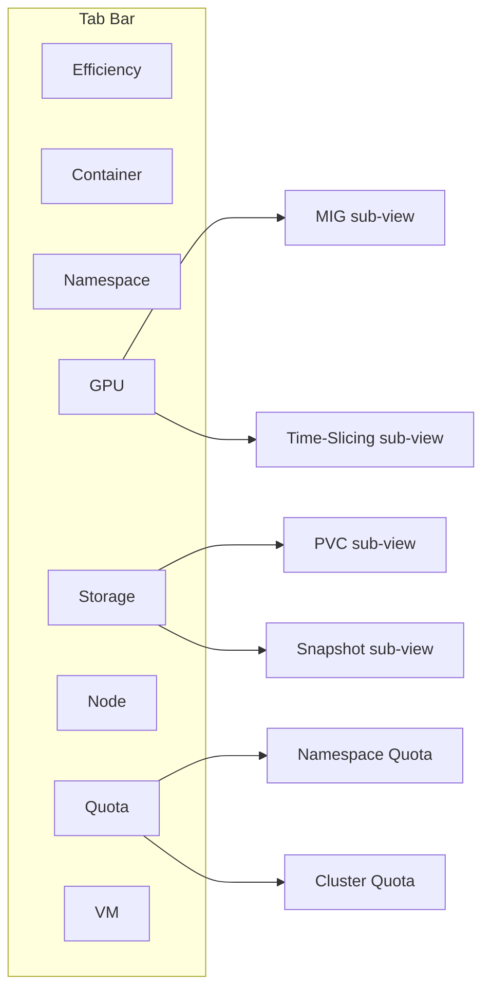

# Optimizations Tabs UI Implementation Plan

## Architecture

8 tabs in the Optimizations page, with 3 using internal ToggleGroups:



## Key Files

- Tab registration: `koku-ui/apps/koku-ui-hccm/src/routes/optimizations/optimizations.tsx`
- ROS MFE entry: `koku-ui/apps/koku-ui-ros/src/routes/optimizations/optimizationsDetails/optimizationsDetails.tsx`
- API types: `koku-ui/apps/koku-ui-ros/src/api/ros/`
- Module Federation config: `koku-ui/apps/koku-ui-ros/webpack-onprem.config.ts`
- Backend OpenAPI: `ros-ocp-backend/openapi.json`

## Pattern Per Tab

Each new tab follows this structure:

1. **API types** in `api/ros/{plugin}.ts` -- TypeScript interfaces matching openapi.json response
2. **List component** in `routes/optimizations/{plugin}Table/` -- PatternFly DataTable with sorting, pagination, filters
3. **Detail/Breakdown component** in `routes/optimizations/{plugin}Breakdown/` -- detail view when clicking a row
4. **Wrapper** for Module Federation exposure
5. **Registration** in the parent tab container and webpack config

## Implementation Phases

### Phase 0: Container Rename (trivial)

- Rename "Optimizations" tab label to "Container" in `optimizations.tsx`
- Update i18n message keys
- No structural changes

### Phase 1: Namespace Tab -- COMPLETED

- **Columns**: Namespace, Cluster, Memory Current/Change, CPU Current/Change, State, Potential Savings, Last Reported
- **API endpoint**: `GET /recommendations/openshift/namespaces`
- **Detail view**: Same structure as Container breakdown (YAML config cards, box plots, explanations) but without container/workload context; header shows project, cluster, savings, monitoring end time
- **Filters**: cluster, project, idle_state (select: active/idle/zombie), tag (text input: `key=value` format, converted to `tag:<key>=<value>` for the ROS API)
- **Group by**: cluster
- **Sort**: all columns sortable; default `cpu_variation_short_cost DESC` (surfaces biggest resource changes). When `estimated_monthly_savings` backend support is deployed and data is flowing, the UI should upgrade to `estimated_monthly_savings DESC` with a fallback to variation when all savings are null (see "Savings Fallback Sort" below)
- **Toggle**: Reuse interval (short/medium/long) and optimization type (cost/performance) selectors
- **URL state**: All filter, sort, and pagination state persisted in URL query params via `useUrlState` hook (prefix `ns_` for namespace, `ctr_` for container)
- **Tab badges**: Both Container and Namespace tabs show lazy count badges via `useRosCount`
- **Cross-tab nav**: Clicking a cluster name applies `filter[cluster]=X` on the same tab
- **Error handling**: 404/501 API responses render "No data available" (`NotConfigured`) instead of error state
- **Backend**: Migration 000149 adds `estimated_savings_cents`, `estimated_cpu_savings_cents`, `estimated_memory_savings_cents` to `namespace_recommendation_sets`; `ApplyNamespaceSavingsEstimates` engine function; `estimated_monthly_savings` added to `NsAllowedOrderBy` and OpenAPI spec

### Phase 2: Node Tab -- COMPLETED

Implemented in `koku-ui-ros` (list, detail, badge, projection toolbar) and wired in HCCM tab bar.

- **Columns**: Node, Cluster, CPU utilization (P50/P95), Memory utilization (P50/P95), Classification, Fleet reduction, Potential savings, Last reported
- **API endpoint**: `GET /recommendations/openshift/nodes`
- **Detail view**: Utilization percentile card (P50/P95 progress), sizing table, classification rationale alert (`instance_type_reason`), MachineSet name in header, expandable explanation factors (`include=explanation`), per-engine `node_count_reduction` and savings for the active term/engine projection
- **Filters**: cluster, node, classification, tag
- **Sort**: `node`, `estimated_monthly_savings`, `cpu_util_p95`, `mem_util_p95` (backend-supported); default `estimated_monthly_savings DESC`
- **Projection**: term/engine dropdowns on list; detail inherits selection via URL state (same pattern as Container/Namespace)
- **Manual testing notes (2026-06-23)**: List columns aligned to plan spec; detail uses metrics percentiles (no time-series plots — API provides aggregate P50/P95 only). Cross-cutting items (summary banner, group-by, cross-tab nav) remain in the plan's Cross-Cutting Concerns section.

### Phase 3: GPU Tab (with MIG/Time-Slicing toggle)

**Mockup first**, then implement.

- **Toggle**: MIG | Time-Slicing (PatternFly ToggleGroup, same pattern as Containers/Projects)

**MIG sub-view columns**: Container, Project, Workload, Cluster, GPU Model, Current Profile, Recommended Profile, Last Reported

- API: `GET /recommendations/openshift/gpu/mig`
- Filters: cluster, project, workload, gpu_model
- Group by: cluster, project
- Sort: all columns sortable; default `last_reported DESC` (no savings column)
- No savings field
- Detail: Shows profile comparison, utilization data

**Time-Slicing sub-view columns**: Node, Cluster, GPU Model, Current Replicas, Recommended Replicas, Impacted Containers (count), Savings, Last Reported

- API: `GET /recommendations/openshift/gpu/time-slicing`
- Filters: cluster, gpu_model
- Group by: cluster
- Sort: all columns sortable; default `estimated_monthly_savings DESC`
- Has savings
- Detail: Shows candidate containers, scheduling impact

### Phase 4: Storage Tab (with PVC/Snapshot toggle) — COMPLETED

Implemented in `koku-ui-ros` and wired in HCCM with `tab=storage` and `sub=pvc|snapshot` URL state.

- **Toggle**: PVC | Snapshots (PatternFly ToggleGroup; `sub` query param)
- **PVC columns**: PVC Name, Namespace, Cluster, Capacity, Usage %, Classification, Savings, Last Reported
- **Snapshot columns**: Snapshot Name, Namespace, Source PVC, Cluster, Age, Classification, Monthly Holding Cost, Last Reported
- **API**: `GET /recommendations/openshift/pvcs`, `GET /recommendations/openshift/snapshots`, `GET /pvcs/detail`
- **Projection**: term dropdown on PVC list (no engine — backend ignores engine for PVC)
- **Summary banner**: fleet `savings-summary` by_plugin for PVC; snapshot shows waste variant
- **PVC breakdown**: multi-term cards, usage history chart, explanation expander, notifications
- **Snapshot detail**: list-row modal (no dedicated detail endpoint); source PVC cross-nav to PVC sub-view
- **Filters**: `filter[pvc_name]` on PVC list and snapshot list (backend); storageclass on PVC list
- **Group by**: `group_by[cluster]` or `group_by[project]` on PVC and snapshot list APIs and Storage tab toolbar (aggregated rows with `count`, summed savings/cost)

### Cross-Cutting (mini sprint) — PARTIAL

- **URL state**: HCCM `tab` and `sub` query params (`useOptimizationsTabUrl`, `useOptimizationsSubUrl`)
- **Summary totals banner**: `OptimizationsTabSummaryBanner` on Container, Namespace, Node, PVC, Snapshot tabs
- **Deferred**: cross-tab navigation links, savings fallback sort, conditional tag visibility

### Phase 5: Quota Tab (with Namespace/Cluster toggle)

**Mockup first**, then implement.

- **Toggle**: Namespace Quota | Cluster Quota

**Namespace Quota columns**: Namespace, Cluster, CPU (Hard/Used/Rec), Memory (Hard/Used/Rec), Risk Level, Last Reported

- API: `GET /recommendations/openshift/quotas`
- Filters: cluster, namespace, risk_level
- Group by: cluster
- Sort: all columns sortable; default `risk_level DESC`
- Risk levels shown as severity badges

**Cluster Quota columns**: CQ Name, Cluster, Matched Namespaces (count), CPU (Hard/Used/Rec), Memory (Hard/Used/Rec), Risk Level, Last Reported

- API: `GET /recommendations/openshift/cluster-quotas`
- Filters: cluster, risk_level
- Group by: cluster
- Sort: all columns sortable; default `risk_level DESC`
- Detail: Shows list of matched namespaces

### Phase 6: VM Tab

**Mockup first**, then implement.

- **Columns**: VM Name, Namespace, Node, Cluster, vCPU (Current/Rec), Memory GiB (Current/Rec), State Flags (idle/abandoned/oversized badges), IO Profile, Savings, Last Reported
- **API endpoint**: `GET /recommendations/openshift/vms`
- **Detail view**: Most complex -- daily digests time series, disk projection, nested GPU sub-recommendation, power-off analysis
- **Filters**: cluster, namespace, node, is_idle, is_abandoned, is_oversized, is_network_bound, is_power_off_candidate, guest_os, tags
- **Group by**: cluster, namespace, node
- **Sort**: all columns sortable; default `estimated_monthly_savings DESC`

## Filter, Group By, and Sort Matrix

Every column shown in the table must be sortable (ascending/descending). Additionally, users must be able to sort by biggest waste or biggest savings. Filters and group_by are per-tab:

### Container (existing -- verify completeness)

- **Filter**: cluster, project, workload, workload_type, idle_state, tags
- **Group by**: cluster, project
- **Sort**: all columns + `estimated_monthly_savings` (money) + `estimated_monthly_waste` (waste)

### Namespace

- **Filter**: cluster, idle_state, tags
- **Group by**: cluster
- **Sort**: namespace, cluster, memory_current_request, memory_variation, cpu_current_request, cpu_variation, estimated_monthly_savings, last_reported

### Node

- **Filter**: cluster, classification
- **Group by**: cluster
- **Sort**: node, cluster, cpu_utilization_p95, memory_utilization_p95, classification, fleet_reduction, estimated_monthly_savings, last_reported

### GPU (MIG)

- **Filter**: cluster, project, workload, gpu_model
- **Group by**: cluster, project
- **Sort**: container, project, workload, cluster, gpu_model, last_reported
- **Note**: No savings column (MIG doesn't compute dollar savings)

### GPU (Time-Slicing)

- **Filter**: cluster, gpu_model
- **Group by**: cluster
- **Sort**: node, cluster, gpu_model, current_replicas, recommended_replicas, estimated_monthly_savings, last_reported

### Storage (PVC)

- **Filter**: cluster, namespace, classification, tags
- **Group by**: cluster, namespace
- **Sort**: pvc_name, namespace, cluster, capacity, usage_pct, classification, estimated_monthly_savings, last_reported

### Storage (Snapshot)

- **Filter**: cluster, namespace, classification, pvc_name
- **Group by**: cluster, namespace
- **Sort**: snapshot_name, namespace, pvc_name, cluster, age_days, classification, estimated_monthly_cost (waste), last_reported

### Quota (Namespace)

- **Filter**: cluster, namespace, risk_level
- **Group by**: cluster
- **Sort**: namespace, cluster, cpu_hard, cpu_used, cpu_recommended, memory_hard, memory_used, memory_recommended, risk_level, last_reported

### Quota (Cluster)

- **Filter**: cluster, risk_level
- **Group by**: cluster
- **Sort**: cluster_quota_name, cluster, matched_namespaces_count, risk_level, last_reported

### VM

- **Filter**: cluster, namespace, node, is_idle, is_abandoned, is_oversized, is_network_bound, is_power_off_candidate, guest_os, tags
- **Group by**: cluster, namespace, node
- **Sort**: vm_name, namespace, node, cluster, vcpu_current, vcpu_recommended, memory_current_gib, memory_recommended_gib, estimated_monthly_savings, last_reported

## Filter/Sort UX Pattern

- **Filter toolbar**: PatternFly `ToolbarFilter` chips with dropdown selectors (same pattern as existing Container tab)
- **Group by**: Dropdown in the toolbar that changes the table to show grouped rows with expandable sections
- **Sort**: Click column header to toggle asc/desc. Default sort per tab: `estimated_monthly_savings DESC` (or `estimated_monthly_cost DESC` for Snapshot, or `last_reported DESC` for MIG which has no savings)
- **Tag filter**: Dropdown shows enabled tag keys; selecting a key reveals a second dropdown for values (same pattern as Container tab)

## Cross-Cutting Concerns

- **Pagination**: All tabs use cursor-based pagination (same as Container)
- **CSV Export**: Verify each endpoint supports it; Snapshot has a separate `/snapshots/summary` rollup
- **Empty States**: Each tab needs "no recommendations" messaging when plugin has no data
- **Error Handling**: Backend may return 404 for plugins not yet deployed -- show "No data available" graceful empty state (not an error banner)
- **i18n**: All column headers and labels need intl message definitions
- **Testing**: After each phase, manual test against UXSNO to identify backend gaps
- **Backend verification**: Each filter/sort key must be supported by the backend `order_by` and `filter` query params. If not, file as a backend bug during manual testing.

### Savings Fallback Sort

Savings may be zero or unavailable when no cost information is flowing from Koku (e.g., no cost model assigned, or the cluster isn't connected to Koku). In this case:

1. **Primary sort**: `estimated_monthly_savings DESC` -- surfaces biggest dollar impact
2. **Fallback sort** (when all savings are null/zero): `cpu_variation_short_cost DESC` (or the relevant variation field) -- surfaces the biggest percentage change in resource usage

The UI should detect when all visible rows have null/zero savings and automatically apply the fallback sort. The "total variation" concept (replicas x individual variation) does not apply to namespaces since namespaces aggregate across all containers -- per-resource variation percentages (e.g., `cpu_variation_short_cost_pct`) are the appropriate metric.

### Conditional Tag Visibility

Tags are only available when Koku is providing tag data for the cluster. When tags are unavailable:

- The "Tag" filter option must **not appear** in the filter dropdown (not shown as an available choice)
- The "group by tag" option must **not appear** in the group-by dropdown
- This is determined by querying the Koku `/tags/openshift/` endpoint at page load; if it returns no tag keys for the relevant cluster, tag UI elements are hidden

For Phase 1, a simpler approach was implemented: the tag filter is always shown as a text input (`key=value` format). The conditional visibility based on Koku tag availability is deferred to a follow-up when the full Koku tag integration is wired through Module Federation.

## Tab Count Badges

Each tab label shows the total recommendation count for that plugin: `Container (47) | Namespace (12) | GPU (3) | ...`

- On page load, fire a parallel `GET /recommendations/openshift/{plugin}?limit=0` (or dedicated count endpoint) for each plugin to fetch just the `meta.count`
- Display as a PatternFly Badge next to the tab title
- Update the badge when filters change (only for the active tab -- don't re-fetch all counts on every filter change)
- Tabs with 0 count show `(0)` but remain clickable (not hidden)

## Summary Totals Banner

At the top of each tab, show an aggregate line:

> **Total potential savings: $X,XXX/month** across **N recommendations**

- Uses the summary/rollup endpoint if available, or sums from client-side page data as a fallback
- For Snapshot tab: "Total monthly waste: $X,XXX/month" (reframed as waste, not savings)
- For GPU MIG tab: "N recommendations" only (no dollar amount since MIG has no savings field)
- For Quota/Node tabs: include both savings and count

## Cross-Tab Navigation Links

Clickable entity names that navigate to the relevant tab pre-filtered:

- **Cluster name** (in any tab) -> stays on same tab but applies `filter[cluster]=X`
- **Namespace name** (in PVC, Snapshot, VM, Quota tabs) -> navigates to Namespace tab with `filter[namespace]=X`
- **Node name** (in GPU TS, VM tabs) -> navigates to Node tab with `filter[node]=X`
- **PVC name** (in Snapshot tab) -> navigates to Storage tab (PVC sub-view) with `filter[pvc_name]=X`
- **Container name** (in GPU MIG tab) -> navigates to Container tab with `filter[container]=X`

Implementation: use `react-router-dom` `useNavigate()` with `state` carrying the target tab + filter params.

## URL State Persistence

All view state lives in the URL query string for deep-linking and browser history:

- `tab` -- active tab index or key (container/namespace/gpu/storage/node/quota/vm)
- `sub` -- sub-toggle position (mig/ts, pvc/snapshot, ns_quota/cluster_quota)
- `filter[key]` -- active filters (multiple allowed)
- `order_by` -- sort column
- `order_how` -- asc/desc
- `after` -- pagination cursor
- `term` -- interval (short_term/medium_term/long_term) where applicable
- `engine` -- optimization type (cost/performance) where applicable

Pattern: use a shared `useUrlState()` hook that syncs React state to/from `URLSearchParams` via `useSearchParams()`. The existing Container tab already partially does this -- extend the pattern.

## Backend Readiness Pre-Check

Before implementing each tab, verify with curl that the endpoint exists and returns the expected shape on UXSNO:

```bash
curl -s -H "Authorization: Bearer $TOKEN" \
  "https://$ROS_API/recommendations/openshift/{plugin}?limit=1" | jq '.data[0] | keys'
```

Document any discrepancies between openapi.json and actual response as backend bugs. If an endpoint returns 404 or 501, implement the tab with mock/empty state and note the backend gap.

## Notification Codes Display

Each plugin has its own notification codes (data quality, configuration warnings, etc.):

- **List view**: Show a warning icon (PatternFly `ExclamationTriangleIcon`) in the State column with a tooltip listing active notification codes
- **Detail view**: Show full notification messages as inline `Alert` components (same pattern as Container breakdown)
- Verify each plugin's notification codes are handled -- unknown codes should show a generic "recommendation has notifications" indicator rather than crashing

## Deliverables Per Phase

1. Wireframe mockup (image) -- reviewed before coding
2. TypeScript API types
3. List table component
4. Detail/breakdown component
5. Module Federation wiring
6. Manual testing notes (bugs found)
