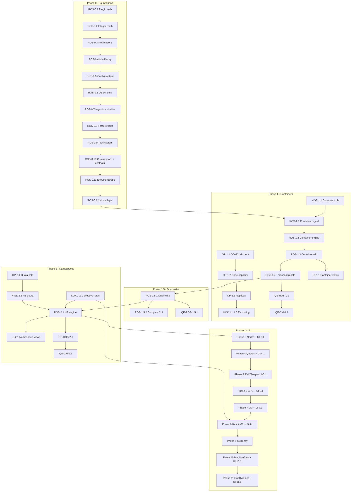

# robne Upstreaming PR Plan

This document defines every PR needed to upstream the native recommendation engine (robne) across 7 repositories, in the exact order they must be merged. Each PR has a description, its contents, and when it must land relative to other PRs.

**Repositories involved:**
- `ros-ocp-backend` (ROS) -- 331 Go files, 317 migration files, ~1.9M lines of change
- `koku-metrics-operator` (OP) -- 42 commits (new CSV columns, new collectors)
- `koku` (KOKU) -- 40 commits (routing, effective-rates, tags, reship)
- `nise` (NISE) -- 62 commits (new CSV generators, scenarios)
- `koku-ui` (UI) -- new development by the UI team, one PR per feature phase
- `iqe-ros-ocp-plugin` (IQE-ROS) -- 85 commits
- `iqe-cost-management-plugin` (IQE-CM) -- 60 commits

**Key principles:**
- PRs are organized into Phases. Within each phase, PRs have a strict merge order indicated by numbers (e.g., PR 0.1 before PR 0.2). Cross-repo dependencies are explicit: if PR ROS-1.3 depends on PR OP-1.1, that means OP-1.1 must be merged first.
- Every feature phase that changes the API surface includes a corresponding **UI PR** describing the frontend work needed. The koku-ui developer writes new code to consume robne's API -- UI PRs are not extraction from the fork.
- Cost data integration and currency conversion are **adjacent phases** because they share the same Koku integration surface.

---

## Legend

- **ROS-X.Y** = ros-ocp-backend PR, Phase X, sequence Y
- **OP-X.Y** = koku-metrics-operator PR
- **KOKU-X.Y** = koku PR
- **NISE-X.Y** = nise PR
- **UI-X.Y** = koku-ui PR (new code by UI team, not extraction)
- **IQE-ROS-X.Y** = iqe-ros-ocp-plugin PR
- **IQE-CM-X.Y** = iqe-cost-management-plugin PR

---

## Phase 0 -- Foundations (merge first, before any feature)

These PRs establish the infrastructure that all subsequent features depend on. They contain no user-visible behavior changes. Merge them in the order listed.

### ROS-0.1: Plugin architecture and engine abstraction

**Merge:** First PR to merge, before anything else.

**Description:** Introduces the plugin registry that allows robne and Kruize to coexist. This is the architectural foundation: the `RecommendationPlugin` interface, plugin lifecycle management, the Kruize compatibility adapter, and the disabled-plugin integration tests. Without this, no robne code can run.

**Contents:**
- `internal/plugins/plugins.go` -- Plugin interface and registry (~250 lines)
- `internal/plugins/kruize/` -- Kruize adapter (5 files, ~760 lines) that wraps the existing Kruize HTTP API behind the plugin interface, so Kruize continues working identically
- `internal/plugins/example/` -- Example plugin for documentation
- Plugin lifecycle integration tests
- Disabled-plugin integration test (verifies Kruize keeps working when robne is not registered)
- ADR-0001: Native engine over Kruize

### ROS-0.2: Integer math, MoneyAmount, and percentile band engine core

**Merge:** Immediately after ROS-0.1.

**Description:** The mathematical foundation of robne. All cost calculations use integer cents (not floating-point dollars) to avoid rounding errors. Percentile bands replace Kruize's boxplots for a more useful statistical model. The `MoneyAmount` API type provides structured currency responses (`{"value": "12.34", "units": "USD"}`) instead of bare floats.

**Contents:**
- `internal/money/` -- `MoneyAmount` struct, cents-to-MoneyAmount formatting, currency conversion helpers (2 files, ~320 lines)
- `internal/engine/core/types.go` -- Core data types: `PercentileBand`, `RecommendationSet`, `Term` definitions (~256 lines)
- `internal/engine/core/percentile.go` -- P50/P95/P99 percentile computation using integer arithmetic
- `internal/engine/core/margin.go`, `margin_scaled.go` -- Adaptive margin calculation (P95-P50 spread)
- `internal/engine/core/confidence.go` -- Data volume confidence scoring
- `internal/engine/core/trend.go` -- Usage trend detection
- `internal/engine/core/savings_int.go` -- Savings estimation in integer cents (~213 lines + 105 lines tests)
- ADR-0002 (exact percentiles), ADR-0064 (MoneyAmount/cents), ADR-0007 (adaptive margin), ADR-0040 (negative savings), ADR-0041 (savings on all-hours only)

### ROS-0.3: Notification codes and explanation system

**Merge:** After ROS-0.2.

**Description:** Robne uses numeric notification codes (1-77) instead of Kruize's string messages. Each code maps to a human-readable name and an explanation of why a recommendation was made. This system is used by every recommendation type (container, namespace, node, GPU, VM, PVC, snapshot, quota).

**Contents:**
- `internal/notifications/` -- Notification catalog, code-to-name mapping, bitmap operations (3 files, ~583 lines)
- `internal/engine/core/notifications.go`, `notifications_bitmap.go` -- Bitmap encoding for efficient storage (~128 lines)
- `internal/engine/core/explanation.go`, `explanation_persist.go` -- Human-readable explanation generation (~384 lines)
- ADR-0038 (notification code bitmap 1-63)

### ROS-0.4: Idle detection and data decay

**Merge:** After ROS-0.3.

**Description:** Idle/zombie/active workload classification and exponential data decay. Idle detection identifies workloads consuming negligible resources (below configurable thresholds). Decay weights recent data higher than old data using half-life curves, so stale usage patterns fade from recommendations. Both are used by container, namespace, and node recommendations.

**Contents:**
- `internal/engine/core/idle_classification.go` -- Three-state idle/zombie/active classifier (~298 lines)
- `internal/engine/core/detect_idle.go` -- Threshold-based idle detection
- `internal/engine/core/decay.go` -- Exponential decay with configurable half-life (~158 lines)
- `internal/engine/core/decay_table.go` -- Precomputed decay lookup table (~72 lines)
- ADR-0005 (decay half-life), ADR-0011 (fixed idle thresholds), ADR-0012 (three-state classification), ADR-0013 (inline idle classification)

### ROS-0.5: Configurability system (env vars, global locks, security)

**Merge:** After ROS-0.4.

**Description:** The configuration system that controls robne behavior via environment variables and runtime settings. Includes the security enforcement model (graduated security levels), config validation, and global settings locks (admin can lock threshold settings to prevent per-user overrides). This is needed before any feature that has configurable thresholds.

**Contents:**
- `internal/config/config.go` -- Main configuration with all env vars (~1,191 lines)
- `internal/config/config_validation.go` -- Startup validation (~55 lines)
- `internal/config/env.go` -- Environment variable parsing helpers (~20 lines)
- `internal/config/security.go` -- Graduated security enforcement (~205 lines)
- `internal/config/tags.go` -- Tag filtering configuration (~57 lines)
- `internal/config/business_hours.go` -- Business hours schedule config (~18 lines)
- `internal/config/visual_insights.go` -- Visual insight thresholds (~35 lines)
- `internal/api/settings_locked.go` -- Global lock enforcement on settings endpoints
- `internal/api/settings_rbac.go` -- RBAC for settings endpoints

### ROS-0.6: Database schema -- core tables and digest infrastructure

**Merge:** After ROS-0.5.

**Description:** The core database migrations that create the tables robne needs. This includes the digest tables (pre-aggregated hourly data that the engine reads), the recommendation output tables, the settings tables, and the quality/history tracking tables. These are SQL migrations only -- no application logic.

**Contents:**
- Migrations 1-60 (approximately): Core schema for container digests, recommendation sets, threshold settings, quality scores, recommendation history, explanation storage
- `scripts/lint-migrations.sh` + `scripts/lint_migrations_test.go` -- Migration linter (ensures migration naming and ordering conventions)
- Does NOT include feature-specific tables (namespace, node, GPU, etc.) -- those come in their respective feature phases

### ROS-0.7: Ingestion pipeline -- CSV parsing and digest computation

**Merge:** After ROS-0.6.

**Description:** The streaming CSV parser and digest builder that processes operator-generated CSV files into pre-aggregated hourly digests stored in PostgreSQL. This is the "read once" architecture: raw CSV data is parsed, aggregated into digests, and discarded. The engine then reads digests, never raw CSV. Includes deadlock retry logic and business-hours schedule awareness.

**Contents:**
- `internal/ingestion/csvparser.go` -- Streaming CSV parser with type-safe column mapping
- `internal/ingestion/csverrors.go` -- CSV error handling and validation
- `internal/ingestion/digest.go` -- Container digest builder (hourly pre-aggregation)
- `internal/ingestion/pipeline.go`, `pipeline_stream.go` -- Main ingestion pipeline orchestration
- `internal/ingestion/ingest_single_tx.go` -- Single-transaction ingestion for atomicity
- `internal/ingestion/models.go` -- Ingestion data models
- `internal/ingestion/schedule_type.go` -- Business hours schedule type detection
- `internal/ingestion/deadlock_retry.go` -- PostgreSQL deadlock retry with exponential backoff
- `internal/ingestion/business_hours.go` -- Business hours classification during ingestion
- `internal/services/report_processor.go` -- Report processing service
- `internal/services/report_file_tracker.go` -- File tracking and deduplication
- `internal/services/parallel_ingest.go` -- Parallel ingestion orchestration
- `internal/services/kafka_processing_errors.go`, `kafka_retry.go` -- Kafka error handling
- `internal/services/poison_message_log.go` -- Poison message isolation
- `internal/services/manifest_recommendation_debouncer.go` -- Debounce rapid re-recommendations
- ADR-0003 (read-once compute-N-terms), ADR-0325 (stdlib CSV over dataframe)

### ROS-0.8: Feature flags infrastructure (rosocp.engine-mode)

**Merge:** After ROS-0.7.

**Description:** The Unleash feature flag integration for controlling which engine runs and which engine's results are displayed. Implements the single `rosocp.engine-mode` flag with four variants: `kruize-only` (default), `dual-write-kruize`, `dual-write-robne`, `robne-only`. Includes helper functions `EngineMode()`, `RobneRuns()`, `KruizeRuns()`, `DisplaysRobne()` that are called per-request by org_id.

**Contents:**
- `internal/featureflags/flags.go` -- Engine mode helpers and variant parsing
- ADR-0322 (temporary dual-write Kruize-robne SaaS migration)

### ROS-0.9: Tags system and API middleware

**Merge:** After ROS-0.8.

**Description:** The tag filtering system that allows users to filter recommendations by OpenShift labels/tags. Includes tag synchronization with Koku (both API-push and DB-read paths), tag validation, RBAC-scoped tag intersection, and the tag enrichment middleware that adds tag data to API list responses.

**Contents:**
- `internal/tags/` -- 9 files (~1,654 lines): sync service, auth, validation, DB/API providers, startup verification
- `internal/api/tag_enrichment.go` -- Tag data injection into list responses
- `internal/api/tag_warnings.go` -- Tag sync status warnings
- `internal/api/handlers_tags_status.go` -- GET /tags/status endpoint
- `internal/api/handlers_tags_sync.go` -- POST /internal/tags/sync endpoint

### ROS-0.10: Common API infrastructure and cost data provider

**Merge:** After ROS-0.9.

**Description:** Shared API infrastructure used by all recommendation endpoints, plus the cost data provider that calls Koku's effective-rates endpoint for savings estimation. Includes: cursor-based and keyset pagination, CSV export streaming, engine filter middleware, list enrichment, notification codes endpoint, capabilities endpoint, workload types endpoint, terms/projections endpoint, OpenAPI handler, rate limiter middleware, and the `internal/costdata/` package (HTTP client for Koku integration with graceful fallback when Koku is unavailable).

**Contents:**
- `internal/costdata/provider.go` -- CostDataProvider interface, HTTP client for Koku effective-rates (~523 lines)
- `internal/costdata/conversion.go` -- Currency conversion logic
- `internal/costdata/currency.go` -- Currency provider (fetches user currency and exchange rates from Koku)
- `internal/costdata/metrics.go` -- Prometheus metrics for cost data fetching
- `internal/api/cursor.go` -- Cursor-based pagination
- `internal/api/pagination_keyset.go` -- Keyset pagination for large datasets
- `internal/api/handlers_list_keyset.go` -- Keyset pagination handler
- `internal/api/csv_helpers.go`, `csv_sanitize.go`, `csv_stream.go` -- CSV export streaming
- `internal/api/handlers_list_csv.go` -- CSV export endpoint
- `internal/api/engine_filter.go` -- Filter responses by engine (robne vs Kruize)
- `internal/api/list_enrichment.go` -- GPU/tag data injection into list responses
- `internal/api/list_projection_filter.go` -- Term/engine projection filtering
- `internal/api/list_response_options.go` -- Pagination and response formatting
- `internal/api/include_params.go` -- `?include=` parameter handling
- `internal/api/handlers_notification_codes.go` -- GET /notification-codes catalog
- `internal/api/handlers_capabilities.go` -- GET /capabilities (feature discovery)
- `internal/api/handlers_workload_types.go` -- GET /workload-types
- `internal/api/handlers_terms.go` -- GET /terms (short/medium/long term definitions)
- `internal/api/openapi_handler.go` -- Serve OpenAPI spec at runtime
- `internal/api/currency.go` -- Currency conversion at API response time
- `internal/api/middleware/rate_limiter.go` -- Request rate limiting
- `internal/api/middleware/entitlement.go` -- Entitlement checking
- `internal/api/middleware/identity.go` -- Identity header parsing
- `internal/api/middleware/rbac.go`, `rbac_cache.go` -- RBAC enforcement and caching
- `internal/api/identity_context.go` -- Request-scoped identity
- `internal/api/internal_endpoints.go` -- Internal (non-public) endpoints
- `internal/api/internal_tags_auth.go` -- Internal tag auth
- `internal/api/server.go` -- HTTP server setup and route registration
- `internal/api/common.go`, `utils.go` -- Shared helpers
- ADR-0327 (API-time currency conversion)

### ROS-0.11: Application entrypoints, async jobs, and operational infrastructure

**Merge:** After ROS-0.10.

**Description:** The main application entrypoints (`cmd/`), background job infrastructure (graceful shutdown), debug/pprof endpoints, and the services layer that ties ingestion to recommendation generation.

**Contents:**
- `cmd/root.go` -- Cobra root command (~24 lines)
- `cmd/start.go` -- Main server startup, wires up all services (~172 lines)
- `cmd/db.go` -- Database migration command (~436 lines)
- `cmd/aggregator.go` -- Aggregation entrypoint (~73 lines)
- `internal/asyncjobs/shutdown.go` -- Graceful shutdown coordinator
- `internal/debug/pprof.go` -- Runtime profiling endpoint
- `internal/services/metrics.go` -- Prometheus metrics for the pipeline
- `internal/services/utils.go` -- Service utilities
- `internal/services/housekeeper/` -- Partition cleanup and source cleanup (~696 lines)

### ROS-0.12: Model layer -- all shared API response types

**Merge:** After ROS-0.11.

**Description:** The Go structs that define all API response shapes. These are shared across features -- a single PR avoids circular dependencies. Includes list/detail response wrappers, pagination types, quality models, history models, and the native query allowlist for raw SQL queries.

**Contents:**
- `internal/model/` -- 55 files covering all response types: `list_response.go`, `detail_response.go`, `recommendation_set.go`, `recommendation_quality.go`, `recommendation_history.go`, `historical_recommendation_set.go`, `org_recommendation_stats.go`, `native_pgx_scan.go`, `native_query_allowlist.go`, and all entity-specific models (container, namespace, node, GPU, VM, PVC, snapshot, quota, machineset, OOM, workload metrics, tag filters, etc.)
- `scripts/ros_ocp_backend.postman_collection.json` -- Postman collection for manual API testing

---

## Phase 1 -- Container Recommendations (the core feature)

This is the first user-visible feature. It replaces Kruize's container right-sizing with robne's engine. After this phase, the system can generate container CPU/memory recommendations with percentile bands, idle detection, business hours, savings estimates, and quality scores.

> **Business hours limitation (Phases 1 through 8):** Business hours classification works correctly for all newly ingested data from Phase 1 onward. However, the reship mechanism (Phase 8) is needed to re-classify historical data when a user changes their business hours schedule. Until Phase 8, schedule changes only apply prospectively -- old data retains its original classification. This is acceptable because business hours schedules are typically set once and rarely changed.

### OP-1.1: Add OOM count and workload pod count to ROS container CSV

**Merge:** First in Phase 1 (before any ROS container work needs the data).

**Description:** Adds two new columns to the ROS container CSV that the operator generates: `oom_count` (number of OOM kills per container per hour) and `workload_pod_count` (number of replicas). Robne uses OOM count to apply logarithmic memory bumps and pod count for fleet-wide aggregation. Includes PromQL queries for both metrics and unit tests.

**Contents:**
- OOM count PromQL query and CSV column
- Workload pod count PromQL query and CSV column
- Golden fixture updates
- Unit tests for both new columns

### OP-1.2: Add node capacity and instance type to ROS container CSV

**Merge:** After OP-1.1.

**Description:** Adds `node_capacity_cpu_cores`, `node_capacity_memory_bytes`, and `instance_type` columns to the ROS container CSV. Robne uses node capacity for right-sizing ceiling calculations and instance type for node consolidation grouping.

**Contents:**
- Node capacity CPU/memory PromQL queries
- Instance type label extraction
- CSV column additions
- Golden fixture updates

### OP-1.3: Add desired/available replicas to ROS container CSV

**Merge:** After OP-1.2.

**Description:** Adds `desired_replicas` and `available_replicas` columns for scale-to-zero and under-replicated workload detection.

**Contents:**
- Replica count PromQL queries (from Deployment/StatefulSet/ReplicaSet)
- DeploymentConfig support
- CSV column additions

### NISE-1.1: Add new container CSV columns to nise OCP generator

**Merge:** After OP-1.3 (or in parallel -- nise is independent).

**Description:** Updates the nise OCP data generator to produce the new CSV columns added by OP-1.1 through OP-1.3 (oom_count, workload_pod_count, node_capacity_cpu_cores, node_capacity_memory_bytes, instance_type, desired_replicas, available_replicas). Also includes GPU profiling metrics in the container CSV.

**Contents:**
- OOM count generation from static YAML
- Pod count, node capacity, instance type, replica columns
- GPU profiling metrics (DCGM-style model names)
- Unit test updates

### ROS-1.1: Container ingestion and digest computation

**Merge:** After ROS-0.12 and NISE-1.1 (needs schema and nise test data).

**Description:** The container-specific ingestion that reads operator CSV files and builds hourly container digests. This is the "read side" -- it parses the container CSV (with all the new columns from OP-1.x), computes digests (min/max/avg/percentile aggregates per container per hour), and writes them to the `daily_container_digests` table.

**Contents:**
- Container-specific CSV column mapping in `internal/ingestion/csvparser.go`
- Container digest computation (extends `internal/ingestion/digest.go`)
- Container digest database table migrations (within the 60-180 migration range)
- Business hours container digest variant

### ROS-1.2: Container recommendation engine

**Merge:** After ROS-1.1.

**Description:** The container recommendation engine that reads digests, applies the robne algorithm (percentile-based sizing with adaptive margins, decay weighting, OOM bump logic), and produces CPU/memory recommendations for short/medium/long terms. Includes cost/performance dual-row generation, quality scoring, and savings estimation.

**Contents:**
- `internal/engine/container/` -- Container recommendation engine (~1,209 lines)
- `internal/plugins/container/` -- Container plugin registration
- `internal/engine/core/cost_rates.go` -- Cost rate lookup for savings
- Quality scoring for container recommendations
- ADR-0004 (dual cost/performance rows), ADR-0006 (P60 vs P98 CPU), ADR-0008 (25-millcore floor), ADR-0009 (limit = request * 1.05), ADR-0010 (logarithmic OOM bump)

### ROS-1.3: Container API endpoints

**Merge:** After ROS-1.2.

**Description:** The REST API endpoints for container recommendations: list with pagination, detail, settings (threshold configuration), quality scores, history, business hours recommendations, savings summary, fleet heatmap, OOM timeline, and CSV export. This is what the UI calls.

**Contents:**
- `internal/api/handlers.go` -- Container list and detail
- `internal/api/handlers_list_keyset.go` -- Container keyset pagination
- `internal/api/handlers_quality.go` -- Container quality scores
- `internal/api/handlers_history.go` -- Container recommendation history
- `internal/api/handlers_threshold_settings.go` -- Container threshold settings (GET/PUT/DELETE)
- `internal/api/threshold_settings_routes.go` -- Threshold settings route registration
- `internal/api/handlers_business_hours_settings.go` -- Business hours settings
- `internal/api/handlers_idle_detection_settings.go` -- Idle detection settings
- `internal/api/handlers_oom_timeline.go` -- OOM timeline endpoint
- `internal/api/handlers_savings_summary.go` -- Savings summary with tag breakdown
- `internal/api/handlers_savings_summary_tag.go` -- Savings by tag
- `internal/api/handlers_savings_recalculate.go` -- POST /internal/recalculate-savings
- `internal/api/handlers_fleet.go` -- Fleet summary
- `internal/api/handlers_fleet_heatmap.go` -- Fleet heatmap (hourly grid)

### ROS-1.4: Threshold recalculation engine

**Merge:** After ROS-1.3.

**Description:** The cross-entity threshold recalculation engine that recomputes recommendations when a user changes threshold settings (e.g., idle CPU threshold, memory headroom). Without this, settings changes have no effect until the next data ingestion cycle. Used by containers (Phase 1), and later by namespaces, nodes, etc.

**Contents:**
- `internal/engine/threshold_recalculate.go` -- Recalculation orchestrator (~580 lines)
- `internal/engine/threshold_recalc_guard.go` -- Concurrency guard to prevent overlapping recalculations (~73 lines)
- `internal/engine/threshold_recalc_state.go` -- Recalculation state tracking (~121 lines)
- Full test suite (~561 lines)

### KOKU-1.1: Route new CSV types to ROS Kafka topic

**Merge:** After OP-1.3 (operator produces the CSVs, Koku needs to route them).

**Description:** Updates Koku's CSV file routing to send the new ROS-relevant file types (storage-usage, snapshot-inventory) to the ROS Kafka topic via `ROS_EXTRA_PATTERNS`. For Phase 1, the critical routing is ensuring container CSV files with the new columns are properly forwarded.

**Contents:**
- Add `ROS_EXTRA_PATTERNS` for storage-usage and snapshot-inventory CSV routing
- Regression tests for routing patterns
- CSV processing doc updates

### UI-1.1: Container recommendation views

**Merge:** After ROS-1.3 (container API must exist).

**Description:** Updates the koku-ui frontend to consume robne's container recommendation API. Replaces Kruize boxplots with percentile band visualizations, bare float costs with `MoneyAmount` structured responses, and Kruize string messages with notification codes. Adds term/engine projection toolbar and container recommendation list/detail views.

**Contents (new development by UI team):**
- Container recommendation list with percentile bands
- Container recommendation detail view
- Term/engine projection toolbar (`OptimizationsProjectionToolbar`)
- Threshold settings UI
- Business hours settings UI
- Quality scores tab
- OOM timeline visualization
- Savings summary with tag breakdown
- Fleet heatmap
- Notification code display

### IQE-ROS-1.1: Container recommendation IQE tests

**Merge:** After ROS-1.4 (needs the full container feature including threshold recalc).

**Description:** Comprehensive IQE test coverage for container recommendations: list pagination, detail, filters (idle_state, namespace, workload_type, gpu_model, engine), order_by, settings CRUD, business hours, quality, history, savings, notification codes, CSV export, keyset pagination, and tag filtering.

### IQE-CM-1.1: Container recommendation IQE-CM tests

**Merge:** After IQE-ROS-1.1 (or in parallel).

**Description:** The iqe-cost-management-plugin counterpart of container tests. Migrates existing ROS tests from IQE-CM to stubs pointing to iqe-ros-ocp-plugin, and adds new container-specific tests that run in the HCCM CI pipeline.

---

## Phase 1.5 -- Dual-Write Infrastructure

This phase implements the mechanism that allows robne and Kruize to run simultaneously. It must land AFTER container recommendations (Phase 1) so there is something to dual-write, and BEFORE namespace recommendations (Phase 2) so the SaaS team can validate robne on real traffic.

See [dual-write-plan.md](dual-write-plan.md) for the full dual-write implementation plan.

### ROS-1.5.1: Dual-write orchestration

**Merge:** After ROS-1.4 (container feature complete).

**Description:** Implements the dual-write execution logic: when `rosocp.engine-mode` is `dual-write-kruize` or `dual-write-robne`, both engines process the same CSV data and persist their results independently. The `DisplaysRobne()` helper determines which engine's results are returned by the API. Includes metrics to compare robne vs Kruize outputs (recommendation count differences, timing ratios).

**Contents:**
- Dual-write orchestration in recommendation poller
- `internal/services/recommendation_poller.go` -- Modified to call both engines based on feature flag
- Per-engine result storage (separate rows or columns)
- `internal/api/engine_filter.go` -- API-level engine selection based on `DisplaysRobne(orgID)`
- Comparison metrics (Prometheus counters for divergence)
- Integration tests for all four engine-mode variants

### ROS-1.5.2: Offline comparison CLI and benchmark runner

**Merge:** After ROS-1.5.1 (or in parallel).

**Description:** The offline robne-vs-Kruize comparison CLI from ADR-0140 (useful for dual-write validation without production traffic) and the benchmark runner for performance testing.

**Contents:**
- `cmd/compare/main.go` -- Offline comparison CLI (~1,039 lines)
- `cmd/bench/main.go` -- Benchmark runner (~441 lines)

### IQE-ROS-1.5.1: Dual-write IQE tests

**Merge:** After ROS-1.5.1.

**Description:** IQE tests that validate dual-write behavior: verify both engines produce results, verify the correct engine is displayed based on the flag, verify filter[engine] works, and verify the divergence test scenario.

---

## Phase 2 -- Namespace Recommendations

### OP-2.1: Add ResourceQuota used metrics to ROS namespace CSV

**Merge:** First in Phase 2.

**Description:** Adds `quota_cpu_requests_used`, `quota_memory_requests_used`, `quota_cpu_limits_used`, `quota_memory_limits_used` columns to the ROS namespace CSV. Robne uses these to compute namespace quota utilization and right-sizing.

### NISE-2.1: Add namespace quota columns to nise

**Merge:** After OP-2.1 (or in parallel).

**Description:** Updates nise to generate the new namespace quota columns in the ROS namespace CSV, including `quota_name` and extended ResourceQuota fields.

### ROS-2.1: Namespace ingestion and engine

**Merge:** After ROS-1.5.1 and NISE-2.1.

**Description:** Namespace-level ingestion, digest computation, recommendation engine, and API endpoints. Namespaces aggregate container-level data and produce namespace-scoped CPU/memory recommendations with idle detection and savings estimates. Includes namespace history.

**Contents:**
- `internal/ingestion/namespace.go`, `namespace_stream.go`, `namespace_quota.go` -- Namespace CSV parsing and digest computation
- `internal/engine/namespace/` -- Namespace recommendation engine (~284 lines + history)
- Namespace API handlers (list, detail, settings, history, quality)
- Namespace-specific migrations
- ADR-0014 (namespace idle after container, GPU priority 90)

### KOKU-2.1: Add effective-rates Masu endpoint

**Merge:** After ROS-2.1 is ready for testing (but can merge earlier if convenient). **Not blocking for Phase 1 because robne produces recommendations without savings when rates are unavailable. Blocking for accurate savings in Phase 2+.**

**Description:** Adds the `/api/cost-management/v1/effective-rates/` Masu endpoint that returns cost model rates and namespace-level cost aggregates per cluster. ROS calls this endpoint to compute dollar savings estimates. Without it, recommendations still work but savings values are zero/omitted.

### UI-2.1: Namespace recommendation views

**Merge:** After ROS-2.1 (namespace API must exist).

**Description:** Adds namespace recommendation tab to the Optimizations page. Loads the namespace recommendations table, detail view, settings, history, and quality scores from the ROS API.

**Contents (new development by UI team):**
- Namespace recommendation list tab in Optimizations page
- Namespace detail view
- Namespace settings UI
- Namespace history and quality tabs

### IQE-ROS-2.1: Namespace recommendation IQE tests

**Merge:** After ROS-2.1.

### IQE-CM-2.1: Namespace recommendation IQE-CM tests

**Merge:** After IQE-ROS-2.1 (or in parallel).

---

## Phase 3 -- Node Recommendations

### OP-3.1: Unify node allocatable/capacity queries

**Merge:** First in Phase 3.

**Description:** Consolidates 6 separate node allocatable/capacity PromQL queries into 2 unified queries. Adds `node_allocatable_gpu_count` for GPU-aware node right-sizing.

### NISE-3.1: Add node diversity example data

**Merge:** After OP-3.1 (or in parallel).

### ROS-3.1: Node ingestion, engine, and API

**Merge:** After ROS-2.1 and OP-3.1.

**Description:** Node-level ingestion (node hourly digests), the node recommendation engine (target utilization, cost consolidation, stranded resource detection, imbalance scoring), and all node API endpoints.

**Contents:**
- `internal/ingestion/node_digest.go`, `node_hourly_digest.go` -- Node digest computation
- `internal/engine/node/` -- Node recommendation engine (~2,681 lines)
- Node API handlers: `handlers_node_recs.go`, `handlers_node_detail.go`, `handlers_node_hourly.go`, `handlers_node_utilization.go`, `handlers_node_recs_group.go`, `handlers_node_recs_persist.go`, `handlers_node_util_pagination.go`, `handlers_node_utilization_group.go`, `node_page_limits.go`
- ADR-0015 (target utilization 80% vs 55%), ADR-0016 (cost consolidation), ADR-0017 (EMA-smoothed imbalance), ADR-0018 (operator node allocatable)

### UI-3.1: Node recommendation views

**Merge:** After ROS-3.1 (node API must exist).

**Description:** Adds node recommendation tab to the Optimizations page with node utilization heatmap, consolidation suggestions, stranded resource indicators, and node detail views.

### IQE-ROS-3.1: Node recommendation IQE tests

**Merge:** After ROS-3.1.

### IQE-CM-3.1: Node recommendation IQE-CM tests

**Merge:** After IQE-ROS-3.1 (or in parallel).

---

## Phase 4 -- Namespace and Cluster Quota Recommendations

### OP-4.1: Add ClusterResourceQuota metrics collection

**Merge:** First in Phase 4.

**Description:** Adds ClusterResourceQuota (CRQ) metrics collection and CSV generation to the operator. CRQs are OpenShift-specific multi-namespace quota objects.

### NISE-4.1: Add CRQ and interval columns to nise

**Merge:** After OP-4.1 (or in parallel).

### ROS-4.1: Quota and CRQ engine and API

**Merge:** After ROS-3.1 and OP-4.1.

**Description:** ResourceQuota and ClusterResourceQuota recommendation engines and API endpoints. Quotas recommend right-sized resource limits based on actual namespace usage with headroom margins and risk bands.

**Contents:**
- `internal/ingestion/cluster_quota.go` -- CRQ CSV parsing
- `internal/engine/quota/` -- Quota recommendation engine (~2,044 lines)
- Quota and CRQ API handlers
- ADR-0028 (quota engine), ADR-0029 (headroom 10%, risk bands), ADR-0030 (quota after container, CRQ after namespace)

### UI-4.1: Quota and CRQ recommendation views

**Merge:** After ROS-4.1 (quota API must exist).

**Description:** Adds quota recommendation views showing right-sizing suggestions for ResourceQuotas and ClusterResourceQuotas with risk band visualization.

### IQE-ROS-4.1: Quota and CRQ IQE tests

**Merge:** After ROS-4.1.

### IQE-CM-4.1: Quota and CRQ IQE-CM tests

**Merge:** After IQE-ROS-4.1 (or in parallel).

---

## Phase 5 -- PVC and Stale Snapshot Recommendations

### OP-5.1: Route storage CSV to ROS and add snapshot collector

**Merge:** First in Phase 5.

**Description:** Adds VolumeSnapshot inventory collection to the operator (new collector) and includes the storage CSV in `resource_optimization_files` so Koku routes it to ROS.

### NISE-5.1: Add PVC/storage and snapshot CSV generation

**Merge:** After OP-5.1 (or in parallel).

### ROS-5.1: PVC and snapshot engines and API

**Merge:** After ROS-4.1 and OP-5.1.

**Description:** PVC right-sizing (oversized/near-full detection with resize recommendations) and stale snapshot management (age-based priority rules, reclaimable cost estimation).

**Contents:**
- `internal/engine/pvc/` -- PVC recommendation engine (~1,436 lines)
- `internal/engine/snapshot/` -- Snapshot recommendation engine (~1,443 lines)
- PVC and Snapshot API handlers
- `internal/api/handlers_storage_groupby.go` -- Storage group-by handler
- ADR-0025 (PVC thresholds), ADR-0026 (PVC size formula), ADR-0027 (PVC longer terms zero decay), ADR-0031 (snapshot priority rules), ADR-0032 (snapshot restore-size for cost)

### UI-5.1: PVC and snapshot recommendation views

**Merge:** After ROS-5.1 (PVC/snapshot API must exist).

**Description:** Adds PVC and snapshot recommendation views showing storage right-sizing and stale snapshot cleanup suggestions with age distribution visualization.

### IQE-ROS-5.1: PVC and snapshot IQE tests

**Merge:** After ROS-5.1.

### IQE-CM-5.1: PVC and snapshot IQE-CM tests

**Merge:** After IQE-ROS-5.1 (or in parallel).

---

## Phase 6 -- GPU (MIG and Time-Slicing) Recommendations

### OP-6.1: Add GPU device CSV and UUID to ROS queries

**Merge:** First in Phase 6.

**Description:** Adds per-device GPU CSV generation (using DCGM PROF_ metrics instead of DEV_ metrics), GPU UUID tracking in ROS queries, and label-based VMI correlation for GPU devices.

### NISE-6.1: Add GPU model catalog and profiling metrics to nise

**Merge:** After OP-6.1 (or in parallel).

### ROS-6.1: GPU ingestion, MIG/time-slicing engines, and API

**Merge:** After ROS-5.1 and OP-6.1.

**Description:** GPU recommendation engines for both MIG (Multi-Instance GPU) partitioning and time-slicing. MIG recommends optimal GPU partition profiles based on framebuffer and compute utilization. Time-slicing recommends replica counts for GPU sharing.

**Contents:**
- `internal/ingestion/gpu_stream.go` -- GPU device CSV parsing
- `internal/engine/gpu/` -- GPU recommendation engines (~4,822 lines)
- GPU API handlers and enrichment pipeline (`gpu_enrichment.go`, `enrichment_cache.go`, `enrichment_dispatch.go`)
- ADR-0019 through ADR-0024 (GPU-specific decisions)

### KOKU-6.1: Add MIG profile group_by support

**Merge:** After ROS-6.1.

### UI-6.1: GPU recommendation views

**Merge:** After ROS-6.1 (GPU API must exist).

**Description:** Adds GPU recommendation views showing MIG partition profile recommendations and time-slicing replica suggestions. Includes GPU summary dashboard.

### IQE-ROS-6.1: GPU MIG and time-slicing IQE tests

**Merge:** After ROS-6.1.

### IQE-CM-6.1: GPU IQE-CM tests

**Merge:** After IQE-ROS-6.1 (or in parallel).

---

## Phase 7 -- VM Recommendations

### OP-7.1: Add OpenShift Virtualization metrics collection

**Merge:** First in Phase 7.

**Description:** Adds dual-CSV output for VMs (VM usage + VM GPU device), VirtualMachineClusterInstancetype/Preference discovery, restart detection, and KubeVirt network metrics.

### OP-7.2: Add VM PVC companion CSV collector

**Merge:** After OP-7.1.

### NISE-7.1: Add VM data generation

**Merge:** After OP-7.1 (or in parallel).

### ROS-7.1: VM ingestion, engine, and API

**Merge:** After ROS-6.1 and OP-7.1.

**Description:** VM right-sizing engine. The most complex engine (~10,393 lines): instance type recommendations, placement optimization, GPU passthrough vs time-slicing, I/O profiling, network analysis, downsize hysteresis, crash loop detection.

**Contents:**
- `internal/engine/vm/` -- VM recommendation engine (~10,393 lines)
- VM ingestion pipeline (9 files)
- VM API handlers
- ADR-0033, ADR-0034, ADR-0035, ADR-0037

### UI-7.1: VM recommendation views

**Merge:** After ROS-7.1 (VM API must exist).

**Description:** Adds VM recommendation views showing instance type suggestions, placement optimization, GPU passthrough vs time-slicing decisions, and crash loop indicators.

### IQE-ROS-7.1: VM recommendation IQE tests

**Merge:** After ROS-7.1.

### IQE-CM-7.1: VM IQE-CM tests

**Merge:** After IQE-ROS-7.1 (or in parallel).

---

## Phase 8 -- Reship and Cost Data Integration

### KOKU-8.1: Reship and tag sync infrastructure

**Merge:** After KOKU-2.1.

**Description:** Implements reship (Koku re-sends historical CSV data to ROS for business hours re-ingestion), the Celery tag sync task, and the savings recalculation notification. Reship resolves the business hours limitation documented in Phase 1: after this phase, schedule changes re-classify historical data.

**Contents:**
- `reship_ros` Masu endpoint for business hours re-ingestion
- Celery task to sync enabled OCP tags to ros-ocp-backend
- Tag sync payload and periodic safety-net task
- Savings recalculation notification after cost model updates
- ROS API host settings for callbacks
- `normalize_org_id` guard (prevent orgorg schema bug)
- CSV routing for VM GPU device files
- Integration documentation

### ROS-8.1: Reship service

**Merge:** After ROS-7.1 and KOKU-8.1.

**Description:** The ROS-side reship service: receives reship triggers from Koku, manages reship locks (only one reship per cluster at a time), resolves the correct data provider, and re-ingests historical data with proper business hours classification.

**Contents:**
- `internal/reship/` -- 10 files (~2,590 lines): client, service, poller, lock, trigger, guard, provider resolver, store, metrics, context
- ADR-0036 (business hours container/namespace only)

### IQE-ROS-8.1: Reship and tag sync IQE tests

**Merge:** After ROS-8.1.

---

## Phase 9 -- Currency Conversion

Adjacent to Phase 8 because both phases share the same Koku integration surface (effective-rates, exchange rates, user currency).

### KOKU-9.1: User currency and exchange rate endpoints

**Merge:** After KOKU-8.1 (builds on the same Masu URL infrastructure).

**Description:** Adds the Masu endpoints that ROS calls to get the user's preferred display currency and exchange rates for multi-currency support. Extends the effective-rates response with a currency field.

**Contents:**
- User currency endpoint
- Exchange rate endpoint
- Currency field in effective-rates response (enhancement to KOKU-2.1)

### ROS-9.1: API-time currency conversion

**Merge:** After ROS-8.1 and KOKU-9.1.

**Description:** Implements API-response-time currency conversion: when a user has a preferred currency (e.g., EUR), all `MoneyAmount` fields in the response are converted from the cost model's native currency (usually USD) to the user's currency using exchange rates fetched from Koku. Fallback: if exchange rates are unavailable, amounts are returned in the native currency.

**Contents:**
- Activation of the `internal/costdata/currency.go` and `internal/costdata/conversion.go` paths (code shipped in ROS-0.10, enabled here)
- ADR-0327 (API-time currency conversion)

### IQE-ROS-9.1: Currency conversion IQE tests

**Merge:** After ROS-9.1.

---

## Phase 10 -- MachineSets

### OP-10.1: Add MachineSet name and node pod capacity

**Merge:** First in Phase 10.

**Description:** Adds `machineset_name` and `node_capacity_pods` columns to the ROS container CSV. Robne uses MachineSet grouping for node consolidation recommendations.

### NISE-10.1: Add machineset columns to nise

**Merge:** After OP-10.1 (or in parallel).

### ROS-10.1: MachineSet API endpoints

**Merge:** After ROS-9.1 and OP-10.1.

**Description:** MachineSet pagination and detail endpoints that aggregate node-level recommendations by MachineSet for fleet management.

**Contents:**
- `internal/api/handlers_machinesets.go` -- MachineSet list
- `internal/api/handlers_machineset_pagination.go` -- MachineSet pagination
- `internal/model/machineset_recommendation.go` -- MachineSet API model

### UI-10.1: MachineSet views

**Merge:** After ROS-10.1 (MachineSet API must exist).

**Description:** Adds MachineSet grouping to node recommendation views, allowing fleet-level node consolidation recommendations.

### IQE-ROS-10.1: MachineSet IQE tests

**Merge:** After ROS-10.1.

---

## Phase 11 -- Quality, History, Fleet Summary

### ROS-11.1: Quality scores, recommendation history, and fleet summary

**Merge:** After ROS-10.1 (all recommendation types must exist).

**Description:** Cross-entity quality scoring (data volume confidence, trend stability, recommendation consistency across terms), historical recommendation tracking (how recommendations changed over time), and the fleet summary dashboard (org-wide savings aggregation with heatmaps). These features span all recommendation types.

**Contents:**
- Quality scoring across all entity types
- `internal/engine/core/quality_utils.go` -- Quality utility functions
- History endpoints for all entity types
- Fleet summary with per-entity savings breakdown
- `internal/api/handlers_fleet.go`, `handlers_fleet_heatmap.go` -- Fleet summary
- `internal/api/handlers_savings_summary.go`, `handlers_savings_summary_tag.go` -- Savings summary
- Dashboard data aggregation

### UI-11.1: Quality, history, and fleet summary views

**Merge:** After ROS-11.1 (quality/fleet API must exist).

**Description:** Adds quality scores tab to all recommendation detail views, recommendation history timeline, and the fleet summary dashboard with org-wide savings heatmap.

### IQE-ROS-11.1: Quality, history, and fleet IQE tests

**Merge:** After ROS-11.1.

### IQE-CM-11.1: Quality, history, and fleet IQE-CM tests

**Merge:** After IQE-ROS-11.1 (or in parallel).

---

## Cross-Repository Dependency Map

---

## Summary Statistics

| Phase | PRs | Description |
|-------|-----|-------------|
| 0 | 12 ROS | Foundations (no user-visible changes) |
| 1 | 3 OP + 1 NISE + 5 ROS + 1 KOKU + 1 UI + 2 IQE | Container recommendations |
| 1.5 | 2 ROS + 1 IQE | Dual-write infrastructure + comparison CLI |
| 2 | 1 OP + 1 NISE + 1 ROS + 1 KOKU + 1 UI + 2 IQE | Namespace recommendations |
| 3 | 1 OP + 1 NISE + 1 ROS + 1 UI + 2 IQE | Node recommendations |
| 4 | 1 OP + 1 NISE + 1 ROS + 1 UI + 2 IQE | Quota/CRQ recommendations |
| 5 | 1 OP + 1 NISE + 1 ROS + 1 UI + 2 IQE | PVC and snapshot recommendations |
| 6 | 1 OP + 1 NISE + 1 ROS + 1 KOKU + 1 UI + 2 IQE | GPU (MIG + time-slicing) |
| 7 | 2 OP + 1 NISE + 1 ROS + 1 UI + 2 IQE | VM recommendations |
| 8 | 1 KOKU + 1 ROS + 1 IQE | Reship and cost data integration |
| 9 | 1 KOKU + 1 ROS + 1 IQE | Currency conversion |
| 10 | 1 OP + 1 NISE + 1 ROS + 1 UI + 1 IQE | MachineSets |
| 11 | 1 ROS + 1 UI + 2 IQE | Quality, history, fleet summary |
| **Total** | **~70 PRs** | |

---

## PR Extraction Strategy

For each PR, the approach is:

1. Create a clean feature branch from upstream `main`/`master`
2. Cherry-pick the relevant commits from the `phase16` branch, squashing where appropriate to produce clean, reviewable commits
3. Resolve any conflicts with upstream changes
4. Run the test suite against the extracted PR
5. Submit for review

**Phase 0 PRs** (foundations) will require the most careful extraction because later features depend on them. The code is already well-organized into separate packages (`internal/money/`, `internal/notifications/`, `internal/engine/core/`, etc.) which maps cleanly to individual PRs.

**Feature PRs** (Phases 1-11) map to distinct directories (`internal/engine/container/`, `internal/engine/gpu/`, `internal/ingestion/vm_*.go`, etc.) so extraction is straightforward.
